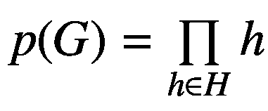

# 二十一、整数密码分析

整数密码分析代表了一种特殊的密码分析攻击，它适用于基于替换置换网络构建的分组密码。该攻击由 Lars Knudsen 设计为针对 Square [ [1](#Par30) ]的专用攻击，因此被称为 Square 攻击。

置换网络代表了分组密码最重要的弱点之一。一旦网络可以被发现(让我们直观地说)，那么对分组密码的攻击可以毁灭性地破坏整个密码系统。下一个易受攻击的点是密钥和用于置换密钥的表。一旦密钥接近真实的或相同的，那么我们就接近破解密码系统。这种密钥的一个例子是

```cs
        private byte[]PermutationTableForKey = {
            06, 30, 13, 07, 05, 35, 15, 14,
            12, 18, 03, 38, 09, 10, 22, 25,
            16, 04, 21, 08, 39, 37, 36, 02,
            24, 11, 28, 27, 29, 23, 33, 01,
            32, 17, 31, 00, 26, 34, 20, 19
        };

```

在接下来的几页中，我们将介绍实现分组密码所需的必要元素，并确定为了发起整体密码分析攻击而必须关注的元素，例如构建 Feistel 网络(参见清单 [22-2](#PC2) )和为密钥生成置换表(清单 [22-4](#PC4) )。一旦对这两个阶段有了清楚的理解，如何进行完整的密码分析就变得非常清楚了。

## 基本概念

为了实现和设计完整的密码分析攻击，首先理解基本概念是非常重要的。所以让我们把下面的概念作为主要的出发点。在此基础上，我们将设计和实施这样的攻击，目的只是为了教育。

让我们考虑( *G* ，+)是一个有限阿贝尔群或序 *k* 。下面的产品组，*G*<sup>*n*</sup>=*G*×…×*G*，是具有形式为*v*=(*v*<sub>1</sub>，…， *v* <sub>*n*</sub> 的元素的组，其中 *v* <sub>*i *G* <sup>*n*</sup> 内的加法被定义为组件方式。所以现在我们有*u*+*v*=*w*持有为 *u* ， *v* ，*w*∈*G*<sup>*n*</sup>当*u*<sub>*I*</sub>+*v**</sub>

我们用 *B* 表示向量的多重集。在 *B* 上定义的积分代表所有矢量的和， *S* 。换句话说，积分被定义为，求和运算被定义为 *G* <sup>* n *</sup> 的分组运算。

当设计整数密码分析攻击时，知道并计算明文和密文中的字数是非常重要的。对于我们的例子，这个数字将用 *n* 来表示。另一个需要注意的非常重要的数字是明文和密文的数量，用 *m* 表示。通常， *m* = *k* (即 *k* = | *G* |)，代表明文和密文的向量 *v* ∈ *B* ，以及*G*=*GF*(2<sup>*B*</sup>或*G*=

前进到攻击，其中一方将试图在特定数量的加密轮次之后预测位于积分中的值。基于这一目的，区分以下三种情况是有益的:(1)在所有字都相等的情况下(例如 *i* )，(2)所有字都不同，(3)求和到预先预测的某个值。

让我们考虑将*b*⊆*g*<sup>*n*</sup>声明为和以前一样的固定索引 *i* 。发生了以下三种情况:

1.  *v*<sub>T3】IT5】=*c*，对于所有 *v* ∈ *B*</sub>

2.  {*v*<sub>*【I】*</sub>:*【v】**【b】*} =

**   

     *

 *其中 *c* ， *c* ，<sup>’</sup>∈*G*是一些事先已知并固定的值。

下面的例子代表了一种典型的情况，其中 *m* = *k* ，在 *B* 中找到的向量的数量等于所考虑的组中的元素的数量。通过使用拉格朗日定理，我们可以看到是否所有的字， *i* <sup>*th*</sup> 都相等，然后很清楚来自积分的*I*<sup>*th*</sup>字将取来自 *G* 的中性元素的值。

以下两个定理是必要的，并且对于任何想要将整数密码分析转化为实践的实际开发者来说是必须的。

**定理 21-1**【1，定理 1，第 114 页】**。**让我们考虑( *G* ，+) a *有限阿贝尔加群*。阶为 1 或 2 的元素的子组表示为*L*= {*G*∈*G*:*G*+*G*= 0 }。我们认为写作 *s* ( *G* )是在 *G* 中找到的所有元素的总和。接下来我们考虑*s*(*G*)=∑<sub>*H*∑*H*</sub>*H*。更多的，理解下面这个类比很重要:*s*(*G*)∈*H*，即*s*(*G*)+*s*(*G*)= 0。

也就是说，对于*G*=*GF*(2<sup>*B*</sup>)我们得到 *s* ( *G* ) = 0，对于 *Z* / *mZ* 我们得到*s*(*Z*/*mZ*)=*m*/2 当我们也有书面群的乘法情况(见定理 21-2)。

**由此 21-2**【1，定理 2，第 114 页】。让我们考虑( *G* ，∫)一个*有限阿贝尔乘法群。*1 阶或 2 阶元素的子群表示为*H*= {*G*∈*G*:*G*∫*G*= 1 }。我们认为写作 *p* ( *G* )是 *G* 所有元素的乘积。接下来，我们考虑。更多，理解下面这个类比很重要:*p*(*G*)∈*H*，即*p*(*G*)∫*p*(*G*)= 1。

举个例子，如果我们有*G*=(*Z*/*pZ*)<sup>∫</sup>其中 *p* 是质数， *p* ( *G* )是 1，*p*(*G*)= 1。这是用威尔逊定理证明的。

## 实用方法

这一节将展示如何使用？NET 框架和 C# 编程语言。下面的方法代表了一个 Feistel 网络在 C# 中的基本实现，可以覆盖当前的块大小。我们将使用重复的序列，目的是创造一个弱点，以显示它如何被利用和制造攻击。

清单 [21-1](#PC2) 展示了如何构建和设计整体密码分析攻击。清单 [21-2](#PC3) 展示了 Feistel 网络是如何构建的。一旦我们有了结构，要成功攻击，重要的是要“弄清楚”Feistel 网络是如何构建的，并创建一个它的副本或至少是与原始网络相似的东西。清单 [21-3](#PC4) 展示了如何实现块数据，清单 [21-4](#PC5) 展示了如何生成密钥。

```cs
using System;
using System.Collections.Generic;
using System.Linq;
using System.Text;
using System.Threading.Tasks;
using System.Diagnostics;

namespace IntegralCryptanalysis
{
    public class Key
    {
        //** permutation table (initial)
        //** used to permutate the key
        private byte[] initial_permutation_table_1 = {
            06, 30, 13, 07, 05, 35, 15, 14,
            12, 18, 03, 38, 09, 10, 22, 25,
            16, 04, 21, 08, 39, 37, 36, 02,
            24, 11, 28, 27, 29, 23, 33, 01,
            32, 17, 31, 00, 26, 34, 20, 19
        };

        /// <summary>
        /// The representation of the key as a byte array
        /// </summary>
        public byte[] KeyBytes
        {
            get; set;
        }

        /// <summary>
        /// Encryption and decryption key for a text
        /// </summary>
        /// <param name="keyAsAString">The key to use for this instance</param>
        public Key(string keyAsAString)
        {
            int k = 0, key_length = keyAsAString.Length;

            //** expansion of the key to a maximum of 40 bytes
            while (keyAsAString.Length < 40)
                keyAsAString += keyAsAString[k++];

            KeyBytes = System.Text.Encoding.UTF8.GetBytes(keyAsAString);

            //** permutation of the key bytes using
            //** initial_permutation_table_1
            for (k = 0; k < KeyBytes.Length; k++)
                KeyBytes[k] = KeyBytes[initial_permutation_table_1[k]];

            Debug.WriteLine("The post permutation key is: "+ System.Text.Encoding.UTF8.GetString(KeyBytes));
        }

        /// <summary>
        /// Generate the keys that are used within the round function
        /// </summary>
        /// <returns>A list with the keys that are of 64-bit. The format is ulong.</returns>
        public List<ulong> ReturnRoundKeys()
        {
            //** Rounds is defined as 64-bit
            //** keys found in the Key string
            int count_of_round = KeyBytes.Length / 8;
            List<ulong> round_keys = new List<ulong>();

            for (int k = 0; k < count_of_round; k++)
            {
                byte[] round_key_bytes = new byte[8];
                ulong round_key = 0;

                Array.Copy(KeyBytes, k * 8, round_key_bytes, 0, 8);
                Array.Reverse(round_key_bytes);

                round_key = BitConverter.ToUInt64(round_key_bytes, 0);

                round_keys.Add(round_key);
            }
            return round_keys;
        }
    }
}

Listing 21-4The Key Class

```

```cs
using System;
using System.Collections;
using System.Collections.Generic;
using System.Linq;
using System.Text;
using System.Threading.Tasks;

namespace IntegralCryptanalysis
{
    public class Block
    {
        /// <summary>
        /// Represents the data that are held by the block
        /// </summary>
        public byte[] DataStructure { get; set; }

        /// <summary>
        /// Represents the left half of the data block
        /// </summary>
        public byte[] LeftHalf
        {
            get
            {
                return DataStructure.Take(DataStructure.Length / 2).ToArray();
            }
            set
            {
                Array.Copy(value, DataStructure, DataStructure.Length / 2);
            }
        }

        /// <summary>
        /// Represents the right half of the data block
        /// </summary>
        public byte[] RightHalf
        {
            get
            {
                return DataStructure.Skip(DataStructure.Length / 2).ToArray();
            }
            set
            {
                Array.Copy(value, 0, DataStructure, DataStructure.Length / 2, DataStructure.Length / 2);
            }
        }

        /// <summary>
        /// Get and return as BitArray the left half of the block data
        /// </summary>
        public BitArray TheLeftBitsOfBlock
        {
            get
            {
                return new BitArray(LeftHalf);
            }
        }

        /// <summary>
        /// Get and return as BitArray the right half of the block data
        /// </summary>
        public BitArray RightBitsOfBlock
        {
            get
            {
                return new BitArray(RightHalf);
            }
        }

        /// <summary>
        /// Representation of the size in bytes of the Block
        /// </summary>
        public int BlockSize
        {
            get
            {
                return DataStructure.Length;
            }
        }

        /// <summary>
        /// The representation of a data block. Constructor
        /// </summary>
        /// <param name="size_of_the_block">The size value (in bytes) of the block</param>
        public Block(int size_of_the_block)
        {
            DataStructure = new byte[size_of_the_block];
        }

        /// <summary>
        /// The representation of a data block. Constructor
        /// </summary>
        /// <param name="the_data_block">the data content stored by the block</param>
        public Block(byte[] the_data_block)
        {
            DataStructure = the_data_block;
        }

        /// <summary>
        /// Swaps the halves (left and right) of the block
        /// </summary>
        public void SwapHalfes()
        {
            byte[] temporary = LeftHalf;
            LeftHalf = RightHalf;
            RightHalf = temporary;
        }

        /// <summary>
        /// Converts the Block to a UTF-8 string
        /// </summary>
        /// <returns>String representation of this block</returns>
        public override string ToString()
        {
            return System.Text.Encoding.UTF8.GetString(DataStructure);
        }
    }

}

Listing 21-3Implementing the Block Data

```

```cs
using System;
using System.Collections;
using System.Collections.Generic;
using System.Linq;
using System.Text;
using System.Threading.Tasks;

namespace IntegralCryptanalysis
{
    public class FeistelNetwork
    {
        //** represents the size in bytes
        //** for each of the block
        public int BlockSize
        {
            get;
            private set;
        }

        //** the password code for
        //** encryption and decryption
        public string PasswordCode
        {
            get;
            set;
        }

        /// <summary>
        /// The basic constructor of Feistel Class.
        /// </summary>
        /// <param name="password_code">represents the
        /// password code</param>
        public FeistelNetwork(string password_code)
        {
            this.PasswordCode = password_code;
            this.BlockSize = 16;
        }

        /// <summary>
        /// Constructs a new instance of the Feist class, with a custom blocksize
        /// </summary>
        /// <param name="password_code">Passcode used in this instance</param>
        /// <param name="the_block_size">Size of the blocks to use in this instance</param>
        public FeistelNetwork(string password_code, int the_block_size) : this(password_code)
        {
            this.BlockSize = the_block_size;
        }

        /// <summary>
        /// Encryption operation of the clear text using the password code
        /// </summary>
        /// <param name="clearText">The string to encrypt</param>
        /// <returns>The encrypted text.</returns>
        public string EncryptionOp(string clearText)
        {
            return DoCiphering(clearText, true);
        }

        /// <summary>

        /// Decryption operation of the encrypted text using the password code
        /// </summary>
        /// <param name="clearText">The string to decrypt</param>
        /// <returns>The decrypted text.</returns>
        public string DecryptionOp(string clearText)
        {
            return DoCiphering(clearText, false);
        }

        /// <summary>
        /// Do a Feistel encryption on the text
        /// </summary>
        /// <param name="sourceText">The clear text or encrypted text to encrypt/decrypt</param>
        /// <param name="isClearText">Decide if the given text represents (true) or not (false) a plaintext string</param>
        /// <returns>A string of plain or ciphered
        /// text</returns>
        private string DoCiphering(string sourceText, bool isClearText)
        {
            int pointer_block = 0;
            string cipher_text_posting = "";
            List<ulong> the_round_keys = new Key(PasswordCode).ReturnRoundKeys();

            //** Do a padding operation to
            //** the string using '\0'.
            //** The output will
            //** be a multiple of <blocksize>
            while (sourceText.Length % BlockSize != 0)
                sourceText += new char();

            //** in case of decryption, reverse

            //** the encryption keys
            if (!isClearText)
                the_round_keys.Reverse();

            byte[] the_text_bytes = Encoding.UTF8.GetBytes(sourceText);

            //** do iteration through the text
            //** moving with <blocksize> bytes per iteration
            while (pointer_block < the_text_bytes.Length)
            {
                byte[] the_block_as_bytes = new byte[BlockSize];
                Array.Copy(the_text_bytes, pointer_block, the_block_as_bytes, 0, BlockSize);

                Block text_as_block = new Block(the_block_as_bytes);

                //** if we have a ciphertext,
                //** swap it in halves
                if (!isClearText)
                    text_as_block.SwapHalfes();

                //** each round keys will be
                //** applied to the text
                foreach (ulong the_round_key in the_round_keys)
                    text_as_block = RoundOnTheBlock(text_as_block, the_round_key);

                //** build the output by appending it
                if (!isClearText) text_as_block.SwapHalfes();
                cipher_text_posting += text_as_block.ToString();

                pointer_block += BlockSize;
            }
            return cipher_text_posting.Trim('\0');
        }

        /// <summary>
        /// Do a single round encryption on the block
        /// </summary>
        /// <param name="theBlock">The block that will be encrypted or decrypted</param>
        /// <param name="theRoundKey">The round key which will be applied as the round function</param>
        /// <returns>The next block in the round sequence</returns>
        private Block RoundOnTheBlock(Block block, ulong theRoundKey)
        {
            ulong theRoundFunction = 0;

            Block roundBlock = new Block(block.BlockSize);

            BitArray keyBits = new BitArray(BitConverter.GetBytes(theRoundKey)), funcBits = block.RightBitsOfBlock.Xor(keyBits);

            roundBlock.LeftHalf = block.RightHalf;

            //** do the proper casting AND round
            //** the function bits to an int
            //** set R(i+1) as L(i) XOR f
            theRoundFunction = ToInteger64(funcBits);
            roundBlock.RightHalf = BitConverter.GetBytes(ToInteger64(block.TheLeftBitsOfBlock) ^ theRoundFunction);

            return roundBlock;
        }

        /// <summary>
        /// Helper method used for conversion of BitArray to have an integer representation
        /// </summary>
        /// <param name="theArray">BitArray that will be converted</param>
        /// <returns>A value of 64-bit integer of the array</returns>
        private ulong ToInteger64(BitArray theArray)
        {
            byte[] array_as_byte = new byte[8];
            theArray.CopyTo(array_as_byte, 0);
            return BitConverter.ToUInt64(array_as_byte, 0);
        }
    }

}

Listing 21-2Building the Feistel Network

```

```cs
using System;
using System.IO;

namespace BuildingIntegralCryptanalysis
{
    class Program
    {
        static void Main(string[] args)
        {
            string theKeyword = "", data_input = "",
                   data_output = "", data_file = "";

            FeistelNetwork feist_network;
            StreamReader file_stream_reader;
            StreamWriter file_stream_writer;

            //** create a help text for the user
            const string helperData =
            @"Building Integral Cryptanalysis Attack
              Usage:
               private [-option] keyword
                         input_file output_file
                          Options:
                             -enc Encrypt the file passed as
                                          input using the keyword
                             -dec Decrypt the file passed as
                                          input using the keyword";

            //** show in the console the helper
            //** if we have less than four arguments
            if(args.Length < 4)

            {
                Console.WriteLine(helperData);
                return;
            }
            else if(args[1].Length < 10 ||
                                              args[1].Length > 40)
            {
                 //** Output usage if the password
                 //** is too short/long
                 Console.Write("The length of the password is
                 invalid. The password should have between 10-40 characters.\n" + helperData);

                 return;
            }

            theKeyword = args[1];
            data_input   = args[2];
            data_output  = args[3];

            //** environment input/output configuration
            feist_network = new FeistelNetwork(theKeyword);
            file_stream_reader = new StreamReader(data_input);
            file_stream_writer = new
                                     StreamWriter(data_output);

            //** Read the data from the input file
            data_file = file_stream_reader.ReadToEnd();
            file_stream_reader.Close();

            if (args[0] == "-enc")
            {
                //** do the encryption based
                //** on the argument provided
                string ciphertext =
                                   feist_network.EncryptionOp(data_file);
                file_stream_writer.Write(ciphertext);
                Console.WriteLine("The file has been encrypted
                        with success. The file has been saved
                                               to: " + data_output);
            }
            else if(args[0] == "-dec")

            {
                //** do the decryption based on the argument
                string thePlaintext =
                                   feist_network.DecryptionOp(data_file);
                file_stream_writer.Write(thePlaintext);
                Console.WriteLine("The file has been decrypted
                             with success. The file has been saved
                             to: " + data_output);
            }
            else
            {
                //** invalid option selected
                Console.Write("The selected option is invalid.
                               Please, choose another option.\n"
                               + helperData);
            }

            file_stream_writer.Close();

            Console.ReadKey();
        }
    }
}

Listing 21-1The Main Program

```

## 结论

在这一章中，我们讨论了整体密码分析以及这种攻击是如何设计和实现的。我们提出了一种建立分组密码系统的方法，并结合脆弱点来说明如何应用整数密码分析攻击。

在本章结束时，您现在可以

*   设计并实现一个简单的分组密码

*   理解这种密码的两个弱点，例如 Feistel 网络和生成置换表来置换密钥

*   了解 Feistel 网络是如何实现的

*   使用排列表，并在密钥上使用它们

## 文献学

1.  琼·代蒙、拉斯·努森和文森特·里门，《分组密码方阵》。快速软件加密(FSE) 1997，“计算机科学讲义*第 1267 卷(第 149–165 页)。以色列海法:施普林格出版社。citeserx 10 . 1 . 1 . 55 . 6109。1997.**