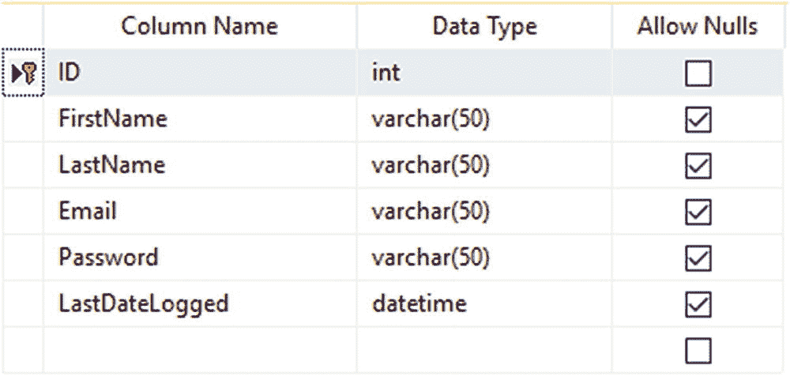
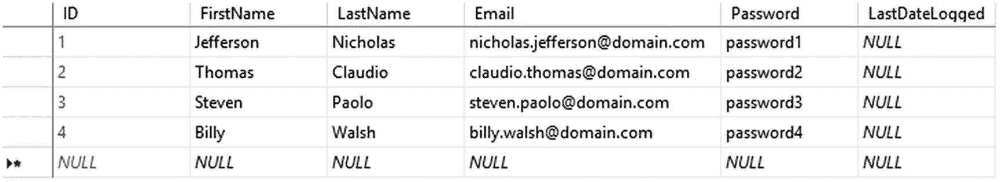
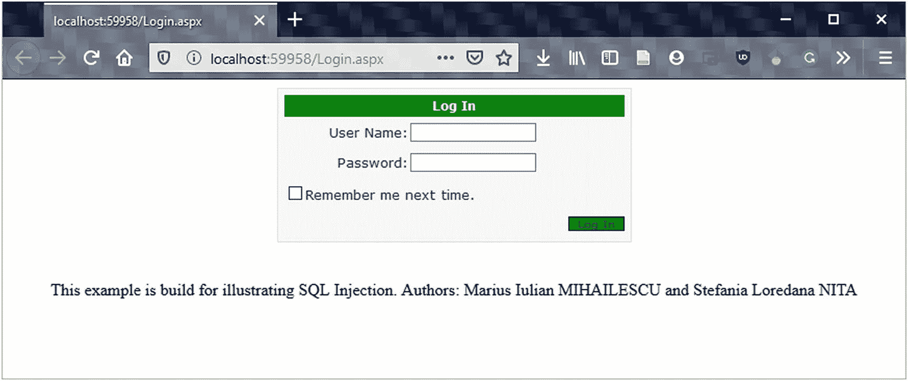

# 二十二、攻击

在这一章中，我们将分析分布式环境中可能发生的最重要的攻击(云计算[ [3](#Par57) 或大数据)，以及如何使用具有 8.0 版本功能的 C# 编程语言[ [2](#Par56) 来利用它们。作为参考，我们将使用一个 ASP.NET MVC 5(也适用于以前版本的 MVC，比如 1.0、2.0、3.0 和 4.0)应用作为例子，它使用 C# 作为后端编程语言。

web 应用上每天发生的三种最常见的攻击是重定向攻击、SQL 注入和跨站脚本(XSS)。

这里描述的方法是道德黑客领域的一部分，错误地使用它们会给企业带来重大灾难。这些方法对红队队员非常有用，其中一些方法将用于后期开发。

## 端口转发和如何防止开放重定向攻击

通过端口转发，黑客无法访问您，但是可以利用路由器在 web 端口上进行配置。

通过将用户重定向到外部恶意 URL，重定向到使用基于 querystring 的请求指定的 URL 的 web 应用很容易被篡改。这种攻击被称为*开放重定向攻击* *。*

要执行攻击并应对此漏洞，了解登录重定向在 ASP.NET MVC web 应用项目中的工作方式非常重要。在下面的例子中，我们可以看到，如果我们要访问一个结构中有`[Authorize]`属性的控制器动作，这将把未授权的用户重定向到`/Account/LogOn`视图。提到的到`/Account/LogOn`的重定向在其结构中有一个称为`returning_url querystring`的参数，这样用户在成功登录后将被返回到所请求的真正的 URL。

基于开放重定向的攻击是非常危险的。攻击者确切地知道我们何时开始登录某个网站。这可能使我们容易受到网络钓鱼攻击。例如，考虑一个攻击者，他向订阅了某个网站的用户发送恶意电子邮件，以获取他们的密码。

让我们考虑以下示例，其中攻击者向用户发送包含特定网页(例如 [`http://apressprocryptoexample.com`](http://apressprocryptoexample.com) )上的登录页面的链接，该链接在其组件中具有到伪造页面的重定向，

[`http://apressprocryptoexample.com/Account/LogOn?returnUrl=http://apresprocryptoexample.com/Account/LogOn`](http://apressprocryptoexample.com/Account/LogOn?returnUrl%253Dhttp://apresprocryptoexample.com/Account/LogOn) 。注意返回的 URL，它指向 apresprocryptoexample.com`. Note that`，单词“apress”中少了一个`"s"`这意味着域名`apresprocryptoexample.com`正在被黑客控制。

如果登录正确，来自 ASP.NET MVC 的`AccountController LogOn`动作将把我们重定向到 querystring 参数中提到的 URL，`returning_url`。在这种情况下，该 URL 就是攻击者使用的 URL，即 [`http://apresprocryptoexample.com`](http://apresprocryptoexample.com) 。如果我们不注意，我们不会注意到浏览器的不同。攻击者是一个非常精通此道的人，他会小心翼翼地确保伪造的页面看起来与原始页面一模一样。假登录页面包含一条错误消息，提示我们需要使用我们的凭据再次登录。一旦我们重新输入我们的凭证，假登录页面将保存数据并把我们送回原来的页面，`ApressProCryptoExample.com`。在这一点上，`ApressProCryptoExample.com`已经成功地让我们登录了，这个假的认证页面能够把我们重定向到那个特定的页面。最终的结果是基于这样一个事实，即攻击者知道我们的凭证(用户名和密码)，而我们，真正的用户，不知道我们已经如此容易地提供了我们的凭证[ [4](#Par58) ]。

让我们继续来看看我们的应用中的`LoginAuthentication`动作的代码(清单 [22-1](#PC1) )。我们定义的控制器将返回一个到`returning_url`的重定向。对于`returning_url`参数，完全没有验证。

表 22-1

SQL 注入的其他示例

<colgroup><col class="tcol1 align-left"> <col class="tcol2 align-left"></colgroup> 
| 

SQL 注入的例子

 | 

描述

 |
| --- | --- |
| `' or ''` | 字符串字符作为指示符 |
| `-- or #` | 单行注释 |
| `/*..*/` | 多行注释 |
| `+` | 添加、连接(也适用于 URL) |
| `&#124;&#124;` | 双重连接 |
| `%` | 通配符属性指示器 |
| `?Param1=foo&Param2=bar` | URL 参数 |
| `PRINT` | 非事务命令 |
| `@variable` | 局部变量 |
| `@@variable` | 全局变量 |
| `waitfor delay '0:0:10'` | 时延 |

```cs
[HttpPost]
public ActionResult LoginAuthentication(
                                    LogOnModel model,
                                    string returning_url)
{
    if (ModelState.IsValid)
    {
        if (MembershipService.ValidateUser(model.UserName,
        model.Password))
        {
            FormsService.SignIn(model.UserName,
                                model.RememberMe);
            if (!String.IsNullOrEmpty(returning_url)) {
                return Redirect(returning_url);
            }
            else {
                return RedirectToAction("Index", "Home");
            }
        }
        else {
            ModelState.AddModelError("", "The credentials are
                                      wrong. Please, try again.");
        }
    }

    //** if we reach here it means that
    //** something went wrong
    //** we will show again the form
    return View(model);
}

Listing 22-1Login Controller

```

清单 [22-2](#PC2) 展示了如何用`returning_url`进行验证。这是使用一个新方法`IsLocalUrl()`完成的，它是助手类`System.Web.Mvc.Url`的一部分。

```cs
[HttpPost]
public ActionResult LoginAuthentication(LogOnModel model, string returning_url)
{
    if (ModelState.IsValid)
    {
        if (MembershipService.ValidateUser(model.UserName,
                                           model.Password))
        {
            FormsService.SignIn(model.UserName,
                                            model.RememberMe);
            if (Url.IsLocalUrl(returning_url)){
                return Redirect(returning_url);
            }
            else {
                return RedirectToAction("Index", "Home");
            }
        }
        else {
            ModelState.AddModelError("",
                      "The credentials are wrong.
                       Please, try again.");
        }
    }

    //** if we reach here it means that
    //** something went wrong
    //** we will show again the form
    return View(model);
}

Listing 22-2Validation for returning_url

```

## SQL 注入

对于许多公司来说，他们的业务是在网上和云计算、大数据等环境中进行的，因此他们的网站越来越暴露在数据被盗的可能性之下。黑客可以从他们的数据中获得重要信息，并将其传递给市场上的其他参与者。

SQL 注入是最常见的方法之一，恶意用户可以通过它使用网页输入将不同的 SQL 命令注入到 SQL 语句中。通过这样做，恶意用户可以破坏 web 应用的安全性。

在这一节中，我们将考虑下面的 web 应用，它是为此目的从头开始构建的。从头开始创建这样一个应用的原因是为了说明开发人员在开发过程中经常犯的错误。

*第一步*是建立一个包含用户登录数据的数据库。数据库是在 Microsoft SQL Server v.17.9 中创建的。图 [22-1](#Fig1) 显示了表的结构，清单 [22-3](#PC3) 显示了生成表的 SQL 脚本代码。一个常见的错误是，许多 web 应用以明文形式存储密码。建议避免这种做法。最佳实践是使用密码的散列(如 MD5、SHA128、SHA256 等。).对于我们的例子，我们将使用明文密码。



图 22-1

表结构

```cs
USE [Apress_ProCrypto_SQLInjectionDB]
GO

/****** Object:  Table [dbo].[LoginUserData]
Script Date: 6/23/2020 2:51:06 AM ******/
SET ANSI_NULLS ON
GO

SET QUOTED_IDENTIFIER ON
GO

CREATE TABLE [dbo].[LoginUserData](
     [ID] [int] IDENTITY(1,1) NOT NULL,
     [FirstName] [varchar](50) NULL,
     [LastName] [varchar](50) NULL,
     [Email] [varchar](50) NULL,
     [Password] [varchar](50) NULL,
     [LastDateLogged] [datetime] NULL,
 CONSTRAINT [PK_LoginUserData] PRIMARY KEY CLUSTERED
(
    [ID] ASC
)WITH (PAD_INDEX = OFF, STATISTICS_NORECOMPUTE = OFF, IGNORE_DUP_KEY = OFF, ALLOW_ROW_LOCKS = ON, ALLOW_PAGE_LOCKS = ON) ON [PRIMARY]
) ON [PRIMARY]
GO

Listing 22-3Login User Data Table SQL Script

```

第二步是用一些数据填充表格，如图 [22-2](#Fig2) 所示。然后我们对清单 [22-4](#PC4) 中的表执行脚本。



图 22-2

用户数据

```cs
SET NOCOUNT ON
INSERT INTO dbo.LoginUserData
              ([FirstName],[LastName],
              [Email],[Password],[LastDateLogged])
VALUES
      ('Jefferson','Nicholas','nicholas.jefferson@domain.com','password1',CONVERT(datetime,NULL,121))
      ,('Thomas','Claudio','claudio.thomas@domain.com','password2',CONVERT(datetime,NULL,121))
      ,('Steven','Paolo','steven.paolo@domain.com','password3',CONVERT(datetime,NULL,121))
      ,('Billy','Walsh','billy.walsh@domain.com','password4',CONVERT(datetime,NULL,121))

Listing 22-4Data Content

```

第三步是构建网络应用。为此，我们不会使用额外的花哨的 web 应用架构。这只是一个简单的 web 应用，有两个网页。到数据库的连接是使用 done 完成的。对于其他对象关系映射(ORM ),如 NHibernate、LINQ 到 SQL 或实体框架，结果是相同的。唯一的区别是处理 SQL 注入的时间长。

我们构建的第一个页面是`Login.aspx`。如图 [22-3](#Fig3) 所示，该页面包含一个简单的表单。代码如清单 [22-5](#PC5) 所示。



图 22-3

Login.aspx 页面

```cs
<%@ Page Language="C#" AutoEventWireup="true" CodeFile="Login.aspx.cs" Inherits="Login" %>

<!DOCTYPE html>

<html xmlns:="http://www.w3.org/1999/xhtml">
<head runat="server">
    <title></title>
</head>
<body>
    <center>
        <form id="form1" runat="server">
        <div>
            <asp:Login ID="MyLogin" runat="server"
                   OnAuthenticate="MyLogin_Authenticate"
                   Width="331px" BackColor="#F7F6F3" BorderColor="#E6E2D8" BorderPadding="4" BorderStyle="Solid" BorderWidth="1px"
                   Font-Names="Verdana" Font-Size="0.8em" ForeColor="#333333" Height="139px">
            <InstructionTextStyle Font-Italic="True"
                                                    ForeColor="Blue" />

            <LoginButtonStyle BackColor="green"
                   BorderColor="black" BorderStyle="Solid" BorderWidth="1px" Font-Names="Verdana"
                   Font-Size="0.8em" ForeColor="#284775" />
                <TextBoxStyle Font-Size="0.8em" />
                <TitleTextStyle BackColor="green" Font-Bold="True" Font-Size="0.9em"
                   ForeColor="White" />
            </asp:Login>
        </div>
        </form>
    </center>
    <br />
    <br />
    <center>
             This example is build for illustrating SQL
             Injection. Authors: Marius Iulian MIHAILESCU and Stefania Loredana NITA
    </center>
</body>
</html>

Listing 22-5The HTML Source Code of Login.aspx

```

清单 [22-6](#PC6) 显示了`Login.aspx`的服务器端代码。从这里你可以注意到，没有任何形式的验证密码的完整性或避免 SQL 注入攻击。

```cs
using System;
using System.Collections.Generic;
using System.Linq;
using System.Web;
using System.Web.UI;
using System.Web.UI.WebControls;
using System.Data;
using System.Data.SqlClient;

public partial class Login : System.Web.UI.Page
{
    DataTable data_table;
    SqlDataAdapter adapter;
    protected void Page_Load(object sender, EventArgs e)
    {

    }
    protected void MyLogin_Authenticate(object sender,
                                        AuthenticateEventArgs e)
    {
        SqlConnection connection = new SqlConnection(@"Data
                         Source=SERVER_NAME;Initial Catalog=Apress_ProCrypto_SQLInjectionDB;Integrated Security=True");
        string query="select * from LoginUserData where
                   Email='"+ MyLogin.UserName+"'and Password='"+
                   MyLogin.Password+"' ";
        adapter = new SqlDataAdapter(query, connection);
        data_table = new DataTable();
        adapter.Fill(data_table);
        if (data_table.Rows.Count >= 1)
        {
            Response.Redirect("index.aspx");
        }
    }
}

Listing 22-6Server Side Source Code for Login.aspx

```

第二个页面叫做`Index.aspx,`，这是一个成功登录的确认页面(参见清单 [22-7](#PC7) 和 [22-8](#PC8) )。该页面没有什么特别之处。

```cs
using System;
using System.Collections.Generic;
using System.Linq;
using System.Web;
using System.Web.UI;
using System.Web.UI.WebControls;

public partial class Index : System.Web.UI.Page
{
    protected void Page_Load(object sender, EventArgs e)
    {

    }
}

Listing 22-8Server Side Source Code for Index.aspx

```

```cs
<%@ Page Language="C#" AutoEventWireup="true" CodeFile="Index.aspx.cs" Inherits="Index" %>

<!DOCTYPE html>

<html xmlns:="http://www.w3.org/1999/xhtml">
<head runat="server">
    <title>APRESS-Example of SQL Injection</title>
</head>
<body>
    <form id="form1" runat="server">
    <div><center>
    <h1>Hello, Apress! <br/>
        Example for SQL Injection
    </h1></center>
    </div>
    </form>
</body>
</html>

Listing 22-7Source Code for Index.aspx

```

现在我们有了整个项目集，让我们继续进行 SQL 注入分析和攻击。查询如下所示:

```cs
                 select * from LoginUserData where
             Email='"+ MyLogin.UserName+"'and Password='"+
                 MyLogin.Password+"';

```

让我们考虑在登录控件的文本框中输入‘or 1 = 1’的情况。一旦按下登录按钮，查询将如下所示:

```cs
select  * from LoginUserData where Email=" or 1=1--'and Password="

```

如果攻击者知道用户名或规则 1=1，它将不再适用。他只需在文本框中写下用户名+'，并对后面的所有内容进行注释，就像这样:

```cs
               select  * from LoginUserData where
          Email='nicholas.jefferson@domain.com'--and Password="

```

另一个危险的例子是从数据库中删除记录或删除表。以下示例显示了这种情况:

```cs
select * from LoginUserData where Email=" Delete from LoginUserData
       –'and Password="

```

其他类型的 SQL 注入可以在表 23-1 中看到。其中一些非常危险，不建议用于实时生产数据库。

在 ASP.NET MVC web 应用的情况下，过程与上面描述的类似。

## 跨站点脚本(XSS)

跨站脚本(XSS)是一个安全漏洞，攻击者在网页中插入客户端脚本，主要是 JavaScript。当用户访问 web 应用时，浏览器将加载受影响的页面，这些页面中的脚本将运行，从而为攻击者提供了获取 cookies 和会话令牌的途径。大多数情况下，当 web 应用接受用户输入并将其输出到另一个页面而不进行验证、编码或转义时，就会出现 XSS 漏洞。

根据经验，我们建议您遵循以下规则来保护您的 web 应用免受 XSS 攻击:

*   千万不要在 HTML 页面中输入敏感数据，比如 HTML 表单输入、查询、HTTP 头等。

*   HTML 元素中的所有内容都应该被编码。

*   HTML 属性中的所有内容都应该被编码。

*   比方说，任何需要添加到 JavaScript 中的不受信任的数据(我不喜欢这个术语，但让我们保持这种方式)应该首先输入到一个 HTML 元素中，该元素的内容应该在运行时过程中检索。

*   在向 URL 查询字符串添加任何数据之前，请确保 URL 已编码。

例如，我们将考虑 HTML 编码如何与 MVC 中使用的 Razor 引擎一起工作，该引擎对变量的整个输出进行编码。为了避免这种情况发生，我们需要一个解决方案来防止这种情况发生。与编码相关的 HTML 属性表示 HTML 编码类型的超集，这意味着我们不需要担心应该使用 HTML 编码还是 HTML 属性编码。我们只需要确保在 HTML 上下文中使用' @ '，而不是当我们试图用 JavaScript 直接添加不可信的数据作为输入时。

让我们考虑下面清单 [22-9](#PC13) 中的剃刀 [1](#Par55) 视图。视图的输出将是一个`untrustedInput`变量。这种类型的变量在其组件中具有一些特征，这些特征可以在 XSS 攻击中被成功地利用和使用。这些角色是。在渲染输出中，编码看起来像:`<&quot;testing123&quot;>`

```cs
@{
       var untrustedInput = "<\"testing123\">";
   }

   @untrustedInput

Listing 22-9Example of a Razor View

```

有些情况下，我们希望在视图中向 JavaScript 添加要处理的值。要实现这一点，我们可以走两条路。实现这一点最安全的方法是将值放在特定标记的数据属性中，并在我们的 JavaScript 中获取它，如清单 [22-10](#PC14) 所示。

```cs
@{
       var untrustedInput = "<\"testing123\">";
   }

   <div
       id="theDataToBeInjected"
       data-untrustedinput="@untrustedInput" />

   <script>
     var theDataToBeInjected =
            document.getElementById("theDataToBeInjected");

     //** for all the clients
     var clientWithUntrustedInput =
         theDataToBeInjected.getAttribute("data-untrustedinput");

     //** for clients that support HTML 5
     var clientWithUntrustedInputHtml5 =
         theDataToBeInjected.dataset.untrustedinput;

     document.write(clientWithUntrustedInput);
     document.write("<br />")
     document.write(clientWithUntrustedInputHtml5);
   </script>

Listing 22-10Using Razor and JavaScript Encoding

```

清单 [22-10](#PC14) 中的代码将产生清单 [22-11](#PC15) 中所示的输出。

```cs
<div
     id="theDataToBeInjected"
     data-untrustedinput="<&quot;testing123&quot;>" />

   <script>
     var theDataToBeInjected =
                   document.getElementById("theDataToBeInjected");

     var clientWithUntrustedInput =
         theDataToBeInjected.getAttribute("data-untrustedinput");;

     var clientWithUntrustedInputHtml5 =
         theDataToBeInjected.dataset.untrustedinput;

     document.write(clientSideUntrustedInputOldStyle);
     document.write("<br />")
     document.write(clientWithUntrustedInputHtml5);
   </script>

Listing 22-11The Output

```

一旦脚本运行，渲染结果将是

```cs
<"testing123">
   <"testing123">

```

同样，我们可以调用 JavaScript 编码器，如清单 [22-12](#PC17) 所示。

```cs
@using System.Text.Encodings.Web;
   @inject JavaScriptEncoder encoder;

   @{
       var someUntrustedInput = "<\"testing123\">";
   }

   <script>
       document.write("@encoder.Encode(someUntrustedInput)");
   </script>

Listing 22-12JavaScript Encoder

```

一旦由浏览器呈现，我们将得到以下内容:

```cs
<script>
    document.write("\u003C\u0022testing123\u0022\u003E");
</script>

```

也就是说，实际上很难注意编码过程。编码发生在输出上，编码后的值不应存储在数据库或服务器上，尤其是在大数据环境中的云计算中。

## 结论

本章介绍了 web 应用中出现的三种常见攻击:带有重定向攻击的端口转发、SQL 注入和跨站点脚本攻击。

本章结束后，您现在可以

*   识别 web 应用中的三种常见攻击。

*   通过提供编程语言功能的最新支持，以专业的方式处理漏洞。

*   理解 SQL 注入的行为方式以及如何遭遇它。

*   通过了解可能发生的灾难，了解通过端口转发和重定向攻击暴露应用的危险。

*   了解什么是跨站点脚本以及它们的行为方式。

## 文献学

1.  使用 Razor 语法(C#)的 ASP.NET Web 编程介绍。在线可用`:` [`https://docs.microsoft.com/en-us/aspnet/web-pages/overview/getting-started/introducing-razor-syntax-c`](https://docs.microsoft.com/en-us/aspnet/web-pages/overview/getting-started/introducing-razor-syntax-c) 。

2.  布兰登·佩里。Gray Hat C# -创建和自动化安全工具的黑客指南。无淀粉出版社，2017。

3.  亚当·弗里曼。*Pro ASP.NET Core 3–使用 MVC Blazor 和 Razor Pages 开发云就绪型 Web 应用*。2020 年出版。

4.  斯蒂芬出没。*应用密码学于 .NET 和 Azure Key Vault* 。Apress，2019。

5.  罗伯特·西斯拉。*面向组织和个人的加密——当代和量子加密基础知识*。2020 年出版。