# 二十三、文本特征

在本章中，我们将分析密码和明文分析的两个重要指标:卡方统计和模式搜索(单字母组合词、双字母组合词和三字母组合词)。当使用经典和现代密码学时，文本特征化技术是密码分析技巧包中非常重要的一部分。

## 卡方统计量

卡方统计是计算两个概率分布之间相似性百分比的重要度量。当卡方统计的结果等于 0 时，有两种情况:这意味着两个分布相似，如果分布非常不同，将输出更高的数字。

卡方统计由以下公式定义:

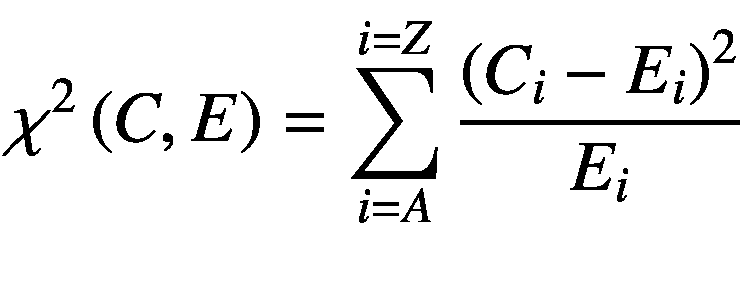

在清单 [23-1](#PC1) 中，我们计算了一个卡方分布的例子。

```cs
using System

namespace ComputeChiSquaredStatistics
{
   class ComputeChiSquaredStatistics
   {
      static void Main(string[] args)
      {
         int number_of_experiments=10000;
         int number_of_stars_distribution=100;

         Random theGenerator = new Random();
            double theDistribution(6.0);

         int[] probability = new int[10];

         for (int counter=0; counter
             <number_of_experiments; ++counter)
         {
               double no =
                   theDistribution(theGenerator);
              if ((no>=0.0)&&(no<10.0))
                 ++ probability [int(no)];
        }

           Console.Writeline("The Chi-Squared
            Distribution (6.0):");

            for (int index = 0; index < 10; ++index)
            {
                Console.WriteLine("index {0} ", index, " -- {1}: ",  (index + 1), ":");
                Console.WriteLine("{0}", probability[index] * number_of_stars_distribution / number_of_experiments);
            }

            Console.ReadKey();
        }
   }
}

Listing 23-1ChiSquaredDistribution Source Code

```

上述实现的输出如图 [23-1](#Fig1) 所示。

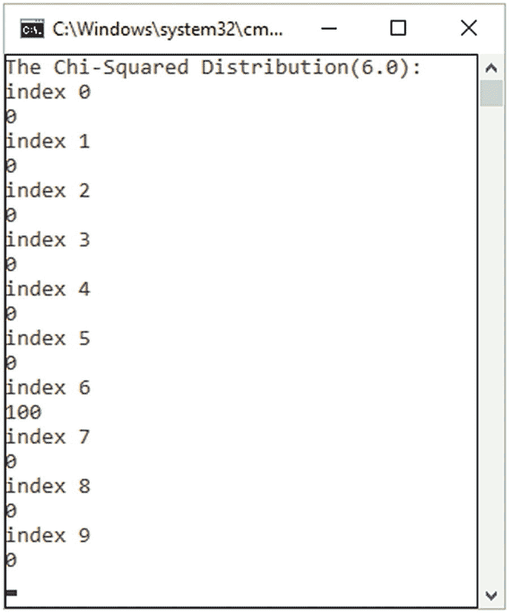

图 23-1

卡氏分布输出

卡方分布的例子如何帮助我们进行密码分析和加密？

第一步是计算密文中字符的出现频率。第二步是比较用于加密的假设语言(例如英语)的频率分布，并使两个频率分布彼此相关。这样我们就可以找到加密过程中使用的*移位*。这个过程是一个标准和简单的过程，可用于密码，如凯撒密码。当英文字符的频率与密文的频率一致时，就会发生这种情况。我们知道英语字符出现的概率

作为一个例子，让我们考虑下面这个用凯撒密码加密的例子，它有 46 个字符(字母频率见图 [23-2](#Fig2) )。图 [23-2](#Fig2) 中的例子使用 CrypTool<sup>T5】1T7 计算并验证加密文本上字母频率的实现及其正确性；</sup>

```cs
     ZHOFRPHWRDSUHVVWKLVLVHQFUBSWHGZLWKFDHVDUFLSKHU

```

理解卡方统计是基于计数而不是概率是非常重要的。例如，如果我们有一个出现概率为 0.127 的字母 E，则预期在 100 个字符内出现 12.7 次。

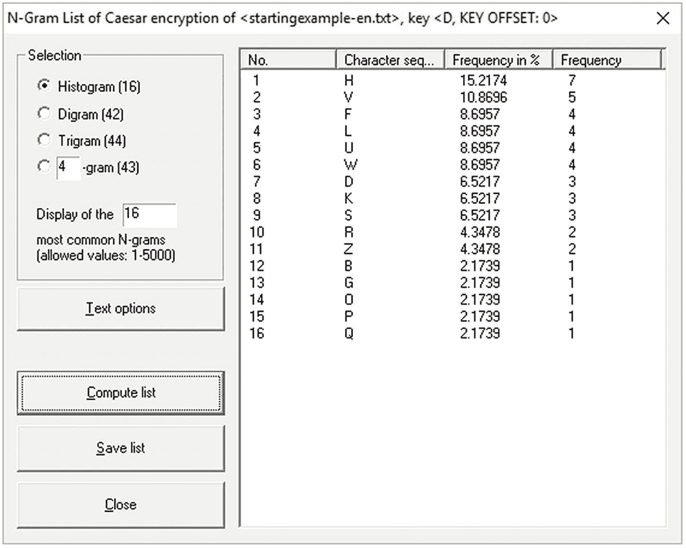

图 23-2

加密文本的字母频率

为了计算预期的计数，密文的长度必须乘以概率。上面的密码共有 46 个字符。根据上面 E 的统计，我们的期望是 E 字母出现 46 0.127 = 5.842 次。

为了解开凯撒密码，我们需要使用 25 个可能的密钥中的每一个，使用字母或字母在字母表中的位置。为此，计数从 0 或 1 开始非常重要。必须为每个键计算卡方。该过程包括将一个字母的计数与如果该文本是英语，我们可以预期的计数进行比较。

为了计算我们的密文的卡方统计量，我们对每个字母进行计数，我们看到字母 H 出现了 7 次。如果使用的语言是英语，应该出现 46 0.082 = 3.772 次。根据输出，我们可以计算出:

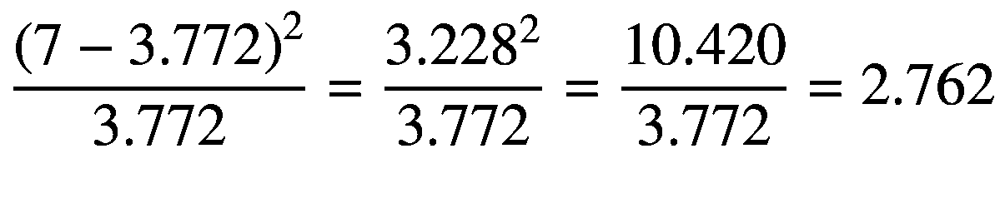

对剩余的字母进行该程序，并在所有概率之间进行加法运算(见图 [23-3](#Fig3) )。

一旦密文被解密，明文应该是

```cs
          WELCOMETOAPRESSTHISISENCRYPTEDWITHCAESARCIPHER

```

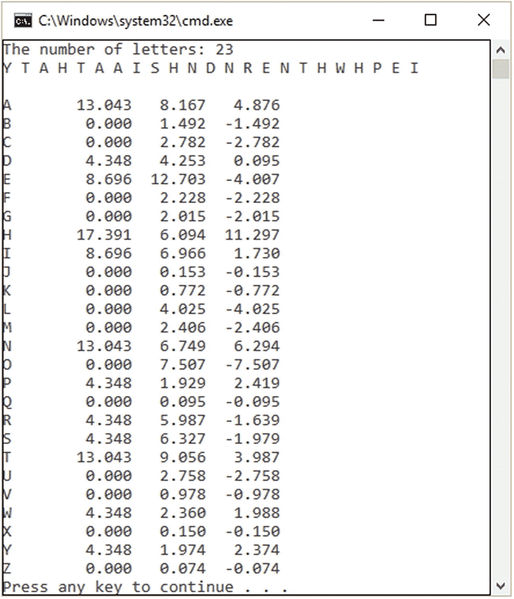

图 23-3

加密字母频率(%) <sup>[2](#Fn2)</sup>

## 使用 Monogram、Bigram 和 Trigram 频率计数的密码分析

频率分析是找到密文字符出现次数的最佳实践之一，目的是破解密码。模式分析可用于将字符作为二元模型(或有向图)进行测量和计数，这是一种测量文本中出现的字符对的方法。还有三元语法频率分析，它测量由三个字母组成的组合的出现率。

在这一节中，我们将重点关注使用二元模型和三元模型的文本特征，而不是解析密码，如 Playfair。

### 计数字母组合

计数字母组合是替代密码中最有效的方法之一，如凯撒密码、波利比乌斯方块等。这种方法非常有效，因为英语有特定的频率分布。这也意味着它没有被替换密码隐藏。分布将如图 [23-4](#Fig4) 和列表 [23-2](#PC4) 所示。

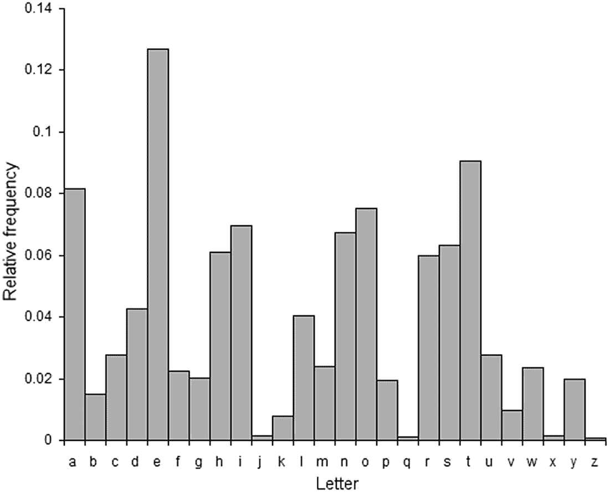

图 23-4

英语的字母频率

```cs
using System;
using System.IO;

class Program
{
    static void Main()
    {
        //** we use the array to store the frequencies
        int[] frequency = new int[(int)char.MaxValue];

        //** look at the content of the text file
        string s = File.ReadAllText("TheText.txt");

        //** go through each of the characters
        foreach (char t in s)
        {
            //** store the frequencies as a table
            frequency [(int)t]++;
        }

        //** write all letters that have been found
        for (int letterPos = 0; letterPos <
                                (int)char.MaxValue; letterPos++)
        {
            if (c[letterPos] > 0 &&
                char.IsLetterOrDigit((char)letterPos))
            {
                Console.WriteLine("The Letter: {0}
                                        has the frequency: {1}",
                    (char)letterPos,
                    freq [letterPos]);
            }
        }
    }
}
}

Listing 23-2Counting Monograms

```

输出如图 [23-5](#Fig5) 所示。

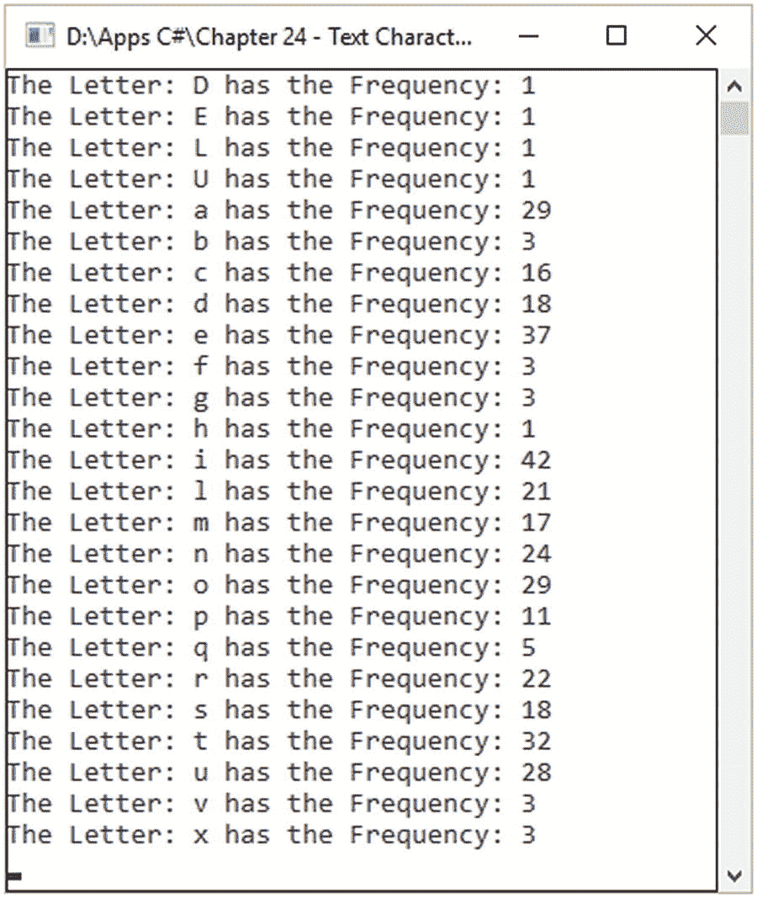

图 23-5

计数字母组合的输出

清单 [23-3](#PC5) 显示了进行上述计数的高级示例。这是一个使用 LINQ 和λ表达式的高级例子。图 [23-6](#Fig6) 显示了输出。

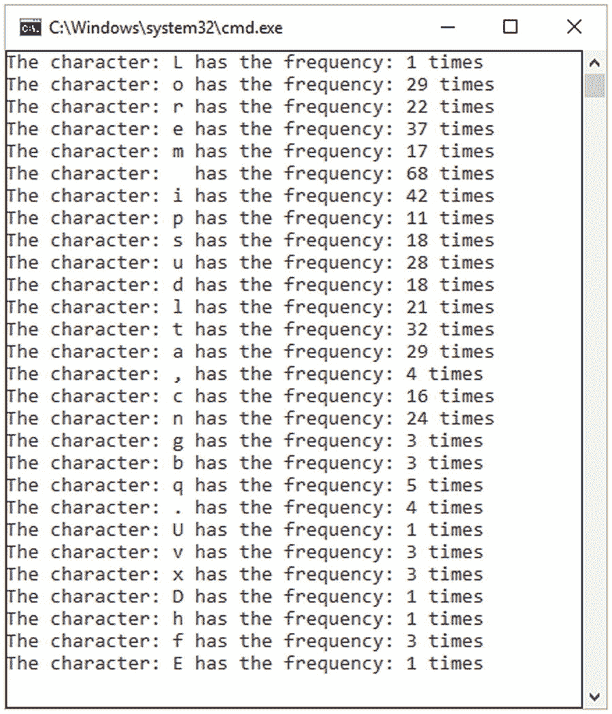

图 23-6

使用 LINQ 和拉姆达表达式的字符频率

```cs
using System;
using System.Collections;
using System.Collections.Generic;
using System.IO;
using System.Linq;
using System.Text;
using System.Threading.Tasks;

namespace MonogramsCounting_LINQ{
    class Program{
        static void Main(){
            var frequencies = from c in
   File.ReadAllText("TheText.txt")
              group c by c into groupCharactersFrequencies
              select groupCharactersFrequencies;

            foreach (var c in frequencies)
                Console.WriteLine($"The character: {c.Key} has
the frequency: {c.Count()} times");

            Console.ReadKey();}}}

Listing 23-3Lambda LINQ Expression for Counting Letter Frequencies

```

### 计算二元模型

计算二元模型的方法基于与计算单字母模型相同的思想。计算二元模型意味着计算成对字符的出现频率，而不是计算单个字符的出现次数。

图 [23-7](#Fig7) 列出了密码分析过程中发现的一些常见二元模型。在清单 [23-4](#PC6) 中，我们实现了一个处理二元模型出现次数的解决方案。图 [23-8](#Fig8) 显示输出。

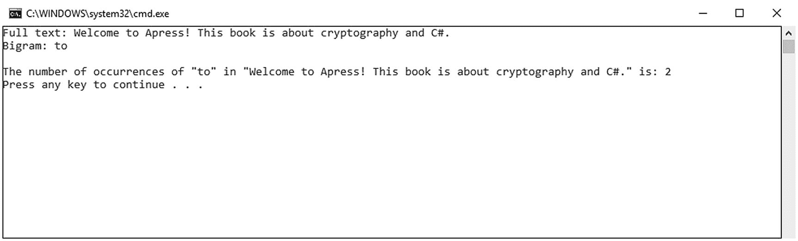

图 23-8

清单 [23-4](#PC6) 的输出

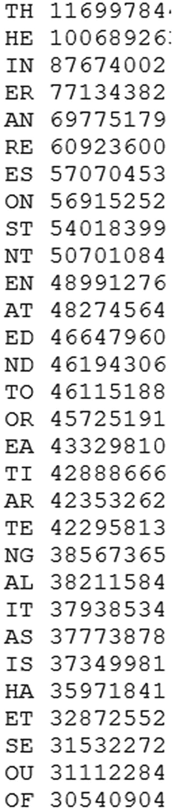

图 23-7

二元模型的例子

```cs
class Program
    {
        static void Main(string[] args)
        {
            String text = "Welcome to Apress! This book is
            about cryptography and C#.";
            String bigramPattern = "to";
            Console.WriteLine("The number of occurrences of
                  \"" + bigramPattern + "\" in \"" + text +
                  "\" is: " +
                 countFrequenciesBigrams(bigramPattern,
                                       text).ToString());

        }

        static int countFrequenciesBigrams(String
                                bigramPattern, String text)
        {
            int bigramPatternLength = bigramPattern.Length;
            int textLength = text.Length;
            int occurrences = 0;

            for (int idx = 0; idx <= textLength –
                               bigramPatternLength; idx++)
            {
                int jIdx;
                for (jIdx = 0; jIdx < bigramPatternLength;
                                                   jIdx++)
                {
                    if (text[idx + jIdx] !=
                                    bigramPattern[jIdx])
                    {
                        break;
                    }
                }

                if (jIdx == bigramPatternLength)
                {
                    occurrences++;
                    jIdx = 0;
                }
            }
            return occurrences;
        }
    }

Listing 23-4Computing Bigrams

```

### 计数三元模型

三元组计数使用与二元组计数相同的原理。区别在于计算三重字符。

图 [23-9](#Fig9) 列出了密码分析过程中遇到的一些常见二元模型。在清单 [23-5](#PC7) 中，我们实现了一个解决方案，用于查找和计算文本中三元模型的出现次数。该解决方案与清单 [23-4](#PC6) 中的解决方案不同。输出如图 [23-10](#Fig10) 所示。

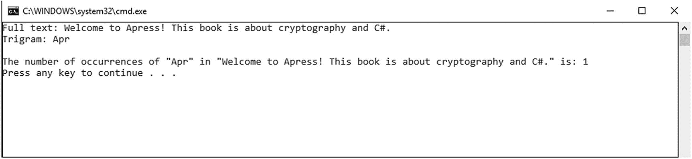

图 23-10

清单 [23-5](#PC7) 的输出

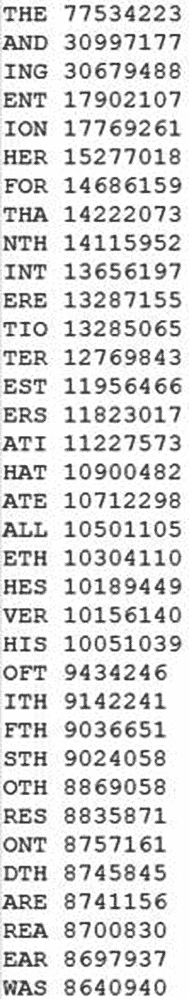

图 23-9

三元模型的例子

```cs
class Program
    {
        static void Main(string[] args)
        {
            String fullText = "Welcome to Apress! This book is
            about cryptography and C#.";
            String trigramPattern = "Apr";
            Console.WriteLine("Full text: " + fullText);
            Console.WriteLine("Trigram: " +
                         trigramPattern + "\n");
            Console.WriteLine("The number of occurrences of
\"" + trigramPattern + "\" in \"" +
fullText + "\" is: " +
countFrequenciesTrigrams(trigramPattern,
fullText).ToString());

        }

        static int countFrequenciesTrigrams(String
                        trigramPattern, String fullText)
        {
            int trigramPatternLength = trigramPattern.Length;
            int fullTextLength = fullText.Length;
            int noOfOccurrence = 0;

            for (int index = 0; index <= fullTextLength –
                           trigramPatternLength; index++)
            {
                int jIndex;
                for (jIndex = 0; jIndex <
                          trigramPatternLength; jIndex++)
                {
                    if (fullText[index + jIndex] !=
                                  trigramPattern[jIndex])
                    {
                        break;
                    }
                }

                if (jIndex == trigramPatternLength)
                {
                    noOfOccurrence++;
                    jIndex = 0;
                }
            }
            return noOfOccurrence;
        }
    }

Listing 23-5Counting Trigrams

```

## 生成信函频率

数组`wikiFrequencies`存储维基百科 <sup>[3](#Fn3)</sup> 中列出的频率(字母的相对百分比)(见清单 [23-6](#PC8) )。提供的示例将数字解释为百分比。例如，字母“A”出现的频率为 8.167%。

图 [23-11](#Fig11) 中的程序声明了一个`Random`对象。字母的定义值(如“A”)是一个整数。我们将在以后使用这个约定。事件处理器`Load`对来自`wikiFrequencies.`的所有值求和

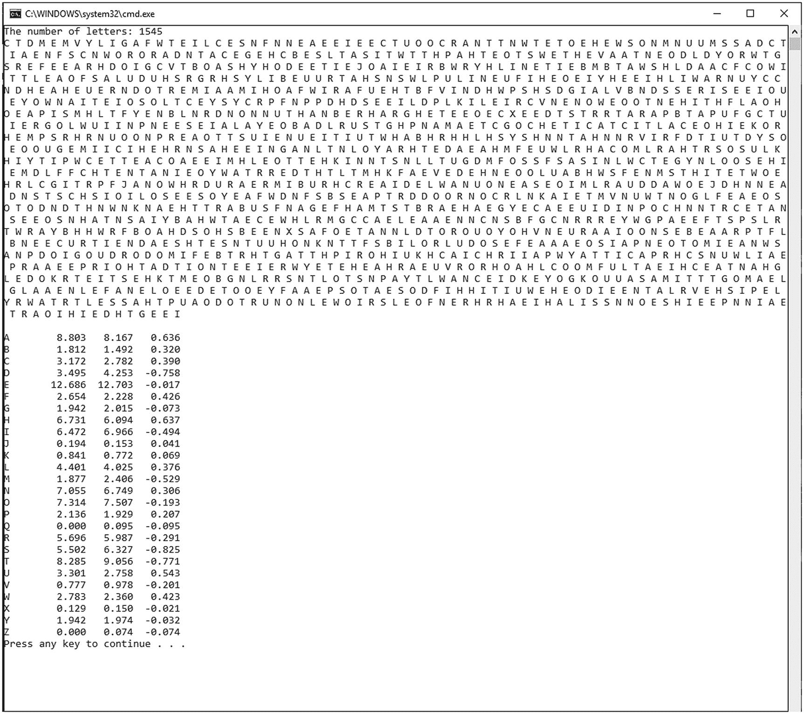

图 23-11

字母频率的生成

```cs
using System;
using System.Linq;

namespace LetterFrequency
{
    class Program
    {
        static void Main(string[] args)
        {
            string input = "";
            VerifyFreq();

            Console.Write("The number of letters: ");
            input = Console.ReadLine();

            Compute(input);
        }

        //** Store the letter frequencies.
        //** For more details and the values
        //** stored below, see the link:
        //** http://en.wikipedia.org/wiki/Letter_frequency
        private static float[] wikiFrequencies =
        {
            8.167f, 1.492f, 2.782f, 4.253f, 12.702f,
            2.228f, 2.015f, 6.094f, 6.966f, 0.153f,
            0.772f, 4.025f, 2.406f, 6.749f, 7.507f,
            1.929f, 0.095f, 5.987f, 6.327f, 9.056f,
            2.758f, 0.978f, 2.360f, 0.150f, 1.974f,
            0.074f

        };

        //** create a instance of a number
        //** generator using Random class
        private static Random randomNumber = new Random();

        //** compute the ASCII value of letter A
        private static int int_AsciiA = (int)'A';

        //** verify that the frequencies are adding up to 100
        private static void VerifyFreq()
        {
            //** compute the difference to E
            float totalAmount = wikiFrequencies.Sum();
            float differenceComputation = 100f - totalAmount;
            wikiFrequencies[(int)'E' - int_AsciiA] +=
                         differenceComputation;
        }

        //** based on the frequencies
        //** generate randomly the letters
        private static void Compute(string txtNumLetters)
        {
            //** monitor and track each letter
            //** that has been generated
            int[] countGeneratedLetters = new int[26];

            //** randomly generate the letters
            int theNumberOfLetters = int.Parse(txtNumLetters);
            string result = "";
            for (int k = 0; k < theNumberOfLetters; k++)
            {
                //** randomly generate a number
                //** between 0 and 100
                double randomlyNumber = 100.0 *
                randomNumber.NextDouble();

                //** select the letter that
                //** this will represents
                for (int numberOfLetter = 0; ;
                                    numberOfLetter++)
                {
                    //** extract the frequency of the
                    //** letter from the number

                    randomlyNumber -=
                       wikiFrequencies[numberOfLetter];

                    //** if the randomly number is
                    //** less and equal than 0
                    //** it means that we have the letter
                    if ((randomlyNumber <= 0) ||
                              (numberOfLetter == 25))
                    {
                        char character = (char)(int_AsciiA +
                                           numberOfLetter);
                        result += character.ToString() + ' ';
                      countGeneratedLetters[numberOfLetter]++;
                        break;
                    }
                }
            }

            Console.WriteLine(result + "\n");

            //** show the frequencies
            for (int i = 0; i < countGeneratedLetters.Length;
                                                  i++)
            {
                char ch = (char)(int_AsciiA + i);
                float frequency =
(float)countGeneratedLetters[i] /
theNumberOfLetters * 100;
                string str =
string.Format("{0}\t{1,6}\t{2,6}\t
{3,6} ,ch.ToString(),
frequency.ToString("0.000"),
wikiFrequencies[i].ToString("0.000"),
(frequency –
wikiFrequencies[i]).ToString("0.000"));

                Console.WriteLine(str);
            }
        }
    }
}

Listing 23-6Randomly Generating Letter Frequencies

```

## 结论

本章介绍了文本特征的概念，并展示了它在密码分析过程中的重要性。现在，您可以处理卡方统计，并使用单字母组合词、双字母组合词和三字母组合词来解密替代密文。作为总结，您了解了

*   文本特征的概念

*   使用字母组合、二元组合和三元组合

*   卡方统计的实现

*   Monogram、digram 和 trigram 实现

## 文献学

1.  西蒙·辛格，《密码本:从古埃及到量子密码术的秘密科学》。国际标准书号 0-385-49532-3。2000.

2.  《密码分析:对密码及其解决方案的研究》, 1989 年。

<aside aria-label="Footnotes" class="FootnoteSection" epub:type="footnotes">Footnotes [1](#Fn1_source)

密码学门户网站， [`www.cryptool.org/en/`](http://www.cryptool.org/en/)

  [2](#Fn2_source)

字母加密频率使用 CrypTool 生成， [`www.cryptool.org/en/`](http://www.cryptool.org/en/)

  [3](#Fn3_source)

[`http://en.wikipedia.org/wiki/Letter_frequency`](http://en.wikipedia.org/wiki/Letter_frequency) 信频。

 </aside>