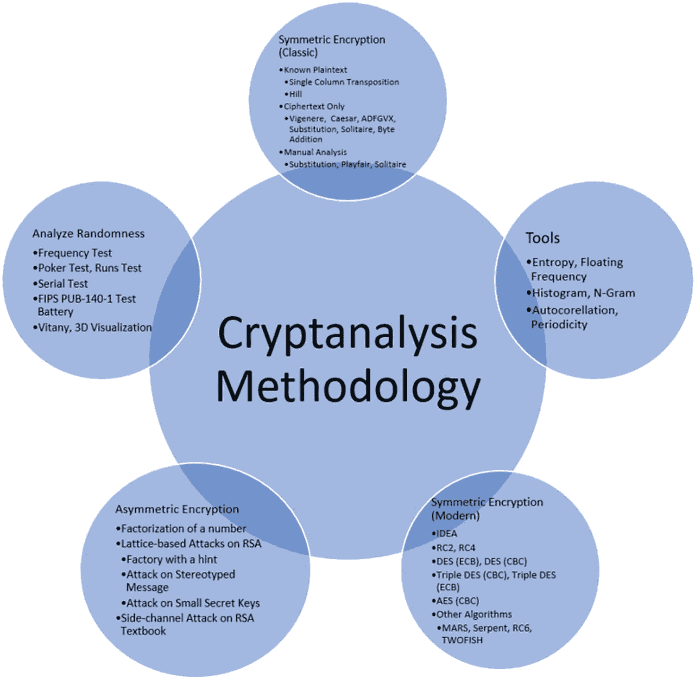
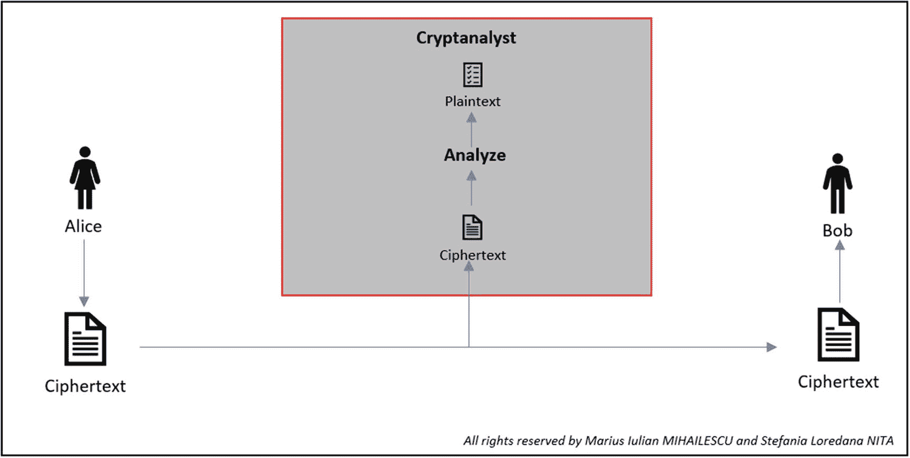
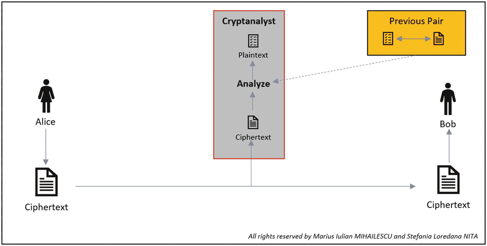
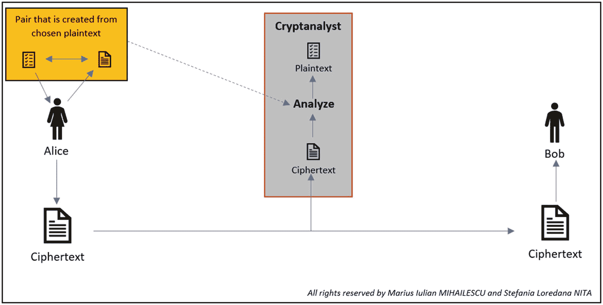
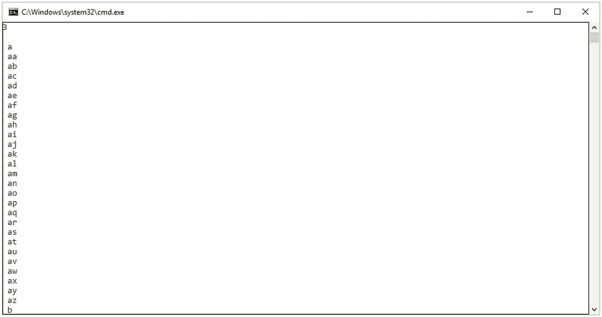
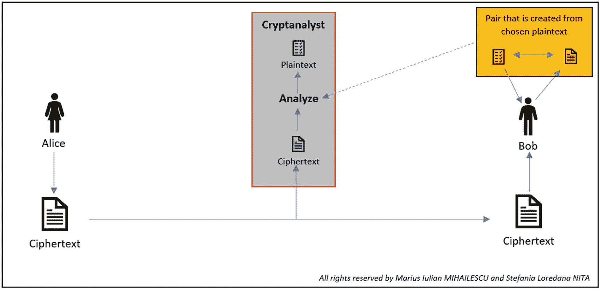

# 二十四、密码分析方法的实现和实用途径

在这一章中，我们想提出一个密码分析方法的方法论，以及如何快速有效地应用它。该方法用于经典和实际(现代)密码术/密码分析算法和方法。目前不包括量子密码术。

所提出的方法(见图 [24-1](#Fig1) )旨在让密码分析人员知道他们在工作中的位置和位置，以及他们可以相应地使用什么工具或方法。



图 24-1

密码分析方法

如果您没有关于加密方法的适当信息，实现密码分析方法是一项非常棘手的任务。也就是说，密码分析过程包括两个一般步骤。第一步包括确定应该执行哪种密码分析，第二步*包括我们所知道的密码算法。基于这两个步骤，我们可以转到*步骤 3* 来构建合适的*攻击模型*和*步骤 4* 来选择合适的工具。*

*第一步。*应该进行什么样的密码分析？在这里，密码分析员决定，连同他们的商业环境，他们将扮演什么样的角色:一个合法的和授权的密码分析员(道德黑客)或一个恶意的(黑客)。一旦他们决定了自己的角色，他们就进入第二步。

*第二步。如果他们是一个合法的密码分析者，在开始之前有两件事他们应该知道:T2 密码算法和 T4 密钥。根据一些密码分析者，这不是一个必要的要求，但在某些情况下，知道这一点是非常有用的。一旦知道了这两件事，他们就可以很容易地执行密码分析方法，并测试业务的安全性。*

*第三步。*当攻击模型或攻击类型对加密消息执行破解方法时，它们将为密码分析能够获得多少信息设置一个量化变量。最常用的攻击模型有

*   唯密文攻击

*   已知明文攻击

*   选择明文攻击

*   选择密文攻击
    *   自适应选择密文攻击

    *   无差别选择密文攻击

*第四步*。一旦选择了攻击模型，或者根据情况和要求创建并调整了另一个模型，下一步就是选择软件工具。有两种方法，从已经存在的工具中选择或者创建自己的工具(这很费时间，但是很好的实践)。下面是一些我们可以在密码分析过程中使用的工具的例子，这取决于我们试图“测试”什么

*   渗透工具:Kali Linux，Parrot Security，BackBox

*   法医:DEFT，CAINE，BlackArch，Matriux

*   数据库:sqlmap(独立版)、Metasploit 框架(独立版)、VulDB

*   Web 和网络:Wireshark、Nmap、Nessus、Burp Suite、Nikto、OpenVas

*   其他工具:CryptTool(非常有用和神奇的工具)

上面提到的工具只代表了那些非常强大并且能够产生预期结果的工具中的一部分。

## 纯密文攻击(COA)

COA 是最弱的攻击之一，因为密码分析者可以很容易地使用它，因为他只是对消息进行编码。

攻击者(密码分析员)将有权访问一组密文。如果相应的明文和密钥一起被推断出来，攻击就被认为是成功的。

在这种类型的攻击中(见图 [24-2](#Fig2) )，攻击者/密码分析师能够观察到密文。他们所看到的是一组被打乱的无意义的字符，这些字符被表示为加密过程的输出。



图 24-2

COA 表示

## 已知明文攻击

这种攻击(见图 [24-3](#Fig3) )赋予了密码分析者生成密文的能力，因为他知道密文。



图 24-3

KPA 表示法

密码分析员会选择明文，但他们会注意到由明文和密文组成的密码对。与 COA 相比，成功的机会更大。简单的密码很容易受到这种攻击。

## 选择明文攻击

密码分析员选择使用加密算法发送的明文，并观察密文是如何生成的。这可以看作是一种主动模型，其中密码分析者有机会选择明文并实现加密。

由于可以选择任何明文，密码分析者也可以观察到密文的细节，这给了他很大的优势来理解算法内部是如何工作的，并有机会获得密钥。

一个专业的密码分析人员将拥有一个数据库，其中包含已知的明文、密文和可能的密钥(参见清单 [24-1](#PC1) 和图 [24-5](#Fig5) 中自动生成可能密钥的示例；这是一个说明要点的非常简单的例子)，并使用它们来确定密文输入(见图 [24-4](#Fig4) )。



图 24-4

注册会计师代表

```cs
using System;
using System.Collections.Generic;
using System.IO;
using System.Linq;
using System.Text;
using System.Threading.Tasks;

namespace GeneratingKeysDatabase
{
    class Program
    {
        public static string size = Console.ReadLine();
        public static int values_based_on_length =
            Convert.ToInt32(size);
        public char first_character = 'a';
        public char last_character = 'z';
        public int string_length = values_based_on_length;

        static void Main(string[] args)
        {
            var writting_password = new Program();
            writting_password.WrittingPasswordsAndKeys(" ");
            Console.ReadLine();
        }

        //** automatically generates the
        //** passwords and create a file
        private void WrittingPasswordsAndKeys(string
                                              cryptographic_passwords)
        {
            //** location and file name that
            //** contains the passwords
            string file = "passwords_database.txt";

            //** add on each row a new password
            File.AppendAllText(file, Environment.NewLine +
                                              cryptographic_passwords);

            //** display it on the console
            Console.WriteLine(cryptographic_passwords);

            //** don't do anything if the length of the
            //** passwords is equal with the length of
            //** the string and continue with generating
            //** the passwords and keys
            if (cryptographic_passwords.Length ==
                                                 string_length)
            {

                return;
            }
            for (char c = first_character; c <=
                                                last_character; c++)
            {
                  WrittingPasswordsAndKeys(
                                           cryptographic_passwords + c);
            }
        }
    }
}

Listing 24-1Automatic Generation of Random Keys

```



图 24-5

生成的密钥和可能的密码。我们选择三个字符只是为了短时间处理

## 选择密文攻击

密码分析员有机会加密和解密信息。在这种攻击中(见图 [24-6](#Fig6) )，他们有能力选择明文，为其提供加密，观察密文是如何生成的，并反转整个过程。在这种攻击中，密码分析人员还将试图找到用于加密的算法和密钥。



图 24-6

CCA 代表

## 结论

在这一章中，我们讨论了如何实现密码分析方法以及如何为密码分析者定义这样的过程。在本章结束时，您将能够

*   对攻击模型有很好的理解

*   遵循简单直接的方法来了解您在密码分析过程中的位置

*   用密钥和可能的密码模拟并生成一个数据库

## 文献学

1.  Abu Yusuf yaqub ibn ishaq al-sabbah al-kindi[`www.trincoll.edu/depts/phil/philo/phils/muslim/kindi.html`](http://www.trincoll.edu/depts/phil/philo/phils/muslim/kindi.html)。

2.  哲学家:亚库卜·伊本·伊扎克·肯尼迪日、k·金迪、阿布·优素福·亚库卜·伊本·伊沙克(草 866-73)。 [`www.muslimphilosophy.com/ip/kin.html`](http://www.muslimphilosophy.com/ip/kin.html) 。

3.  Ahmad Fouad Al-Ehwany，*穆斯林哲学史第 1 卷*中的“Al-Kindi”。新德里:低价出版物。第 421-434 页。1961.

4.  Ismail R. Al-Faruqi 和 Lois Lamya al-Faruqi，*伊斯兰文化图集*，纽约:麦克米伦出版公司。第 305-306 页。1986 年大英百科全书公司(1969 年)。大英百科全书。芝加哥:威廉·本顿。

5.  J.J .奥康纳和 E.F .罗伯逊，E.F. *阿布·优素福·雅各布·伊本·伊斯哈格·萨巴·金迪*。1999.