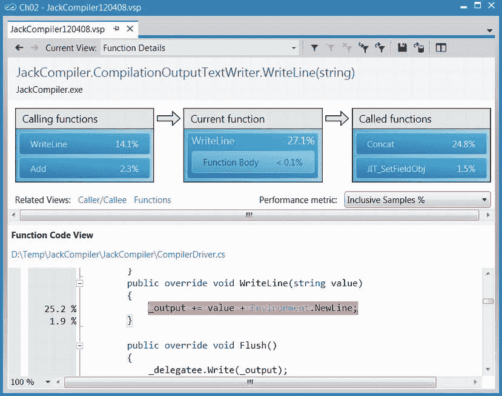
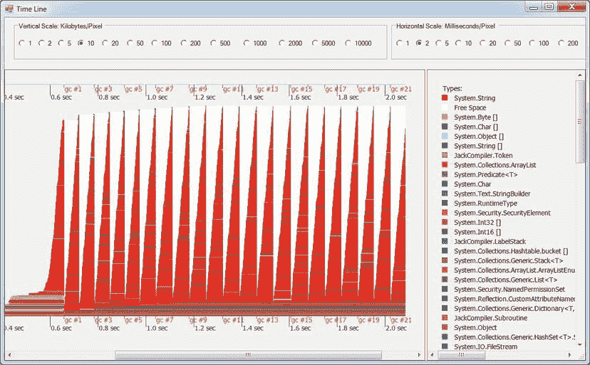

# 二、性能测量

这本书是关于提高性能的。NET 应用。你不能改进你不能首先测量的东西，这就是为什么我们的第一个实质性章节处理性能测量工具和技术。对于注重性能的开发人员来说，猜测应用的瓶颈在哪里，并过早地得出要优化什么的结论是最糟糕的事情，而且往往以危险告终。正如我们在[第 1 章](01.html)中看到的，有许多有趣的性能指标可能是您的应用感知性能的核心因素；在本章中，我们将看到如何获得它们。

绩效评估方法

衡量应用性能的正确方法不止一种，在很大程度上取决于上下文、应用的复杂性、所需信息的类型以及所获得结果的准确性。

测试小程序或库方法的一种方法是*白盒测试* :检查源代码，在白板上分析其复杂性，修改程序的源代码，并在其中插入度量代码。我们将在本章末尾讨论这种方法，通常称为*微基准*；在需要精确的结果和对每条 CPU 指令的绝对理解的情况下，它可能非常有价值，而且通常是不可替代的，但在涉及大型应用时，它相当耗时且不灵活。此外，如果您事先不知道要度量和推理程序的哪个小部分，那么在不借助自动化工具的情况下，隔离瓶颈可能会非常困难。

对于更大的程序，更常见的方法是*黑盒测试* ，其中性能指标由人识别，然后由工具自动测量。当使用这种方法时，开发人员不必预先确定性能瓶颈，也不必假设问题出在程序的某个(且很小的)部分。在本章中，我们将考虑许多工具，这些工具可以自动分析应用的性能，并以易于理解的形式提供定量结果。这些工具包括*性能计数器* 、Windows 事件跟踪(*【ETW】*)和商业*剖析器*。

当您阅读本章时，请记住性能测量工具会对应用性能产生负面影响。很少有工具能够提供准确的信息，同时在应用执行时不产生任何开销。当我们从一个工具转移到下一个工具时，请始终记住，工具的准确性经常与它们对您的应用造成的开销相冲突。

内置 Windows 工具

在我们转向需要安装和侵入性测量应用性能的商业工具之前，最重要的是要确保 Windows 提供的开箱即用的一切都得到最大限度的利用。近二十年来，性能计数器一直是 Windows 的一部分，而 Windows 的事件跟踪则稍新一些，在 Windows Vista 时期(2006 年)变得真正有用。两者都是免费的，存在于每个版本的 Windows 上，并且可以用最小的开销用于性能调查。

性能计数器

Windows 性能计数器是一种内置的 Windows 机制，用于性能和运行状况调查。包括 Windows 内核、驱动程序、数据库和 CLR 在内的各种组件提供了性能计数器，用户和管理员可以使用这些计数器来了解系统的运行情况。额外的好处是，默认情况下，大多数系统组件的性能计数器都是打开的，因此收集这些信息不会带来任何额外的开销。

从本地或远程系统读取性能计数器信息非常容易。内置的*性能监视器*工具(perfmon.exe)可以显示系统上可用的每个性能计数器，并将性能计数器数据记录到一个文件中以供后续调查，并在性能计数器读数超过定义的阈值时提供自动警报。如果您有管理员权限并且可以通过本地网络连接到远程系统，性能监视器也可以监视远程系统。

性能信息按以下层次组织:

*   *性能计数器类别*(或*性能对象*)代表与某个系统组件相关的一组单独的计数器。类别的一些例子包括。NET CLR 内存、处理器信息、TCPv4 和 PhysicalDisk。
*   *性能计数器*是性能计数器类别中的单个数字数据属性。通常用斜线分隔性能计数器类别和性能计数器名称，例如 Process\Private Bytes。性能计数器有几种受支持的类型，包括原始数字信息(进程\线程计数)、事件速率(打印队列\每秒打印的字节数)、百分比(物理磁盘\%空闲时间)和平均值(service model operation 3 . 0 . 0 . 0 \ Calls Duration)。
*   *性能计数器类别实例*用于区分几组计数器和一个特定组件，该组件有几个实例。例如，因为系统上可能有多个处理器，所以每个处理器都有一个处理器信息类别的实例(以及一个 aggregated _Total 实例)。性能计数器类别可以是多实例的，也可以是单实例的(例如内存类别)。

如果您查看由运行的典型 Windows 系统提供的性能计数器的完整列表。NET 应用，您将会看到许多性能问题无需借助任何其他工具就可以识别出来。至少，在调查性能问题或检查生产系统的数据日志以了解其行为是否正常时，性能计数器通常可以提供一个大致的方向。

下面是一些场景，在这些场景中，系统管理员或性能调查员可以在使用更强大的工具之前大致了解性能问题的症结所在:

*   如果应用出现内存泄漏，可以使用性能计数器来确定是托管内存分配还是本机内存分配导致了内存泄漏。Process\Private Bytes 计数器可以与。所有堆计数器中的. NET CLR 内存\# 字节。前者占进程分配的所有私有内存(包括 GC 堆)，而后者只占托管内存。(参见[图 2-1](#Fig00021) 。)
*   如果一个 ASP.NET 应用开始表现出异常行为，ASP.NET 应用类别可以提供关于正在发生的事情的更多信息。例如，Requests/Sec、Requests Timed Out、Request Wait Time 和 Requests Executing 计数器可以识别极端负载条件，Errors Total/Sec 计数器可以提示应用是否面临异常数量，而各种与缓存和输出缓存相关的计数器可以指示缓存是否得到有效应用。
*   如果严重依赖数据库和分布式事务的 WCF 服务无法处理其当前负载，则 ServiceModelService 类别可以查明问题——未完成的调用、每秒调用数和每秒失败的调用数计数器可以确定负载过重，每秒流动的事务数计数器报告服务正在处理的事务数，同时 SQL Server 类别(如 MSSQL＄instance name:Transactions 和 MSSQL＄instance name:Locks)可以指出事务执行、过度锁定甚至死锁方面的问题。


[**图 2-1**](#_Fig00021) 。*性能监视器主窗口，显示特定进程的三个计数器。图中最上面一行是进程\私有字节计数器，中间一行是。所有堆中的. NET CLR 内存\# 字节，最下面的是。NET CLR 内存\每秒分配的字节数。从图中可以明显看出，应用在 GC 堆中出现了内存泄漏*

用性能计数器监视内存使用情况

在这个简短的实验中，您将使用性能监视器和上面讨论的性能计数器来监视一个示例应用的内存使用情况，并确定它是否存在内存泄漏。

1.  打开性能监视器—您可以通过搜索“性能监视器”在“开始”菜单中找到它，或者直接运行 perfmon.exe。
2.  从本章的源代码文件夹中运行 MemoryLeak.exe 应用。
3.  单击左侧树中的“性能监视器”节点，然后单击绿色的 **+** 按钮。
4.  从。NET CLR 内存类别，选择所有堆中的# Bytes 和分配的字节/秒性能计数器，从实例列表中选择 MemoryLeak 实例，然后单击“添加> >”按钮。
5.  从 Process 类别中选择 Private Bytes 性能计数器，从 instance 列表中选择 MemoryLeak 实例，然后单击“Add > >”按钮。
6.  单击“确定”按钮确认您的选择并查看性能图。
7.  您可能需要右键单击屏幕底部的计数器，并选择“缩放选定的计数器”来查看图表上的实际线条。

You should now see the lines corresponding to the Private Bytes and # Bytes in all Heaps performance counters climb in unison (somewhat similar to [Figure 2-1](#Fig00021)). This points to a memory leak in the managed heap. We will return to this particular memory leak in [Chapter 4](04.html) and pinpoint its root cause.

 **提示**在一个典型的 Windows 系统上，几乎有数千个性能计数器；没有一个绩效调查员会记得所有的问题。这就是“添加计数器”对话框底部的小“显示描述”复选框派上用场的地方——它可以告诉您系统\处理器队列长度代表系统处理器上等待执行的就绪线程的数量。NET CLR LocksAndThreads \ Contention Rate/sec 是线程尝试获取托管锁失败并必须等待该锁可用的次数(每秒)。

性能计数器日志和警报

配置性能计数器日志相当容易，您甚至可以向系统管理员提供一个 XML 模板来自动应用性能计数器日志，而不必指定单独的性能计数器。您可以在任何机器上打开生成的日志，并回放它们，就像它们代表实时数据一样。(您甚至可以使用一些内置的计数器集，而不是手动配置要记录的数据。)

您还可以使用性能监视器来配置性能计数器警报，当超过某个阈值时，该警报将执行任务。您可以使用性能计数器警报来创建一个基本的监视基础结构，当违反性能约束时，它可以向系统管理员发送电子邮件或消息。例如，您可以配置一个性能计数器警报，当它达到危险的内存使用量时，或者当整个系统用完磁盘空间时，它会自动重新启动您的进程。我们强烈建议您试用性能监视器，并熟悉它所提供的各种选项。

配置性能计数器日志

要配置性能计数器日志，请打开性能监视器并执行以下步骤。(我们假设您在 Windows 7 或 Windows Server 2008 R2 上使用性能监视器；在以前的操作系统版本中，性能监视器的用户界面略有不同，如果您正在使用这些版本，请查阅文档以获得详细说明。)

1.  在左侧的树中，展开数据收集器集节点。
2.  右键单击用户定义的节点，并从上下文菜单中选择新建数据收集器集。
3.  命名数据收集器集，选择“手动创建(高级)”单选按钮，然后单击“下一步”。
4.  确保选中“创建数据日志”单选按钮，选中“性能计数器”复选框，然后单击“下一步”。
5.  使用“添加”按钮添加性能计数器(将打开标准的“添加计数器”对话框)。完成后，配置一个采样间隔(默认为每 15 秒对计数器进行一次采样)，然后单击 Next。
6.  提供一个目录，性能监视器将使用它来存储您的计数器日志，然后单击“下一步”。
7.  选择“打开此数据收集器集的属性”单选按钮，然后单击“完成”。
8.  使用各种选项卡进一步配置数据收集器集—您可以定义自动运行的计划、停止条件(例如，在收集超过一定数量的数据后)以及数据收集停止时运行的任务(例如，将结果上载到集中位置)。完成后，点按“好”。
9.  单击用户定义的节点，右键单击主窗格中的数据收集器集，然后从上下文菜单中选择启动。
10.  Your counter log is now running and collecting data to the directory you’ve selected. You can stop the data collector set at any time by right-clicking it and selecting Stop from the context menu.

    当您完成数据收集并希望使用性能监视器检查数据时，执行以下步骤:

11.  选择用户定义的节点。
12.  右键单击数据收集器集，并从上下文菜单中选择最新报告。
13.  在出现的窗口中，您可以在日志的计数器列表中添加或删除计数器，配置时间范围，并通过右键单击图表并从上下文菜单中选择属性来更改数据比例。

Finally, to analyze log data on another machine, you should copy the log directory to that machine, open the Performance Monitor node, and click the second toolbar button from the left (or Ctrl + L). In the resulting dialog you can select the “Log files” checkbox and add log files using the Add button.

自定义性能计数器

虽然性能监视器是一个非常有用的工具，但是您可以从任何。NET 应用。诊断。PerformanceCounter 类。更好的是，您可以创建自己的性能计数器，并将它们添加到大量可用于性能调查的数据中。

下面是一些您应该考虑导出性能计数器类别的场景:

*   您正在开发一个基础设施库，作为大型系统的一部分。您的库可以通过性能计数器报告性能信息，对于开发人员和系统管理员来说，这通常比跟踪日志文件或在源代码级别进行调试更容易。
*   您正在开发一个服务器系统，该系统接受定制请求，处理它们，并交付响应(定制 Web 服务器、Web 服务等)。).您应该报告请求处理率、遇到的错误和类似统计的性能信息。(有关一些想法，请参见 ASP.NET 性能计数器类别。)
*   您正在开发一个高可靠性的 Windows 服务，该服务在无人值守的情况下运行，并与自定义硬件进行通信。您的服务可以报告硬件的健康状况、软件与硬件的交互率以及类似的统计数据。

以下代码是从应用中导出单实例性能计数器类别并定期更新这些计数器所需的全部内容。它假设 AttendanceSystem 类具有关于当前登录的雇员数量的信息，并且您希望将此信息公开为性能计数器。(你将需要这个系统。诊断命名空间来编译这段代码。)

```cs
public static void CreateCategory() {
  if (PerformanceCounterCategory.Exists("Attendance")) {
   PerformanceCounterCategory.Delete("Attendance");
  }
  CounterCreationDataCollection counters = new CounterCreationDataCollection();
  CounterCreationData employeesAtWork = new CounterCreationData(
   "# Employees at Work", "The number of employees currently checked in.",
   PerformanceCounterType.NumberOfItems32);
  PerformanceCounterCategory.Create(
   "Attendance", "Attendance information for Litware, Inc.",
   PerformanceCounterCategoryType.SingleInstance, counters);
}
public static void StartUpdatingCounters() {
  PerformanceCounter employeesAtWork = new PerformanceCounter(
   "Attendance", "# Employees at Work", readOnly: false);
  updateTimer = new Timer(_ = > {
   employeesAtWork.RawValue = AttendanceSystem.Current.EmployeeCount;
  }, null, TimeSpan.Zero, TimeSpan.FromSeconds(1));
}

```

正如我们所看到的，配置自定义性能计数器几乎不费吹灰之力，而且在执行性能调查时，它们可能是至关重要的。将系统性能计数器数据与自定义性能计数器相关联通常是性能调查人员查明性能或配置问题的确切原因所需的全部工作。

 **注意**性能监视器可以用来收集与性能计数器无关的其他类型的信息。您可以使用它从系统中收集配置数据—注册表项的值、WMI 对象属性，甚至有趣的磁盘文件。您还可以使用它从 ETW 提供者(我们将在下面讨论)获取数据，以供后续分析。通过使用 XML 模板，系统管理员可以快速地将数据收集器集应用于系统，并通过很少的手动配置步骤生成有用的报告。

尽管性能计数器提供了大量有趣的性能信息，但它们不能用作高性能的日志记录和监控框架。没有系统组件更新性能计数器的频率超过每秒几次，Windows 性能监视器读取性能计数器的频率不会超过每秒一次。如果您的性能调查需要每秒跟踪数千个事件，那么性能计数器并不适合。我们现在将注意力转向 Windows (ETW)的*事件跟踪，它是为高性能数据收集和更丰富的数据类型(不仅仅是数字)而设计的。*

Windows 事件跟踪(ETW)

Windows 事件跟踪(ETW) 是一个内置于 Windows 的高性能事件记录框架。与性能计数器的情况一样，许多系统组件和应用框架，包括 Windows 内核和 CLR，都定义了*提供者* ，它们报告*事件*——关于组件内部工作的信息。与始终打开的性能计数器不同，ETW 提供程序可以在运行时打开和关闭，因此只有在性能调查需要它们时，才会产生传输和收集它们的性能开销。

最丰富的 ETW 信息来源之一是*内核提供者*，它报告关于进程和线程创建、DLL 加载、内存分配、网络 I/O 和堆栈跟踪统计的事件(也称为*采样* )。表 2-1 显示了内核和 CLR ETW 提供者报告的一些有用信息。您可以使用 ETW 来调查整体系统行为，例如哪些进程正在消耗 CPU 时间，分析磁盘 I/O 和网络 I/O 瓶颈，获取托管进程的垃圾收集统计信息和内存使用情况，以及本节稍后讨论的许多其他场景。

ETW 事件标记有精确的时间，可以包含自定义信息，以及可选的堆栈跟踪事件发生的位置。这些堆栈跟踪可用于进一步识别性能和正确性问题的来源。例如，CLR 提供程序可以在每次垃圾回收的开始和结束时报告事件。结合精确的调用堆栈，这些事件可用于确定程序的哪些部分通常会导致垃圾收集。(有关垃圾收集及其触发器的更多信息，请参见[第 4 章](04.html)。)

[表 2-1。](#_Tab00021)Windows 中 ETW 事件的部分列表和 CLR


访问这些非常详细的信息需要一个 ETW 收集工具和一个能够读取原始 ETW 事件并执行一些基本分析的应用。在撰写本文时，有两种工具能够完成这两种任务: *Windows 性能工具包* (WPT，也称为 XPerf)，它与 Windows SDK 一起提供，以及*性能监视器* (不要与 Windows 性能监视器混淆！)，这是微软 CLR 团队的一个开源项目。

Windows 性能工具包(WPT)

windows Performance Toolkit(WPT)是一套实用程序，用于控制 ETW 会话，将 ETW 事件捕获到日志文件中，并对它们进行处理以供以后显示。它可以生成 ETW 事件的图形和覆盖图，包括调用堆栈信息和聚合的汇总表，以及用于自动处理的 CSV 文件。要下载 WPT，请从[http://msdn.microsoft.com/en-us/performance/cc752957.aspx](http://msdn.microsoft.com/en-us/performance/cc752957.aspx)下载 Windows SDK Web 安装程序，并从安装选项屏幕中仅选择常用实用程序 Windows Performance Toolkit。Windows SDK 安装程序完成后，导航到 SDK 安装目录 的 Redist \ Windows Performance Toolkit 子目录，并运行适用于您系统架构的安装程序文件(32 位系统为 Xperf_x86.msi，64 位系统为 Xperf_x64.msi)。

 **注意**在 64 位 Windows 上，堆栈审核需要更改注册表设置，以禁用内核代码页的分页(对于 Windows 内核本身和任何驱动程序)。这可能会将系统的工作集(RAM 利用率)增加几兆字节。若要更改此设置，请导航到注册表项 HKLM \系统\当前控制集\控制\会话管理器\内存管理，将 DisablePagingExecutive 值设置为 DWORD 0x1，然后重新启动系统。

您将用于捕获和分析 ETW 追踪的工具是 XPerf.exe 和 XPerfView.exe。这两个工具都需要管理权限才能运行。XPerf.exe 工具有几个命令行选项，用于控制跟踪期间启用哪些提供程序、使用的缓冲区大小、事件刷新到的文件名以及许多其他选项。XPerfView.exe 工具分析并提供跟踪文件内容的图形报告。

所有的跟踪都可以用调用栈来扩充，调用栈通常允许对性能问题进行精确的放大。但是，您不必从特定的提供者捕获事件来获得系统正在做什么的堆栈跟踪；SysProfile 内核标志组支持以 1 毫秒为间隔从所有处理器收集堆栈跟踪。这是理解一个繁忙的系统在方法级做什么的基本方法。(在本章后面讨论*采样*评测器 时，我们会更详细地回到这个模式。)

用 XPERF 捕获和分析内核踪迹

在本节中，您将使用 XPerf.exe 捕获一个内核跟踪，并在 XPerfView.exe 图形工具中分析结果。本实验旨在 Windows Vista 系统或更高版本上进行。(它还要求您设置两个系统环境变量。为此，右键单击计算机，单击属性，单击“高级系统设置”，最后单击对话框底部的“环境变量”按钮。)

1.  设置系统环境变量 _NT_SYMBOL_PATH 指向微软公共符号服务器和本地符号缓存，例如:SRV * C:\ Temp \ Symbols *[http://msdl.microsoft.com/download/symbols](http://msdl.microsoft.com/download/symbols)
2.  将系统环境变量 _NT_SYMCACHE_PATH 设置为磁盘上的本地目录—这应该是与上一步中的本地符号缓存不同的*目录。*
3.  打开管理员命令提示符窗口，导航到安装 WPT 的安装目录(例如 C:\ Program Files \ Windows Kits \ 8.0 \ Windows Performance Toolkit)。
4.  从基本内核提供者组开始跟踪，该组包含 PROC_THREAD、LOADER、DISK_IO、HARD_FAULTS、PROFILE、MEMINFO 和 MEMINFO_WS 内核标志(参见[表 2-1](#Tab00021) )。为此，运行以下命令:xperf -on Base
5.  启动一些系统活动:运行应用，在窗口之间切换，打开文件——至少几秒钟。(这些是将进入跟踪的事件。)
6.  通过运行以下命令，停止跟踪并将跟踪刷新到日志文件中:xperf -d KernelTrace.etl
7.  通过运行以下命令启动图形性能分析器:xperfview KernelTrace.etl
8.  结果窗口包含几个图形，每个图形对应一个在跟踪过程中生成事件的 ETW 关键字。您可以选择在左侧显示的图表。通常，最上面的图形按处理器显示处理器利用率，随后的图形显示磁盘 I/O 操作计数、内存使用情况和其他统计信息。
9.  选择处理器利用率图的一个部分，右键单击它，然后从上下文菜单中选择 Load Symbols。再次右键单击所选部分，并选择简单汇总表。这应该会打开一个可扩展的视图，您可以在跟踪期间有一些处理器活动的所有进程中的方法之间导航。(第一次从 Microsoft 符号服务器加载符号可能会很耗时。)

There’s much more to WPT than you’ve seen in this experiment; you should explore other parts of the UI and consider capturing and analyzing trace data from other kernel groups or even your own application’s ETW providers. (We’ll discuss custom ETW providers later in this chapter.)

在许多有用的场景中，WPT 可以洞察系统的整体行为和单个进程的性能。以下是这些场景的一些截图和示例:

*   WPT 可以捕获系统上的所有磁盘 I/O 操作,并将它们显示在物理磁盘的地图上。这有助于深入了解昂贵的 I/O 操作，尤其是在旋转硬盘上涉及大量寻道的情况下。(参见[图 2-2](#Fig00022) 。)
*   WPT 可以在跟踪期间为系统上的所有处理器活动提供调用堆栈。它在进程、模块和函数级别聚集调用堆栈，并允许对系统(或特定应用)在何处花费 CPU 时间有一目了然的了解。请注意，托管帧不受支持—我们将在稍后使用 PerfMonitor 工具解决这一缺陷。(参见[图 2-3](#Fig00023) 。)
*   WPT 可以显示不同活动类型的覆盖图，以提供 I/O 操作、内存利用率、处理器活动和其他捕获指标之间的相关性。(参见[图 2-4](#Fig00024) 。)
*   WPT 可以在跟踪中显示调用堆栈聚合(当跟踪最初用-stackwalk 命令行开关配置时)—这提供了创建了某些事件的调用堆栈的完整信息。(参见[图 2-5](#Fig00025) 。)


[**图 2-2**](#_Fig00022) *磁盘 I/O 操作在物理磁盘的地图上布局。I/O 操作之间的寻道和单个 I/O 细节通过工具提示提供*


[**图 2-3**](#_Fig00023) *单个进程的详细堆栈帧(times napper . exe)。权重栏显示了(大致)在该帧*中花费了多少 CPU 时间


[**图 2-4**](#_Fig00024) *CPU 活动(线条-每条线条表示不同的处理器)和磁盘 I/O 操作(列)的叠加图。I/O 活动和 CPU 活动之间没有明显的相关性*


[**图 2-5**](#_Fig00025) *在报表中调用堆栈聚合。请注意，托管框架仅部分显示。！？无法解析帧。mscorlib.dll 框架(例如系统。DateTime.get_Now())被成功解析，因为它们是使用 NGen 预编译的，而不是在运行时由 JIT 编译器编译的*

 **注意**最新版本的 Windows SDK(8.0 版)附带了一对新工具，名为 Windows Performance Recorder(wpr.exe)和 Windows Performance Analyzer(wpa . exe)，旨在逐步取代我们之前使用的 XPerf 和 XPerfView 工具。比如 wpr -start CPU 大致相当于 xperf -on Diag，wpr -stop reportfile 大致相当于 xperf -d reportfile。WPA 分析 UI 略有不同，但提供了类似于 XPerfView 的功能。有关新工具的更多信息，请查阅位于 http://msdn.microsoft.com/en-us/library/hh162962.aspx 的 MSDN 文档。

XPerfView 非常能够以吸引人的图形和表格显示内核提供者数据，但是它对定制提供者的支持却不那么强大。例如，我们可以从 CLR ETW 提供程序捕获事件，但 XPerfView 不会为各种事件生成漂亮的图形，我们必须根据提供程序文档中的关键字和事件列表来理解跟踪中的原始数据(MSDN 文档中提供了 CLR ETW 提供程序的关键字和事件的完整列表，http://msdn . Microsoft . com/en-us/library/ff 357720 . aspx)。

如果我们使用 CLR ETW 提供程序(e 13 c0d 23-ccbc-4e 12-931 b-d 9 cc 2 eee 27 e 4)运行 XPerf，使用 GC 事件的关键字(0x00000001)和详细日志级别(0x5)，它将忠实地捕获提供程序生成的每个事件。通过将它转储到一个 CSV 文件或用 XPerfView 打开它，我们将能够——慢慢地——识别应用中与 GC 相关的事件。[图 2-6](#Fig00026) 显示了生成的 XPerfView 报告的一个示例——GC/Start 和 GC /Stop 行之间经过的时间是在被监控的应用中完成一次垃圾收集所花费的时间。


[**图 2-6**](#_Fig00026) *CLR GC 相关事件的原始报告 。选中的行显示 GCAllocationTick_V1 事件，每次大约分配 100KB 内存时都会引发该事件*

幸运的是，微软的基础类库(BCL)团队已经发现了这一缺陷，并提供了一个开源库和工具来分析 CLR ETW 跟踪，称为 PerfMonitor。我们接下来讨论这个工具。

性能监视器

PerfMonitor.exe 开源命令行工具已经由微软的 BCL 团队通过 CodePlex 网站发布。在撰写本文时，最新的版本是 PerfMonitor 1.5，可以从 http://bcl.codeplex.com/releases/view/49601 下载。与 WPT 相比，PerfMonitor 的主要优势 是它对 CLR 事件有深入的了解，并提供不仅仅是原始的表格数据。PerfMonitor 分析进程中的 GC 和 JIT 活动，可以对托管堆栈跟踪进行采样，并确定应用的哪些部分正在使用 CPU 时间。

对于高级用户，PerfMonitor 还附带了一个名为 TraceEvent 的库，该库支持对 CLR ETW 跟踪的编程访问，以便进行自动检查。您可以使用定制系统监视软件中的 TraceEvent 库来自动检查来自生产系统的跟踪，并决定如何对其进行分类。

虽然 PerfMonitor 可用于收集内核事件，甚至是来自自定义 ETW 提供程序的事件(使用/KernelEvents 和/Provider 命令行开关)，但它通常用于分析使用内置 CLR 提供程序的托管应用的行为。它的 runAnalyze 命令 行选项执行您选择的应用，监控它的执行，并在它终止时生成一个详细的 HTML 报告并在您的默认浏览器中打开它。(您应该遵循 PerfMonitor 用户指南(至少是快速入门部分),以生成类似于本部分截图的报告。要显示用户指南，请运行 PerfMonitor usersguide。)

当指示 PerfMonitor 运行应用并生成报告时，它会生成以下命令行输出。在阅读本节时，您可以通过在本章的源代码文件夹 中的 JackCompiler.exe 示例应用上运行该工具来亲自试验该工具。

c:\性能监视器>性能监视器运行分析 JackCompiler.exe

开始内核跟踪。输出文件:PerfMonitorOutput.kernel.etl

开始用户模型跟踪。输出文件:PerfMonitorOutput.etl

从 2012 年 4 月 7 日下午 12:33:40 开始

当前目录 C:\PerfMonitor

执行:JackCompiler.exe {

}停止于 2012 年 4 月 7 日 12 时 33 分 42 秒= 1.724 秒

正在停止对会话“NT 内核记录器”和“PerfMonitorSession”的跟踪。

分析 C:\ PerfMonitor \ perfmonitoroutput . etlx 中的数据

C:\ PerfMonitor \ PerfMonitorOutput 中的 GC 时间 HTML 报告。GCTime.html

C:\ PerfMonitor \ perfmonitoroutput . JIT Time . HTML 中的 JIT 时间 HTML 报告

筛选以处理 JackCompiler (1372)。开始于 1372.000 毫秒。

过滤至时间区域[0.000，1391.346]毫秒

C:\ PerfMonitor \ perfmonitoroutput . cputime . HTML 中的 CPU 时间 HTML 报告

筛选以处理 JackCompiler (1372)。开始于 1372.000 毫秒。

C:\ perf monitor \ perfmonitoroutput . analyze . HTML 中的性能分析 HTML 报告

PerfMonitor 处理时间:7.172 秒。

PerfMonitor 生成的各种 HTML 文件 包含了经过提炼的报告，但是您始终可以通过 XPerfView 或任何其他能够读取二进制 ETW 跟踪的工具来使用原始的 ETL 文件。上面示例的概要分析包含以下信息(当然，当您在自己的机器上运行这个实验时，这可能会有所不同):

*   CPU 统计—消耗的 CPU 时间为 917 毫秒，平均 CPU 利用率为 56.6%。剩下的时间都用来等待什么了。
*   GC 统计—总 GC 时间为 20 毫秒，最大 GC 堆大小为 4.5MB，最大分配率为 1496.1MB/s，平均 GC 暂停时间为 0.1 毫秒
*   JIT 编译统计—JIT 编译器在运行时编译了 159 个方法，总共有 30493 字节的机器代码。

深入到 CPU、GC 和 JIT 报告 可以提供大量有用的信息。CPU 详细报告提供了使用大量 CPU 时间的方法的信息(*自下而上分析*)、CPU 时间使用位置的调用树(*自上而下分析*)以及跟踪中每个方法的单独调用者-被调用者视图。为了防止报告变得非常大，不超过预定义相关性阈值(自下而上分析为 1%，自上而下分析为 5%)的方法被排除在外。[图 2-7](#Fig00027) 是一个自下而上报告的例子 CPU 工作量最大的三种方法是系统。String.Concat，JackCompiler。Tokenizer.Advance 和 system . linq . enumerable . contains .[图 2-8](#Fig00028) 是一个(部分)自上而下报告的例子 JackCompiler 消耗了 84.2%的 CPU 时间。Parser.Parse，它调用 ParseClass、ParseSubDecls、ParseSubDecl、ParseSubBody 等等。


[**图 2-7**](#_Fig00027) 来自 PerfMonitor 的*自下而上报告 。“Exc %”列是该方法单独使用的 CPU 时间的估计值；“Inc %”列是该方法及其调用的所有其他方法(调用树中的子树)使用的 CPU 时间的估计值*


[**图 2-8**](#_Fig00028) *来自性能监视器*的自上而下报告

详细的 GC 分析报告 包含一个表格，其中包含每一代的垃圾收集统计信息(计数、次数),以及单个 GC 事件信息，包括暂停时间、回收的内存和许多其他信息。当我们在[第 4 章](04.html)中讨论垃圾收集器的内部工作方式和性能含义时，这些信息中的一些会非常有用。[图 2-9](#Fig00029) 显示了几行单独的 GC 事件。


[**图 2-9**](#_Fig00029) *单个 GC 事件，包括回收的内存量、应用暂停时间、发生的收集类型以及其他详细信息*

最后，详细的 JIT 分析报告 显示了 JIT 编译器为每个应用的方法所需的时间以及它们被编译的精确时间。这些信息有助于确定应用的启动性能是否可以提高——如果 JIT 编译器花费了过多的启动时间，预编译应用的二进制文件(使用 NGen)可能是一个值得的优化。我们将在第 10 章的[中讨论 NGEN 和其他减少应用启动时间的策略。](10.html)

 **提示**从多个高性能 ETW 提供商那里收集信息会生成非常大的日志文件。例如，在默认收集模式下，PerfMonitor 通常每秒生成 5MB 以上的原始数据。让这样的痕迹持续几天可能会耗尽磁盘空间，即使是在大容量硬盘上。幸运的是，XPerf 和 PerfMonitor 都支持循环日志模式，在这种模式下，只保留最后的 *N* 兆字节的日志。在 PerfMonitor 中,/Circular 命令行开关采用最大日志文件大小(以兆字节为单位),并在超过阈值时自动丢弃最旧的日志。

虽然 PerfMonitor 是一个非常强大的工具，但它的原始 HTML 报告和丰富的命令行选项使它有点难以使用。我们将看到的下一个工具提供了与 PerfMonitor 非常相似的功能，并且可以在相同的场景中使用，但是它有一个更加用户友好的界面来收集和解释 ETW 信息，并且将使一些性能调查大大缩短。

性能视图工具

PerfView 是一个免费的微软工具，它将 PerfMonitor 中已经提供的 ETW 收集和分析功能与堆分析功能统一起来，我们将在后面结合 CLR Profiler 和 ANTS Memory Profiler 等工具讨论堆分析功能。你可以从微软下载中心下载 PerfView，地址是 http://www.microsoft.com/download/en/details.aspx?id=28567[。请注意，您必须以管理员身份运行 PerfView，因为它需要访问 ETW 基础架构。](http://www.microsoft.com/download/en/details.aspx?id=28567)


[**图 2-10**T3。 *PerfView 的主界面。在文件视图(左侧)中，可以看到一个堆转储和一个 ETW 跟踪。主视图上的链接指向工具支持的各种命令*](#_Fig000210)

要分析来自特定进程的 ETW 信息，使用 PerfView 中的 Collect  Run 菜单项([图 2-10](#Fig000210) 显示了主 UI)。出于我们稍后将执行的堆分析的目的，您可以在本章源代码文件夹中的 MemoryLeak.exe 示例应用上使用 PerfView。它将为您运行该流程，并生成一份报告，其中包含 PerfMonitor 提供的所有信息以及更多信息，包括:

*   从各种提供程序收集的 ETW 事件的原始列表(例如，CLR 争用信息、本机磁盘 I/O、TCP 数据包和硬页面错误)
*   应用 CPU 时间花费的分组堆栈位置，包括可配置的过滤器和阈值
*   映像(程序集)加载、磁盘 I/O 操作和 GC 分配的堆栈位置(针对每 100KB 分配的对象)
*   GC 统计和事件，包括每次垃圾收集的持续时间和回收的空间量

此外，PerfView 可用于从当前运行的进程中捕获堆快照，或者从转储文件中导入堆快照。导入后，PerfView 可用于在快照中查找内存利用率最高的类型，并识别负责保持这些类型活动的引用链。[图 2-11](#Fig000211) 显示了调度类的 PerfView 引用分析器，它负责(包括)31MB 的堆快照内容。PerfView 成功地识别出持有调度对象引用的 Employee 类实例，同时 Employee 实例被 f-reachable 队列保留(在[第 4 章](04.html)中讨论)。


[**图 2-11**T3。*调度类实例的引用链，在捕获的堆快照中负责应用 99.5%的内存使用*](#_Fig000211)

当我们在本章后面讨论内存分析器时，我们会看到与商业工具相比，PerfView 的可视化功能仍然有些欠缺。尽管如此，PerfView 是一个非常有用的免费工具，它可以大大缩短许多性能调查的时间。您可以使用从其主屏幕链接的内置教程来了解更多信息，还有 BCL 团队录制的视频展示了该工具的一些主要功能。

自定义 ETW 提供商

与性能计数器类似，您可能希望利用 ETW 为您自己的应用需求提供的强大的工具和信息收集框架。之前。NET 4.5 中，从托管应用公开 ETW 信息是相当复杂的。您必须处理大量关于为应用的 ETW 提供者定义清单、在运行时实例化它以及记录事件的细节。截至。NET 4.5，编写一个定制的 ETW 提供程序再简单不过了。你需要做的就是从系统中推导出来。并调用 WriteEvent 基类方法来输出 ETW 事件。向系统注册 ETW 提供者和格式化事件数据的所有细节都是自动为您处理的。

下面的类是托管应用中 ETW 提供程序的一个示例(完整的程序可以在本章的源代码文件夹中找到，以后可以使用 PerfMonitor 运行它):

```cs
public class CustomEventSource : EventSource {
  public class Keywords {
   public const EventKeywords Loop = (EventKeywords)1;
   public const EventKeywords Method = (EventKeywords)2;
  }
  [Event(1, Level = EventLevel.Verbose, Keywords = Keywords.Loop,
   Message = "Loop {0} iteration {1}")]
  public void LoopIteration(string loopTitle, int iteration) {
   WriteEvent(1, loopTitle, iteration);
  }
  [Event(2, Level = EventLevel.Informational, Keywords = Keywords.Loop,
   Message = "Loop {0} done")]
  public void LoopDone(string loopTitle) {
   WriteEvent(2, loopTitle);
  }
  [Event(3, Level = EventLevel.Informational, Keywords = Keywords.Method,
   Message = "Method {0} done")]
  public void MethodDone([CallerMemberName] string methodName = null) {
   WriteEvent(3, methodName);
  }
}
class Program {
  static void Main(string[] args) {
   CustomEventSource log = new CustomEventSource();
   for (int i = 0; i < 10; ++i) {
   Thread.Sleep(50);
   log.LoopIteration("MainLoop", i);
   }
   log.LoopDone("MainLoop");
   Thread.Sleep(100);
   log.MethodDone();
  }
}

```

PerfMonitor 工具可用于从该应用自动获取其包含的 ETW 提供程序，在监控该 ETW 提供程序的同时运行该应用，并生成该应用提交的所有 ETW 事件的报告。例如:

c:\性能监视器>性能监视器监视器转储 Ch02.exe

开始内核跟踪。输出文件:PerfMonitorOutput.kernel.etl

开始用户模型跟踪。输出文件:PerfMonitorOutput.etl

找到了提供程序 CustomEventSource Guid ff 6a 40d 2-5116-5555-675 b-4468 e 821162 e

正在启用提供程序 ff 6a 40d 2-5116-5555-675 b-4468 e 821162 e 级别:详细关键字:0xffffffffffffffff

从 2012 年 4 月 7 日下午 1:44:00 开始

当前目录 C:\PerfMonitor

执行:Ch02.exe {

}停止于 2012 年 4 月 7 日下午 1 点 44 分 01 秒= 0.693 秒

正在停止对会话“NT 内核记录器”和“PerfMonitorSession”的跟踪。

将 C:\ PerfMonitor \ perfmonitoroutput . etlx 转换为 XML 文件。

C:\ PerfMonitor \ PerfMonitor output . dump . XML 中的输出

PerfMonitor 处理时间:1.886 秒。

 **注意**还有一个性能监控和系统健康检测框架我们没有考虑: *Windows 管理检测* (WMI)。WMI 是集成在 Windows 中的命令和控制(C & C)基础设施，不在本章讨论范围之内。它可用于获取有关系统状态的信息(如安装的操作系统、BIOS 固件或可用磁盘空间)，注册感兴趣的事件(如进程创建和终止)，以及调用更改系统状态的控制方法(如创建网络共享或卸载驱动程序)。有关 WMI 的更多信息，请参考位于[http://msdn . Microsoft . com/en-us/library/windows/desktop/aa 394582 . aspx](http://msdn.microsoft.com/en-us/library/windows/desktop/aa394582.aspx)的 MSDN 文档。如果您对开发托管 WMI 提供程序感兴趣，可以阅读 Sasha Goldshtein 的文章“WMI 提供程序扩展。NET 3.5”([http://www . code project . com/Articles/25783/WMI-Provider-Extensions-in-NET-3-5](http://www.codeproject.com/Articles/25783/WMI-Provider-Extensions-in-NET-3-5)，2008)提供了一个良好的开端。

时间分析器

虽然性能计数器和 ETW 事件提供了对 Windows 应用性能的大量洞察，但通常从更具侵入性的工具(分析器)中可以获得很多，这些工具在方法和行级别检查应用的执行时间(在 ETW 堆栈跟踪收集支持的基础上进行改进)。在本节中，我们将介绍一些商业工具,并了解它们带来的好处，请记住，更强大、更精确的工具需要更大的测量开销。

在我们进入分析器世界的旅程中，我们会遇到许多商业工具；其中大多数都有几个现成的对等物。我们不认可任何特定的工具供应商；本章中展示的产品只是我们最常用的分析器，放在我们的工具箱中用于性能研究。和软件工具一样，你的里程数可能会有所不同。

我们考虑的第一个分析器是 Visual Studio 的一部分，自 Visual Studio 2005(Team Suite edition)以来就由微软提供。在本章中，我们将使用 Visual Studio 2012 探查器，它在 Visual Studio 的高级版和旗舰版中都有提供。

Visual Studio 采样探查器

Visual Studio 采样分析器 的操作类似于我们在 ETW 部分看到的概要内核标志。它定期中断应用，并记录当前运行应用线程的每个处理器上的调用堆栈信息。与内核 ETW 提供程序不同，这个采样分析器可以根据几个标准中断进程，其中一些标准在[表 2-2](#Tab00022) 中列出。

[表 2-2](#_Tab00022) 。Visual Studio 采样探查器事件(部分列表)


使用 Visual Studio profiler 捕获样本非常便宜，如果样本事件间隔足够宽(默认为 10，000，000 个时钟周期)，应用的执行开销可以少于 5%。此外，采样非常灵活，可以连接到一个正在运行的进程，收集一段时间的样本事件，然后从该进程断开以分析数据。由于这些特点，采样是开始 CPU 瓶颈性能调查的推荐方法，这种方法需要大量的 CPU 时间。

当采样会话完成时，探查器会提供摘要表，其中每个方法都与两个数字相关联:独占样本数*，这是该方法当前在 CPU 上执行时获取的样本；包含样本数*，这是该方法当前执行时或调用堆栈上任何其他位置获取的样本。具有许多独占样本的方法负责应用的 CPU 利用率；具有许多包含样本的方法不直接使用 CPU，而是调用其他使用 CPU 的方法。(例如，在单线程应用中，Main 方法拥有 100%的包含样本是有意义的。)**

 **从 VISUAL STUDIO 运行采样分析器

运行采样分析器最简单的方法是从 Visual Studio 本身，尽管(我们将在后面看到)它也支持从简化的命令行环境中进行生产分析。我们建议您使用自己的一个应用来做这个实验。

1.  在 Visual Studio 中，单击 Analyze 启动性能向导菜单项。
2.  在向导的第一页上，确保选择了“CPU sampling”单选按钮，然后单击“Next”按钮。(在本章的后面，我们将讨论其他的分析模式；然后你可以重复这个实验。)
3.  如果要分析的项目加载到当前解决方案中，请单击“一个或多个可用项目”单选按钮，并从列表中选择项目。否则，单击“可执行文件(。EXE 文件)”单选按钮。单击下一步按钮。
4.  如果您选择了“可执行文件(。在上一个屏幕上，将 profiler 指向您的可执行文件，并在必要时提供任何命令行参数，然后单击 Next 按钮。(如果您手头没有自己的应用，请随意使用本章源代码文件夹中的 JackCompiler.exe 示例应用。)
5.  选中“向导完成后启动性能分析”复选框，然后单击“完成”按钮。
6.  如果您不是以管理员身份运行 Visual Studio，将提示您升级探查器的凭据。
7.  当您的应用完成执行时，将会打开一个分析报告。使用顶部的“当前视图”组合框在不同视图之间导航，显示应用代码中收集的样本。

For more experimentation, after the profiling session completes make sure to check out the Performance Explorer tool window (Analyze  Windows  Performance Explorer). You can configure sampling parameters (e.g. choosing a different sample event or interval), change the target binary, and compare multiple profiler reports from different runs.

[图 2-12](#Fig000212) 显示了一个概要分析器结果的窗口，带有最昂贵的调用路径和收集了最多独占样本的函数。[图 2-13](#Fig000213) 显示的是详细报告，其中有几个方法负责大部分 CPU 利用率(有大量独占样本)。双击列表中的一个方法会弹出一个详细的窗口，该窗口显示了应用的源代码，这些代码行用颜色进行了编码，在这些代码行中收集了大多数样本(参见[图 2-14](#Fig000214) )。


[**图 2-12**T3。 *Profiler 报告， 概要视图——负责大部分样本的调用路径和样本独占最多的函数*](#_Fig000212)


[**图 2-13**T3。*功能视图 ，显示样本最多的功能。系统。String.Concat 函数负责的样本是其他函数的两倍*](#_Fig000213)



[**图 2-14**T3。*函数详细视图，显示 JackCompiler 调用的函数。CompilationOutputTextWriter . WriteLine 函数。在该函数的代码中，根据累积的包含样本的百分比来突出显示各行*](#_Fig000214)

 **注意**看起来采样是一种测量 CPU 利用率的精确技术。你可能会听到这样的说法，“如果这个方法有 65%的独占样本，那么它会运行 65%的时间”。由于抽样的统计性质，这种推理是不可靠的，在实际应用中应该避免。有几个因素会导致采样结果的不准确:在应用执行期间，CPU 时钟速率每秒钟可以改变数百次，使得样本数量和实际 CPU 时间之间的相关性被扭曲；如果在采集许多样本时，某个方法碰巧没有运行，则该方法可能被“遗漏”(代表性不足)；如果一个方法在采集许多样本时碰巧正在运行，但每次都很快完成，则该方法可能被过度表示。总而言之，您不应该认为采样分析器的结果是 CPU 时间消耗的精确表示，而是应用主要 CPU 瓶颈的一般概述。

Visual Studio 探查器除了为每种方法提供独占/包含示例表之外，还提供了更多信息。我们建议您自己浏览一下评测器的窗口——调用树视图显示了应用方法中调用的层次结构(与 PerfMonitor 的自顶向下分析相比，[图 2-8](#Fig00028) ),“行”视图显示行级别的采样信息,“模块”视图按汇编对方法进行分组，这可以快速得出查找性能瓶颈的大致方向。

因为所有采样间隔都需要触发它们的应用线程在 CPU 上主动执行，所以无法从等待 I/O 或同步机制时被阻塞的应用线程中获取样本。对于 CPU 受限的应用，采样是理想的；对于 I/O 绑定的应用，我们将不得不考虑依赖于更具侵入性的分析机制的其他方法。

Visual Studio 检测分析器

Visual Studio profiler 提供了另一种操作模式，称为*检测分析* ，它是为测量整体执行时间而定制的，而不仅仅是 CPU 时间。这使得它适合于分析 I/O 绑定的应用或大量参与同步操作的应用。在检测分析模式中，分析器修改目标二进制文件，并在其中嵌入测量代码，该代码向分析器报告每个被检测方法 的准确计时和调用计数信息。

例如，考虑以下方法:

```cs
public static int InstrumentedMethod(int param) {
  List< int > evens = new List < int > ();
  for (int i = 0; i < param; ++i) {
   if (i % 2 == 0) {
   evens.Add(i);
   }
  }
  return evens.Count;
}

```

在检测过程中，Visual Studio 探查器会修改此方法。请记住，插装发生在二进制级别——您的源代码是经过*而不是*修改的，但是您总是可以使用 IL 反汇编程序来检查插装的二进制代码，比如。网状反射器。(为了简洁起见，我们稍微修改了结果代码。)

```cs
public static int mmid = (int)
  Microsoft.VisualStudio.Instrumentation.g_fldMMID_2D71B909-C28E-4fd9-A0E7-ED05264B707A;
public static int InstrumentedMethod(int param) {
  _CAP_Enter_Function_Managed(mmid, 0x600000b, 0);
  _CAP_StartProfiling_Managed(mmid, 0x600000b, 0xa000018);
  _CAP_StopProfiling_Managed(mmid, 0x600000b, 0);
  List < int > evens = new List < int > ();
  for (int i = 0; i < param; i++) {
   if (i % 2 == 0) {
   _CAP_StartProfiling_Managed(mmid, 0x600000b, 0xa000019);
   evens.Add(i);
   _CAP_StopProfiling_Managed(mmid, 0x600000b, 0);
   }
  }
  _CAP_StartProfiling_Managed(mmid, 0x600000b, 0xa00001a);
  _CAP_StopProfiling_Managed(mmid, 0x600000b, 0);
  int count = evens.Count;
  _CAP_Exit_Function_Managed(mmid, 0x600000b, 0);
  return count;
}

```

以 _CAP 开头的方法调用是对 VSPerf110.dll 模块的互操作调用，该模块被检测的程序集引用。他们负责测量时间和记录方法调用计数。因为检测会捕获从检测代码发出的每个方法调用，并捕获方法进入和退出位置，所以在检测运行结束时可用的信息可能非常准确。

当我们在[图 2-12](#Fig000212) 、[图 2-13](#Fig000213) 和[图 2-14](#Fig000214) 中看到的同一个应用在检测模式下运行时(您可以跟随—这是 JackCompiler.exe 应用)，分析器生成一个带有摘要视图的报告，其中包含类似的信息—应用中开销最大的调用路径，以及具有最多单独工作的函数。然而，这一次信息不是基于样本计数(仅测量 CPU 上的执行)；它基于仪器代码记录的精确定时信息。[图 2-15](#Fig000215) 显示了函数视图，在该视图中，以毫秒为单位测量的包含时间和不包含时间是可用的，以及函数被调用的次数。


[**图 2-15**T3。*功能视图:系统。随着我们的注意力转移到 JackCompiler 上，String.Concat 似乎不再是性能瓶颈。Tokenizer.NextChar 和 JackCompiler。代币..克特。第一个方法被调用了将近一百万次*](#_Fig000215)

 **提示**用于生成[图 2-12](#Fig000212) 和[图 2-15](#Fig000215) 的示例应用并不完全受限于 CPU 事实上，它的大部分时间都花在了阻止 I/O 操作完成上。这解释了指向系统的采样结果之间的差异。String.Concat 作为 *CPU* hog，以及指向 JackCompiler 的插装结果。Tokenizer.NextChar 成为*整体*的性能瓶颈。

尽管插装看起来是更准确的方法，但在实践中，如果应用的大部分代码都是 CPU 受限的，那么您应该尽量坚持采样。检测限制了灵活性，因为您必须在启动应用之前检测它的代码，并且不能将探查器附加到已经运行的进程。此外，插装有一个不可忽略的开销——它显著增加了代码的大小，并增加了运行时开销，因为每当程序进入或退出一个方法时都会收集探测。(一些检测分析器提供了行检测模式，其中每一行都被检测探针包围；这些更慢！)

和往常一样，最大的风险是过于信任检测分析器的结果。有理由假设对特定方法的调用次数不会因为应用使用检测而改变，但是由于探查器的开销，所收集的时间信息可能仍然有很大偏差，尽管探查器尝试从最终结果中抵消检测成本。小心使用时，采样和插装可以提供关于应用在哪里花费时间的深刻见解，特别是当您比较多个报告并注意您的优化是否产生成果时。

时间分析器的高级用途

时间分析器还有一些我们在前面章节中没有研究过的技巧。本章太短，无法详细讨论它们，但是它们值得指出来，以确保您不会因为 Visual Studio 向导的舒适性而错过它们。

取样提示

正如我们在 Visual Studio 采样分析器一节中看到的，采样分析器可以从几种类型的事件中收集样本，包括缓存未命中和页面错误。在[第 5 章](05.html)和[第 6 章](06.html)中，我们将看到几个应用的示例，这些应用可以从改善其内存访问特性中大大受益，主要围绕着最大限度地减少缓存缺失。在分析这些应用显示的缓存未命中和页面错误的数量以及它们在代码中的精确位置时，分析器将被证明是有价值的。(使用指令评测时，您仍然可以收集 CPU 计数器，如缓存未命中、失效的指令以及预测错误的分支。为此，请从性能资源管理器窗格中打开性能会话属性，并导航到 CPU 计数器选项卡。收集的信息将在报告的 Functions 视图中作为附加列提供。)

采样分析模式通常比检测模式更灵活。例如，您可以使用“性能资源管理器”窗格将探查器(在采样模式下)附加到已经运行的进程。

分析时收集附加数据

在所有的评测模式 中，当评测器处于活动状态时，您可以使用 Performance Explorer 窗格暂停和恢复数据收集，并生成标记，这些标记将在最终的评测器报告中可见，以便更容易地识别应用执行的各个部分。这些标记将在报告的标记视图中可见。

 **提示**Visual Studio profiler 甚至有一个 API，应用可以使用它来暂停和恢复对代码的分析。这可以用来避免从应用中不感兴趣的部分收集数据，并减小分析器数据文件的大小。有关探查器 API 的更多信息，请参考位于[http://msdn . Microsoft . com/en-us/library/bb 514149 的 MSDN 文档。aspx](http://msdn.microsoft.com/en-us/library/bb514149(v=vs.110).aspx) 。

在正常的分析运行期间，探查器还可以收集 Windows 性能计数器和 ETW 事件(本章前面已经讨论过)。要启用这些功能，请从性能资源管理器中打开性能会话属性，并导航到 Windows 事件和 Windows 计数器选项卡。ETW 跟踪数据只能通过使用 VSPerfReport /summary:ETW 命令行开关从命令行查看，而性能计数器数据将出现在 Visual Studio 的报告标记视图中。

最后，如果 Visual Studio 需要很长时间来分析包含大量附加数据的报告，您可以确保这是一次性的性能损失:分析完成后，在性能资源管理器中右键单击该报告，然后选择“保存分析的报告”。序列化报告文件具有。vsps 文件扩展名，并在 Visual Studio 中即时打开。

分析器指南

在 Visual Studio 中打开一个报告时，您可能会注意到一个名为 Profiler Guidance 的部分，其中包含许多有用的提示，可以检测到本书其他地方讨论的常见性能问题，包括:

*   “考虑使用 StringBuilder 进行字符串连接”——这是一个有用的规则，可能有助于降低应用创建的垃圾量，从而减少垃圾收集时间，在第 4 章的[中讨论过。](04.html)
*   “你的许多对象都在第二代垃圾收集中被收集”——对象的*中年危机*现象，也在[第 4 章](04.html)中讨论。
*   “覆盖值类型上的等于和等于运算符”——一个常用值类型的重要优化，在第 3 章的[中讨论。](03.html)
*   “你可能过度使用了反射。这是一个昂贵的手术”——在第 10 章中讨论。

高级概要定制

如果您必须安装 Visual Studio 之类的大型工具，从生产环境中收集性能信息可能会很困难。幸运的是，Visual Studio 探查器可以在没有整个 Visual Studio 套件的生产环境中安装和运行。您可以在 Visual Studio 安装介质上的独立探查器目录中找到探查器安装文件(32 位和 64 位系统有不同的版本)。安装了 profiler 之后，请按照[http://msdn . Microsoft . com/en-us/library/ms 182401(v = vs . 110)中的说明进行操作。aspx](http://msdn.microsoft.com/en-us/library/ms182401(v=vs.110).aspx) 在分析器下启动您的应用，或者使用 VSPerfCmd.exe 工具附加到现有的进程。完成后，探查器将生成一个. vsp 文件，您可以使用 Visual Studio 在另一台计算机上打开该文件，或者使用 VSPerfReport.exe 工具生成 XML 或 CSV 报告，您可以在生产计算机上查看这些报告，而无需求助于 Visual Studio。

对于检测分析，使用 VSInstr.exe 工具，可以从命令行使用许多定制选项。具体来说，您可以使用 START、SUSPEND、INCLUDE 和 EXCLUDE 选项来启动和暂停特定函数中的分析，并根据函数名称中的模式在检测中包含/排除函数。更多关于 VSInstr.exe 的信息可以在 http://msdn.microsoft.com/en-us/library/ms182402.aspx 的 MSDN 上找到。

一些时间分析器提供了远程分析模式，允许主分析器 UI 在一台机器上运行，而分析会话在另一台机器上进行，而无需手动复制性能报告。例如，JetBrains dotTrace 分析器通过一个小的远程代理支持这种操作模式，该代理运行在远程机器上并与主分析器 UI 通信。这是在生产机器上安装整个 profiler 套件的一个很好的替代方法。

 **注[第六章](06.html)中的**我们将利用 GPU 进行超并行计算，导致可观的(超过 100×！)加速。当性能问题出现在 GPU 上运行的代码中时，标准的时间分析器就没有用了。有一些工具可以分析和诊断 GPU 代码中的性能问题，包括 Visual Studio 2012。这个主题超出了本章的范围，但是如果您使用 GPU 进行图形或简单计算，您应该研究适用于您的 GPU 编程框架的工具(如 C++ AMP、CUDA 或 OpenCL)。

在本节中，我们已经非常详细地了解了如何使用 Visual Studio profiler 来分析应用的执行时间(总体时间或仅 CPU 时间)。内存管理是托管应用性能的另一个重要方面。在接下来的两节中，我们将讨论分配分析器 和内存分析器，它们可以查明应用中与内存相关的性能瓶颈。

分配分析器

分配分析器检测应用执行的内存分配，并可以报告哪些方法分配了最多的内存，每个方法分配了哪些类型，以及类似的与内存相关的统计信息 。内存密集型应用通常会在垃圾收集器中花费大量时间，回收以前分配的内存。正如我们将在《T2》第四章中看到的，CLR 使得分配内存变得非常容易和便宜，但是恢复它可能会非常昂贵。因此，一组分配大量内存的小方法可能不会花费大量的 CPU 时间来运行，并且在时间分析器的报告中几乎看不到，但会在应用执行的不确定点造成垃圾收集，从而导致速度下降。我们已经看到生产应用在内存分配上粗心大意，并能够通过调整其分配和内存管理来提高其性能——有时提高 10 倍。

我们将使用两个工具来分析内存分配——无处不在的 Visual Studio profiler，它提供了分配分析模式，以及 CLR Profiler，它是一个免费的独立工具。不幸的是，这两种工具通常会给内存密集型应用带来严重的性能影响，因为每次内存分配都必须通过分析器进行记录。尽管如此，结果可能非常有价值，即使是 100 倍的减速也值得等待。

Visual Studio 分配探查器

Visual Studio profiler 可以在采样和检测模式下收集分配信息和对象生存期数据(垃圾收集器回收了哪些对象)。将此功能用于采样时，探查器从整个进程中收集分配数据；使用检测，探查器只从检测的模块中收集数据。

您可以通过在本章的源代码文件夹中的 JackCompiler.exe 示例应用上运行 Visual Studio profiler 来跟进。确保选择”。NET 内存分配”。在分析过程的最后，概要视图显示了分配最多内存的函数和分配最多内存的类型(参见[图 2-16](#Fig000216) )。报告中的函数视图包含每个方法分配的对象数和字节数(通常提供包含和不包含的度量),函数细节视图可以提供调用者和被调用者信息，以及在空白处带有分配信息的彩色突出显示的源代码(参见[图 2-17](#Fig000217) )。更有趣的信息在分配视图中，它显示了哪些调用树负责分配特定的类型(参见[图 2-18](#Fig000218) )。


[**图 2-16**T3。*分配分析结果汇总视图*](#_Fig000216)


[**图 2-17**T3。*功能详情视图 为 JackCompiler。Tokenizer.Advance 函数，显示调用者、被调用者和函数的源代码，在空白处有分配计数*](#_Fig000217)


[**图 2-18**T3。*分配视图 ，显示负责分配系统的调用树。字符串对象*](#_Fig000218)

在第 4 章中，我们将学会理解快速丢弃临时对象的重要性，并讨论一种称为*中年危机*的关键性能相关现象，这种现象发生在临时对象经历了太多垃圾收集之后。为了识别应用中的这种现象，探查器报告中的对象生存期视图可以指示对象在哪一代被回收，这有助于了解它们是否在太多的垃圾收集后仍然存在。在[图 2-19](#Fig000219) 中你可以看到应用分配的所有字符串(超过 1GB 的对象！)已经在第 0 代中被回收，这意味着它们甚至连一次垃圾收集都没有存活下来。


[**图 2-19**T3。*对象生存期视图 帮助识别在多次垃圾收集中幸存的临时对象。在这个视图中，所有对象都在第 0 代中被回收，这是可用的最便宜的垃圾收集方式。(详见第 4 章。)*](#_Fig000219)

尽管 Visual Studio profiler 生成的分配报告非常强大，但它们在可视化方面有些欠缺。例如，如果一个特定的类型被分配在许多地方(字符串和字节数组总是这样)，那么通过分配调用堆栈跟踪它就非常耗时。CLR 探查器提供了几个可视化功能，这使它成为 Visual Studio 的一个有价值的替代方案。

CLR Profiler

CLR Profiler 是一个独立的分析工具，不需要安装，占用的磁盘空间不到 1MB。你可以从 http://www.microsoft.com/download/en/details.aspx?id=16273 下载。另外，它附带了完整的源代码，如果您正在考虑使用 CLR Profiling API 开发一个定制工具，这将是一个有趣的读物。它可以附加到正在运行的进程(从 CLR 4.0 开始)或启动可执行文件，并记录所有内存分配和垃圾收集事件。

虽然运行 CLR Profiler 非常简单(运行 Profiler，单击“启动应用”,选择您的应用，然后等待报告出现),但报告信息的丰富程度可能会让人不知所措。我们将讨论报告中的一些观点；CLR 探查器的完整指南是 CLRProfiler.doc 文档，它是下载包的一部分。和往常一样，您可以在 JackCompiler.exe 示例应用上运行 CLR Profiler。

[图 2-20](#Fig000220) 显示了剖析应用终止后生成的主视图 。它包含有关内存分配和垃圾收集的基本统计信息。从这里有几个共同的方向。我们可以重点调查内存分配源，以了解应用在何处创建其大多数对象(这类似于 Visual Studio profiler 的 Allocations 视图)。我们可以关注垃圾收集，以了解哪些对象正在被回收。最后，我们可以直观地检查堆的内容，以了解它的一般结构。


[**图 2-20**T3。 *CLR Profiler 的主报告视图，显示分配和垃圾收集统计信息*](#_Fig000220)

在[图 2-20](#Fig000220) 中“已分配字节”和“最终堆字节”旁边的**直方图**按钮和会导致一个对象类型的图表，这些对象类型根据它们的大小被分组到各个容器中。这些直方图可以用来识别大对象和小对象，以及程序分配最频繁的类型的要点。图 2-21 显示了我们的示例应用在运行过程中分配的所有对象的直方图。


[**图 2-21**T3。*被分析的应用分配的所有对象。每个箱代表特定大小的对象。左边的图例包含从每种类型分配的字节和实例总数*](#_Fig000221)

[图 2-20](#Fig000220) 中的**分配图**按钮 打开一个视图，在一个分组图中显示应用中所有对象的分配调用栈，这样可以很容易地从分配大部分内存的方法导航到各个类型，并查看哪些方法分配了它们的实例。图 2-22 显示了分配图的一小部分，从解析器开始。ParseStatement 方法，它分配了 372MB 的内存，并依次显示了它调用的各种方法。(此外，CLR Profiler 视图的其余部分有一个“显示分配给谁”上下文菜单项，它为应用对象的子集打开分配图。)


[**图 2-22**T3。*评测应用的分配图。这里只显示了方法；实际分配的类型在图的最右边*](#_Fig000222)

[图 2-20](#Fig000220) 中的**年龄直方图**按钮显示了一个图表，该图表根据年龄将最终堆中的对象分组到存储箱中。这使得能够快速识别长寿命的对象和临时对象，这对于检测中年危机情况是重要的。(我们将在[第 4 章](04.html)中深入讨论这些。)

[图 2-20](#Fig000220) 中的**按地址对象**按钮将最终管理的堆内存区域分层可视化；最低层是最老的层(见[图 2-23](#Fig000223) )。就像考古探险一样，您可以挖掘这些层，看看哪些对象构成了您的应用的内存。这个视图对于诊断堆中的内部碎片也很有用(例如，由于固定)——我们将在第 4 章的[中更详细地讨论这些。](04.html)


[**图 2-23**T3。*应用堆的可视化视图 。左边轴上的标签是地址；“gen 0”和“gen 1”标记是堆的子部分，在第 4 章*中讨论](#_Fig000223)

最后，[图 2-20](#Fig000220) 中垃圾收集统计部分的**时间线**按钮 导致单个垃圾收集及其对应用堆的影响的可视化(参见[图 2-24](#Fig000224) )。该视图可用于确定哪些类型的对象正在被回收，以及随着垃圾收集的发生，堆是如何变化的。它还有助于识别内存泄漏，即垃圾收集没有回收足够的内存，因为应用保留了越来越多的对象。



[**图 2-24**T3。*应用垃圾收集的时间线。底部轴上的记号代表单独的 GC 运行，所描绘的区域是托管堆。随着垃圾收集的发生，内存使用量显著下降，然后急剧上升，直到下一次收集发生。总的来说，内存使用(在 GC 之后)是恒定的，所以这个应用没有出现内存泄漏*](#_Fig000224)

分配图和直方图是非常有用的工具，但有时识别对象之间的引用和不调用方法堆栈同样重要。例如，当应用出现托管内存泄漏时，对其堆进行爬网、检测最大的对象类别并确定阻止 GC 收集这些对象的对象引用是非常有用的。当被分析的应用正在运行时，单击“Show Heap now”按钮会生成一个*堆转储*，稍后可以对其进行检查以对对象之间的引用进行分类。

[图 2-25](#Fig000225) 显示了三个堆转储如何同时显示在分析器的报告中，显示了 f-reachable 队列保留的 byte[]对象数量的增加(在[第 4 章](04.html)中讨论)，通过雇员和调度对象引用。[图 2-26](#Fig000226) 显示了从上下文菜单中选择“显示新对象”的结果，以便只查看在第二次和第三次堆转储之间分配的对象。


[**图 2-25**T3。*三个堆转储一个在另一个上面，显示 11MB 的 byte[]实例被保留*](#_Fig000225)


[**图 2-26**T3。*在最后一个和倒数第二个堆转储之间分配的新对象，显示内存泄漏的来源显然是来自 f-reachable 队列的这个引用链*](#_Fig000226)

您可以在 CLR Profiler 中使用堆转储来诊断应用中的内存泄漏，但是缺少可视化工具。我们接下来讨论的商业工具提供了更丰富的功能，包括常见内存泄漏源的自动检测器、智能过滤器和更复杂的分组。因为这些工具中的大多数不记录每个分配对象的信息，也不捕获分配调用栈，所以它们给被分析的应用带来了较低的开销——这是一个很大的优势。

内存分析器

在这一节中，我们将讨论两个商业内存分析器，它们专门用于可视化托管堆和检测内存泄漏源。因为这些工具相当复杂，我们将只研究它们的一小部分特性，而将其余的留给读者在各自的用户指南中探索。

蚂蚁内存分析器

RedGate 的 ANTS 内存分析器专门从事堆快照分析。下面我们详细介绍使用 ANTS 内存分析器诊断内存泄漏的过程。如果您想在阅读本节时遵循这些步骤，请从[http://www . red-gate . com/products/dot net-development/ANTS-Memory-Profiler/](http://www.red-gate.com/products/dotnet-development/ants-memory-profiler/)下载 14 天免费试用版的 ANTS Memory Profiler，并使用它来分析您自己的应用。在下面的说明和截图中，我们使用了 ANTS Memory Profiler 7.3，这是撰写本文时可用的最新版本。

您可以使用本章源代码文件夹中的 FileExplorer.exe 应用来遵循这个演示——要使它泄漏内存，请导航左边的目录树到非空目录 。

1.  从探查器中运行应用。(与 CLR Profiler 类似，从 CLR 4.0 开始，ANTS 支持附加到正在运行的进程。)
2.  应用完成初始化后，使用“获取内存快照”按钮捕获初始快照。该快照是后续性能调查的基准。
3.  随着内存泄漏的累积，获取额外的堆快照。
4.  应用终止后，比较快照(基线快照与最后一个快照，或它们之间的中间快照)以了解哪些类型的对象正在内存中增长。
5.  使用实例分类程序关注特定类型，以了解哪些类型的引用保留了可疑类型的对象。(在这个阶段，您正在检查*类型*之间的引用——引用类型 *B* 实例的类型 *A* 实例将按类型分组，就好像 *A* 正在引用 *B* 。)
6.  使用实例列表浏览可疑类型的单个实例。确定几个有代表性的实例，并使用实例保留图来确定它们保留在内存中的原因。(在这个阶段，您正在检查各个*对象*之间的引用，并且可以看到为什么特定的对象没有被 GC 回收。)
7.  返回到应用的源代码并修改它，使泄漏的对象不再被有问题的链引用。

在分析过程的最后，您应该很好地理解了为什么应用中最重的对象没有被 GC 回收。内存泄漏的原因有很多，真正的艺术是从百万对象堆中快速辨别出有趣的代表性对象和类型，从而导致主要的泄漏源。

[**图 2-27**](#Fig000227) *显示了两张快照之间的对比视图。内存泄漏(以字节为单位)主要由字符串对象组成。关注实例分类器中的字符串类型(在图 2-28 中)可以得出这样的结论:有一个事件将 FileInformation 实例保留在内存中，它们又保存了对 byte[]对象的引用。使用实例保留图(参见[图 2-29](#Fig000229) )向下钻取以检查特定实例指向文件信息。FileInformationNeedsRefresh 需要一个新的静态事件作为内存泄漏的来源。*


[图 2-27](#_Fig000227) 。两个堆快照之间的比较。两者之差总计+6.23MB，目前内存中持有的最大类型是 System。线


[**图 2-28**T3。*字符串 由字符串数组保留，字符串数组由 FileInformation 实例保留，file information 实例又由事件(通过系统)保留。EventHandler 委托)*](#_Fig000228)


[**图 2-29**T3。*我们选择检查的单个字符串 是字符串数组中的元素 29，由 FileInformation 对象的<first few lines>k _ _ backing field 字段保存。跟随引用指向文件信息。FileInformationNeedsRefresh 刷新静态事件*](#_Fig000229)

科学技术。NET 内存分析器

科学技术。内存分析器是另一个专注于内存泄漏诊断的商业工具。虽然一般的分析流程与 ANTS 内存分析器非常相似，但是这个分析器可以打开*转储文件* ，这意味着您不必在应用旁边运行它，并且可以使用当 CLR 耗尽内存时生成的崩溃转储。在问题已经在生产环境中发生之后，这对于诊断内存泄漏*事后检查* 可能是至关重要的。你可以从 http://memprofiler.com/download.aspx 下载 10 天评估版。在下面的说明和截图中，我们使用了。NET 内存分析器 4.0，这是撰写本文时可用的最新版本。

 **注意** CLR Profiler 不能直接打开转储文件，但是有一个 SOS.DLL 命令叫做！可以生成 CLR 探查器格式的. log 文件的 TraverseHeap。我们将在第 3 章和第 4 章中讨论更多 SOS.DLL 命令的例子。同时，Sasha Goldshtein 在[http://blog . sashag . net/archive/2008/04/08/next-generation-production-debugging-demo-2-and-demo-3 . aspx](http://blog.sashag.net/archive/2008/04/08/next-generation-production-debugging-demo-2-and-demo-3.aspx)上发表的博客文章提供了一个如何一起使用 SOS.DLL 和 CLR Profiler 的示例。

在中打开内存转储。NET 内存分析器，选择文件导入内存转储菜单项，并将分析器定向到转储文件。如果您有几个转储文件，您可以将它们全部导入到分析会话中，并将它们作为堆快照进行比较。导入过程可能相当长，尤其是在涉及大堆的情况下；对于更快的分析会话，SciTech 提供了一个单独的工具，NmpCore.exe，它可以用来捕获生产环境中的堆会话，而不是依赖于转储文件。

[图 2-30](#Fig000230) 显示了比较两个内存转储的结果。NET 内存分析器。它立即发现了由事件处理程序直接保存在内存中的可疑对象，并将分析指向 FileInformation 对象。


[**图 2-30**](#_Fig000230) *两张内存快照 的初步分析。第一列列出了活动实例的数量，而第三列列出了它们所占用的字节数。由于工具提示*，主内存猪——字符串 对象——不可见

关注 FileInformation 对象说明了 FileInformation 只有一个根路径。FileInformation 需要一个刷新事件处理程序来处理所选的 file information 实例 (参见[图 2-31](#Fig000231) )并且单个实例的可视化证实了我们之前在 ANTS 内存分析器中看到的相同的引用链。


[图 2-31](#_Fig000231) 。文件信息实例。“保留的字节”列列出了每个实例保留的内存量(它在对象图中的子树)。右侧显示了实例的最短根路径

我们不会在这里重复使用的其余说明。NET Memory Profiler 的功能——你可以在 SciTech 的网站上找到优秀的教程，[http://memprofiler.com/OnlineDocs/](http://memprofiler.com/OnlineDocs/)。该工具总结了我们对内存泄漏检测工具和技术的调查，这是从 CLR Profiler 的堆转储开始的。

其他分析器

在本章中，我们选择主要关注 CPU、时间和内存分析器，因为这些是大多数性能调查关注的指标。有几个其他的性能指标有专门的测量工具；在这一节中，我们将简要地提到其中的一些。

数据库和数据访问分析器

许多托管应用都是围绕数据库构建的，它们花费大量时间等待数据库返回查询结果或完成批量更新。数据库访问可以在两个位置进行分析:从应用端，这是*数据访问分析器*的领域；从数据库端，最好留给*数据库分析器*。

数据库分析器通常需要特定于供应商的专业知识，通常由数据库管理员在他们的性能调查和日常工作中使用。这里我们不考虑数据库分析器；您可以在[http://msdn.microsoft.com/en-us/library/ms181091.aspx](http://msdn.microsoft.com/en-us/library/ms181091.aspx)了解更多关于 SQL Server Profiler 的信息，这是一款非常强大的数据库分析工具，适用于 Microsoft SQL Server。

另一方面，数据访问分析器完全属于应用开发人员的领域。这些工具检测应用的数据访问层(DAL) 并通常报告以下内容:

*   由应用的 DAL 执行的数据库查询，以及启动每个操作的精确堆栈跟踪。
*   启动数据库操作的应用方法列表，以及每个方法已经运行的查询列表。
*   针对低效数据库访问的警报，例如使用未绑定的结果集执行查询、检索所有表列而只使用其中的一些列、发出具有太多连接的查询，或者对具有 *N* 个关联实体的实体进行一次查询，然后对每个关联实体进行另一次查询(也称为“选择 N + 1”问题)。

有几种商业工具可以分析应用数据访问模式。其中一些只适用于特定的数据库产品(如 Microsoft SQL Server)，而另一些只适用于特定的数据访问框架(如 Entity Framework 或 NHibernate)。以下是几个例子:

*   RedGate ANTS Performance Profiler 可以分析对 Microsoft SQL Server 数据库的应用查询。
*   Visual Studio 的“层交互”分析功能可以分析来自 ADO 的任何同步数据访问操作。遗憾的是，它不报告数据库操作的调用栈。
*   休眠 Rhinos 系列分析器(LINQ 到 SQL 分析器、实体框架分析器和 NHibernate 分析器)可以分析特定数据访问框架执行的所有操作。

我们不会在这里更详细地讨论这些分析器，但是如果您关心数据访问层的性能，您应该考虑在您的性能调查中与时间或内存分析器一起运行它们。

并发分析器

并行编程越来越受欢迎，这使得使用多线程在多个处理器上运行的高并发软件需要专门的分析器。在[第 6 章](06.html)中，我们将考察几个场景，在这些场景中，并行化可以轻松实现成熟的性能提升——而这些性能提升最好通过精确的测量工具来实现。

Visual Studio 探查器在其并发和并发可视化工具模式下使用 ETW 来监视并发应用的性能，并报告几个有用的视图，这些视图有助于检测特定于高并发软件的可伸缩性和性能瓶颈。它有两种工作模式，如下所示。

并发模式(或*资源争用剖析*)检测应用线程正在等待的资源，例如托管锁。报告的一部分集中在资源本身，以及被阻塞等待它们的线程——这有助于发现和消除可伸缩性瓶颈(见[图 2-32](#Fig000232) )。报告的另一部分显示特定线程的争用信息，即线程必须等待的各种同步机制，这有助于减少特定线程执行中的障碍。要在这种操作模式下启动 profiler，请使用 Performance Explorer 窗格或 Analyze 启动性能向导菜单项，并选择并发模式。


[**图 2-32**T3。*对特定资源的争用——有几个线程同时等待获取资源。当一个线程被选中时，它的阻塞调用堆栈列在底部*](#_Fig000232)

Concurrency Visualizer 模式(或*多线程执行可视化*)显示一个图表，其中包含所有应用线程的执行细节，并根据其当前状态进行颜色编码。每一个线程状态转换——阻塞 I/O、等待同步机制、运行——都被记录下来，以及它的调用堆栈和解除阻塞调用堆栈(如适用)(参见[图 2-33](#Fig000233) )。这些报告非常有助于理解应用线程的作用，并检测不良的性能模式，如超额预订、预订不足、饥饿和过度同步。图中还内置了对任务并行库机制的支持，比如并行循环和 CLR 同步机制。要在这种操作模式下启动分析器，请使用分析并发可视化子菜单。


[**图 2-33**](#_Fig000233) *几个应用线程(列在左边)及其执行的可视化。从可视化效果和底部的直方图可以明显看出，工作并没有在不同线程之间均匀分布*

 **注意** MSDN 的特色是基于并发可视化图形的多线程应用的反模式集合，包括锁护卫、不均匀的工作负载分布、超额订阅等等——你可以在[http://msdn . Microsoft . com/en-us/library/ee 329530(v = vs . 110)找到这些在线反模式。aspx](http://msdn.microsoft.com/en-us/library/ee329530(v=vs.110).aspx) 。当您运行自己的测量时，您将能够通过直观地比较报告来识别类似的问题。

并发分析和可视化是非常有用的工具，我们将在后续章节中再次遇到它们。它们是 ETW 巨大影响力的另一个有力证据——这种无处不在的高性能监控框架被用于托管和本机分析工具。

I/O 配置文件 t1

本章中我们研究的最后一个性能指标类别是 I/O 操作。ETW 事件可以用来获得物理磁盘访问、页面错误、网络数据包和其他类型的 I/O 的计数和详细信息，但我们还没有看到任何针对 I/O 操作的专门处理。

Sysinternals 进程监视器是一个收集文件系统、注册表和网络活动的免费工具(见[图 2-34](#Fig000234) )。您可以从 TechNet 网站 http://technet.microsoft.com/en-us/sysinternals/bb896645 的[下载整个 Sysinternals 工具套件，或者只下载最新版本的 Process Monitor。通过应用其丰富的过滤功能，系统管理员和性能调查人员可以使用 Process Monitor 来诊断与 I/O 相关的错误(如文件丢失或权限不足)以及性能问题(如远程文件系统访问或过度分页)。](http://technet.microsoft.com/en-us/sysinternals/bb896645)


[**图 2-34**T3。*进程监视器在主视图中显示几种类型的事件，在对话框窗口中显示特定事件的调用堆栈。第 19 帧和更低的帧是管理帧*](#_Fig000234)

Process Monitor 为其捕获的每个事件提供了完整的用户模式和内核模式堆栈跟踪，这使得了解应用源代码中过多或错误的 I/O 操作的来源非常理想。不幸的是，在撰写本文时，Process Monitor 无法解码托管调用堆栈，但它至少可以指出执行 I/O 操作的应用的大致方向。

在本章的学习过程中，我们使用了自动工具来从各个方面衡量应用的性能——执行时间、CPU 时间、内存分配，甚至 I/O 操作。各种各样的测量技术势不可挡，这也是为什么开发人员经常喜欢对他们的应用的性能进行手动基准测试的原因之一。在结束本章之前，我们讨论一下微基准测试和它的一些潜在缺陷。

微基准测试

一些性能问题只能通过手动测量来解决。您可能正在决定是否值得使用 StringBuilder、测量第三方库的性能、通过展开内部循环来优化复杂的算法，或者通过反复试验来帮助 JIT 将常用的数据放入寄存器——并且您可能不愿意使用分析器来为您进行性能测量，因为分析器太慢、太贵或者太麻烦。尽管经常有危险，微基准测试仍然非常流行。如果你做了，我们想确保你做对了。

糟糕的微基准测试示例

我们从一个设计不良的微基准测试的例子开始，并对其进行改进，直到它提供的结果有意义并与问题领域的实际知识很好地相关。目的是确定哪个更快——使用 is 关键字然后转换为所需的类型，或者使用 as 关键字并依赖结果。

```cs
//Test class
class Employee {
  public void Work() {}
}
//Fragment 1 – casting safely and then checking for null
static void Fragment1(object obj) {
  Employee emp = obj as Employee;
  if (emp ! = null) {
   emp.Work();
  }
}
//Fragment 2 – first checking the type and then casting
static void Fragment2(object obj) {
  if (obj is Employee) {
   Employee emp = obj as Employee;
   emp.Work();
  }
}

```

一个基本的基准框架可能遵循以下路线:

```cs
static void Main() {
  object obj = new Employee();
  Stopwatch sw = Stopwatch.StartNew();
  for (int i = 0; i < 500; i++) {
   Fragment1(obj);
  }
  Console.WriteLine(sw.ElapsedTicks);
  sw = Stopwatch.StartNew();
  for (int i = 0; i < 500; i++) {
   Fragment2(obj);
  }
  Console.WriteLine(sw.ElapsedTicks);
}

```

这是*而不是*令人信服的微基准，尽管结果是相当可重复的。通常，第一个循环的输出是 4 个节拍，第二个循环是 200-400 个节拍。这可能导致第一个片段快 50-100 倍的结论。然而，这种测量和由此得出的结论存在重大误差:

*   循环只运行一次，500 次迭代不足以得出任何有意义的结论——运行整个基准测试只需要很少的时间，因此它会受到许多环境因素的影响。
*   没有努力阻止优化，所以 JIT 编译器可能已经完全内联并丢弃了这两个度量循环。
*   Fragment1 和 Fragment2 方法不仅度量 is 和 as 关键字的开销，还度量方法调用的开销(对于片段 *N* 方法本身！).调用该方法可能比其余的工作要昂贵得多。

针对这些问题，下面的微基准测试更接近地描述了两种操作的实际成本:

```cs
class Employee {
  //Prevent the JIT compiler from inlining this method (optimizing it away)
  [MethodImpl(MethodImplOptions.NoInlining)]
  public void Work() {}
}
static void Measure(object obj) {
  const int OUTER_ITERATIONS = 10;
  const int INNER_ITERATIONS = 100000000;
  //The outer loop is repeated many times to make sure we get reliable results
  for (int i = 0; i < OUTER_ITERATIONS; ++i) {
   Stopwatch sw = Stopwatch.StartNew();
   //The inner measurement loop is repeated many times to make sure we are measuring an
   //operation of significant duration
   for (int j = 0; j < INNER_ITERATIONS; ++j) {
   Employee emp = obj as Employee;
   if (emp ! = null)
   emp.Work();
   }
   Console.WriteLine("As - {0}ms", sw.ElapsedMilliseconds);
  }
  for (int i = 0; i < OUTER_ITERATIONS; ++i) {
   Stopwatch sw = Stopwatch.StartNew();
   for (int j = 0; j < INNER_ITERATIONS; ++j) {
   if (obj is Employee) {
   Employee emp = obj as Employee;
   emp.Work();
   }
   }
   Console.WriteLine("Is Then As - {0}ms", sw.ElapsedMilliseconds);
  }
}

```

在作者的一台测试机器上的结果(在丢弃第一次迭代之后)是，第一次循环大约 410ms，第二次循环大约 440ms，这是一个可靠的、可重复的性能差异，这可能会使您确信，实际上，只使用 as 关键字进行强制转换和检查更有效。

然而，谜题还没有结束。如果我们将虚拟修改器添加到工作方法中，性能差异会完全消失，即使我们增加迭代次数也不会。这不能用我们的微基准框架的优缺点来解释——这是问题域的结果。在这两种情况下，如果不进入汇编语言级别并检查 JIT 编译器生成的循环，就无法理解这种行为。一、虚修饰语前:

```cs
; Disassembled loop body – the first loop
mov edx,ebx
mov ecx,163780h (MT: Employee)
call clr!JIT_IsInstanceOfClass (705ecfaa)
test eax,eax
je WRONG_TYPE
mov ecx,eax
call dword ptr ds:[163774h] (Employee.Work(), mdToken: 06000001)
WRONG_TYPE:
; Disassembled loop body – the second loop
mov edx,ebx
mov ecx,163780h (MT: Employee)
call clr!JIT_IsInstanceOfClass (705ecfaa)
test eax,eax
je WRONG_TYPE
mov ecx,ebx

```

cmp 双字指针[ecx]，ecx

```cs
call dword ptr ds:[163774h] (Employee.Work(), mdToken: 06000001)
WRONG_TYPE:

```

在第 3 章中，我们将深入讨论 JIT 编译器发出的指令序列来调用一个非虚方法和一个虚方法。当调用非虚方法时，JIT 编译器必须发出一条指令，确保我们没有在空引用上进行方法调用。第二个循环中的 CMP 指令服务于该任务。在第一个循环中，JIT 编译器足够聪明地优化了这种检查，因为在调用之前，有一个对转换结果的空引用检查(if (emp！= null)。。。).在第二个循环中，JIT 编译器的优化试探法不足以优化 check away(尽管它同样安全)，这个额外的指令造成了额外的 7-8%的性能开销。

但是，在添加虚拟修饰符后，JIT 编译器在两个循环体中生成完全相同的代码:

```cs
; Disassembled loop body – both cases
mov edx,ebx
mov ecx,1A3794h (MT: Employee)
call clr!JIT_IsInstanceOfClass (6b24cfaa)
test eax,eax
je WRONG_TYPE
mov ecx,eax
mov eax,dword ptr [ecx]
mov eax,dword ptr [eax + 28h]
call dword ptr [eax + 10h]
WRONG_TYPE:

```

原因是当调用一个虚拟方法时，不需要显式地执行空引用检查——这是方法分派序列中固有的(正如我们将在第 3 章中看到的)。当循环体相同时，计时结果也相同。

微基准测试指南

对于成功的微基准测试，您必须确保您决定测量的内容遵循以下准则 :

*   您的测试代码环境代表了开发它的真实环境。例如，如果某个方法被设计为对数据库表进行操作，则不应该对内存中的数据集合运行该方法。
*   您的测试代码的输入代表了它被开发的真实输入。例如，如果一个排序方法被设计成对有几百万个元素的集合进行操作，那么就不应该衡量它在三元素列表上的表现。
*   与您正在测量的实际测试代码相比，用于设置环境的支持代码应该可以忽略不计。如果这是不可能的，那么设置应该发生一次，测试代码应该重复多次。
*   测试代码应该运行足够长的时间，以便在面对硬件和软件波动时相当可靠。例如，如果您正在测试值类型的装箱操作的开销，单个装箱操作可能会太快而无法产生显著的结果，并且将需要多次重复相同的测试才能变得实际。
*   测试代码不应该被语言编译器或 JIT 编译器优化掉。当试图测量简单的操作时，这经常发生在发布模式中。(我们稍后会回到这一点。)

当您已经确定您的测试代码足够健壮，并且测量了您想要测量的精确效果时，您应该投入一些时间来设置基准测试环境:

*   当基准运行时，不应该允许其他进程在目标系统上运行。应该尽量减少网络、文件 I/O 和其他类型的外部活动(例如，通过禁用网卡和关闭不必要的服务)。
*   分配许多对象的基准应该警惕垃圾收集的影响。建议在重要的基准测试迭代前后强制进行垃圾收集，以最小化它们之间的相互影响。
*   测试系统上的硬件应该与生产环境中使用的硬件相似。例如，涉及密集随机磁盘寻道的基准测试在固态硬盘上的运行速度要比带有旋转磁头的机械硬盘快得多。(这同样适用于显卡、SIMD 指令等特定处理器特性、内存架构和其他硬件特性。)

最后，你应该关注测量本身。设计基准测试代码时要记住以下几点:

*   丢弃第一个测量结果——它经常受到 JIT 编译器和其他应用启动成本的影响。此外，在第一次测量期间，数据和指令不太可能在处理器的高速缓存中。(有一些衡量缓存效果的基准，不应该听从这个建议。)
*   多次重复测量，不仅仅使用平均值，标准偏差(代表结果的方差)和连续测量之间的波动也很有趣。
*   从基准测试代码中减去测量循环的开销——这需要测量空循环的开销，这不是小事，因为 JIT 编译器可能会优化掉空循环。(用汇编语言手动编写循环是对抗这种风险的一种方法。)
*   从计时结果中减去时间测量开销，并使用最便宜且最精确的可用时间测量方法，这通常是 System.Diagnostics.Stopwatch。
*   了解测量机制的分辨率、精度和准确度，例如环境。TickCount 的精度通常只有 10-15 毫秒，尽管它的分辨率似乎是 1 毫秒。

 **注意**分辨率是细度的度量机制。如果它报告的结果是 100 纳秒的整数倍，那么它的分辨率就是 100 纳秒。然而，它的精度可能要低得多——对于 500 纳秒的物理时间间隔，它可能一次报告 2×100 纳秒，另一次报告 7×100 纳秒。在这种情况下，我们或许可以将精度上限定在 300ns。最后，准确性是衡量机制的正确程度。如果它可靠地、重复地以 100 纳秒的精度将 5000 纳秒的物理时间间隔报告为 5400 纳秒，我们可以说它的准确性是事实的+8%。

本节开头的不幸例子不应该阻止您编写自己的微基准。但是，您应该注意这里给出的建议，并设计有意义的基准，其结果可以信任。最差的性能优化是基于不正确的测量；不幸的是，手工基准测试经常会陷入这个陷阱。

摘要

性能测量不是一项简单的任务，原因之一是度量和工具的多样性，以及工具对测量准确性和应用行为的影响。我们在这一章中已经看到了大量的工具，如果让你准确地说出哪种情况下应该使用哪种工具，你可能会感到有点头晕。表 2-3 总结了本章展示的所有工具的重要特征。

[表 2-3](#_Tab00023) 。本章中使用的绩效衡量工具

| 工具 | 性能指标 | 开销 | 特殊优点/缺点 |
| --- | --- | --- | --- |
| Visual Studio 采样探查器 | CPU 使用率、缓存未命中、页面错误、系统调用 | 低的 | - |
| Visual Studio 检测分析器 | 执行时间 | 中等 | 无法附加到正在运行的进程 |
| Visual Studio 分配探查器 | 内存分配 | 中等 | - |
| Visual Studio 并发可视化工具 | 线程可视化、资源争用 | 低的 | 可视化线程进度信息、争用细节、解除阻塞堆栈 |
| CLR 配置文件 | 内存分配、垃圾收集统计、对象引用 | 高的 | 可视化堆图、分配图、GC 时间线可视化 |
| 性能监控器 | 流程或系统级别的数字性能指标 | 没有人 | 只有数字信息，而不是方法级别的 |
| BCL 性能监视器 | 运行时间、GC 信息、JIT 信息 | 极低 | 简单、几乎没有开销的运行时分析 |
| PerfView | 运行时间、堆信息、GC 信息、JIT 信息 | 极低 | 为 PerfMonitor 添加了空闲堆分析功能 |
| Windows 性能工具包 | 来自系统级和应用级提供商的 ETW 事件 | 极低 | - |
| 过程监视器 | 文件、注册表和网络 I/O 操作 | 低的 | - |
| 实体框架分析器 | 通过实体框架类进行数据访问 | 中等 | - |
| 蚂蚁内存分析器 | 内存使用和堆信息 | 中等 | 强大的过滤器和强大的可视化功能 |
| 。网络内存分析器 | 内存使用和堆信息 | 中等 | 可以打开内存转储文件 |

有了这些工具和对托管应用预期的性能指标的一般理解，我们现在准备深入 CLR 的内部，看看可以采取哪些实际步骤来提高托管应用的性能。**