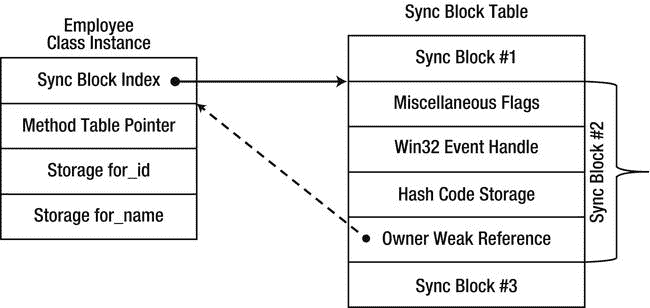
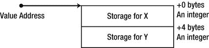

# 三、类型内部原理

本章关注的是的内部。NET 类型、值类型和引用类型在内存中的布局、JIT 调用虚方法必须做什么、正确实现值类型的复杂性以及其他细节。为什么我们要自寻烦恼，花几十页来讨论这些内部工作方式呢？这些内部细节如何影响我们应用的性能？事实证明，值类型和引用类型在布局、分配、相等、赋值、存储和许多其他参数方面是不同的，这使得正确的类型选择对应用性能至关重要。

一个例子

考虑一个名为 Point2D 的简单类型，它表示一个小的二维空间中的一个点。两个坐标中的每一个都可以用一个短整型来表示，对于整个对象来说总共有四个字节。现在假设你想在内存中存储一千万个点的数组。它们需要多大的空间？这个问题的答案很大程度上取决于 Point2D 是引用类型还是值类型。如果是引用类型，一千万个点的数组实际上会存储一千万个引用。在 32 位系统上，这一千万个引用消耗了将近 40 MB 的内存。物体本身消耗的能量至少是相同的。事实上，我们很快就会看到，每个 Point2D 实例将占用至少 12 个字节的内存，从而使一个包含一千万个点的数组的总内存使用量达到 160MB！另一方面，如果 Point2D 是值类型，一千万个点的数组将存储一千万个点——不会浪费一个额外的字节，总共 40MB，比引用类型方法少四倍(见[图 3-1](#Fig1) )。这种*内存密度*的差异是在某些设置中偏好值类型的关键原因。


[图 3-1](#_Fig1) 。Point2D 实例的数组在 Point2D 的情况下是引用类型而不是值类型

 **注意**存储对点的引用而不是实际的点实例还有一个缺点。如果您想顺序遍历这个巨大的点数组，编译器和硬件访问 Point2D 实例的连续数组要比通过引用访问堆对象容易得多，因为堆对象不能保证在内存中是连续的。正如我们将在第 5 章中看到的，CPU 缓存的考虑会影响应用的执行时间一个数量级。

不可避免地得出这样的结论:理解 CLR 如何在内存中布局对象以及引用类型与值类型有何不同的细节，对于我们的应用的性能至关重要。我们首先回顾值类型和引用类型在语言层面上的基本区别，然后深入内部实现细节。

引用类型和值类型之间的语义差异

中的引用类型。NET 包括类、委托、接口和数组。字符串(系统。String)，这是。NET 也是一种引用类型。中的值类型。NET 包含结构和枚举。基本类型，比如 int，float，decimal，都是值类型，但是。NET 开发人员可以使用 struct 关键字自由定义其他值类型。

在语言层面上，引用类型享有*引用语义*，其中对象的身份在其内容之前被考虑，而值类型享有*值语义*，其中对象没有身份，不通过引用访问，并根据其内容处理。这会影响的几个方面。NET 语言，如[表 3-1](#Tab1) 所示。

[表 3-1。](#_Tab1)值类型和引用类型的语义差异

| 标准 | 参考类型 | 值类型 |
| --- | --- | --- |
| 将对象传递给方法 | 仅传递引用；更改会传播到所有其他引用 | 对象的内容被复制到参数中(除非使用 ref 或 out 关键字)；更改不会影响方法之外的任何代码 |
| 将一个变量赋给另一个变量 | 仅复制引用；两个变量现在包含对同一对象的引用 | 内容被复制；这两个变量包含不相关数据的相同副本 |
| 使用运算符==比较两个对象 | 比较参考文献；如果两个引用引用同一个对象，则它们是相等的 | 内容比较；如果两个对象的内容在逐字段级别上相同，则它们是相等的 |

这些语义差异是我们在任何。网语。然而，就引用类型和值类型及其用途的不同而言，它们只是冰山一角。首先，让我们考虑存储对象的内存位置，以及它们是如何分配和释放的。

存储、分配和解除分配

引用类型专门从托管堆 中分配，托管堆是由。NET 垃圾收集器，这将在[第 4 章](04.html)中详细讨论。从托管堆中分配一个对象需要增加一个指针，就性能而言，这是一个相当便宜的操作。在多处理器系统上，如果多个处理器访问同一个堆，就需要一些同步，但是与非托管环境(如 malloc)中的分配器相比，这种分配仍然非常便宜。

垃圾收集器 以一种不确定的方式回收内存，并且对其内部操作不做任何承诺。正如我们将在《T4》第 4 章中看到的，一个完整的垃圾收集过程是极其昂贵的，但是一个表现良好的应用的平均垃圾收集成本应该比一个类似的非托管应用的平均垃圾收集成本要小得多。

 **注意**准确的说，这里的*是*一个可以从栈中分配的引用类型的化身。使用不安全上下文和 stackalloc 关键字，或者通过使用 fixed 关键字(在[第 8 章](08.html)中讨论)将固定大小的数组嵌入到自定义结构中，可以从堆栈中分配某些原始类型的数组(例如整数数组)。然而，由 stackalloc 和 fixed 关键字创建的对象并不是“真正的”数组，它们的内存布局不同于从堆中分配的标准数组。

独立值类型 通常从执行线程的堆栈中分配。然而，值类型可以嵌入到引用类型中，在这种情况下，它们被分配到堆中，并且可以被装箱，将它们的存储转移到堆中(我们将在本章后面重新讨论装箱)。从堆栈中分配值类型实例是一种非常廉价的操作，它涉及修改堆栈指针寄存器(尤其是在 Intel x86 上)，并且具有一次分配几个对象的额外优势。事实上，对于一个方法的*序言*代码来说，只使用一条 CPU 指令为其最外层块中的*所有*局部变量分配堆栈存储是很常见的。

回收堆栈内存也非常有效，并且需要对堆栈指针寄存器进行反向修改。由于将方法编译成机器码的方式，通常足够编译器不需要跟踪方法的局部变量的大小，并且可以在一组标准的三个指令中破坏整个堆栈帧，称为函数*后记* 。

下面是编译成 32 位机器码的托管方法的典型序言和尾声(这不是由 JIT 编译器生成的实际生产代码，它采用了在第 10 章中讨论的许多优化)。该方法有四个局部变量，它们的存储在序言中一次分配，在结语中一次回收:

```cs
int Calculation(int a, int b)
{
  int x = a + b;
  int y = a - b;
  int z = b - a;
  int w = 2 * b + 2 * a;
  return x + y + z + w;
}
; parameters are passed on the stack in [esp+4] and [esp+8]
push ebp
mov ebp, esp
add esp, 16 ; allocates storage for four local variablesmov eax, dword ptr [ebp+8]
add eax, dword ptr [ebp+12]
mov dword ptr [ebp-4], eax
; ...similar manipulations for y, z, w
mov eax, dword ptr [ebp-4]
add eax, dword ptr [ebp-8]
add eax, dword ptr [ebp-12]
add eax, dword ptr [ebp-16] ; eax contains the return value
mov esp, ebp ; restores the stack frame, thus reclaiming the local storage spacepop ebp
ret 8 ; reclaims the storage for the two parameters
```

 **注意**在 C# 和其他托管语言中，new 关键字并不意味着堆分配。您也可以使用 new 关键字在堆栈上分配值类型。例如，下面的代码行从堆栈中分配一个 DateTime 实例，用除夕夜(系统。DateTime 是值类型):DateTime new year = new DateTime(2011，12，31)；

栈和堆有什么区别？T2】

与普遍的看法相反，在. NET 进程中，堆栈和堆之间并没有太大的区别。堆栈和堆只不过是虚拟内存中的地址范围，与为托管堆保留的地址范围相比，为特定线程的堆栈保留的地址范围没有内在优势。访问堆上的内存位置并不比访问堆栈上的内存位置更快或更慢。总的来说，在某些情况下，有几个考虑因素可能支持对堆栈位置的内存访问比对堆位置的内存访问更快的说法。其中包括:

*   在堆栈上，时间分配局部性(在时间上靠得很近的分配)意味着空间局部性(在空间上靠得很近的存储)。反过来，当时间分配局部性意味着时间访问局部性(一起分配的对象被一起访问)时，顺序堆栈存储往往相对于 CPU 高速缓存和操作系统分页系统表现得更好。
*   由于引用类型的开销，堆栈上的内存密度往往高于堆上的内存密度(这将在本章后面讨论)。更高的内存密度通常会带来更好的性能，例如，因为更多的对象适合 CPU 缓存。
*   线程堆栈往往很小 Windows 上默认的最大堆栈大小是 1MB，大多数线程实际上只使用很少的堆栈页面。在现代系统中，所有应用线程的堆栈都可以放入 CPU 缓存，使得典型的堆栈对象访问速度极快。(另一方面，整个堆很少适合 CPU 缓存。)

也就是说，你不应该把所有的分配都转移到堆栈中！Windows 上的线程堆栈是有限的，通过应用不明智的递归和大量堆栈分配很容易耗尽堆栈。

在研究了值类型和引用类型之间的表面差异之后，是时候转向底层的实现细节了，这也解释了我们已经多次暗示过的内存密度的巨大差异。在我们开始之前，有一个小警告:下面描述的细节是 CLR 的内部实现细节，可能会在不通知的情况下随时更改。我们已尽最大努力确保这些信息是最新的。NET 4.5 发布，但不能保证以后仍然正确。

参考型内部原理

我们从引用类型开始，引用类型的内存布局相当复杂，对它们的运行时性能有重大影响。出于讨论的目的，让我们考虑一个雇员引用类型的教科书示例，它有几个字段(实例和静态)以及几个方法:

```cs
public class Employee
{
  private int _id;
  private string _name;
  private static CompanyPolicy _policy;
  public virtual void Work() {
   Console.WriteLine(“Zzzz...”);
  }
  public void TakeVacation(int days) {
   Console.WriteLine(“Zzzz...”);
  }
  public static void SetCompanyPolicy(CompanyPolicy policy) {
   _policy = policy;
  }
}
```

现在考虑托管堆上 Employee 引用类型的一个实例。[图 3-2](#Fig2) 描述了一个 32 位实例的布局。净进程:


[图 3-2](#_Fig2) 。托管堆上 Employee 实例的布局，包括引用类型开销

对象中 _id 和 _name 字段的顺序是不确定的(尽管它是可以控制的，正如我们将在“值类型内部”一节中看到的，使用 StructLayout 属性)。然而，对象的内存存储以一个名为*对象头字*(或同步块索引)的四字节字段开始，随后是另一个名为*方法表指针*(或类型对象指针)的四字节字段。这些字段不能从任何。NET 语言——它们服务于 JIT 和 CLR 本身。对象引用(在内部只是一个内存地址)指向方法表指针的开始，因此对象头字位于对象地址的负偏移量处。

 **注意**在 32 位系统上，堆中的对象与最近的四字节倍数对齐。这意味着，由于对齐的原因，只有一个字节成员的对象仍然会在堆中占用 12 个字节(事实上，即使没有实例字段的类在实例化时也会占用 12 个字节)。引入 64 位系统有几个不同之处。首先，方法表指针字段(它就是一个指针)占用了 8 个字节的内存，对象头字也占用了 8 个字节。其次，堆中的对象与最接近的 8 字节倍数对齐。这意味着一个 64 位堆中只有一个字节成员的对象将占用 24 个字节的内存。这只是为了更有力地证明引用类型的内存密度开销，尤其是在批量创建小对象的情况下。

方法表

方法表指针指向称为方法表(MT)的内部 CLR 数据结构，方法表又指向另一个称为 EEClass 的内部结构(EE 代表执行引擎)。MT 和 EEClass 一起包含调度虚拟方法调用、接口方法调用、访问静态变量、确定运行时对象的类型、有效地访问基本类型方法以及服务于许多附加目的所需的信息。方法表包含频繁访问的信息，这是关键机制(如虚拟方法调度)的运行时操作所需要的，而 EEClass 包含不太频繁访问的信息，但仍由一些运行时机制(如反射)使用。我们可以通过使用！DumpMT 和！DumpClass SOS 命令和 Rotor (SSCLI)源代码，请记住，我们正在讨论的内部实现细节在不同的 CLR 版本之间可能会有很大的不同。

 **注** SOS(罢工之子)是一个调试器扩展 DLL，方便使用 Windows 调试器调试托管应用。它最常用于 WinDbg，但也可以使用即时窗口加载到 Visual Studio 中。它的命令提供了对 CLR 内部的洞察，这也是我们在本章中经常使用它的原因。有关 SOS 的更多信息，请参考内嵌帮助(的！加载扩展后的 help 命令)和 MSDN 文档。Mario Hewardt 的书《高级》对 SOS 特性和调试托管应用进行了精彩的论述。NET 调试”(Addison-Wesley，2009)。

静态字段的位置由 EEClass 决定。基元字段(如整数)存储在加载器堆上动态分配的位置，而自定义值类型和引用类型存储为对堆位置的间接引用(通过 AppDomain 范围的对象数组)。要访问静态字段，没有必要查阅方法表或 ee class——JIT 编译器可以将静态字段的地址硬编码到生成的机器码中。静态字段的引用数组是固定的，因此它的地址在垃圾收集期间不能改变(在第 4 章的[中有更详细的讨论)，原始静态字段驻留在方法表中，垃圾收集器也不接触它。这确保了硬编码地址可用于访问这些字段:](04.html)

```cs
public static void SetCompanyPolicy(CompanyPolicy policy)
{
   _policy = policy;
}
mov ecx, dword ptr [ebp+8] ;copy parameter to ECX
mov dword ptr [0x3543320], ecx ;copy ECX to the static field location in the global pinned array
```

方法表包含的最明显的东西是一个代码地址数组，该类型的每个方法都有一个地址，包括从其基类型继承的任何虚方法。例如，[图 3-3](#Fig3) 显示了上面 Employee 类的一个可能的方法表布局，假设它只来自 System。对象:


[图 3-3](#_Fig3) 。雇员类的方法表(局部视图)

我们可以使用！DumpMT SOS 命令，给定一个方法表指针(可以通过检查它的第一个字段或使用！Name2EE 命令)。-md 开关将输出方法描述符表，其中包含该类型的每个方法的代码地址和方法描述符。(JIT 列可以有三个值之一:PreJIT，表示该方法是使用 NGEN 编译的；JIT，意味着该方法是在运行时 JIT 编译的；或者没有，这意味着该方法尚未编译。)

```cs
0:000> r esi
esi=02774ec8
0:000> !do esi
Name: CompanyPolicy
MethodTable: 002a3828
EEClass: 002a1350
Size: 12(0xc) bytes
File: D:\Development\...\App.exe
Fields:
None
0:000> dd esi L1
02774ec8 002a3828
0:000> !dumpmt -md 002a3828
EEClass: 002a1350
Module: 002a2e7c
Name: CompanyPolicy
mdToken: 02000002
File: D:\Development\...\App.exe
BaseSize: 0xc
ComponentSize: 0x0
Slots in VTable: 5
Number of IFaces in IFaceMap: 0
--------------------------------------
MethodDesc Table
Entry    MethodDe   JIT Name
5b625450 5b3c3524 PreJIT System.Object.ToString()
5b6106b0 5b3c352c PreJIT System.Object.Equals(System.Object)
5b610270 5b3c354c PreJIT System.Object.GetHashCode()
5b610230 5b3c3560 PreJIT System.Object.Finalize()
002ac058 002a3820 NONE CompanyPolicy..ctor()
```

 **注意**与 C++虚函数指针表不同，CLR 方法表包含了*所有*方法的代码地址，包括非虚函数。方法表创建者布置方法的顺序是不确定的。目前，它们按以下顺序排列:继承的虚方法(包括任何可能的重写——稍后讨论)、新引入的虚方法、非虚实例方法和静态方法。

存储在方法表中的代码地址是动态生成的 JIT 编译器在方法第一次被调用时编译它们，除非使用了 NGEN(在第 10 章中讨论)。然而，由于一个相当常见的编译器技巧，方法表的用户不需要知道这个步骤。当方法表第一次被创建时，它被填充了指向特殊的 pre-JIT 存根的指针，这些存根包含一个调用指令，该指令将调用者调度到一个 JIT 例程，该例程动态地编译相关的方法。编译完成后，存根会被 JMP 指令覆盖，该指令将控制权转移给新编译的方法。存储 pre-JIT 存根和一些关于方法的附加信息的整个数据结构称为方法描述符(MD ),可以通过！DumpMD SOS 命令。

在方法被 JIT 编译之前，它的方法描述符包含以下信息:

```cs
0:000> !dumpmd 003737a8
Method Name:   Employee.Sleep()
Class:   003712fc
MethodTable:   003737c8
mdToken:   06000003
Module:   00372e7c
IsJitted:   no
CodeAddr:       ffffffff
Transparency:   Critical
```

下面是一个负责更新方法描述符的 pre-JIT 存根的示例:

```cs
0:000> !u 002ac035
Unmanaged code
002ac035 b002 mov al,2
002ac037 eb08 jmp 002ac041
002ac039 b005 mov al,5
002ac03b eb04 jmp 002ac041
002ac03d b008 mov al,8
002ac03f eb00 jmp 002ac041
002ac041 0fb6c0 movzx eax,al
002ac044 c1e002 shl eax,2
002ac047 05a0372a00 add eax,2A37A0h
002ac04c e98270ca66 jmp clr!ThePreStub (66f530d3)
```

该方法经过 JIT 编译后，其方法描述符更改为:

```cs
0:007> !dumpmd 003737a8
Method Name: Employee.Sleep()
Class: 003712fc
MethodTable: 003737c8
mdToken: 06000003
Module: 00372e7c
IsJitted: yes
CodeAddr: 00490140
Transparency: Critical
```

一个真实的方法表包含了更多我们之前公开的信息。理解一些额外的字段对于下面讨论的方法分派的细节是至关重要的；这就是为什么我们必须花更长的时间来研究 Employee 实例的方法表结构。我们还假设 Employee 类实现了三个接口:IComparable、IDisposable 和 ICloneable。

在[图 3-4](#Fig4) 中，对我们之前对方法表布局的理解有几个补充。首先，方法表头包含几个有趣的标志，允许动态发现其布局，例如虚方法的数量和类型实现的接口的数量。其次，方法表包含一个指向其基类的方法表的指针、一个指向其模块的指针和一个指向其 EEClass 的指针(包含一个对方法表的反向引用)。第三，实际方法前面是该类型实现的接口方法表列表。这就是为什么在方法表中有一个指向方法列表的指针，它离方法表开始处有一个 40 字节的恒定偏移量。


[图 3-4](#_Fig4) 。Employee 方法表的详细视图，包括用于虚拟方法调用的接口列表和方法列表的内部指针

 **注意**到达该类型方法的代码地址表所需的额外解引用步骤允许该表与方法表对象分开存储在不同的内存位置。例如，如果您检查系统的方法表。对象，您可能会发现它的方法代码地址存储在单独的位置。此外，有许多虚方法的类将有几个一级表指针，允许在派生类中部分重用方法表。

调用引用类型实例上的方法

显然，方法表可以用来调用任意对象实例上的方法。假设堆栈位置 EBP-64 包含一个 Employee 对象的地址，其方法表布局如上图所示。然后我们可以使用下面的指令序列调用工作虚拟方法:

```cs
mov ecx, dword ptr [ebp-64]
mov eax, dword ptr [ecx] ; the method table pointer
mov eax, dword ptr [eax+40] ; the pointer to the actual methods inside the method table
call dword ptr [eax+16] ; Work is the fifth slot (fourth if zero-based)
```

第一条指令将引用从堆栈复制到 ECX 寄存器，第二条指令解引用 ECX 寄存器以获得对象的方法表指针，第三条指令获取指向方法表(位于 40 字节的常量偏移量处)内的方法列表的内部指针，第四条指令解引用偏移量为 16 的内部方法表以获得工作方法的代码地址并调用它。为了理解为什么有必要使用方法表进行虚拟方法调度，我们需要考虑运行时绑定是如何工作的——也就是说，多态是如何通过虚拟方法实现的。

假设一个额外的类 Manager 将从 Employee 派生并覆盖它的 Work 虚方法，同时实现另一个接口:

```cs
public class Manager : Employee, ISerializable
{
  private List<Employee> _reports;
  public override void Work() ...
  //...implementation of ISerializable omitted for brevity
}
```

编译器可能需要向管理器发送一个调用。Work 方法，如下面的代码清单所示:

```cs
Employee employee = new Manager(...);
employee.Work();
```

在这种特殊情况下，编译器可能能够使用静态流分析推断出管理器。应该调用 Work 方法(这在当前的 C# 和 CLR 实现中不会发生)。然而，在一般情况下，当提供静态类型的雇员引用时，编译器需要将绑定推迟到运行时。事实上，绑定到正确方法的唯一方式是在运行时确定 employee 变量引用的对象的实际类型，并根据该类型信息调度虚拟方法。这正是方法表使 JIT 编译器能够做到的。

如[图 3-5](#Fig5) 所示，管理器类的方法表布局用不同的代码地址覆盖了工作槽，而方法分派序列保持不变。请注意，被覆盖的槽距方法表开头的偏移量是不同的，因为 Manager 类实现了一个额外的接口；然而,“指向方法的指针”字段仍然在相同的偏移量处，并且适应这种差异:


[图 3-5](#_Fig5) 。管理器方法表的方法表布局。这个方法表包含一个额外的接口 MT 槽，这使得“指向方法的指针”偏移量更大

```cs
mov ecx, dword ptr [ebp-64]
mov eax, dword ptr [ecx]
mov eax, dword ptr [ecx+40] ;this accommodates for the Work method having a different
call dword ptr [eax+16] ;absolute offset from the beginning of the MT
```

 **注意**对象布局是 CLR 4.0 中的新特性，在该布局中，被覆盖的方法从方法表开始的偏移量不能保证在派生类中是相同的。在 CLR 4.0 之前，由类型实现的接口列表存储在方法表的末尾，在代码地址之后；这意味着物体的偏移量。Equals 地址(和其余的代码地址)在所有派生类中都是常量。反过来，这意味着虚拟方法分派序列只由三条指令组成，而不是四条(上面序列中的第三条指令是不必要的)。旧的文章和书籍可能仍然引用以前的调用序列和对象布局，作为内部 CLR 细节如何在没有任何通知的情况下在版本之间变化的额外演示。

分派非虚拟方法

我们也可以使用类似的分派序列来调用非虚拟方法。然而，对于非虚方法，不需要使用方法表进行方法分派:当 JIT 编译方法分派时，被调用方法的代码地址(或者至少是它的预 JIT 存根)是已知的。例如，如前所述，如果堆栈位置 EBP-64 包含雇员对象的地址，那么下面的指令序列将调用带参数 5 的 TakeVacation 方法:

```cs
mov edx, 5 ;parameter passing through register – custom calling convention
mov ecx, dword ptr [ebp-64] ;still required because ECX contains ‘this’ by convention
call dword ptr [0x004a1260]
```

仍然需要将对象的地址加载到 ECX 寄存器中——所有实例方法都希望在 ECX 中接收隐含的这个参数。然而，不再需要解引用方法表指针并从方法表中获取地址。JIT 编译器在执行调用后仍然需要能够更新调用站点；这是通过对最初指向预 JIT 存根的内存位置(在本例中为 0x004a1260)执行间接调用来实现的，一旦编译了该方法，JIT 编译器就会对其进行更新。

不幸的是，上面的方法分派序列遇到了一个严重的问题。它允许对空对象引用的方法调用被成功调度，并且可能保持不被检测到，直到实例方法试图访问实例字段或虚拟方法，这将导致访问冲突。事实上，这是 C++实例方法调用的行为——下面的代码在大多数 C++环境中不会受到伤害，但肯定会让 C# 开发人员在椅子上不安地移动:

```cs
class Employee {
public: void Work() { } //empty non-virtual method
};
Employee* pEmployee = NULL;
pEmployee->Work(); //runs to completion
```

如果您检查 JIT 编译器调用非虚拟实例方法所使用的实际序列，它将包含一条附加指令:

```cs
mov edx, 5 ;parameter passing through register – custom calling convention
mov ecx, dword ptr [ebp-64] ;still required because ECX contains ‘this’ by convention
cmp ecx, dword ptr [ecx]
call dword ptr [0x004a1260]
```

回想一下，CMP 指令从第一个操作数中减去第二个操作数，并根据操作结果设置 CPU 标志。上面的代码不使用存储在 CPU 标志中的比较结果，那么 CMP 指令如何帮助防止使用空对象引用调用方法呢？嗯，CMP 指令试图访问包含对象引用的 ECX 寄存器中的内存地址。如果对象引用为空，则此内存访问将因访问冲突而失败，因为在 Windows 进程中访问地址 0 总是非法的。CLR 将此访问冲突转换为在调用点引发的 NullReferenceException 这比在方法被调用后在方法内部发出空检查要好得多。此外，CMP 指令仅占用内存中的两个字节，并且具有能够检查除 null 之外的无效地址的优点。

 **注意**调用虚方法时不需要类似的 CMP 指令；空检查是隐式的，因为标准的虚拟方法调用流访问方法表指针，这确保了对象指针是有效的。即使对于虚拟方法调用，您也不一定总能看到发出的 CMP 指令；在最近的 CLR 版本中，JIT 编译器足够聪明，可以避免多余的检查。例如，如果程序流刚刚从一个对象上的虚拟方法调用返回——它隐式地包含空检查——那么 JIT 编译器可能不会发出 CMP 指令。

我们如此关注调用虚方法与调用非虚方法的精确实现细节的原因，并不是额外的内存访问或额外的指令(可能需要，也可能不需要)。虚拟方法排除的主要优化是*方法内联*，这对现代高性能应用至关重要。内联 是一个相当简单的编译器技巧，它以代码大小换取速度，由此对小型或简单方法的方法调用被方法体取代。例如，在下面的代码中，将对 Add 方法的调用替换为在该方法内部执行的单个操作是非常合理的:

```cs
int Add(int a, int b)
{
  return a + b;
}
int c = Add(10, 12);
//assume that c is used later in the code
```

非优化调用序列将有将近 10 条指令:三条用于设置参数和分派方法，两条用于设置方法框架，一条用于将数字相加，两条用于拆除方法框架，一条用于从方法返回。优化后的调用序列将只有*条*指令——你能猜到是哪一条吗？一个选项是 ADD 指令，但事实上，另一种称为常数折叠的优化可以用于在编译时计算加法运算的结果，并将常量值 22 赋给变量 c。

内联和非内联方法 调用之间的性能差异可能很大，特别是当方法像上面的方法一样简单时。例如，属性是内联的绝佳选择，编译器生成的自动属性更是如此，因为它们除了直接访问字段之外不包含任何逻辑。但是，虚方法会阻止内联，因为只有当编译器在编译时(对于 JIT 编译器，在 JIT 时)知道将要调用哪个方法时，才会发生内联。当要调用的方法在运行时由嵌入到对象中的类型信息确定时，没有办法为虚拟方法分派生成正确的内联代码。如果默认情况下所有的方法都是虚拟的，那么属性也应该是虚拟的，并且间接方法调度的累积成本(如果没有内联的话)将会是巨大的。

鉴于内联的重要性，您可能想知道 sealed 关键字对方法分派的影响。例如，如果 Manager 类将 Work 方法声明为 sealed，则对具有 Manager 静态类型的对象引用的工作调用可以作为非虚拟实例方法调用进行:

```cs
public class Manager : Employee
{
  public override sealed void Work() ...
}
Manager manager = ...; //could be an instance of Manager, could be a derived type
manager.Work(); //direct dispatch should be possible!
```

尽管如此，在撰写本文时，sealed 关键字对我们测试的所有 CLR 版本的方法调度都没有影响，尽管知道类或方法是密封的可以有效地消除对虚方法调度的需要。

调度静态和接口方法

为了完整起见，我们需要考虑另外两种类型的方法:静态方法和接口方法。分派静态方法相当容易:不需要加载对象引用，简单地调用方法(或其预 JIT 存根)就足够了。因为调用不通过方法表进行，所以 JIT 编译器使用与非虚拟实例方法相同的技巧:方法调度是通过一个特殊的内存位置间接进行的，该内存位置在方法被 JIT 编译后被更新。

然而，接口方法是完全不同的事情。分派接口方法似乎与分派虚拟实例方法没有什么不同。事实上，接口实现了一种让人想起经典虚方法的多态形式。不幸的是，不能保证跨几个类的特定接口的接口实现最终都在方法表中的相同位置。考虑下面的代码，其中有两个类实现了 IComparable 接口:

```cs
class Manager : Employee, IComparable {
  public override void Work() ...
  public void TakeVacation(int days) ...
  public static void SetCompanyPolicy(...) ...
  public int CompareTo(object other) ...
}
class BigNumber : IComparable {
  public long Part1, Part2;
  public int CompareTo(object other) ...
}
```

显然，这些类的方法表布局会非常不同，CompareTo 方法结束的槽号也会不同。复杂的对象层次结构和多个接口实现使得需要一个额外的分派步骤来识别接口方法在方法表中的位置变得很明显。

在以前的 CLR 版本中，该信息存储在一个全局(AppDomain 级)表中，该表由接口 ID 索引，在首次加载接口时生成。方法表有一个特殊的条目(在偏移量 12 处),指向全局接口表中的适当位置，全局接口表条目又指向方法表，指向其中存储接口方法指针的子表。这允许多步方法调度，如下所示:

```cs
mov ecx, dword ptr [ebp-64] ; object reference
mov eax, dword ptr [ecx] ; method table pointer
mov eax, dword ptr [eax+12] ; interface map pointer
mov eax, dword ptr [eax+48] ; compile time offset for this interface in the map
call dword ptr [eax] ; first method at EAX, second method at EAX+4, etc.
```

这看起来很复杂，也很昂贵！需要四次内存访问来获取接口实现的代码地址并将其分发，对于某些接口来说，这可能成本太高。这就是为什么您永远不会看到生产 JIT 编译器使用的上述序列，即使没有启用优化。JIT 使用了几个技巧来有效地内联接口方法，至少对于常见的情况是这样。

*热路径分析* —当 JIT 检测到经常使用相同的接口实现时，它用优化的代码替换特定的调用点，甚至可能内联常用的接口实现:

```cs
mov ecx, dword ptr [ebp-64]
cmp dword ptr [ecx], 00385670 ; expected method table pointer
jne 00a188c0 ; cold path, shown below in pseudo-code
jmp 00a19548 ; hot path, could be inlined body here
cold path:
if (--wrongGuessesRemaining < 0) { ;starts at 100
  back patch the call site to the code discussed below
} else {
  standard interface dispatch as discussed above
}
```

*频率分析* —当 JIT 检测到它选择的热路径对于特定的呼叫站点不再准确时(跨越一系列的几个调度)，它用新的热路径替换以前的热路径猜测，并在每次猜测错误时继续在它们之间交替:

```cs
start: if (obj->MTP == expectedMTP) {
  direct jump to expected implementation
} else {
  expectedMTP = obj->MTP;
  goto start;
}
```

有关接口方法调度的更多细节，可以考虑阅读萨沙·戈尔德施泰因的文章“JIT 优化”([http://www.codeproject.com/Articles/25801/JIT-Optimizations](http://www.codeproject.com/Articles/25801/JIT-Optimizations))和万斯·莫里森的博客文章([http://blogs . msdn . com/b/vancem/archive/2006/03/13/550529 . aspx](http://blogs.msdn.com/b/vancem/archive/2006/03/13/550529.aspx))。接口方法调度是一个移动的目标，也是优化的成熟场所；未来的 CLR 版本可能会引入这里没有讨论的进一步优化。

同步块和锁定关键字

嵌入在每个引用类型实例中的第二个头字段是对象头字(或同步块索引)。与方法表指针不同，该字段有多种用途，包括同步、GC 簿记、终结和哈希代码存储。该字段的几个位决定了在任何时刻存储在其中的确切信息。

使用对象头字最复杂的目的是使用 CLR 监控机制进行同步，通过 lock 关键字向 C# 公开。要点如下:几个线程可能试图进入由 lock 语句保护的代码区域，但是一次只有一个线程可以进入该区域，实现互斥:

```cs
class Counter
{
  private int _i;
  private object _syncObject = new object();
  public int Increment()
  {
   lock (_syncObject)
   {
     return ++_i; //only one thread at a time can execute this statement
   }
  }
}
```

然而，lock 关键字仅仅是使用监视器包装以下结构的语法糖。进入并监控。退出方法:

```cs
class Counter
{
  private int _i;
  private object _syncObject = new object();
  public int Increment()
  {
   bool acquired = false;
   try
   {
     Monitor.Enter(_syncObject, ref acquired);
     return ++_i;
   }
   finally
   {
     if (acquired) Monitor.Exit(_syncObject);
   }
  }
}
```

为了确保这种互斥，同步机制可以与每个对象相关联。因为一开始就为每个对象创建一个同步机制是很昂贵的，所以当对象第一次用于同步时，这种关联是延迟发生的。当需要时，CLR 从名为*同步块表*的全局数组中分配一个名为*同步块*的结构。sync 块包含一个对其所属对象的向后引用(尽管这是一个不阻止对象被收集的弱引用)，以及一个名为 monitor 的同步机制，它是使用 Win32 事件在内部实现的。分配的同步块的数字索引存储在对象的头字中。随后使用该对象进行同步的尝试会识别现有的同步块索引，并使用相关的监视器对象进行同步。



图 3-6。与对象实例相关联的同步块。同步块索引字段仅将索引存储到同步块表中，允许 CLR 在不修改同步块索引的情况下在内存中调整表的大小和移动表

在同步块长时间未使用后，垃圾收集器会回收它，并将其所属的对象与其分离，从而将同步块索引设置为无效索引。在这种回收之后，同步块可以与另一个对象相关联，这节省了同步机制所需的昂贵的操作系统资源。

那个！SyncBlk SOS 命令可用于检查当前竞争的同步块，即由一个线程拥有并由另一个线程(可能不止一个等待者)等待的同步块。从 CLR 2.0 开始，有一种优化可以延迟创建一个同步块，仅当存在争用时。当没有同步块时，CLR 可以使用一个*瘦锁*来管理同步状态。下面我们探索一些这方面的例子。

首先，让我们来看看一个对象的对象头字，这个对象还没有被用于同步，但是它的哈希代码已经被访问过了(本章后面我们将讨论引用类型中的哈希代码存储)。在下面的例子中，EAX 指向一个雇员对象，它的散列码是 46104728:

```cs
0:000> dd eax-4 L2
023d438c 0ebf8098 002a3860
0:000> ? 0n46104728
Evaluate expression: 46104728 = 02bf8098
0:000> .formats 0e**bf8098**
Evaluate expression:
  Hex: 0e**bf8098**
  Binary: 00001110 10111111 10000000 10011000
0:000> .formats 02**bf8098**
Evaluate expression:
  Hex: 02**bf8098**
  Binary: 00000010 10111111 10000000 10011000
```

这里没有同步块索引；只有哈希码和两个设置为 1 的位，其中一个可能表示对象头字现在存储哈希码。接下来，我们发布一个监视器。从一个线程输入对对象的调用以锁定它，并检查对象头字:

```cs
0:004> dd 02444390-4 L2
0244438c 08000001 00173868
0:000> .formats 08000001
Evaluate expression:
  Hex: 08000001
  Binary: 00001000 00000000 00000000 00000001
0:004> !syncblk
Index	SyncBlock	MonitorHeld	Recursion	Owning	Thread	Info	SyncBlock	Owner
   1	0097db4c 3 1	0092c698 1790 0	02444390	Employee
```

对象被分配了同步块#1，这从！SyncBlk 命令输出(有关命令输出中的列的更多信息，请参考 SOS 文档)。当另一个线程试图用同一个对象输入 lock 语句时，它会进入一个标准的 Win32 等待(尽管如果它是一个 GUI 线程，则会有消息泵送)。下面是等待监视器的线程堆栈的底部:

```cs
0:004> kb
ChildEBP RetAddr Args to Child
04c0f404 75120bdd 00000001 04c0f454 00000001 ntdll!NtWaitForMultipleObjects+0x15
04c0f4a0 76c61a2c 04c0f454 04c0f4c8 00000000 KERNELBASE!WaitForMultipleObjectsEx+0x100
04c0f4e8 670f5579 00000001 7efde000 00000000 KERNEL32!WaitForMultipleObjectsExImplementation+0xe0
04c0f538 670f52b3 00000000 ffffffff 00000001 clr!WaitForMultipleObjectsEx_SO_TOLERANT+0x3c
04c0f5cc 670f53a5 00000001 0097db60 00000000 clr!Thread::DoAppropriateWaitWorker+0x22f
04c0f638 670f544b 00000001 0097db60 00000000 clr!Thread::DoAppropriateWait+0x65
04c0f684 66f5c28a ffffffff 00000001 00000000 clr!CLREventBase::WaitEx+0x128
04c0f698 670fd055 ffffffff 00000001 00000000 clr!CLREventBase::Wait+0x1a
04c0f724 670fd154 00939428 ffffffff f2e05698 clr!AwareLock::EnterEpilogHelper+0xac
04c0f764 670fd24f 00939428 00939428 00050172 clr!AwareLock::EnterEpilog+0x48
04c0f77c 670fce93 f2e05674 04c0f8b4 0097db4c clr!AwareLock::Enter+0x4a
04c0f7ec 670fd580 ffffffff f2e05968 04c0f8b4 clr!AwareLock::Contention+0x221
04c0f894 002e0259 02444390 00000000 00000000 clr!JITutil_MonReliableContention+0x8a
```

使用的同步对象是 25c，它是一个事件的句柄:

```cs
0:004> dd 04c0f454 L1
04c0f454 0000025c
0:004> !handle 25c f
Handle 25c
 Type Event
 Attributes 0
 GrantedAccess	0x1f0003:
   Delete,ReadControl,WriteDac,WriteOwner,Synch
   QueryState,ModifyState
 HandleCount 2
 PointerCount 4
 Name <none>
 Object Specific Information
   Event Type Auto Reset
   Event is Waiting
```

最后，如果我们检查分配给该对象的原始同步块内存，哈希代码和同步机制句柄清晰可见:

```cs
0:004> dd 0097db4c
0097db4c 00000003 00000001 0092c698 00000001
0097db5c 80000001 0000025c 0000000d 00000000
0097db6c 00000000 00000000 00000000 02bf8098
0097db7c 00000000 00000003 00000000 00000001
```

值得一提的最后一个微妙之处是，在前面的例子中，我们通过在锁定对象之前调用 GetHashCode 来强制创建同步块。从 CLR 2.0 开始，有一个特殊的优化旨在节省时间和内存，如果对象以前没有与同步块关联，则不会创建同步块。相反，CLR 使用一种叫做*瘦锁* 的机制。当对象第一次被锁定并且还没有争用时(即，没有其他线程试图锁定该对象)，CLR 在对象头字中存储该对象的当前拥有线程的托管线程 ID。例如，下面是应用主线程在发生锁争用之前锁定的对象的对象头字:

```cs
0:004> dd 02384390-4
0238438c 00000001 00423870 00000000 00000000
```

这里，托管线程 ID 为 1 的线程是应用的主线程，这从！线程命令:

```cs
0:004> !Threads
ThreadCount: 2
UnstartedThread: 0
BackgroundThread: 1
PendingThread: 0
DeadThread: 0
Hosted Runtime: no
   Lock
   ID OSID ThreadOBJ State GC Mode GC Alloc Context Domain Count Apt Exception
  0 1 12f0 0033ce80 2a020 Preemptive 02385114:00000000 00334850 2 MTA
  2 2 23bc 00348eb8 2b220 Preemptive 00000000:00000000 00334850 0 MTA (Finalizer)
```

瘦锁也被 SOS 举报了！DumpObj 命令，它指示一个对象的所有者线程，该对象的头包含一个瘦锁。同样的。DumpHeap -thinlock 命令可以输出托管堆中当前存在的所有瘦锁:

```cs
0:004> !dumpheap -thinlock
 Address MT Size
02384390 00423870 12 ThinLock owner 1 (0033ce80) Recursive 0
02384758 5b70f98c 16 ThinLock owner 1 (0033ce80) Recursive 0
Found 2 objects.
0:004> !DumpObj 02384390
Name: Employee
MethodTable: 00423870
EEClass: 004213d4
Size: 12(0xc) bytes
File: D:\Development\...\App.exe
Fields:
   MT Field Offset Type VT Attr Value Name
00423970 4000001 4 CompanyPolicy 0 static 00000000 _policy
ThinLock owner 1 (0033ce80), Recursive 0
```

当另一个线程试图锁定对象时，它将旋转一小段时间，等待瘦锁被释放(即，所有者线程信息从对象头字中消失)。如果在某个时间阈值之后，锁没有被释放，则它被转换为同步块，同步块索引被存储在对象头字中，并且从那时起，线程照常在 Win32 同步机制上阻塞。

值类型内部

既然我们已经了解了引用类型在内存中的布局以及对象头字段的用途，那么是时候讨论值类型了。值类型有一个简单得多的内存布局，但是它引入了限制和装箱，这是一个昂贵的过程，用来补偿在需要引用的地方使用值类型的不兼容性。正如我们所看到的，使用值类型的主要原因是它们出色的内存密度和没有开销；当您开发自己的值类型时，每一点性能都很重要。

出于讨论的目的，让我们使用本章开始时讨论过的简单值类型 Point2D，它表示二维空间中的一个点:

```cs
public struct Point2D
{
  public int X;
  public int Y;
}
```

用 X=5，Y=7 初始化的 Point2D 实例的内存布局简单如下，没有额外的“开销”字段混乱:



图 3-7。Point2D 值类型实例的内存布局

在一些罕见的情况下，可能需要自定义值类型布局——一个例子是为了实现互操作性,当你的值类型实例被原封不动地传递给非托管代码时。通过使用两个属性 StructLayout 和 FieldOffset，可以实现这种自定义。StructLayout 属性可用于指定根据类型的定义(这是默认设置)或根据 FieldOffset 属性提供的指令来顺序布局对象的字段。这允许创建 C 风格的联合，其中字段可能重叠。一个简单的例子是下面的值类型，它可以将浮点数“转换”为其表示形式所使用的四个字节:

```cs
[StructLayout(LayoutKind.Explicit)]
public struct FloatingPointExplorer
{
  [FieldOffset(0)] public float F;
  [FieldOffset(0)] public byte B1;
  [FieldOffset(1)] public byte B2;
  [FieldOffset(2)] public byte B3;
  [FieldOffset(3)] public byte B4;
}
```

当您将浮点值赋给对象的 F 字段时，它会同时修改 B1-B4 的值，反之亦然。实际上，F 场和 B1-B4 场在内存中重叠，如[图 3-8](#Fig8) 所示:


[图 3-8](#_Fig8) 。FloatingPointExplorer 实例的内存布局。水平对齐的块在内存中重叠

因为值类型实例没有对象头字和方法表指针，所以它们不能像引用类型那样提供丰富的语义。我们现在将看看它们的简单布局带来的限制，以及当开发人员试图在用于引用类型的设置中使用值类型时会发生什么。

值类型限制

首先，考虑对象头字。如果一个程序试图使用值类型实例进行同步，这通常是程序中的一个错误(我们将很快看到)，但是运行时应该使它非法并抛出一个异常吗？在下面的代码示例中，当同一个 Counter 类实例的 Increment 方法由两个不同的线程执行时，会发生什么情况？

```cs
class Counter
{
  private int _i;
  public int Increment()
  {
   lock (_i)
   {
   return ++_i;
   }
  }
}
```

当我们试图验证发生了什么时，我们遇到了一个意想不到的障碍:C# 编译器不允许使用带有 lock 关键字的值类型。但是，我们现在已经熟悉了 lock 关键字的内部工作原理，可以尝试编写一个解决方法:

```cs
class Counter
{
  private int _i;
  public int Increment()
  {
   bool acquired=false;
   try
   {
     Monitor.Enter(_i, ref acquired);
     return ++_i;
   }
   finally
   {
     if (acquired) Monitor.Exit(_i);
   }
 }
}
```

通过这样做，我们在程序中引入了一个 bug 结果是多个线程将能够同时进入锁并修改 _i，此外还有监视器。Exit 调用将抛出一个异常(要了解同步访问整数变量的正确方法，请参考[第 6 章](06.html))。问题是监视器。输入方法接受系统。对象参数，它是一个引用，我们通过值传递给它一个值类型。即使可以在需要引用的地方不加修改地传递该值，也要将该值传递给监视器。输入方法没有与传递给监视器的值相同的*标识*。退出方式；同样，传递给监视器的值。一个线程上的 Enter 方法没有与传递给监视器的值相同的*标识*。在另一个线程上输入方法。如果我们传递值(按值传递！)在需要引用的地方，无法获得正确的锁定语义。

值类型语义不适合对象引用的另一个例子出现在从方法返回值类型时。考虑以下代码:

```cs
object GetInt()
{
  int i = 42;
  return i;
}
object obj = GetInt();
```

GetInt 方法返回一个值类型——通常由值返回。但是，调用方期望从方法返回一个对象引用。该方法可以返回一个指向堆栈位置的直接指针，在该方法执行期间，I 存储在该堆栈位置。不幸的是，这将是对无效内存位置的引用，因为该方法的堆栈帧在返回之前已被清除。这表明值类型默认情况下具有的按值复制语义不太适合需要对象引用(到托管堆中)的情况。

值类型上的虚拟方法

我们还没有考虑方法表指针，当试图将值类型作为一等公民对待时，我们已经有了不可克服的问题。现在我们转向虚方法和接口实现。CLR 禁止值类型之间的继承关系，这使得不可能在值类型上定义新的虚方法。这是幸运的，因为如果有可能在值类型上定义虚方法，调用这些方法将需要一个方法表指针，该指针不是值类型实例的一部分。这不是一个实质性的限制，因为引用类型的按值复制语义使它们不适合需要对象引用的多态。

然而，值类型配备了从 System.Object 继承的虚方法，有几种:Equals、GetHashCode、ToString 和 Finalize。这里我们将只讨论前两个，但是大部分讨论也适用于其他虚拟方法。让我们从检查他们的签名开始:

```cs
public class Object
{
  public virtual bool Equals(object obj) ...
  public virtual int GetHashCode() ...
}
```

这些虚方法由每个。NET 类型，包括值类型。这意味着给定一个值类型的实例，我们应该能够成功地分派虚拟方法，即使它没有方法表指针！第三个例子说明了值类型内存布局如何影响我们对值类型实例进行简单操作的能力，这需要一种机制，能够将值类型实例“转化”为更能代表“真实”对象的东西。

拳击

每当语言编译器检测到需要将值类型实例视为引用类型的情况时，它都会发出 box IL 指令。反过来，JIT 编译器解释这个指令，并发出对分配堆存储的方法的调用，将值类型实例的内容复制到堆中，并用对象头-对象头字和方法表指针包装值类型内容。每当需要对象引用时，就使用这个“盒子”。请注意，该框是从原始值类型实例中分离出来的，对其中一个实例所做的更改不会影响另一个实例。


图 3-9。堆上的原始值和装箱副本。装箱的副本有标准的引用类型“开销”(对象头字和方法表指针)，可能需要进一步的堆对齐

```cs
.method private hidebysig static object GetInt() cil managed
{
   .maxstack 8
   L_0000: ldc.i4.s 0x2a
   L_0002: box int32
   L_0007: ret
}
```

装箱是一项开销很大的操作——它涉及到内存分配、内存复制，并且随后当垃圾收集器努力回收临时盒时会给它造成压力。随着 CLR 2.0 中泛型的引入，几乎没有必要将反射和其他晦涩的场景打包。尽管如此，装箱在许多应用中仍然是一个严重的性能问题；正如我们将看到的，如果不进一步了解值类型上的方法分派是如何操作的，那么“正确处理值类型”以防止各种类型的装箱是很重要的。

抛开性能问题不谈，装箱为我们之前遇到的一些问题提供了一种补救方法。例如，GetInt 方法返回对堆上包含值 42 的 box 的引用。只要有对它的引用，这个盒子就会存在，并且不受方法堆栈上局部变量的生存期的影响。同样的，当班长。Enter 方法需要一个对象引用，它在运行时接收对堆上一个框的引用，并使用该框进行同步。不幸的是，在代码的不同点从相同值类型实例创建的盒子被认为是不相同的，所以盒子被传递给 Monitor。Exit 不是传递给 Monitor 的同一个框。回车，框传递给监视器。一个线程上的 Enter 不是传递给 Monitor 的同一个框。进入另一个线程。这意味着，任何基于监视器的同步的值类型的使用本质上都是错误的，不管装箱提供的部分解决方案如何。

问题的关键仍然是从 System.Object 继承的虚方法。直接反对；相反，它们派生自一个名为 System.ValueType 的中间类型。

 **注**混淆地，系统地。ValueType 是引用类型–CLR 根据以下标准区分值类型和引用类型:值类型是从 System.ValueType 派生的类型。ValueType 是一种引用类型。

系统。ValueType 重写从 System 继承的 Equals 和 GetHashCode 虚方法。对象，这样做有一个很好的理由:值类型与引用类型具有不同的默认相等语义，这些默认值必须在某个地方实现。例如，系统中被重写的 Equals 方法。ValueType 确保值类型基于它们的内容进行比较，而系统中的原始 Equals 方法。对象只比较对象引用(标识)。

不管系统如何。ValueType 实现这些重写的虚方法，请考虑以下场景。您在列表<point2d>中嵌入了一千万个 Point2D 对象，然后使用 Contains 方法在列表中查找单个 Point2D 对象。反过来，Contains 没有更好的选择，只能对一千万个对象进行线性搜索，并将它们分别与您提供的对象进行比较。</point2d>

```cs
List<Point2D> polygon = new List<Point2D>();
//insert ten million points into the list
Point2D point = new Point2D { X = 5, Y = 7 };
bool contains = polygon.Contains(point);
```

遍历一个包含一千万个点的列表并逐个与另一个点进行比较需要一段时间，但这是一个相对较快的操作。访问的字节数大约是 80，000，000(每个 Point2D 对象 8 个字节)，比较操作非常快。遗憾的是，比较两个 Point2D 对象需要调用 Equals 虚拟方法:

```cs
Point2D a = ..., b = ...;
a.Equals(b);
```

这里有两个关键问题。首先，等于——即使被系统覆盖。value type–接受系统。对象引用作为其参数。正如我们已经看到的，将 Point2D 对象作为对象引用需要装箱，所以 b 必须装箱。此外，调度 Equals 方法调用需要装箱 a 来获取方法表指针！

 **注意**JIT 编译器有一个短路行为，可能允许对 Equals 的直接方法调用，因为值类型是密封的，虚拟分派目标在编译时由 Point2D 是否覆盖 Equals 来确定(这是由受约束的 IL 前缀启用的)。尽管如此，因为制度。ValueType 是一个引用类型，Equals 方法也可以自由地将其 this 隐式参数视为引用类型，而我们使用值类型实例(Point2D a)来调用 Equals——这需要装箱。

总而言之，对于 Point2D 实例上的每个 Equals 调用，我们有两个装箱操作。对于上面代码执行的 10，000，000 个 Equals 调用，我们有 20，000，000 个装箱操作，每个操作分配(在 32 位系统上)16 个字节，总共有 320，000，000 个字节的分配和 160，000，000 个字节的内存被复制到堆中。这些分配的成本远远超过了实际比较二维空间中的点所需的时间。

避免使用 Equals 方法对值类型进行装箱

我们能做些什么来完全摆脱这些拳击操作？一种想法是覆盖 Equals 方法，并提供适合我们值类型的实现:

```cs
public struct Point2D
{
  public int X;
  public int Y;
  public override bool Equals(object obj)
  {
   if (!(obj is Point2D)) return false;
   Point2D other = (Point2D)obj;
   return X == other.X && Y == other.Y;
  }
}
```

使用前面讨论的 JIT 编译器的短路行为，a.Equals(b)仍然需要对 b 进行装箱，因为该方法接受一个对象引用，但不再需要对 a 进行装箱。

```cs
public struct Point2D
{
  public int X;
  public int Y;
  public override bool Equals(object obj) ... //as before
  public bool Equals(Point2D other)
  {
   return X == other.X && Y == other.Y;
   }
}
```

每当编译器遇到 a.Equals(b)时，它肯定会选择第二个重载而不是第一个重载，因为它的参数类型更接近所提供的参数类型。当我们这样做的时候，还有更多的重载方法——我们经常使用==和！来比较对象。=运算符:

```cs
public struct Point2D
{
  public int X;
  public int Y;
  public override bool Equals(object obj) ... // as before
  public bool Equals(Point2D other) ... //as before
  public static bool operator==(Point2D a, Point2D b)
  {
   return a.Equals(b);
  }
  public static bool operator!= (Point2D a, Point2D b)
  {
   return !(a == b);
  }
}
```

这就差不多够了。有一种边缘情况与 CLR 实现泛型的方式有关，当 List <point2d>在两个 Point2D 实例上调用 Equals 时，仍然会导致装箱，其中 Point2D 作为其泛型类型参数(T)的实现。我们将在第五章中讨论具体细节；现在可以说，Point2D 需要实现 IEquatable < Point2D >，这允许 List < T >和 EqualityComparer < T >中的聪明行为通过接口将方法调用分派给*重载的* Equals 方法(代价是对 EqualityComparer < T >的虚拟方法调用)。等于抽象方法)。结果是在 10，000，000 个 Point2D 实例的列表中搜索特定实例时，执行时间提高了 10 倍，并且完全消除了所有内存分配(由装箱引入)!</point2d>

```cs
public struct Point2D : IEquatable<Point2D>
{
  public int X;
  public int Y;
  public bool Equals(Point2D other) ... //as before
}
```

这是思考值类型接口实现主题的好时机。正如我们已经看到的，典型的接口方法分派需要对象的方法表指针，这将请求涉及值类型的装箱。事实上，从值类型实例到接口类型变量的转换需要装箱，因为接口引用可以被视为所有意图和目的的对象引用:

```cs
Point2D point = ...;
IEquatable<Point2D> equatable = point; //boxing occurs here
```

然而，当通过静态类型的值类型变量进行接口调用时，不会发生装箱(这与上面讨论的由受约束的 IL 前缀启用的短路相同):

```cs
Point2D point = ..., anotherPoint = ...;
point.Equals(anotherPoint); //no boxing occurs here, Point2D.Equals(Point2D) is invoked
```

如果值类型是可变的，通过接口使用值类型会引发一个潜在的问题，就像我们在本章中讨论的 Point2D。与往常一样，修改盒装副本不会影响原件，这可能会导致意外行为:

```cs
Point2D point = new Point2D { X = 5, Y = 7 };
Point2D anotherPoint = new Point2D { X = 6, Y = 7 };
IEquatable<Point2D> equatable = point; //boxing occurs here
equatable.Equals(anotherPoint); //returns false
point.X = 6;
point.Equals(anotherPoint); //returns true
equatable.Equals(anotherPoint); //returns false, the box was not modified!
```

这是让值类型不可变，并且只允许通过制作更多副本来修改的常见建议的一个理由。(考虑系统。DateTime API 是一个设计良好的不可变值类型的例子。)

ValueType 棺材上的最后一颗钉子。Equals 是它的实际实现。根据内容比较两个任意值类型实例并不简单。反汇编方法提供了下面的图片(为简洁起见略加编辑):

```cs
public override bool Equals(object obj)
{
  if (obj == null) return false;
  RuntimeType type = (RuntimeType) base.GetType();
  RuntimeType type2 = (RuntimeType) obj.GetType();
  if (type2 != type) return false;
  object a = this;
  if (CanCompareBits(this))
  {
   return FastEqualsCheck(a, obj);
  }
  FieldInfo[] fields = type.GetFields(BindingFlags.NonPublic | ← BindingFlags.Public | BindingFlags.Instance);
  for (int i = 0; i < fields.Length; i++)
  {
   object obj3 = ((RtFieldInfo) fields[i]).InternalGetValue(a, false);
   object obj4 = ((RtFieldInfo) fields[i]).InternalGetValue(obj, false);
   if (obj3 == null && obj4 != null)
   return false;
   else if (!obj3.Equals(obj4))
   return false;
  }
  return true;
}
```

简而言之，如果 CanCompareBits 返回 true，FastEqualsCheck 负责检查相等性；否则，该方法进入一个基于反射的循环，其中使用 FieldInfo 类提取字段，并通过调用 Equals 进行递归比较。不用说，基于反射的循环是性能之争完全让步的地方；反射是一种极其昂贵的机制，其他一切都相形见绌。CanCompareBits 和 FastEqualsCheck 的定义被推迟到 CLR——它们是“内部调用”,没有在 IL 中实现——所以我们不能轻易反汇编它们。然而，从实验中我们发现，如果以下任一条件成立，CanCompareBits 将返回 true:

1.  值类型只包含基元类型，不重写等于
2.  值类型只包含(1)成立且不重写等于的值类型
3.  值类型只包含(2)成立且不重写等于的值类型

FastEqualsCheck 方法同样是一个谜，但是它有效地执行了 memcmp 操作——比较两个值类型实例的内存(逐字节)。不幸的是，这两种方法仍然是内部实现细节，依赖它们作为比较值类型实例的高性能方法是一个非常糟糕的想法。

GetHashCode 方法

最后一个重要的方法是 GetHashCode。在展示合适的实现之前，让我们先复习一下它的用途。哈希代码最常与哈希表结合使用，哈希表是一种(在特定条件下)允许对任意数据进行常数时间( *O* (1))插入、查找和删除操作的数据结构。中常见的哈希表类。NET 框架包括字典< TKey，TValue >，Hashtable，HashSet < T >。典型的哈希表实现由动态长度的桶数组组成，每个桶包含一个项目链表。为了将一个条目放入哈希表，它首先计算一个数值(通过使用 GetHashCode 方法)，然后对其应用一个哈希函数，指定条目映射到哪个桶。该项被插入到其存储桶的链表中。


图 3-10。一种哈希表，由存储项目的链表(桶)数组组成。一些桶可能是空的；其他存储桶可能包含相当多的项目

哈希表的性能保证在很大程度上依赖于哈希表实现使用的哈希函数，但也需要 GetHashCode 方法的几个属性:

1.  如果两个对象相等，则它们的哈希代码相等。
2.  如果两个对象不相等，则它们的哈希代码不太可能相等。
3.  GetHashCode 应该很快(虽然通常在对象大小上是线性的)。
4.  对象的哈希代码不应改变。

 **注意**属性(2)不能陈述“如果两个对象不相等，则它们的散列码不相等”，因为鸽笼原理:可能存在对象比整数多得多的类型，因此不可避免地会有许多对象具有相同的散列码。例如，考虑 longs 有 2 个 <sup>64 个</sup>不同的长，但是只有 2 个 <sup>32 个</sup>不同的整数，所以至少会有一个整数值是 2 个 <sup>32 个</sup>不同长的散列码！

形式上，属性(2)可以表述如下以要求散列码的均匀分布:设置一个对象 *A* ，设 *S(A)* 为所有对象 *B* 的集合，使得:

*   *B* 不等于*A；*
*   *B* 的哈希码等于 *A* 的哈希码。

性质(2)要求对于每个对象 *A* ，S(A) 的大小大致相同。(这假设看到每个对象的概率是相同的——这对于实际类型来说不一定是正确的。)

属性(1)和(2)强调对象相等和哈希代码相等之间的关系。如果我们费力地重写和重载虚拟 Equals 方法，那么除了确保 GetHashCode 实现也与它一致之外，别无选择。似乎 GetHashCode 的典型实现会在某种程度上依赖于对象的字段。例如，对于 int，GetHashCode 的一个很好的实现就是简单地返回整数值。对于 Point2D 对象，我们可能会考虑两个坐标的某种线性组合，或者将第一个坐标的一些位与第二个坐标的一些其他位组合起来。一般来说，设计一个好的哈希代码是一件非常困难的事情，这超出了本书的范围。

最后，考虑属性(4)。背后的推理是这样的:假设你有 point (5，5)并把它嵌入到哈希表中，进一步假设它的哈希码是 10。如果您将该点修改为(6，6)——并且它的散列码也被修改为 12——那么您将无法在散列表中找到您插入到其中的点。但是这与值类型无关，因为您*不能*修改您插入哈希表的对象——哈希表存储了它的一个*副本*,您的代码无法访问它。

参考类型是什么？对于引用类型，基于内容的相等成为一个问题。假设我们有以下 Employee 的实现。GetHashCode:

```cs
public class Employee
{
  public string Name { get; set; }
  public override int GetHashCode()
  {
   return Name.GetHashCode();
  }
}
```

这似乎是个好主意；哈希代码基于对象的内容，我们使用的是字符串。GetHashCode 这样我们就不用为字符串实现一个好的哈希代码函数了。但是，考虑一下当我们使用一个 Employee 对象并在它被插入哈希表后更改其名称时会发生什么:

```cs
HashSet<Employee> employees = new HashSet<Employee>();
Employee kate = new Employee { Name = “Kate Jones” };
employees.Add(kate);
kate.Name = “Kate Jones-Smith”;
employees.Contains(kate); //returns false!
```

该对象的哈希代码已更改，因为其内容已更改，我们无法再在哈希表中找到该对象。这可能有点出乎意料，但问题是现在我们根本不能从哈希表中删除 Kate，即使我们可以访问原始对象！

CLR 为依赖对象的标识作为相等条件的引用类型提供了默认的 GetHashCode 实现。如果两个对象引用相等当且仅当它们引用同一个对象时，将哈希代码存储在对象本身的某个地方是有意义的，这样它就永远不会被修改并且容易被访问。事实上，当创建引用类型实例时，CLR 可以将其哈希代码嵌入到对象 heard word 中(作为一种优化，只有在第一次访问哈希代码时才会这样做；毕竟很多对象从来不用做哈希表键)。要计算散列码，不需要依赖随机数的生成，也不需要考虑对象的内容；一个简单的柜台就可以了。

 **注**哈希码怎么能和同步块索引一起共存在对象头字里？正如您所记得的，大多数对象从不使用它们的对象头字来存储同步块索引，因为它们不用于同步。在极少数情况下，对象通过存储其索引的对象头字链接到同步块，散列码被复制到同步块并存储在那里，直到同步块与对象分离。为了确定散列码或同步块索引当前是否存储在对象头字中，该字段的一个位被用作标记。

使用默认 Equals 和 GetHashCode 实现的引用类型不需要关心上面强调的四个属性中的任何一个——它们是免费获得的。但是，如果你的引用类型应该选择覆盖默认的相等行为(这是什么系统。String 是这样的)，那么如果您将引用类型用作哈希表中的键，您应该考虑使其不可变。

使用值类型的最佳实践

下面是一些最佳实践，当您考虑为某个任务使用值类型时，这些实践应该会引导您朝着正确的方向前进:

*   如果您的对象很小，并且您打算创建大量的对象，请使用值类型。
*   如果需要高密度的内存集合，请使用值类型。
*   重载等于，重载等于，实现 IEquatable <t>，重载运算符==，重载运算符！=在值类型上。</t>
*   在值类型上重写 GetHashCode。
*   考虑让你的值类型不可变。

摘要

在这一章中，我们已经揭示了引用类型和值类型的实现细节，以及这些细节如何影响应用的性能。值类型表现出极高的内存密度，这使它们成为大型集合的理想选择，但不具备对象所需的特性，如多态、同步支持和引用语义。CLR 引入了两类类型，以便在需要时提供面向对象的高性能替代方案，但仍然需要开发人员付出巨大努力来正确实现值类型。