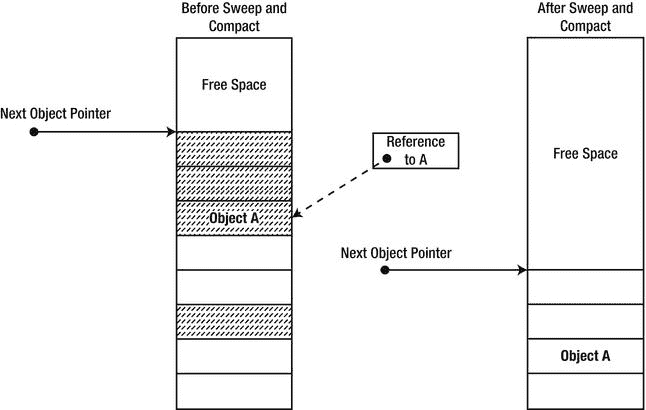
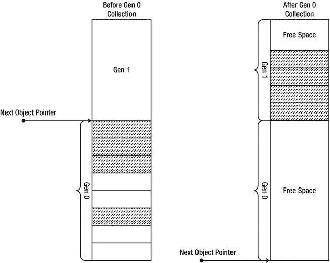

# 四、垃圾收集

在本章中，我们将研究。垃圾收集器(GC)是影响。NET 应用。在让开发人员不必担心内存释放的同时，GC 为构建性能至上的行为良好的程序带来了新的挑战。首先，我们将回顾 CLR 中可用的 GC 类型，并了解如何使应用适应 GC，这对整体 GC 性能和暂停时间非常有益。接下来，我们将了解代如何影响 GC 性能，以及如何相应地调优应用。在本章的最后，我们将研究可用于直接控制 GC 的 API，以及正确使用非确定性终结所涉及的微妙之处。

本章中的许多例子都是基于作者在现实系统中的个人经验。在可能的情况下，我们试图为您提供案例研究，甚至是您在阅读本章时可以使用的示例应用，以说明主要的性能难点。本章末尾的“最佳实践”部分充满了这样的案例研究和例子。但是，您应该意识到，这些要点中的一些很难用简短的代码片段甚至一个示例程序来演示，因为出现性能差异的情况通常发生在内存中有数千种类型和数百万个对象的大型项目中。

为什么要收集垃圾？

垃圾收集是一种高级抽象，它让开发人员不再需要关心内存释放的管理。在垃圾收集环境中，内存分配依赖于对象的创建，当应用不再引用这些对象时，就可以释放内存。垃圾回收器还为不驻留在托管堆上的非托管资源提供终结接口，以便在不再需要这些资源时可以执行自定义清理代码。的两个主要设计目标。网络垃圾收集器有:

*   消除内存管理错误和缺陷的负担
*   提供匹配或超过手动本机分配器性能的内存管理性能

现有的编程语言和框架使用几种不同的内存管理策略。我们将简要分析其中的两个:自由列表管理(可以在 C 标准分配器中找到)和引用计数垃圾收集。这将为我们了解的内部结构提供一个参考点。网络垃圾收集器。

自由列表管理

自由列表管理是 C 运行时库中的底层内存管理机制，默认情况下，C++内存管理 API(如 new 和 delete)也会使用它。这是一个确定性的内存管理器，依赖于开发人员在他们认为合适的时候分配和释放内存。内存的空闲块存储在一个链表中，从中分配得到满足(见[图 4-1](#Fig00041) )。被释放的内存块被返回到空闲列表。


[图 4-1](#_Fig00041) 。自由列表管理器管理未使用内存块的列表，并满足分配和解除分配请求。应用分发通常包含块大小的内存块

自由列表管理不能摆脱影响使用分配器的应用性能的战略和战术决策。在这些决定中:

*   一个使用自由列表管理的应用从一个由*自由列表*组成的小内存块池开始。该列表可以按照大小、使用时间、由应用确定的分配场所等来组织。
*   当来自应用的分配请求到达时，在空闲列表中找到一个匹配的块。可以通过选择第一拟合、最佳拟合或使用更复杂的替代策略来定位匹配块。
*   当空闲列表用尽时，内存管理器向操作系统请求添加到空闲列表中的另一组空闲块。当来自应用的释放请求到达时，被释放的内存块被添加到空闲列表中。这个阶段的优化包括将相邻的空闲块连接在一起，整理碎片和调整列表，等等。

与自由列表内存管理器相关的主要问题如下:

*   *分配成本* :寻找一个合适的区块来满足分配请求是非常耗时的，即使使用了最适合的方法。此外，块通常被分成多个部分来满足分配请求。在多处理器的情况下，除非使用多个列表，否则对空闲列表的争用和分配请求的同步是不可避免的。另一方面，多重列表恶化了列表的碎片化。
*   *解除分配成本* :将一个空闲内存块返回到空闲列表是很耗时的，并且还需要多处理器同步多个解除分配请求。
*   *管理成本* :对空闲列表进行碎片整理和修整是避免内存耗尽情况所必需的，但是这项工作必须在一个单独的线程中进行，并获取空闲列表上的锁，这阻碍了分配和解除分配性能。通过使用固定大小的分配桶来维护多个自由列表，可以最小化碎片，但是这需要更多的管理，并且会给每个分配和释放请求增加少量成本。

引用计数垃圾收集

引用计数垃圾收集器 将每个对象与一个整数变量相关联——它的*引用计数*。创建对象时，其引用计数被初始化为 1。当应用创建一个新的对象引用时，其引用计数增加 1(见[图 4-2](#Fig00042) )。当应用移除对该对象的现有引用时，其引用计数减 1。当对象的引用计数达到 0 时，可以确定性地销毁该对象，并回收其内存。


[图 4-2](#_Fig00042) 。每个对象都包含一个引用计数

Windows 生态系统中引用计数垃圾收集的一个例子是 COM(组件对象模型)。COM 对象与影响其生存期的引用计数相关联。当 COM 对象的引用计数达到 0 时，通常由该对象负责回收自己的内存。通过显式的 AddRef 和释演法调用，管理引用计数的负担主要由开发人员承担，尽管大多数语言都有在创建和销毁引用时自动调用这些方法的自动包装器。

与引用计数垃圾收集相关的主要问题如下:

*   *管理成本*:每当创建或销毁对一个对象的引用时，必须更新该对象的引用计数。这意味着诸如引用赋值(a = b)或通过值将引用传递给函数之类的琐碎操作会导致更新引用计数的开销。在多处理器系统上，这些更新会围绕引用计数引入争用和同步，并且如果多个处理器更新同一个对象的引用计数，会导致缓存抖动。(有关单处理器和多处理器缓存考虑事项的更多信息，请参见第 5 章和第 6 章。)
*   *内存使用*:对象的引用计数必须存储在内存中，并与对象相关联。根据每个对象预期的引用数量，这会将对象的大小增加几个字节，使得引用计数对于 flyweight 对象来说不值得。(这对于 CLR 来说不是什么问题，因为对象已经有了 8 或 16 字节的“开销”，正如我们在《T2》第三章中看到的。)
*   *正确性*:在引用计数垃圾收集下，对象的断开循环不能被回收。如果应用不再有对两个对象的引用，但是每个对象都有对另一个对象的引用，引用计数应用将经历内存泄漏(见[图 4-3](#Fig00043) )。COM 记录了这种行为，并要求手动中断循环。其他平台，如 Python 编程语言，引入了一种额外的机制来检测和消除这种循环，从而导致额外的不确定性收集成本。


[图 4-3](#_Fig00043) 。当一个对象周期不再被应用引用时，它们的内部引用计数保持为 1，并且不会被销毁，从而产生内存泄漏。(图中的虚线参考已被删除。)

跟踪垃圾收集

跟踪垃圾回收是。NET CLR、Java VM 和各种其他托管环境——这些环境不使用任何形式的引用计数垃圾收集。开发人员不需要发出显式的内存释放请求；这由垃圾收集器负责。跟踪 GC 不会将对象与引用计数相关联，通常在达到内存使用阈值之前不会产生任何释放开销。

当垃圾收集发生时，收集器从*标记阶段* 开始，在此期间，它解析应用仍然引用的所有对象(活动对象)。在构建了一组活动对象之后，收集器转到*扫描阶段*，此时它将回收未使用的对象所占用的空间。最后，收集器以*压缩阶段*结束，在这个阶段，它移动活动对象，使它们在内存中保持连续。

在本章中，我们将详细研究与跟踪垃圾收集相关的各种问题。但是，现在可以提供这些问题的大致轮廓:

*   *分配成本*:分配成本与基于堆栈的分配相当，因为没有与自由对象相关联的维护。分配包括递增指针。
*   *解除分配成本*:每当 GC 周期发生时发生，而不是均匀分布在应用的执行配置文件中。这有它的优点和缺点(特别是对于低延迟的场景)，我们将在本章的后面讨论。
*   标记阶段:定位被引用的对象需要来自托管执行环境的大量规则。对对象的引用可以存储在静态变量、线程堆栈上的局部变量中，作为指针传递给非托管代码，等等。跟踪每个可访问对象的每个可能的引用路径一点也不简单，而且经常会在收集周期之外产生运行时开销。
*   *扫描阶段*:在内存中移动对象会耗费时间，并且可能不适用于大型对象。另一方面，消除对象之间未使用的空间有助于引用的局部性，因为被一起分配的对象被一起放置在内存中。此外，这消除了对额外碎片整理机制的需要，因为对象总是连续存储的。最后，这意味着分配代码在寻找空闲空间时不需要考虑对象之间的“洞”；可以使用简单的基于指针的分配策略。

在接下来的部分中，我们将研究。NET GC 内存管理范式，从理解 GC 标记和清除阶段开始，到更重要的优化，如代。

标记阶段

在跟踪垃圾收集周期的*标记阶段*，GC 遍历应用当前引用的所有对象的图。为了成功地遍历这个图并防止*假阳性*和*假阴性*(将在本章后面讨论)，GC 需要一组起始点，引用遍历可以从这些起始点开始。这些起始点被称为*根*，顾名思义，它们构成了 GC 构建的有向引用图的根。

在建立了一组根之后，垃圾收集器在标记阶段的工作就相对容易理解了。它考虑每个根中的每个内部引用字段，并继续遍历图，直到所有被引用的对象都被访问过。因为参考周期是允许的。NET 应用中，GC 标记被访问的对象，这样每个对象只被访问一次——因此得名*标记*阶段。

本地根

最明显的根类型之一是*局部变量*；单个局部变量可以构成应用引用的整个对象图的根。例如，考虑创建系统的应用的 Main 方法中的以下代码片段。Xml.XmlDocument 对象并继续调用其 Load 方法:

```cs
static void Main(string[] args) {
    XmlDocument doc = new XmlDocument();
    doc.Load("Data.xml");
    Console.WriteLine(doc.OuterXml);
}
```

我们不控制垃圾收集器的计时，因此必须假设在 Load 方法调用期间可能会发生垃圾收集。如果发生这种情况，我们不希望 XmlDocument 对象被回收 Main 方法中的本地引用是垃圾收集器必须考虑的文档对象图的根。因此，当其方法在堆栈上时，每个可能保存对对象的引用的局部变量(即，引用类型的每个局部变量)可以表现为活动根。

然而，我们不需要引用保持一个活动的根，直到其封闭方法的*结束*。例如，在加载并显示文档之后，我们可能希望在同一个方法中引入额外的代码，不再需要将文档保存在内存中。这段代码可能需要很长时间才能完成，如果同时发生垃圾收集，我们希望文档的内存被回收。

是不是？NET 垃圾收集器提供了这种急切的收集功能？让我们检查下面的代码片段，它创建了一个系统。Timer，并用一个回调来初始化它，这个回调通过调用 GC 来引发垃圾收集。收集(我们将在后面更详细地研究这个 API):

```cs
using System;
using System.Threading;

class Program {
    static void Main(string[] args) {
     Timer timer = new Timer(OnTimer, null, 0, 1000);
     Console.ReadLine();
    }
    static void OnTimer(object state) {
     Console.WriteLine(DateTime.Now.TimeOfDay);
     GC.Collect();
    }
}
```

如果您在调试模式下运行上述代码(如果从命令行编译，没有/optimize +编译器开关)，您将看到计时器回调每秒被调用一次，正如预期的那样，这意味着计时器没有被垃圾收集。但是，如果在发布模式下运行它(使用/optimize +编译器开关)，计时器回调只被调用一次！换句话说，计时器被收集并停止调用回调。这是合法的(甚至是期望的)行为，因为一旦到达控制台，我们对计时器的本地引用就不再作为根相关了。ReadLine 方法调用。因为它不再相关，所以计时器被收集起来，如果您没有遵循前面关于本地根的讨论，就会产生一个意想不到的结果！

急切的根集合

这种对本地根的急切收集功能实际上是由。NET 实时编译器(JIT) 。垃圾收集器无法自行知道局部变量是否仍有可能被其封闭方法使用。当 JIT 编译方法时，这个信息被嵌入到特殊的表中。对于每个局部变量，JIT 将最早和最晚指令指针的地址嵌入到表中，其中变量仍然作为根相关。然后，GC 在执行堆栈审核时使用这些表。(注意，局部变量可以存储在堆栈上或 CPU 寄存器中；JIT 表必须指出这一点。)

```cs
//Original C# code:
static void Main() {
  Widget a = new Widget();
  a.Use();
  //...additional code
  Widget b = new Widget();
  b.Use();
  //...additional code
  Foo(); //static method call
}

//Compiled x86 assembly code:
     ; prologue omitted for brevity
     call 0x0a890a30;              Widget..ctor
+0x14 mov esi, eax ;               esi now contains the object's reference
     mov ecx, esi
     mov eax, dword ptr [ecx]
     ; the rest of the function call sequence
+0x24 mov dword ptr [ebp-12], eax ; ebp-12 now contains the object's reference
     mov ecx, dword ptr [ebp-12]
     mov eax, dword ptr [ecx]
     ; the rest of the function call sequence
+0x34 call 0x0a880480 ;             Foo method call
     ; method epilogue omitted for brevity

//JIT-generated tables that the GC consults:
Register or stack     Begin offset     End offset
     ESI                  0x14           0x24
  EBP - 12                0x24           0x34
```

上面的讨论暗示了将你的代码分解成更小的方法和使用更少的局部变量不仅仅是一个好的设计方法或者软件工程技术。与。NET 垃圾收集器，它也可以提供一个性能优势，因为你有更少的本地根！这意味着编译方法时 JIT 的工作量更少，根 IP 表占用的空间更少，执行堆栈审核时 GC 的工作量也更少。

如果我们想显式地延长计时器的生命周期，直到它的封装方法结束，该怎么办？有多种方法可以实现这一点。我们可以使用一个静态变量(这是一种不同类型的根，稍后将讨论)。或者，我们可以在方法的终止语句之前使用计时器(例如，调用计时器。Dispose())。但是完成这项工作最干净的方法是使用 GC。KeepAlive 方法，它保证对对象的引用将被视为根。

GC 是如何？KeepAlive 工作？这似乎是一个从 CLR 内部提升的神奇方法。然而，它是相当琐碎的——我们可以自己写，我们会的。如果我们将对象引用传递给任何不能被内联的方法(参见[第 3 章](03.html)关于内联的讨论)，JIT 必须自动假定该对象被使用。因此，下面的方法可以代替 GC。KeepAlive 如果我们想:

```cs
[MethodImpl(MethodImplOptions.NoInlining)]
static void MyKeepAlive(object obj) {
  //Intentionally left blank: the method doesn't have to do *anything*

}
```

静态根

根的另一个类别是静态变量。类型的静态成员是在类型被加载时创建的(我们已经在[第 3 章](03.html)中看到了这个过程)，并且在应用域的整个生命周期中被认为是潜在的根。例如，考虑这个短程序，它不断地创建对象，这些对象又注册到一个静态事件:

```cs
class Button {
  public void OnClick(object sender, EventArgs e) {
    //Implementation omitted
  }
}

class Program {
  static event EventHandler ButtonClick;

  static void Main(string[] args) {
    while (true) {
     Button button = new Button();
     ButtonClick += button.OnClick;
    }
  }
}
```

这被证明是内存泄漏，因为静态事件包含一个委托列表，该列表又包含对我们创建的对象的引用。事实上最常见的一种。净内存泄漏是从一个静态变量引用你的对象！

其他词根

刚刚描述的两类根是最常见的，但是还存在其他类别。比如 *GC 处理* (由系统表示。runtime . interop services . GC handle 类型)也被垃圾收集器视为根。*f-可达队列* 是另一个微妙的根类型的例子——等待终结的对象仍然被 GC 认为是可达的。我们将在本章后面考虑这两种根类型；中调试内存泄漏时，理解其他类别的根是很重要的。NET 应用，因为通常没有普通的(静态的或本地的)根引用你的对象，但是由于其他原因，它仍然存在。

使用 SOS.DLL 检查根部

我们在第 3 章中看到的调试器扩展 SOS.DLL 可以用来检查负责保持特定对象存活的根链。其！gcroot 命令提供了根类型和引用链的简洁信息。以下是其输出的一些示例:

```cs
0:004> !gcroot 02512370
HandleTable:
    001513ec (pinned handle)
    -> 03513310 System.Object[]
    -> 0251237c System.EventHandler
    -> 02512370 Employee

0:004> !gcroot 0251239c
Thread 3068:
    003df31c 002900dc Program.Main(System.String[]) [d:\...\Ch04\Program.cs @ 38]
     esi:
     -> 0251239c Employee

0:004> !gcroot 0227239c
Finalizer Queue:
    0227239c
    -> 0227239c Employee
```

这个输出中的第一类根可能是一个静态字段——尽管确定这一点需要一些工作。不管怎样，它是一个固定的 GC 句柄(GC 句柄将在本章后面讨论)。第二种类型的根是线程 3068 中的 ESI 寄存器，它在 Main 方法中存储一个局部变量。最后一种根是 f-可达队列。

性能影响

垃圾收集周期的标记阶段是一个“几乎只读”的阶段，在这个阶段，没有对象被转移到内存中或者从内存中释放。尽管如此，在标记阶段所做的工作会产生重大的性能影响:

*   在满标记期间，垃圾收集器必须接触每个被引用的对象。如果内存不再位于工作集中，这会导致页面错误，并在遍历对象时导致缓存未命中和缓存抖动。
*   在多处理器系统上，由于收集器通过在对象头中设置一个位来标记对象，这会导致缓存中有该对象的其他处理器的缓存失效。
*   在这个阶段，未引用对象的成本较低，因此标记阶段的性能在*收集效率因子*中是线性的:收集空间中引用对象和未引用对象之间的比率。
*   标记阶段的性能还取决于图形中对象的数量，而不是这些对象消耗的内存。不包含很多引用的大型对象更容易遍历，并且开销也更少。这意味着标记阶段的性能与图中活动对象的数量成线性关系。

一旦所有被引用的对象都被标记，垃圾收集器就有了所有被引用对象及其引用的完整图形(见[图 4-4](#Fig00044) )。现在可以进入扫描阶段。


[图 4-4](#_Fig00044) 。具有各种类型根的对象图。允许循环引用

扫描和压缩阶段

在清扫和压缩阶段，垃圾收集器回收内存，通常是通过移动活动对象，使它们连续地放在堆中。为了理解移动对象的机制，我们必须首先检查分配机制，它为清扫阶段执行的工作提供了动力。

在我们目前正在研究的简单 GC 模型中，来自应用的分配请求通过增加一个指针来满足，该指针总是指向下一个可用的内存槽(参见[图 4-5](#Fig00045) )。这个指针被称为*下一个对象指针* (或*新对象指针*)，它在应用启动时构建垃圾收集堆时被初始化。


[图 4-5](#_Fig00045) 。GC 堆和下一个对象指针

在这种模型中，满足分配请求的代价非常低:它只涉及单个指针的原子增量。多处理器系统很可能会经历对这个指针的争用(这个问题将在本章后面讨论)。

如果内存是无限的，分配请求可以通过增加新的对象指针来无限地满足。然而，在某个时间点，我们达到了触发垃圾收集的阈值。阈值是动态的和可配置的，我们将在本章的后面研究控制它们的方法。

在压缩阶段，垃圾收集器移动内存中的活动对象，使它们占据空间中的连续区域(见[图 4-6](#Fig00046) )。这有助于引用的局部性，因为一起分配的对象也可能一起使用，所以最好在内存中将它们放在一起。另一方面，移动物体至少有两个性能痛点:

*   移动对象意味着复制内存，对于大型对象来说，这是一个开销很大的操作。即使副本被优化，在每个垃圾收集周期中复制几兆字节的内存也会导致不合理的开销。(这就是为什么大对象被区别对待的原因，我们将在后面看到。)
*   移动对象时，必须更新对它们的引用，以反映它们的新位置。对于经常被引用的对象，这种分散的内存访问(当引用被更新时)可能是代价很高的。



[图 4-6](#_Fig00046) 。左边的阴影对象在垃圾收集中幸存下来，并在内存中四处移动。这意味着必须更新对 A(虚线)的引用。(图中未显示更新后的参考。)

扫描阶段的总体性能与图中的对象数量成线性，并且对收集效率因子特别敏感。如果发现大多数对象是未被引用的，那么 GC 只需移动内存中的少数对象。这同样适用于大多数对象仍然被引用的场景，因为需要填充的漏洞相对较少。另一方面，如果堆中的所有其他对象都没有被引用，GC 可能不得不移动几乎所有活动的对象来填补这些漏洞。

 **注意**与普遍的看法相反，垃圾收集器并不总是四处移动对象(也就是说，有一些只进行清扫的收集不会进入压缩阶段)，即使它们没有被锁定(见下文)，即使对象之间有空闲空间。有一个实现定义的试探法，它确定在扫描阶段移动对象来填充空闲空间是否值得。例如，在作者的 32 位系统上执行的一个测试套件中，如果空闲空间大于 16 个字节，由多个对象组成，并且自上次垃圾收集以来分配的空间超过 16KB，则垃圾收集器决定四处移动对象。你不能指望这些结果是可重复的，但这确实证明了优化的存在。

前面几节中描述的标记和清除模型有一个重大缺陷，我们将在本章后面讨论分代 GC 模型时解决这个问题。每当发生收集时，堆中的所有对象都会被遍历，即使它们可以根据收集效率的可能性进行分区。如果我们事先知道一些对象比其他对象更有可能死亡，我们也许能够相应地调整我们的收集算法，并获得更低的分摊收集成本。

钉住

上面介绍的垃圾收集模型没有解决托管对象的常见用例。这个用例围绕着传递托管对象供非托管代码使用。有两种不同的方法可以用来解决这个问题:

*   每个应该传递给非托管代码的对象在传递给非托管代码时都通过值进行封送(复制)，并在返回时封送回去。
*   指向对象的指针被传递给非托管代码，而不是复制该对象。

每当我们需要与非托管代码交互时，复制内存是不现实的。考虑软实时视频处理软件的情况，该软件需要以每秒 30 帧的速度将高分辨率图像从非托管代码传播到托管代码，反之亦然。每次进行微小的更改时复制多兆字节的内存将会使性能下降到不可接受的程度。

那个。NET 内存管理模型 提供了获取被管理对象内存地址的工具。但是，在垃圾回收器存在的情况下将该地址传递给非托管代码会引发一个重要的问题:如果对象在非托管代码仍在执行并使用该指针时被 GC 移动，会发生什么情况？

这种情况可能会带来灾难性的后果——内存很容易被破坏。这个问题的一个可靠解决方案是*在非托管代码有一个指向托管对象的指针时关闭*垃圾收集器。然而，如果对象经常在托管和非托管代码 之间传递，这种方法就不够细粒度。如果线程从非托管代码中进入长时间等待，它还可能导致死锁或内存耗尽。

除了关闭垃圾收集，每个可以获得地址的托管对象也必须*固定*在内存中。锁定一个对象可以防止垃圾收集器在清理阶段移动它，直到它被*解除锁定*。

锁定操作 本身并不昂贵——有多种机制可以相当便宜地执行它。锁定一个对象最直接的方法是用 GCHandleType 创建一个 GC 句柄 T3。别着的旗帜。创建一个 GC 句柄会在进程' *GC 句柄表*中创建一个新的根，它会告诉 GC 对象应该被保留并固定在内存中。其他替代方法包括 P/Invoke 封送拆收器使用的 magic sauce，以及通过 fixed 关键字(或 C++/CLI 中的 pin_ptr < T >)在 C# 中公开的 pinned pointers 机制，它依赖于以特殊方式标记 pinning 局部变量以便 GC 查看。(有关更多详细信息，请参考第 8 章。)

然而，当我们考虑固定如何影响垃圾收集本身时，固定的性能成本就变得很明显了。当垃圾收集器在压缩阶段遇到固定对象时，它必须绕过该对象，以确保它不会在内存中移动。这使收集算法变得复杂，但最直接的影响是将*碎片* 引入到托管堆中。一个严重碎片化的堆直接使使垃圾收集可行的假设无效:它导致连续的分配在内存中被碎片化(以及局部性的损失)，给分配过程带来复杂性，并且由于碎片不能被填充而导致内存浪费。

 **注意**钉扎副作用可以用多种工具来诊断，包括微软 CLR 探查器。CLR 探查器可以按地址显示对象的图形，将空闲(碎片)区域显示为未使用的空白。或者，SOS.DLL(托管调试扩展)可用于显示“自由”类型的对象，这是由于碎片造成的漏洞。最后，固定对象的 *# 性能计数器*(在*中)。NET CLR Memory* 性能计数器类别)可以用来确定在 GC 检查的最后一个区域中固定了多少对象。

尽管有上述缺点 ，但在许多应用中，钉扎是必要的。当有一个抽象层(比如 P/Invoke)代表我们处理细节时，我们常常不能直接控制钉住。在这一章的后面，我们将提出一系列的建议来最小化钉扎的负面影响。

我们已经回顾了垃圾收集器在收集周期中采取的基本步骤。我们还看到了必须传递给非托管代码的对象会发生什么。在前面的章节中，我们已经看到了许多需要优化的地方。经常提到的一点是，在多处理器机器上，争用和同步需求可能是影响内存密集型应用性能的一个非常重要的因素。在接下来的章节中，我们将研究多种优化，包括针对多处理器系统的优化。

垃圾收集风味

那个。NET 垃圾收集器有几种风格 ，尽管它可能看起来像是一个庞大的整体代码，几乎没有定制的空间。这些风格用于区分多种场景:面向客户端的应用、高性能服务器应用等等。为了理解这些不同的味道是如何彼此不同的，我们必须看看垃圾收集器与其他应用线程(通常称为 *mutator 线程* )的交互。

暂停线程以进行垃圾收集

当垃圾收集发生时，应用线程 正常执行。毕竟，垃圾收集请求通常是应用代码中进行新分配的结果——所以它当然愿意运行。GC 执行的工作会影响对象的内存位置以及对这些对象的引用。当应用代码正在使用对象时，在内存中移动对象并更改它们的引用很容易出现问题。

另一方面，在某些情况下，与其他应用线程同时执行垃圾收集进程至关重要。例如，考虑一个经典的 GUI 应用。如果垃圾收集过程是在后台线程上触发的，我们希望能够在收集过程中保持 UI 的响应。即使收集本身可能需要更长的时间才能完成(因为 UI 与 GC 争夺 CPU 资源)，用户也会更高兴，因为应用的响应速度更快了。

如果垃圾收集器与其他应用线程同时执行，会出现两类问题:

*   *假阴性*:一个对象被认为是活的，即使它符合垃圾收集的条件。这是一个不希望的结果，但是如果这个对象将在下一个周期被收集，我们可以接受这个结果。
*   *误报*:一个对象被认为是死的，即使它仍然被应用引用。这是一个调试噩梦，垃圾收集器必须尽一切努力防止这种情况发生。

让我们考虑一下垃圾收集的两个阶段，看看我们是否能够承受与 GC 进程同时运行应用线程。请注意，无论我们可能得出什么结论，仍然有一些场景需要在垃圾收集过程中暂停线程。例如，如果进程真的耗尽了内存，那么在回收内存时就有必要挂起线程。然而，我们将审查较少例外的情况，这相当于大多数情况。

挂起 GC 的线程

挂起线程进行垃圾收集是在*安全点*执行的。不是每两个指令的集合都可以被中断来执行收集。JIT 发出额外的信息，以便在安全执行收集时发生挂起，CLR 尝试优雅地挂起线程——它不会在挂起后不验证线程是否安全的情况下公然调用 suspend thread Win32 API。

在 CLR 2.0 中，可能会出现这样一种情况:一个被 CPU 限制得非常紧的循环缠住的托管线程会绕过安全点很长一段时间，导致 GC 启动延迟长达 1500 毫秒(这反过来又会延迟任何已经被阻塞等待 GC 完成的线程)。此问题已在 CLR 4.0 中修复；如果你对细节感到好奇，可以看看萨沙·戈尔德施泰因的博文《垃圾收集线程挂起延迟》([http://blog . sashag . net/archive/2009/07/31/Garbage-Collection-Thread-Suspension-Delay-250 ms-multiples . aspx](http://blog.sashag.net/archive/2009/07/31/garbage-collection-thread-suspension-delay-250ms-multiples.aspx)，2009)。

请注意，非托管线程在返回托管代码之前不受线程挂起的影响，这由 P/Invoke 转换存根负责。

在标记阶段暂停线程

在标记阶段 期间，垃圾收集器的工作几乎是只读的。尽管如此，假阴性和假阳性还是会发生。

新创建的对象可能被收集器认为是死的，即使它被应用引用。如果收集器已经考虑了创建对象时更新的图形部分，这是可能的(见[图 4-7](#Fig00047) )。这可以通过拦截新引用(和新对象)的创建并确保标记它们来解决。它需要同步并增加分配成本，但允许其他线程与收集进程并发执行。


[图 4-7](#_Fig00047) 。在图形的该部分已经被标记(虚线对象已经被标记)之后，对象被引入到图形中。这导致对象被错误地认为是不可到达的

如果在标记阶段删除了对对象的最后一个引用，则已经被收集器标记的对象有资格进行垃圾收集(参见[图 4-8](#Fig00048) )。这不是一个需要考虑的严重问题；毕竟，如果对象真的不可到达，它将在下一个 GC 周期被收集——死对象没有办法再次变得可到达。


[图 4-8](#_Fig00048) 。在图形的该部分已经被标记(虚线对象已经被标记)之后，从图形中移除对象。这导致对象被错误地认为是可到达的

在清理阶段暂停线程

在扫描阶段 ，不仅引用会改变，对象也会在内存中移动。这给并发执行的应用线程带来了一系列新问题。这些问题包括:

*   复制对象不是原子操作。这意味着在复制了对象的一部分后，应用仍在修改原始对象。
*   更新对对象的引用不是原子操作。这意味着应用的某些部分可能使用旧的对象引用，而其他一些部分可能使用新的对象引用。

解决这些问题是可能的(JVM 的 Azul Pauseless GC，[http://www.azulsystems.com/zing/pgc](http://www.azulsystems.com/zing/pgc)就是一个例子)，但是在 CLR GC 中还没有这样做。声明清扫阶段不支持与垃圾收集器并发执行的应用线程更简单。

 **提示**要确定并发 GC 是否能为您的应用带来任何好处，您必须首先确定它通常花费多少时间来执行垃圾收集。如果您的应用花费 50%的时间来回收内存，那么还有很大的优化空间。另一方面，如果您只在几分钟内执行一次收集，您可能应该坚持对您有效的方法，并在其他地方进行重大优化。您可以通过。NET CLR 内存性能类别。

既然我们已经回顾了垃圾收集过程中其他应用线程的行为，我们可以更详细地研究各种 GC 风格。

工作站 GC

我们将研究的第一种 GC 风格被称为*工作站 GC* 。又进一步分为两个子口味:*并发工作站 GC* 和*非并发工作站 GC* 。

在工作站 GC 下，有一个执行垃圾收集的线程，垃圾收集不是并行运行的。请注意，在多个处理器上并行运行收集进程*本身*和与其他应用线程并发运行收集进程是有区别的。

并发工作站 GC

*并发工作站* GC 风格是*默认*风格。在并发工作站 GC 下，有一个单独的专用 *GC 线程*，标记为 THREAD_PRIORITY_HIGHEST，从头到尾执行垃圾收集。此外，CLR 可以决定它希望垃圾收集过程的某些阶段与应用线程并发运行(正如我们在上面看到的，大多数标记阶段可以并发执行)。请注意，这个决定仍然取决于 CLR——正如我们将在后面看到的，一些收集足够快，足以保证完全暂停，例如第 0 代收集。无论如何，当执行扫描阶段时，所有应用线程都被挂起。

如果垃圾收集是由 UI 线程触发的，那么使用并发工作站 GC 的响应性优势可能会被超越。在这种情况下，应用的后台线程将与 UI 正在等待的垃圾收集竞争。这实际上会*降低*UI 的响应性，因为 UI 线程会被阻塞，直到 GC 完成，并且还有其他应用线程与 GC 争夺资源。(参见[图 4-9](#Fig00049) 。)


[图 4-9](#_Fig00049) 。上半部分显示了 UI 线程触发收集时的并发 GC。下半部分显示了当一个后台线程触发收集时的并发 GC。(虚线表示阻塞的线程。)

因此，使用并发工作站 GC 的 UI 应用应该非常小心，防止 UI 线程上发生垃圾收集。这归结为在后台线程上执行分配，并避免显式调用 GC。在 UI 线程上收集。

所有的默认 GC 风格。NET 应用(保存 ASP.NET 应用)，不管它们是运行在用户的工作站上还是运行在功能强大的多处理器服务器上，都是并发工作站 GC。这个缺省值很少适合服务器应用，我们很快就会看到。正如我们刚刚看到的，如果 UI 应用倾向于在 UI 线程上触发垃圾收集，这也不一定是合适的默认设置。

非并发工作站 GC

*非并发工作站* GC 风格，顾名思义，在标记和清除阶段都会挂起应用线程。非并发工作站 GC 的主要使用场景是上一节提到的情况，此时 UI 线程倾向于触发垃圾收集。在这种情况下，非并发 GC 可能会提供更好的响应，因为后台线程不会与 UI 线程正在等待的垃圾收集竞争，从而更快地释放 UI 线程。(参见[图 4-10](#Fig000410) 。)


[图 4-10](#_Fig000410) 。UI 线程触发非并发 GC 下的收集。在收集期间，其他线程不会争用资源

服务器 GC

*服务器* GC 风格针对完全不同类型的应用进行了优化——服务器应用，顾名思义。在这种情况下，服务器应用需要高吞吐量的场景(通常以单个操作的延迟为代价)。服务器应用还需要轻松扩展到多个处理器，内存管理也必须能够扩展到多个处理器。

使用服务器 GC 的应用具有以下特征:

*   的关联掩码中，每个处理器都有一个单独的托管堆。NET 进程。特定处理器上的线程的分配请求从属于该特定处理器的托管堆中得到满足。这种分离的目的是在进行分配时最大限度地减少托管堆上的争用:大多数时候，下一个对象指针上没有争用，多个线程可以真正并行地执行分配。如果应用创建手动工作线程并为它们分配硬 CPU 关联，这种架构需要动态调整堆大小和 GC 阈值，以确保公平性。在典型的服务器应用中，服务请求来自线程池工作线程，很可能所有堆的大小都大致相同。
*   垃圾收集不会发生在触发垃圾收集的线程上。相反，垃圾收集发生在一组专用的 GC 线程上，这些线程是在应用启动期间创建的，并被标记为 THREAD_PRIORITY_HIGHEST。的关联掩码中的每个处理器都有一个 GC 线程。NET 进程。这允许每个线程在分配给其处理器的托管堆上并行执行垃圾收集。由于引用的局部性，很可能每个 GC 线程几乎只在自己的堆中执行标记阶段，堆的一部分保证在 CPU 的缓存中。
*   在垃圾收集的两个阶段，所有应用线程都被挂起。这允许 GC 及时完成，并允许应用线程尽快继续处理请求。它以延迟为代价最大化了吞吐量:当垃圾收集正在进行时，一些请求可能需要更长的时间来处理，但是总的来说，应用可以处理更多的请求，因为在垃圾收集正在进行时引入了更少的上下文切换。

使用服务器 GC 时，CLR 会尝试在处理器堆之间平衡对象分配。直到 CLR 4.0，只有小对象堆是平衡的；从 CLR 4.5 开始，大对象堆(稍后讨论)也得到了平衡。因此，所有堆的分配率、填充率和垃圾收集频率都是相似的。

使用服务器 GC 风格的唯一限制是机器上物理处理器的数量。如果机器上只有一个物理处理器，那么唯一可用的 GC 风格就是工作站 GC。这是一个合理的选择，因为如果只有一个处理器可用，就会有一个托管堆和一个 GC 线程，这会妨碍服务器 GC 架构的有效性。

 **注意**从 NT 6.1 (Windows 7 和 Windows Server 2008 R2)开始，Windows 通过使用*处理器组*支持超过 64 个逻辑处理器。从 CLR 4.5 开始，GC 也可以使用超过 64 个逻辑处理器。这需要在应用配置文件中放置<GCCpuGroup enabled = " true "/>元素。

服务器应用很可能受益于服务器 GC 风格。然而，正如我们之前看到的，默认的 GC 风格是工作站并发 GC。对于在控制台应用、Windows 应用和 Windows 服务中的默认 CLR 宿主下承载的应用来说，情况确实如此。非默认 CLR 主机可以选择使用不同的 GC 风格。这就是 IIS ASP.NET 主机所做的:它在服务器 GC 风格下运行应用，因为 IIS 通常安装在服务器机器上(尽管这种行为仍然可以通过 Web.config 进行定制)。

控制 GC 味道是下一节的主题。这是一个有趣的性能测试实验，尤其是对于内存密集型应用。在各种 GC 风格下测试这些应用的行为是一个好主意，看看在高内存负载下哪一种能产生最佳性能。

在 GC 风格之间切换

有可能用 CLR 托管接口来控制 GC 风格，这将在本章后面讨论。但是，对于默认主机，也可以使用应用配置文件(App.config)来控制 GC 风格选择。以下 XML 应用配置文件可用于在各种 GC 风格和子风格 之间进行选择:

```cs
<?xml version="1.0" encoding="utf-8" ?>
<configuration>
  <runtime>
    <gcServer enabled="true" />
    <gcConcurrent enabled="false" />
  </runtime>
</configuration>
```

gcServer 元素控制服务器 GC 的选择，而不是工作站 GC 。gcConcurrent 元素控制工作站 GC 子风格的选择。

。NET 3.5(包括。NET 2.0 SP1 和。NET 3.0 SP1)增加了一个额外的 API，可以在运行时改变 GC 风格。它作为系统提供。这个类有两个属性:IsServerGC 和 LatencyMode。

GCSettings。IsServerGC 是一个只读属性，它指定应用是否在服务器 GC 下运行。它不能用于在运行时选择加入服务器 GC，并且只反映应用的配置状态或 CLR 主机的 GC 风格定义。

另一方面，LatencyMode 属性采用 GCLatencyMode 枚举的值，即:Batch、Interactive、LowLatency 和 SustainedLowLatency。批处理对应于非并发 GC；Interactive 对应于并发 GC。LatencyMode 属性可用于在运行时在并发和非并发 GC 之间切换。

GCLatencyMode 枚举的最后一个最有趣的值是 LowLatency 和 SustainedLowLatency。这些值向垃圾收集器发出信号，表明您的代码当前正处于一个时间敏感的操作中，此时垃圾收集可能是有害的。低延迟值是在中引入的。NET 3.5，仅在并发工作站 GC 上受支持，并且是为短时间敏感区域设计的。另一方面，SustainedLowLatency 是在 CLR 4.5 中引入的，它在服务器和工作站 GC 上都受支持，并且是为更长时间而设计的，在这段时间内，应用不应该暂停以进行完整的垃圾收集。低延迟不适用于您即将执行导弹制导代码的场景，原因很快就会看到。但是，如果您正在执行 UI 动画，并且垃圾收集会破坏用户体验，这是很有用的。

低延迟垃圾收集模式指示垃圾收集器避免执行完全收集，除非绝对必要，例如，如果操作系统的物理内存不足(分页的影响可能比执行完全收集的影响更糟)。低延迟并不意味着垃圾收集器关闭；部分收集(我们将在讨论代时考虑)仍将被执行，但是垃圾收集器在应用处理时间中所占的份额将显著降低。

安全使用低延迟 GC

使用低延迟 GC 模式的唯一安全方式是在受约束的执行区域内(CER ) 。CER 限定了一段代码，在这一段代码中，CLR 被限制不能抛出带外异常(如线程中止)，这将阻止该段代码完整执行。放置在 CER 中的代码必须只调用具有强可靠性保证的代码。使用 CER 是保证延迟模式恢复到其先前值的唯一方法。下面的代码演示了如何实现这一点(您应该导入系统。编译器服务和系统。编译这段代码的运行时名称空间):

```cs
GCLatencyMode oldMode = GCSettings.LatencyMode;
RuntimeHelpers.PrepareConstrainedRegions();
try
{
    GCSettings.LatencyMode = GCLatencyMode.LowLatency;
    //Perform time-sensitive work here
}
finally
{
    GCSettings.LatencyMode = oldMode;
}
```

您希望花费在低延迟 GC 模式上的时间必须保持在最低限度——一旦您退出低延迟模式，GC 开始积极回收未使用的内存，其长期影响可能会影响应用的性能。如果您不能完全控制进程中发生的所有分配(例如，如果您托管插件或有多个后台线程独立工作)，请记住，切换到低延迟 GC 模式会影响整个进程，并可能对其他分配路径造成不良影响。

选择正确的 GC 风格并不是一项简单的任务，大多数时候我们只能通过实验来找到合适的模式。然而，对于内存密集型应用来说，这种试验是必须的——我们不能在一个处理器上花费我们宝贵的 CPU 时间的 50%来执行垃圾收集，而其他 15 个处理器却高高兴兴地闲坐着，等待收集完成。

当我们仔细检查上面展示的模型时，一些严重的性能问题仍然困扰着我们。以下是最重要的问题:

*   大对象:复制大对象是一个非常昂贵的操作，但是在扫描阶段，大对象可以一直被复制。在某些情况下，复制内存可能成为执行垃圾收集的主要成本。我们得出的结论是，在扫描阶段，对象必须根据大小进行区分。
*   *收集效率因子*:每一次收集都是一次完全收集，这意味着一个拥有相对稳定的对象集的应用将会付出巨大的代价来执行标记并清扫整个堆，即使大部分对象仍然被引用。为了防止低收集效率因素，我们必须追求一种优化，这种优化可以通过对象的*收集可能性*来区分对象:它们是否可能在下一个 GC 周期被收集。

这些问题的大多数方面都可以通过正确使用代来解决，这是我们在下一节讨论的主题。我们还将涉及一些在与交互时需要考虑的其他性能问题。网络垃圾收集器。

世代

的*世代模型*。NET 垃圾收集器通过执行部分垃圾收集来优化收集性能。部分垃圾收集具有更高的收集效率因子，收集器遍历的对象是那些具有最佳收集可能性的对象。根据收集可能性划分对象的主要决定因素是它们的*年龄*—该模型假设对象的年龄与其预期寿命之间存在固有的相关性。

世代模型假设

与人类和动物世界相反，年轻。NET 对象预计会很快死亡，而旧的。NET 对象预期寿命更长。这两个假设迫使目标预期寿命分布在图 4-11 中的两个角上。


[图 4-11](#_Fig000411) 。对象预期寿命是对象年龄的函数，分为三个区域

 **注意**“新”和“旧”的定义取决于应用引发的垃圾收集的频率。如果垃圾收集每分钟进行一次，则 5 秒钟前创建的对象将被视为年轻对象。在另一个系统中，它会被认为是旧的，因为该系统非常占用内存，每秒钟会导致几十次收集。然而，在大多数应用中，临时对象(例如，作为方法调用的一部分在本地分配的对象)往往很年轻就死去，而在应用初始化时分配的对象往往存活得更久。

在世代模型下，大多数新对象被期望表现出暂时的行为——为特定的、短暂的目的而分配，并在不久之后变成垃圾。另一方面，存活了很长时间的对象(例如，应用初始化时分配的单例对象或众所周知的对象)预计会存活更长时间。

不是每个应用都遵循世代模型强加的假设。很容易想象这样一个系统，其中临时对象在几次垃圾收集后仍然存在，然后变得不被引用，并创建更多的临时对象。这种现象，其中一个对象的预期寿命不在世代模型预测的范围内，被非正式地称为*中年危机* 。表现出这种现象的对象超过了世代模型提供的性能优化的好处。我们将在这一部分的后面考察中年危机。

。NET 实现 的几代

在分代模型中，垃圾收集堆被划分为三个区域:第 0 代、第 1 代和第 2 代。这些区域反映了它们所包含的对象的预期寿命:第 0 代包含最年轻的对象，第 2 代包含已经存活了一段时间的旧对象。

第 0 代

第 0 代是所有新对象的游乐场(在本节的后面，我们将看到对象也是按大小划分的，这使得这种说法只是部分正确)。它非常小，甚至不能容纳最小的应用的所有内存使用。第 0 代开始时的预算通常在 256 KB 到 4 MB 之间，如果需要，可能会略有增长。

 **注意**除了操作系统位之外，L2 和三级高速缓存的大小也会影响第 0 代的大小，因为这一代的主要目标是包含短期内频繁访问和一起访问的对象。它还在运行时由垃圾收集器动态控制，并且可以在应用启动时由 CLR 宿主通过设置 GC 启动限制来控制。第 0 代和第 1 代的预算合计不能超过单个段的大小(稍后讨论)。

当新的分配请求由于已满而无法从第 0 代得到满足时，将在第 0 代内启动垃圾收集。在这个过程中，垃圾收集器只接触那些在标记和清除阶段属于第 0 代的对象。这是很难实现的，因为在根和代之间没有先验的相关性，并且总是存在第 0 代之外的对象引用第 0 代之内的对象的可能性。我们将很快研究这个困难。

第 0 代内的垃圾收集是一个非常廉价和高效的过程，原因有几个:

*   第 0 代非常小，因此它不包含很多对象。遍历这么少量的内存只需要很少的时间。在我们的一台测试机器上，在 2%的对象存活的情况下执行第 0 代收集大约需要 70 秒(微秒)。
*   缓存大小影响第 0 代的大小，这使得第 0 代中的所有对象更有可能在缓存中找到。正如我们将在第 5 章中看到的，遍历已经在缓存中的内存要比从主存中访问它或者从磁盘中调页快得多。
*   由于时间局部性，在第 0 代中分配的对象很可能引用了第 0 代中的其他对象。也有可能这些物体在空间上相互靠近。这使得在标记阶段遍历图形更有效，如果高速缓存未命中被捕获的话。
*   因为新对象预计会很快死亡，所以遇到的每个单独对象的收集可能性都非常高。这反过来意味着第 0 代中的大多数对象不必被触及，它们只是未使用的内存，可以回收供其他对象使用。这也意味着我们没有浪费时间来执行这种垃圾收集；大多数对象实际上是不被引用的，它们的内存可以重用。
*   当垃圾收集结束时，回收的内存将用于满足新的分配请求。因为它刚刚被遍历，所以它很可能在 CPU 缓存中，从而使分配和后续的对象访问稍微快一些。

正如我们所观察到的，当收集完成时，几乎所有的对象都将从第 0 代中消失。但是，由于各种原因，有些对象可能会保留下来:

*   应用可能表现不佳，并且执行临时对象的分配，这些临时对象在一次垃圾收集之后仍然存在。
*   应用处于初始化阶段，此时正在分配长期存在的对象。
*   该应用创建了一些临时的短期对象，这些对象在垃圾收集被触发时正好在使用中。

在第 0 级垃圾回收中幸存的对象不会被清除到第 0 级的开头。相反，他们被提升到第一代，以反映他们的预期寿命更长的事实。作为升级的一部分，它们被从第 0 代占用的内存区域复制到第 1 代占用的内存区域(见[图 4-12](#Fig000412) )。这个副本可能看起来很昂贵，但无论如何它都是清扫操作的一部分。此外，因为第 0 代中的收集效率因子非常高，所以与执行部分收集而不是完整收集所带来的性能提升相比，该副本的摊余成本应该可以忽略不计。



[图 4-12](#_Fig000412) 。垃圾收集完成后，第 0 代的活动(幸存)对象被提升到第 1 代

跨代移动锁定的对象

固定一个对象可以防止它被垃圾收集器移动。在分代模型中，它防止在代之间提升固定对象。这在较年轻的一代中尤其显著，例如第 0 代，因为第 0 代的大小非常小。在第 0 代中导致碎片的钉住对象比我们在引入第 0 代之前检查钉住对象可能造成的危害更大。幸运的是，CLR 能够使用以下技巧提升固定对象:如果第 0 代被固定对象严重碎片化，CLR 可以将第 0 代的整个空间声明为更高的第 0 代，并从将成为第 0 代的新内存区域分配新对象。这是通过改变短暂段来实现的，这将在本章后面讨论。

下面的代码演示了通过使用 GC，锁定的对象可以跨代移动。本章稍后讨论的 GetGeneration 方法:

```cs
static void Main(string[] args) {
    byte[] bytes = new byte[128];
    GCHandle gch = GCHandle.Alloc(bytes, GCHandleType.Pinned);

    GC.Collect();
    Console.WriteLine("Generation: " + GC.GetGeneration(bytes));

    gch.Free();
    GC.KeepAlive(bytes);
}
```

如果我们在垃圾收集之前检查 GC 堆，层代的排列如下所示:

```cs
Generation 0 starts at 0x02791030
Generation 1 starts at 0x02791018
Generation 2 starts at 0x02791000
```

如果我们在垃圾收集后检查 GC 堆，代将在同一个段内重新对齐，如下所示:

```cs
Generation 0 starts at 0x02795df8
Generation 1 starts at 0x02791018
Generation 2 starts at 0x02791000
```

该对象的地址(在本例中为 0x02791be0)没有发生变化，因为它是固定的，但是通过移动层代边界，CLR 保持了该对象在层代之间升级的假象。

第 1 代

*第 1 代*是第 0 代和第 2 代之间的缓冲。它包含在一次垃圾收集中幸存下来的对象。它比第 0 代稍大，但仍比整个可用内存空间小几个数量级。第 1 代的典型起始预算范围为 512 KB-4 MB。

当第 1 代变满时，在第 1 代中触发垃圾收集。这仍然是部分垃圾收集；垃圾收集器只标记和清除第 1 代中的对象。请注意，第 1 代中的收集的唯一自然触发器是第 0 代中的前一个收集，因为对象从第 0 代提升到第 1 代(手动引发垃圾收集是另一个触发器)。

第 1 代中的垃圾收集仍然是一个相对廉价的过程。执行一次收集最多需要几兆字节的内存。收集效率因子也仍然很高，因为到达第 1 代的大多数对象应该是临时的短命对象——在第 0 代中没有被回收的对象，但是不会比另一次垃圾收集更长寿。例如，带有终结器的短期对象保证会到达第 1 代。(我们将在本章后面讨论终结化。)

第 1 代的幸存对象被提升到第 2 代。这种提升反映了它们现在被认为是旧对象的事实。分代模型中的一个主要风险是临时对象会蔓延到第 2 代，并在不久后死亡；这就是中年危机。确保临时对象不会到达第二代是非常重要的。在这一节的后面，我们将研究中年危机现象的可怕影响，并探讨诊断和预防措施。

第二代

第二代(Generation 2)是那些至少经历了两次垃圾收集的对象的最终内存区域(对于大对象，我们将在后面看到)。在分代模型中，这些对象被认为是旧的，并且根据我们的假设，在不久的将来不应该有资格进行垃圾收集。

第二代在尺寸上没有人为的限制。它的大小可以扩展专用于操作系统进程的整个内存空间，即在 32 位系统上最多 2 GB 的内存，或者在 64 位系统上最多 8 TB 的内存。

如果系统上的每个应用都可以运行，直到内存空间耗尽，然后 GC 才会回收未使用的内存，那么分页效应会使系统陷入停顿。

当垃圾收集发生在第 2 代时，它是一个完整的垃圾收集。这是最昂贵的一种垃圾收集，可能需要最长的时间才能完成。在我们的一台测试机器上，对 100MB 的被引用对象执行一次完整的垃圾收集大约需要 30ms(毫秒)——比年轻一代的收集慢几个数量级。

此外，如果应用根据分代模型假设运行，第 2 代中的垃圾收集也可能表现出非常低的收集效率因子，因为第 2 代中的大多数对象将比多个垃圾收集周期更长寿。因此，第 2 代中的垃圾收集应该是一种罕见的情况—与年轻一代的部分收集相比，它非常慢，并且效率低下，因为大多数遍历的对象仍然被引用，几乎没有任何内存可以回收。

如果应用分配的所有临时对象都很快死亡，它们就没有机会在多次垃圾收集后存活下来并到达第 2 代。在这个乐观的场景中，第 2 代中没有收集，垃圾收集器对应用性能的影响降低了几个数量级。

通过小心地使用代，我们已经成功地解决了我们在前面几节中概述的关于天真的垃圾收集器的一个主要问题:根据对象的收集可能性对其进行分区。如果我们根据对象的当前寿命成功地预测了它们的预期寿命，我们就可以执行廉价的部分垃圾收集，并且很少求助于昂贵的完全收集。然而，另一个问题仍然没有解决，甚至恶化了:在扫描阶段复制大对象，这在 CPU 和内存工作方面可能非常昂贵。此外，在分代模型中，不清楚第 0 代如何包含 10，000，000 个整数的数组，这明显大于其大小。

大型对象堆

*大对象堆* (LOH) 是为大对象保留的特殊区域。大对象是指占用超过 85KB 内存的对象。该阈值适用于对象本身，而不适用于以该对象为根的整个对象图的大小，因此包含 1，000 个字符串(每个字符串的大小为 100 个字符)的数组不是大对象，因为数组本身只包含对字符串的 4 字节或 8 字节引用，但是包含 50，000 个整数的数组是大对象。

大型对象直接从 LOH 分配，不经过第 0 代、第 1 代或第 2 代。这使得跨代提升他们的成本最小化，这意味着四处复制他们的记忆。然而，当垃圾收集发生在 LOH 中时，清扫阶段可能不得不四处复制对象，从而导致相同的性能损失。为了避免这种性能损失，大型对象堆中的对象不受标准扫描算法的约束。

垃圾收集器在收集 LOH 时采用不同的策略，而不是扫描大对象并四处复制它们。维护所有未使用的存储块的链表，并且可以从该列表中满足分配请求。这种策略与本章开始时讨论的空闲列表内存管理策略非常相似，并且具有相同的性能成本:分配成本(找到一个合适的空闲块，将空闲块分成几部分)、解除分配成本(将内存区域返回到空闲列表)和管理成本(将相邻块连接在一起)。然而，使用自由列表管理比在内存中复制大对象更便宜——这是一个典型的场景，其中为了获得更好的性能而牺牲了实现的纯度。

 **注意**因为 LOH 中的对象不会移动，所以在获取大对象的内存地址时，似乎没有必要锁定。这是错误的，并且依赖于实现细节。您不能假设大型对象在其整个生命周期中都保持相同的内存位置，并且大型对象的阈值可能会在将来发生变化，而不会有任何通知！然而，从实践的角度来看，有理由认为固定大对象比固定小的年轻对象会产生更少的性能开销。事实上，在固定数组的情况下，通常建议分配一个大数组，将其固定在内存中，并从数组中分配块，而不是为每个需要固定的操作分配一个新的小数组。

当达到第 2 代中收集的阈值时，收集 LOH。类似地，当达到 LOH 中收集的阈值时，也收集第 2 代。因此，创建许多大型临时对象会导致与中年危机现象相同的问题——将执行完全收集来回收这些对象。大型对象堆中的碎片是另一个潜在的问题，因为对象之间的漏洞不会通过对堆进行清扫和碎片整理而自动消除。

LOH 模型意味着应用开发人员必须非常注意大内存分配，这通常接近手动内存管理。一个有效的策略是将大对象集中起来并重用它们，而不是将它们释放给 GC。维护池的成本可能小于执行完整收集的成本。另一种可能的方法(如果涉及相同类型的数组)是分配一个非常大的对象，并根据需要手动将其分成块(见[图 4-13](#Fig000413) )。


[图 4-13](#_Fig000413) 。分配一个大对象并手动将其分成块，通过 flyweight“窗口”对象向客户端公开

代间引用

在讨论世代模型时，我们忽略了一个重要的细节，它可能会损害模型的正确性和性能。回想一下，年轻一代的部分收集是廉价的，因为在收集期间只遍历年轻一代中的对象。GC 如何保证它只接触这些较年轻的对象？

考虑第 0 代收集期间的标记阶段。在标记阶段，GC 确定当前活动的根，并开始构建根引用的所有对象的图形。在这个过程中，我们希望丢弃任何不属于第 0 代的对象。然而，如果我们在构建了整个图之后丢弃它们，那么我们已经触及了所有被引用的对象，这使得标记阶段与完全收集一样昂贵。或者，我们可以在到达不在第 0 代的对象时停止遍历图。这种方法的风险是，我们将永远无法到达第 0 代的对象，这些对象只被更高代的对象引用，如图 4-14 所示！


[图 4-14](#_Fig000414) 。如果在标记阶段，一旦到达更高代中的对象，我们就停止跟踪引用，则可能会错过代之间的引用

这个问题似乎需要在正确性和性能之间进行折衷。当老一代的对象引用年轻一代的对象时，我们可以通过获得特定场景的先验知识来解决这个问题。如果 GC 在执行标记阶段之前有这样的知识，它可以在构建图时将这些旧对象添加到根集中。这将使 GC 在遇到不属于第 0 代的对象时停止遍历图。

这种先验知识可以在 JIT 编译器的帮助下获得。来自老一代的对象引用来自年轻一代的对象的场景可能只出现在一类语句中:对引用类型的实例字段的非空引用类型赋值(或数组元素写)。

```cs
class Customer {
    public Order LastOrder { get; set; }
}
class Order { }

class Program {
    static void Main(string[] args) {
     Customer customer = new Customer();
     GC.Collect();
     GC.Collect();
     //customer is now in generation 2
     customer.LastOrder = new Order();
    }
}
```

当 JIT 编译这种形式的语句时，它发出一个*写屏障*，在运行时拦截引用写，并将辅助信息记录在一个名为*卡表* 的数据结构中。写屏障是一个轻量级 CLR 函数，它检查被分配的对象是否属于比第 0 代更老的一代。如果是这种情况，它更新卡表中对应于分配目标周围 1024 字节地址范围的一个字节(见[图 4-15](#Fig000415) )。


[图 4-15](#_Fig000415) 。对参考字段的赋值通过写屏障，写屏障更新卡表中的相关位，匹配参考被更新的区域

使用调试器跟踪写屏障代码相当容易。首先，Main 中的实际赋值语句由 JIT 编译器编译成如下代码:

```cs
; ESI contains a pointer to 'customer', ESI+4 is 'LastOrder', EAX is 'new Order()'
lea edx, [esi+4]
call clr!JIT_WriteBarrierEAX
```

在写屏障内，进行检查以查看被分配的对象是否具有低于第 1 代(即，在第 1 代或第 2 代中)的起始地址的地址。如果是这种情况，则通过将 0xFF 分配给偏移量处的字节来更新卡表，偏移量是通过将对象的地址向右移动 10 位获得的。(如果该字节之前被设置为 0xFF，则不会再次被设置，以防止其他处理器高速缓存无效；更多详情见第 6 章。)

```cs
mov dword ptr [edx], eax                ; the actual write
cmp eax, 0x272237C                      ; start address of generation 1
jb NoNeedToUpdate
shr edx, 0xA                            ; shift 10 bits to the right
cmp byte ptr [edx+0x48639C], 0xFF       ; 0x48639C is the start of the card table
jne NeedUpdate
NoNeedToUpdate:
ret
NeedUpdate:
mov byte ptr [edx+0x48639C], 0xFF       ;update the card table
ret
```

垃圾收集器在执行标记阶段时使用这些辅助信息。它检查卡表，以查看在收集年轻一代时哪些地址范围必须被视为根。收集器遍历这些地址范围内的对象，并定位它们对年轻一代中对象的引用。这实现了上面提到的性能优化，其中收集器可以在遇到不属于第 0 代的对象时停止遍历图形。

卡表可能会增长到为堆中的每 KB 内存占用一个字节。这似乎浪费了 0.1%的空间，但是在收集年轻一代时提供了很大的性能提升。在 card 表中为每个单独的对象引用使用一个条目会更快(GC 只需要考虑那个特定的对象，而不是 1024 字节的范围)，但是在运行时为每个对象引用存储额外的信息是负担不起的。现有的卡表方法完美地反映了存储空间和执行时间之间的这种折衷。

 **注意**虽然这样的微优化很少是值得的，但是我们可以主动最小化与更新和遍历卡表相关的成本。一种可能的方法是池化对象并重用它们，而不是创建它们。这将最大限度地减少垃圾收集。另一种方法是尽可能使用值类型，并尽量减少图中引用的数量。值类型赋值不需要写屏障，因为堆上的值类型总是某个引用类型的一部分(或者，在装箱的形式中，它只是自身的一部分)。

后台 GC

CLR 1.0 中引入的工作站并发 GC 风格有一个主要缺点。虽然在第 2 代并发 GC 应用线程被允许继续分配，但是它们只能分配适合第 0 代和第 1 代的内存。一旦达到这个限制，应用线程必须阻塞并等待收集完成。

CLR 4.0 中引入的后台垃圾收集(GC)使 CLR 能够在第 0 代和第 1 代中执行垃圾收集，即使完全收集正在进行。为此，CLR 创建了*两个* GC 线程:一个*前台 GC 线程*和一个*后台 GC 线程*。后台 GC 线程在后台执行第 2 代收集，并定期检查在第 0 代和第 1 代中执行快速收集的请求。当一个请求到达时(因为应用已经耗尽了年轻的代)，后台 GC 线程挂起自己，并将执行交给前台 GC 线程，前台 GC 线程执行快速收集并释放应用线程。

在 CLR 4.0 中，后台 GC 是为任何使用并发工作站 GC 的应用自动提供的。没有办法选择退出后台 GC 或者将后台 GC 与其他 GC 风格一起使用。

在 CLR 4.5 中，后台 GC 扩展到了服务器 GC 风格。此外，服务器 GC 也进行了改进，以支持并发收集。当在使用 *N* 个逻辑处理器的进程中使用并发服务器 GC 时，CLR 会创建 *N* 个前台 GC 线程和 *N* 个后台 GC 线程。后台 GC 线程负责第 2 代收集，并允许应用代码在前台并发执行。如果 CLR 认为合适，只要需要执行阻塞收集，执行压缩(后台 GC 线程不压缩)，或者在后台线程上的完整收集过程中在年轻代中执行收集，就会调用前台 GC 线程。总而言之，从 CLR 4.5 开始，有四种不同的 GC 风格可供您使用应用配置文件进行选择:

1.  并发工作站 GC——默认风格；有后台 GC。
2.  非并发工作站 GC—没有后台 GC。
3.  非并发服务器 GC—没有后台 GC。
4.  并发服务器 GC—具有后台 GC。

GC 段和虚拟内存

在我们对基本 GC 模型和分代 GC 模型的讨论中，我们反复假设. NET 进程占用了其宿主进程的全部可用内存空间，并将这些内存用作垃圾收集堆的后备存储。考虑到托管应用在不使用非托管代码的情况下无法独立生存的事实，这种假设显然是错误的。CLR 本身是在非托管代码中实现的。NET 基础类库(BCL) 往往包装 Win32 和 COM 接口，用非托管代码开发的自定义组件可以加载到原本“托管 的进程中。

 **注意**即使托管代码可以完全隔离，垃圾收集器立即提交整个可用地址空间也是没有意义的。尽管在不使用内存的情况下提交内存并不意味着立即需要该内存的后备存储(RAM 或磁盘空间),但这不是免费的操作。通常建议只分配比您可能需要的内存量稍微多一点的内存。正如我们将在后面看到的，CLR 预先保留了大量的内存区域，但只在必要时才提交它们，并强调将未使用的内存返回给 Windows。

鉴于上述情况，我们必须细化垃圾收集器与虚拟内存管理器的交互。在一个进程内的 CLR 启动期间，从虚拟内存中分配了两个称为 *GC 段*的内存块(更准确地说，是请求 CLR 主机提供这个内存块)。第一段用于第 0 代、第 1 代和第 2 代(称为*短暂段* )。第二段用于大对象堆。如果在 CLR 主机下运行，段的大小取决于 GC 风格和 GC 启动限制。在带有工作站 GC 的 32 位系统上，典型的段大小是 16MB，而对于服务器 GC，它在 16-64MB 范围内。在 64 位系统上，CLR 对服务器 GC 使用 128MB-2 GB 段，对工作站 GC 使用 128MB-256MB 段。(CLR 不会一次提交整个段；它只保留地址范围，并在需要时提交部分数据段。)

当段变满并且更多的分配请求到达时，CLR 分配另一个段。在任何给定时间，只有一个段可以包含层代 0 和层代 1。然而，它不必是相同的段！我们之前已经观察到，由于这些小内存区域中的碎片效应，将对象长时间固定在第 0 代或第 1 代中是特别危险的。CLR 通过将另一个段声明为临时段来处理 这些问题，这有效地将先前在年轻代中的对象直接提升到第 2 代(因为只能有一个临时段)。


图 4-16。GC 段占用了进程的虚拟地址空间。包含年轻世代的段被称为短暂段

当某个段由于垃圾回收而变空时，CLR 通常会释放该段的内存并将其返回给操作系统。这是大多数应用所希望的行为，尤其是内存使用量不经常出现大峰值的应用。但是，可以指示 CLR 将空段保留在备用列表中，而不将其返回给操作系统。这种行为被称为*段囤积*或 *VM 囤积* ，可以通过 CLR 托管用 CorBindToRuntimeEx 函数的启动标志启用。段囤积可以提高频繁分配和释放段的应用的性能(内存使用频繁的内存密集型应用)，并减少由于虚拟内存碎片导致的内存不足异常(稍后将讨论)。默认情况下，它由 ASP.NET 应用使用。自定义 CLR 宿主可以通过使用 IHostMemoryManager 接口来满足来自内存池或任何其他来源的段分配请求，从而进一步自定义此行为。

管理内存空间的分段模型引入了一个极其严重的问题，这个问题与外部(虚拟内存)碎片 有关。因为段在为空时会返回给操作系统，所以非托管分配可能发生在曾经是 GC 段的内存区域的中间。这种分配会导致碎片，因为段在内存中必须是连续的。

虚拟内存碎片最常见的原因是后期加载的动态程序集(如 XML 序列化程序集或 ASP.NET 调试编译的页面)，动态加载的 COM 对象和非托管代码 执行分散的内存分配。虚拟内存碎片可能会导致内存不足的情况，即使感知到的进程内存使用量远未达到 2 GB 的限制。长时间运行的进程(如 web 服务器)执行内存密集型工作，内存分配频繁出现峰值，在执行几个小时、几天或几周后往往会表现出这种行为。在非关键场景中，故障转移是可用的(比如负载平衡的服务器群)，这通常通过进程回收来解决。

 **注意**从理论上讲，如果段大小为 64MB，虚拟内存分配粒度为 4KB，32 位进程地址空间为 2GB(其中只有 32 个段的空间)，则可能只分配 4KB × 32 = 128KB 的非托管内存，但仍然会将地址空间分段，从而无法分配一个连续的段！

Sysinternals VMMap 实用程序可以非常容易地诊断内存碎片情况。它不仅可以精确地报告哪个内存区域用于什么目的，它还有一个碎片视图选项，可以显示地址空间的图片，并使碎片问题可视化变得容易。[图 4-17](#Fig000417) 显示了一个地址空间快照的例子，其中有将近 500MB 的空闲空间，但是没有一个单独的空闲片段大到足以容纳一个 16MB 的 GC 段。在截图中，白色区域是空闲内存 区域。


[图 4-17](#_Fig000417) 。严重碎片化的地址空间快照。几乎有 500MB 的可用内存，但是没有足够大的块来容纳一个 GC 段

使用 VMMAP 进行实验

您可以在一个示例应用中尝试使用 VMMap ，看看它如何快速地为您指出正确的方向。具体来说，VMMap 使得确定您遇到的内存问题是源自托管堆还是其他地方变得非常容易，并且有助于诊断碎片问题。

1.  从微软 TechNet([http://TechNet . Microsoft . com/en-us/sys internals/DD 535533 . aspx](http://technet.microsoft.com/en-us/sysinternals/dd535533.aspx))下载 VMMap，并将其存储在您的机器上。
2.  从本章的示例代码文件夹中运行 OOM2.exe 应用。应用很快耗尽所有可用内存，并因异常而崩溃。当 Windows 错误报告对话框出现时，不要关闭它—保持应用运行。
3.  运行 VMMap 并选择要监视的 OOM2.exe 进程。注意可用内存的数量(汇总表中的“空闲”行)。打开碎片视图(从视图菜单中),直观地检查地址空间。检查“空闲”类型内存块的详细列表，查看应用地址空间中最大的空闲块。
4.  正如您所看到的，应用没有耗尽所有的虚拟地址空间，但是没有足够的空间来分配新的 GC 段——最大的可用空闲块小于 16 MB。
5.  对本章示例代码文件夹中的 OOM3.exe 应用重复步骤 2 和 3。内存耗尽稍微慢一些，并且由于不同的原因而发生。

每当您在 Windows 应用中遇到与内存相关的问题时，您应该随时准备好 VMMap。它可以指出托管内存泄漏、堆碎片、过多的程序集加载以及许多其他问题。它甚至可以分析非托管分配，帮助检测内存泄漏:参见 Sasha Goldshtein 关于 VMMap 分配分析的博客文章([http://blog . sashag . net/archive/2011/08/27/VM map-allocation-profiling-and-leak-detection . aspx](http://blog.sashag.net/archive/2011/08/27/vmmap-allocation-profiling-and-leak-detection.aspx))。

解决虚拟内存碎片问题有两种方法:

*   减少动态程序集的数量，减少或集中非托管内存分配，集中托管内存分配或囤积 GC 段。这类方法通常会延长问题再次出现的时间，但不会完全消除问题。
*   切换到 64 位操作系统并在 64 位进程中运行代码。一个 64 位进程有 8TB 的地址空间，这实际上完全消除了这个问题。因为这个问题与可用的物理内存量无关，而是与虚拟地址空间量密切相关，所以不管物理内存量有多少，切换到 64 位就足够了。

对分段 GC 模型的研究到此结束，该模型定义了托管内存与其底层虚拟内存存储之间的交互。大多数应用永远不需要定制这种交互；如果您在上面概述的特定场景中被迫这样做，CLR 宿主提供了最完整和可定制的解决方案。

最终确定

到目前为止，这一章已经足够详细地讨论了管理一类资源的细节，即托管内存。然而，在现实世界中，存在许多其他类型的资源，它们可以统称为*非托管资源* ，因为它们不受 CLR 或垃圾收集器的管理(如内核对象句柄、数据库连接、非托管内存等)。).它们的分配和释放不受 GC 规则的控制，当涉及到它们时，上面概述的标准内存回收技术是不够的。

释放非托管资源需要一个叫做*终结*的附加特性，它将一个对象(代表一个非托管资源)与不再需要该对象时必须执行的代码相关联。通常，当资源符合释放条件时，应该以确定的方式执行这段代码；在其他时候，它可以被延迟到稍后的非确定性时间点。

手动确定性终结

考虑一个虚构的文件类，它充当 Win32 文件句柄的包装。该类有一个 System 类型的成员字段。持有句柄本身的 IntPtr。当不再需要该文件时，必须调用 CloseHandle Win32 API 来关闭句柄并释放基础资源。

确定性终结方法需要向 File 类添加一个关闭底层句柄的方法。然后，调用此方法是客户端的责任，即使面对异常也是如此，以便确定性地关闭句柄并释放非托管资源。

```cs
class File {
    private IntPtr handle;

    public File(string fileName) {
     handle = CreateFile(...); //P/Invoke call to Win32 CreateFile API
    }
    public void Close() {
     CloseHandle(handle); //P/Invoke call to Win32 CloseHandle API
    }
}
```

这种方法非常简单，并且在非托管环境(如 C++)中被证明是有效的，在这种环境中，释放资源是客户端的责任。然而，。习惯于自动资源回收实践的. NET 开发人员可能会发现这种模式不方便。CLR 应该为非托管资源的自动终结提供一种机制。

自动非确定性终结

自动机制 不能是确定性的，因为它必须依赖垃圾收集器来发现对象是否被引用。反过来，GC 的不确定性意味着终结也是不确定的。有时，这种不确定的行为是一种阻碍，因为临时的“资源泄漏”或者将共享资源锁定的时间比需要的时间稍长都可能是不可接受的行为。在其他时候，这是可以接受的，我们试图专注于它所在的场景。

任何类型都可以重写由系统定义的受保护的 Finalize 方法。对象指示它需要自动终结。在 File 类上请求自动终结的 C# 语法是 File 方法。这个方法被称为*终结器*，当对象被销毁时，它必须被调用。

 **注意**顺便说一句，在 C# 中只有引用类型(类)可以定义终结器，尽管 CLR 没有这种限制。然而，通常只有引用类型定义一个终结行为才有意义，因为值类型只有在被装箱时才有资格进行垃圾收集(关于装箱的详细处理，参见[第 3 章](03.html))。当在堆栈上分配值类型时，它永远不会添加到终结队列中。当堆栈作为从方法返回或由于异常而终止帧的一部分展开时，不会调用值类型终结器。

当一个具有终结器的对象被创建时，对它的引用被添加到一个特殊的运行时管理的队列中，这个队列叫做*终结队列* 。垃圾收集器将该队列视为根队列，这意味着即使应用没有对该对象的未完成引用，它仍然由终结队列保持活动。

当应用不再引用该对象并且发生垃圾回收时，GC 检测到对该对象的唯一引用是来自终结队列的引用。因此，GC 将对象引用移动到另一个运行时管理的队列中，这个队列叫做 *f-reachable 队列*。这个队列也被认为是一个根，所以此时这个对象仍然被引用并被认为是活动的。

垃圾回收期间不运行对象的终结器。相反，在 CLR 初始化期间会创建一个名为*终结器线程* 的特殊线程(不管 GC 风格如何，每个进程都有一个终结线程，但它运行在 THREAD_PRIORITY_HIGHEST)。该线程反复等待*完成事件*T5 被终止。如果对象被移动到 f-reachable 队列，则垃圾回收完成后，GC 会发出此事件的信号，结果是终结器线程被唤醒。终结器线程从 f-reachable 队列中移除对象引用，并同步执行由对象定义的终结器方法。当下一次垃圾回收发生时，对象不再被引用，因此 GC 可以回收它的内存。[图 4-18](#Fig000418) 包含了所有的运动部件:


[图 4-18](#_Fig000418) 。终结队列保存对具有终结器的对象的引用。当应用停止引用它们时，GC 将对象引用移动到 f-reachable 队列。终结器线程唤醒并执行这些对象上的终结器，然后释放它们

为什么 GC 不执行对象的终结器，而是将工作委托给异步线程？这样做的动机是在没有 f-reachable 队列或额外的终结器线程的情况下关闭循环，这看起来更便宜。然而，与在 GC 期间运行终结器相关的主要风险是，终结器(本质上是用户定义的)可能需要很长时间才能完成，从而阻塞垃圾收集进程，进而阻塞所有应用线程。此外，处理发生在 GC 中间的异常并不简单，处理终结器可能在 GC 中间触发的内存分配也不简单。总之，由于可靠性的原因，GC 不执行终结代码，而是将该处理委托给一个特殊的专用线程。

非确定性终结的陷阱

刚刚描述的终结模型带来了一系列性能损失。其中一些无关紧要，但另一些则需要重新考虑终结是否适用于您的资源 。

*   具有终结器的对象保证至少到达第 1 代，这使它们更容易受到中年危机现象的影响。这增加了执行多次完全收集的机会。
*   具有终结器的对象的分配成本稍高，因为它们被添加到终结队列中。这在多处理器场景中引入了争用。一般来说，与其他问题相比，这个成本可以忽略不计。
*   终结器线程上的压力(许多对象需要终结)可能会导致内存泄漏。如果应用线程分配对象的速率高于终结器线程能够完成的速率，那么应用将不断地从等待完成的对象中泄漏内存。

下面的代码演示了一个应用线程，由于阻止代码在终结器中执行，该应用线程分配对象的速率高于它们被终结的速率。这会导致持续的内存泄漏。

```cs
class File2 {
    public File2() {
     Thread.Sleep(10);
    }
    ∼File2() {
     Thread.Sleep(20);
    }
    //Data to leak:
    private byte[] data = new byte[1024];
}

class Program {
    static void Main(string[] args) {
     while (true) {
     File2 f = new File2();
     }
    }
}
```

尝试与终结相关的泄漏

在这个实验中，您将运行一个显示内存泄漏的示例应用，并在查看源代码之前执行部分诊断。没有完全暴露问题，泄漏与终结的不正确使用有关，本质上类似于 File2 类的代码清单。

1.  从本章的源代码文件夹中运行 MemoryLeak.exe 应用。
2.  运行性能监视器，并从监视下列性能计数器。此应用的. NET CLR 内存类别(有关性能监视器以及如何运行它的更多信息，请参考[第 2 章](02.html)):所有堆中的字节数、# Gen 0 集合、# Gen 1 集合、# Gen 2 集合、% GC 时间、每秒分配的字节数、终止幸存者、提升的终止-来自 Gen 0 的内存。
3.  监视这些计数器几分钟，直到模式出现。例如，您应该看到所有堆中的# Bytes 计数器逐渐上升，尽管它有时会略微下降。总的来说，应用的内存使用量在上升，这表明可能存在内存泄漏。
4.  请注意，应用以 1MB/s 的平均速率分配内存。这不是一个很高的分配速率，实际上 GC 中的时间比例非常低，这不是垃圾收集器努力跟上应用的情况。
5.  最后，请注意，无论何时更新终结存活计数器，它都非常高。此计数器表示在最近一次垃圾回收中幸存的对象数，这些对象只是因为注册了终结，并且它们的终结器尚未运行(换句话说，这些对象的根是 f-reachable 队列)。Promoted Finalization-Memory from Gen 0 计数器指向由这些对象保留的大量内存。

将这些信息加在一起，您可以推断出应用很可能正在泄漏内存，因为它给终结器线程带来了无法承受的压力。例如，它创建(和释放)可终结资源的速度可能快于终结器线程清理它们的速度。现在您可以检查应用的源代码(使用。NET Reflector、ILSpy 或任何其他用于此目的的反编译器)，并验证泄漏源与终结化相关，特别是 Employee 和 Schedule 类。

除了性能问题之外，使用自动非确定性终结也是错误的来源，这些错误往往非常难以发现和解决。这些错误的发生是因为终结根据定义是异步的，并且因为多个对象之间的终结顺序是未定义的。

考虑一个可终结对象 *A* ，它保存了对另一个可终结对象 *B* 的引用。因为终结的顺序是未定义的， *A* 不能假设当它的终结器被调用时， *B* 是有效的——它的终结器可能已经执行了。例如，系统的实例。StreamWriter 类可以保存对系统实例的引用。IO.FileStream 类。两个实例都有可终结的资源:流编写器包含一个必须刷新到基础流的缓冲区，文件流有一个必须关闭的文件句柄。如果流编写器首先完成，它将把缓冲区刷新到有效的基础流，当文件流完成时，它将关闭文件句柄。但是，由于终结顺序未定义，可能会发生相反的情况:文件流首先被终结并关闭文件句柄，当流编写器被终结时，它将缓冲区刷新到先前关闭的无效文件流。这是一个无法解决的问题。NET Framework 的一个缺点是 StreamWriter 不定义终结器，只依赖确定性终结。如果客户端忘记关闭流编写器，其内部缓冲区就会丢失。

 **提示**It*如果其中一个资源来自系统，资源对可以在它们之间定义终结顺序。runtime . constrainedexecution . criticalfinalizeobject 抽象类，它将其终结器定义为一个*关键终结器*。这个特殊的基类保证了它的终结器将在所有其他非关键终结器被调用之后被调用。它由资源对(如 System)使用。微软的 IO.FileStream。win32 . safe handles . safe file handle 和系统。使用 Microsoft . win32 . safe handles . safe wait handle。*

 *另一个问题与发生在专用线程中的终结的异步特性有关。终结器可能试图获取应用代码持有的锁，应用可能通过调用 GC 来等待终结完成。WaitForPendingFinalizers()。解决这个问题的唯一方法是超时获取锁，如果无法获取，则正常失败。

另一种情况是垃圾收集器急于尽快回收内存。考虑下面的代码，它代表了一个带有关闭文件句柄的终结器的 File 类的简单实现:

```cs
class File3 {
  Handle handle;
  public File3(string filename) {
    handle = new Handle(filename);
  }
  public byte[] Read(int bytes) {
    return Util.InternalRead(handle, bytes);
  }
  ∼File3() {
    handle.Close();
  }
}

class Program {
  static void Main() {
    File3 file = new File3("File.txt");
    byte[] data = file.Read(100);
    Console.WriteLine(Encoding.ASCII.GetString(data));
  }
}
```

这段无害的代码可能会以非常恶劣的方式被破坏。Read 方法可能需要很长时间才能完成，它只使用包含在对象中的句柄，而不使用对象本身。用于确定局部变量何时被认为是活动根的规则规定，在已经分派读取调用之后，由客户端持有的局部变量不再相关。因此，该对象被视为符合垃圾回收条件，其终结器可能会在 Read 方法返回之前执行！如果发生这种情况，我们可能会在使用句柄时关闭它，或者在使用之前关闭它。

终结器可能永远不会被调用

尽管终结通常被认为是保证资源释放的防弹特性 ，CLR 实际上并不保证在任何可能的情况下都会调用终结器。

一个明显的不会发生终结的场景是一个残酷的流程关闭。如果用户通过任务管理器关闭进程，或者应用调用 TerminateProcess Win32 API，终结器就没有机会回收资源。因此，盲目依赖终结器来清理跨进程边界的资源(如删除磁盘上的文件或将特定数据写入数据库)是不正确的。

当应用遇到内存不足的情况并且即将关闭时，情况就不那么明显了。通常，我们希望终结器即使在遇到异常时也能运行，但是如果某个类的终结器从未被调用过，并且必须被 JIT 化，那该怎么办呢？JIT 需要内存分配来编译终结器，但是没有可用的内存。这可以通过使用来解决。NET 预编译(NGEN)或从 CriticalFinalizerObject 派生，这保证了在加载类型时终结器将被急切地 JIT 化。

最后，CLR 对作为进程关闭或 AppDomain 卸载方案的一部分运行的终结器施加了时间限制。在这些情况下(可以通过环境检测到。HasShutdownStarted 或 AppDomain。IsFinalizingForUnload())，每个终结器有(大约)两秒钟的时间来完成其执行，所有终结器加起来有(大约)40 秒的时间来完成其执行。如果违反了这些时间限制，终结器可能不会执行。这种情况可以在运行时使用 BreakOnFinalizeTimeout 注册表值进行诊断。详见 Sasha Goldshtein 的博文《调试关机终结超时》([http://blog . sashag . net/archive/2008/08/27/Debugging-shut down-Finalization-time out . aspx](http://blog.sashag.net/archive/2008/08/27/debugging-shutdown-finalization-timeout.aspx)，2008)。

处置模式

我们已经讨论了非确定性终结实现的多个问题和限制。现在应该重新考虑前面提到的替代方法——确定性终结。

确定性终结的主要问题是*客户端*负责正确使用对象。这与面向对象的范式相矛盾，在面向对象的范式中，对象对自己的状态和不变量负责。这个问题无法完全解决，因为自动终结总是不确定的。但是，我们可以引入一种契约机制，努力确保确定性终结的发生，这将使客户端更容易使用它。在特殊情况下，我们将不得不提供自动终结，尽管前面提到了所有的成本。

由。NET Framework 规定需要确定性终结的对象必须用一个 Dispose 方法实现 IDisposable 接口。此方法应执行确定性终止来释放非托管资源。

实现 IDisposable 接口的对象的客户端负责在使用完 Dispose 后调用它。在 C# 中，这可以通过 using 块来实现，该块在 try 中包装对象用法...finally 块并在 finally 块内调用 Dispose。

如果我们完全信任我们的客户，这种合同模式是足够公平的。然而，我们通常不能相信我们的客户端会确定性地调用 Dispose，而必须提供备份行为来防止资源泄漏。这可以使用自动终结来完成，但是带来了一个新的问题:如果客户端调用 Dispose，然后调用终结器，我们将释放资源两次。此外，实现确定性终结的想法是为了避免自动终结的缺陷！

我们需要的是一种机制，用于指示垃圾收集器非托管资源已经被释放，并且特定对象不再需要自动终结。这可以使用 GC 来完成。SuppressFinalize 方法，通过在对象的头字中设置一个位来禁用终结(关于对象头的更多细节，参见[第 3 章](03.html))。该对象仍保留在终结队列中，但不会产生大部分终结开销，因为该对象的内存在第一次收集后会立即被回收，并且它永远不会被终结器线程看到。

最后，我们可能希望有一种机制在调用终结器时提醒我们的客户，因为这意味着他们没有使用(更高效、更可预测和更可靠的)确定性终结机制。这可以使用系统来完成。Diagnostics.Debug.Assert 或某种日志框架。

下面的代码是一个类的粗略草稿，该类包装了一个遵循这些准则的非托管资源(如果该类是从另一个也管理非托管资源的类派生的，则需要考虑更多的细节):

```cs
class File3 : IDisposable {
  Handle handle;
  public File3(string filename) {
    handle = new Handle(filename);
  }
  public byte[] Read(int bytes) {
    Util.InternalRead(handle, bytes);
  }
  ∼File3() {
    Debug.Assert(false, "Do not rely on finalization! Use Dispose!");
    handle.Close();
  }
  public void Dispose() {
    handle.Close();
    GC.SuppressFinalize(this);
  }
}
```

 **注意**本节中描述的终结模式被称为 *Dispose 模式* ，它涵盖了其他领域，比如需要终结的派生类和基类之间的交互。有关 Dispose 模式的更多信息，请参考 MSDN 文档。顺便提一下，C++/CLI 将 Dispose 模式作为其本机语法的一部分来实现:！File 是 C++/CLI 终结器，File 是 C++/CLI IDisposable。处置实现。调用基类和确保终结被抑制的细节由编译器自动处理。

确保 Dispose 模式的实现是正确的，并不像确保使用您的类的客户端将使用确定性终结而不是自动终结那样困难。前面概述的断言方法是一个有效的强力选项。或者，可以使用静态代码分析来检测对可支配资源的不当使用。

复活

终结为对象提供了在应用不再引用它之后执行任意代码的机会。这个机会可以用来创建一个从应用到对象的新引用，在对象被认为是死的之后恢复它。这个能力叫做*复活*。

复活在少数情况下很有用，应该小心使用。主要风险是您的对象引用的其他对象可能具有无效状态，因为它们的终结器可能已经运行。如果不重新初始化您的对象引用的所有对象，就无法解决此问题。另一个问题是，除非使用模糊的 GC，否则对象的终结器不会再次运行。RegisterForFinalize 方法，将对您的对象(通常是这个)的引用作为参数传递。

使用复活的一个适用场景是*对象池*。对象池意味着从池中分配对象，并在不再使用时将其返回到池中，而不是进行垃圾收集和重新创建。将对象返回到池中可以确定性地执行，也可以延迟到终结时执行，这是使用复活的典型场景。

弱引用

弱引用是处理对托管对象的引用的一种补充机制。典型的对象引用(也称为*强引用* )是非常确定的:只要你有一个对对象的引用，对象就会保持活动状态。这是垃圾收集器的正确性承诺。

然而，在某些情况下，我们希望将一个不可见的字符串附加到一个对象上，而不影响垃圾收集器回收该对象内存的能力。如果 GC 回收了内存，我们的字符串就变得独立，我们可以检测到这一点。如果 GC 还没有接触到对象，我们可以取出字符串并检索一个对对象的强引用来再次使用它。

该功能适用于各种场景 ，其中最常见的有:

*   提供外部服务而不保持对象存活。诸如定时器和事件之类的服务可以提供给对象，而不需要保持对它们的引用，这可以解决许多典型的内存泄漏问题。
*   自动管理缓存或池策略。缓存可以保留对最近最少使用的对象的弱引用，而不会阻止它们被收集；可以将池划分为包含强引用的最小大小和包含弱引用的可选大小。
*   保存一个大的物体，希望它不会被收集。应用可以保存一个对大型对象的弱引用，该对象需要很长时间来创建和初始化。对象可能被收集，在这种情况下，应用将重新初始化它。否则可以在下次需要的时候使用。

弱引用通过系统暴露给应用代码 。WeakReference 类，这是系统的一个特例。runtime . interop services . GC handle 类型。弱引用具有 IsAlive 布尔属性，该属性指示基础对象是否尚未被收集，还具有可用于检索基础对象的 Target 属性(如果已被收集，则返回 null)。

 **注意**注意，获得对弱引用目标的强引用的唯一安全方法是使用 target 属性。如果 IsAlive 属性返回 true，则可能紧接着该对象将被收集。为了防止这种竞争情况，必须使用 Target 属性，将返回值赋给强引用(局部变量、字段等)。)然后检查返回值是否为 null。当您只对对象死亡的情况感兴趣时，请使用 IsAlive 属性；例如，从高速缓存中移除弱引用。

以下代码显示了基于弱引用的事件的实现草案(见[图 4-19](#Fig000419) )。事件本身不能直接使用. NET 委托，因为委托对其目标有强引用，这是不可定制的。但是，它可以存储委托的目标(作为弱引用)及其方法。这防止了一个最常见的。网络内存泄漏——忘记从事件中注销！

```cs
public class Button {
  private class WeakDelegate {
    public WeakReference Target;
    public MethodInfo Method;
  }
  private List<WeakDelegate> clickSubscribers = new List<WeakDelegate>();

  public event EventHandler Click {
    add {
     clickSubscribers.Add(new WeakDelegate {
     Target = new WeakReference(value.Target),
     Method = value.Method
     });
    }
    remove {
     //...Implementation omitted for brevity
    }
  }
  public void FireClick() {
    List<WeakDelegate> toRemove = new List<WeakDelegate>();
    foreach (WeakDelegate subscriber in clickSubscribers) {
     object target = subscriber.Target.Target;
     if (target == null) {
     toRemove.Add(subscriber);
     } else {
     subscriber.Method.Invoke(target, new object[] { this, EventArgs.Empty });
     }
    }
    clickSubscribers.RemoveAll(toRemove);
  }
```

}


[图 4-19](#_Fig000419) 。弱事件对每个订阅者都有弱引用。如果应用无法到达订户，弱事件可以检测到这一点，因为弱引用被清空了

默认情况下，弱引用不跟踪对象复活。若要启用复活跟踪，请使用重载的构造函数，该构造函数接受一个布尔参数并传递 true 以指示应该跟踪复活。追踪复活的弱引用称为*长弱引用*；不跟踪复活的弱引用称为*短弱引用* 。

GC 句柄

弱引用是 *GC 句柄*的特例。GC 句柄 是一种特殊的低级值类型，可以为引用对象提供多种便利:

*   保持对对象的标准(强)引用，防止它被收集。这由 GCHandleType 表示。正常枚举值。
*   保持对对象的短弱引用。这由 GCHandleType 表示。弱枚举值。
*   保持对对象的长弱引用。这由 GCHandleType 表示。WeakTrackResurrection 枚举值。
*   保持对一个对象的引用，锁定它使它不能在内存中移动，并在必要时获取它的地址。这由 GCHandleType 表示。固定枚举值。

很少需要直接使用 GC 句柄，但是它们经常作为另一种可以保留托管对象的根出现在分析结果中。

与垃圾收集器交互

到目前为止，我们将我们的应用视为 GC 故事中的被动参与者。我们深入研究了垃圾收集器的实现，并回顾了重要的优化，所有这些都是自动执行的，几乎不需要我们参与。在这一节中，我们将研究与垃圾收集器进行主动交互的可用方法，以便调整应用的性能，并接收否则无法获得的诊断信息。

系统。GC 类

系统。GC 类是与。来自托管代码的. NET 垃圾收集器。它包含一组方法，这些方法控制垃圾收集器的行为，并获得关于其目前工作的诊断信息。

诊断方法

系统的诊断方法。GC 类提供关于垃圾收集器工作的信息。它们旨在用于诊断或调试场景；不要依赖他们在正常运行时做出决定。这些诊断方法返回的信息集可以作为性能计数器在*下使用。NET CLR 内存*性能类别。

*   GC。CollectionCount 方法返回自应用启动以来指定代的垃圾回收次数。它可用于确定指定代的收集是否发生在两个时间点之间。
*   GC。GetTotalMemory 方法返回垃圾回收堆消耗的总内存，以字节为单位。如果其布尔参数为 true，则在返回结果之前执行完整的垃圾收集，以确保只考虑无法回收的内存。
*   GC。GetGeneration 方法返回特定对象所属的层代。请注意，在当前的 CLR 实现下，当垃圾回收发生时，不能保证对象在各代之间得到提升。

通知

引进于。NET 3.5 SP1 中，GC notifications API 为应用提供了一个提前了解即将进行全面垃圾收集的机会。该 API 只有在使用非并发 GC 时才可用，并且面向那些 GC 暂停时间长，并且希望在感觉到即将暂停时重新分配工作或通知其执行环境的应用。

首先，对 GC 通知感兴趣的应用调用 GC。RegisterForFullGCNotification 方法，并向其传递两个阈值(1 到 99 之间的数字)。这些阈值根据第 2 代中的阈值和大对象堆来指示应用希望多早得到通知。简而言之，较大的阈值可以确保您收到通知，但实际的收集可能会延迟一段时间，而较小的阈值则有可能根本收不到通知，因为收集太接近通知触发器。

接下来，应用使用 GC。WaitForFullGCApproach 方法同步阻塞，直到通知发生，为 GC 做好所有准备，然后调用 GC。WaitForFullGCComplete 同步阻止，直到 GC 完成。因为这些 API 是同步的，所以您可能希望在后台线程上调用它们，并向主处理代码引发事件，如下所示:

```cs
public class GCWatcher {
  private Thread watcherThread;

  public event EventHandler GCApproaches;
  public event EventHandler GCComplete;

  public void Watch() {
    GC.RegisterForFullGCNotification(50, 50);
    watcherThread = new Thread(() => {
     while (true) {
     GCNotificationStatus status = GC.WaitForFullGCApproach();
     //Omitted error handling code here
     if (GCApproaches != null) {
     GCApproaches(this, EventArgs.Empty);
     }
     status = GC.WaitForFullGCComplete();
     //Omitted error handling code here
     if (GCComplete != null) {
     GCComplete(this, EventArgs.Empty);
     } }
    });
    watcherThread.IsBackground = true;
    watcherThread.Start();
  }

  public void Cancel() {
    GC.CancelFullGCNotification();
    watcherThread.Join();
  }
}
```

要了解更多信息和使用 GC notifications API 重新分配服务器负载的完整示例，请参考位于 http://msdn.microsoft.com/en-us/library/cc713687.aspx 的 MSDN 文档。

控制方法

GC。方法指示垃圾回收器执行指定代(包括所有较年轻的代)的垃圾回收。从……开始。NET 3.5(也可在。NET 2.0 SP1 和。NET 3.0 SP1)，GC。Collect 方法被枚举类型 GCCollectionMode 的参数重载。该枚举具有以下可能值:

*   使用 GCCollectionMode 时。强制，垃圾回收器立即执行回收，并与当前线程同步。当方法返回时，保证垃圾回收完成。
*   使用 GCCollectionMode 时。优化后，垃圾收集器可以决定此时收集是否有效。是否执行收集的最终决定被延迟到运行时，并且不能由实现来保证。如果您试图通过提供提示来帮助垃圾收集器了解何时进行收集可能是有益的，建议使用这种模式。在诊断场景中，或者当您希望强制进行完全垃圾回收以回收您感兴趣的特定对象时，您应该使用 GCCollectionMode。反而被逼的。
*   从 CLR 4.5 开始，使用 GCCollectionMode。默认等效于 GCCollectionMode.Forced。

强制垃圾收集器执行收集并不是一项常见的任务。本章中描述的优化很大程度上基于动态调优和启发式方法，这些方法已经针对各种应用场景进行了彻底的测试。不建议强制进行垃圾收集，甚至不建议进行垃圾收集(使用 GCCollectionMode。优化)在非特殊情况下。也就是说，我们可以概括出几个场景,这些场景需要仔细考虑强制垃圾收集:

*   当需要大量长期内存的不经常发生的可重复操作完成时，这些内存就有资格进行垃圾收集。如果应用不经常导致完全垃圾收集，那么在被回收之前，这些内存可能会在第 2 代(或 LOH)中保留很长时间。在这种情况下，当已知内存未被引用时，强制进行垃圾收集是有意义的，这样就不会占用工作集或页面文件中不必要的空间。
*   当使用低延迟 GC 模式时，如果知道对时间敏感的工作已经空闲并且可以暂停以执行收集，建议在安全点强制进行垃圾收集。长时间停留在低延迟模式下而不执行收集可能会导致内存不足的情况。一般来说，如果应用对垃圾收集时间很敏感，那么在空闲时间强制进行收集，以影响垃圾收集开销在空闲运行时区域的有偏向的重新分配，这是合理的。
*   当使用非确定性终结来回收非托管资源时，通常需要阻塞，直到所有这样的资源都被回收。这可以通过遵循 GC 来完成。用 GC 打对方付费电话。WaitForPendingFinalizers 调用。在这些场景中，确定性终结总是首选，但我们通常无法控制实际执行终结工作的内部类。

 **注**截至。NET 4.5，GC。Collect 方法有一个带有尾随布尔参数的额外重载:GC。收集(int 生成，GCCollectionMode 模式，**布尔阻塞**)。此参数控制是否需要阻塞垃圾收集(默认)，或者是否可以通过启动后台垃圾收集来异步满足请求。

其他控制方法如下:

*   GC。AddMemoryPressure 和 GC。RemoveMemoryPressure 方法可用于向垃圾回收器通知当前进程中发生的非托管内存分配。增加内存压力向垃圾回收器表明已经分配了指定数量的非托管内存。垃圾收集器可以使用该信息来调整垃圾收集的积极性和频率，或者完全忽略它。当已知非托管分配将被回收时，通知垃圾回收器可以移除内存压力。
*   GC。WaitForPendingFinalizers 方法阻塞当前线程，直到所有终结器都执行完。应谨慎使用此方法，因为它可能会引入死锁；例如，如果主线程阻塞在 GC 内部。当持有某个锁，并且其中一个活动终结器需要该锁时，就会发生死锁。因为 GC。WaitForPendingFinalizers 不接受超时参数，终结器内部的锁定代码必须使用超时来进行正常的错误处理。
*   GC。SuppressFinalize 和 GC。RegisterForFinalize 方法与终结和恢复功能结合使用。本章的最后一节将对它们进行讨论。
*   从……开始。NET 3.5(也可在。NET 2.0 SP1 和。NET 3.0 SP1)，垃圾收集器的另一个接口由前面讨论过的 GCSettings 类提供，用于控制 GC 风格和切换到低延迟 GC 模式。

对于系统的其他方法和属性。本节没有提到的 GC 类，请参考 MSDN 文档。

使用 CLR 托管与 GC 交互

在上一节中，我们研究了可用于从托管代码与垃圾收集器交互的诊断和控制方法。然而，这些方法所提供的控制程度还有许多不足之处；此外，没有通知机制可以让应用知道发生了垃圾收集。

这些不足不能由托管代码单独解决，需要 *CLR 托管*来进一步控制与垃圾收集器的交互。CLR 宿主提供了多种控制机制。网络内存管理:

*   IHostMemoryManager 接口及其关联的 IHostMalloc 接口提供回调，CLR 使用这些回调为 GC 段分配虚拟内存，在内存不足时接收通知，执行非 GC 内存分配(例如，为 JITted 代码)以及估计可用内存量。例如，此接口可用于确保所有 CLR 内存分配请求都从不能被分页到磁盘的物理内存中得到满足。这就是非分页 CLR 主机开源项目的本质([http://nonpagedclrhost.codeplex.com/](http://nonpagedclrhost.codeplex.com/)，2008)。
*   ICLRGCManager 接口提供了控制垃圾收集器和获取有关其操作的统计信息的方法。它可用于从主机代码启动垃圾收集，检索统计数据(也可作为性能计数器在*下使用)。NET CLR Memory* 性能类别)并初始化 GC 启动限制，包括 GC 段大小和第 0 代的最大大小。
*   IHostGCManager 接口提供了在垃圾收集开始或结束时，以及在线程挂起以便垃圾收集可以继续时接收通知的方法。

下面是来自非分页 CLR 主机开源项目的一小段代码摘录，它显示了 CLR 主机如何定制 CLR 请求的段分配，并确保任何提交的页面都被锁定到物理内存中:

```cs
HRESULT __stdcall HostControl::VirtualAlloc(
  void* pAddress, SIZE_T dwSize, DWORD flAllocationType,
  DWORD flProtect, EMemoryCriticalLevel dwCriticalLevel, void** ppMem) {

  *ppMem = VirtualAlloc(pAddress, dwSize, flAllocationType, flProtect);
  if (*ppMem == NULL) {
    return E_OUTOFMEMORY;
  }
  if (flAllocationType & MEM_COMMIT) {
    VirtualLock(*ppMem, dwSize);
    return S_OK;
  }
}

HRESULT __stdcall HostControl::VirtualFree(
  LPVOID lpAddress, SIZE_T dwSize, DWORD dwFreeType) {

  VirtualUnlock(lpAddress, dwSize);
  if (FALSE == VirtualFree(lpAddress, dwSize, dwFreeType)) {
    return E_FAIL;
  }
  return S_OK;
}
```

有关其他与 GC 相关的 CLR 宿主接口(包括 IGCHost、IGCHostControl 和 IGCThreadControl)的信息，请参考 MSDN 文档。

GC 触发器

我们已经看到了 GC 触发的几个原因，但是从来没有在一个地方列出它们。以下是 CLR 用来确定是否有必要执行 GC 的触发器，按可能性顺序列出:

1.  第 0 代填充。当应用在小对象堆中分配新对象时，这种情况经常发生。
2.  大对象堆达到阈值。当应用分配大型对象时会发生这种情况。
3.  应用调用 GC。显式收集。
4.  操作系统报告内存不足。CLR 使用内存资源通知 Win32 APIs 来监视系统内存使用情况，并在整个系统的资源不足时成为好公民。
5.  AppDomain 已卸载。
6.  进程(或 CLR)正在关闭。这是一种退化的垃圾收集——没有东西被认为是根，对象没有被提升，堆没有被压缩。此集合的主要目的是运行终结器。

垃圾收集性能最佳实践

在本节中，我们将总结与交互的最佳实践。网络垃圾收集器。我们将研究展示这些最佳实践的多个场景，并指出必须避免的陷阱。

世代模型

我们回顾了分代模型,它为之前讨论的简单 GC 模型带来了两个显著的性能优化。分代堆根据托管对象的预期寿命对其进行分区，这使得 GC 能够频繁地收集寿命短且收集可能性高的对象。此外，独立的大对象堆通过对回收的大内存块采用自由列表管理策略，解决了复制大对象的问题。

我们现在可以总结用于与世代模型交互的最佳实践 ，然后回顾几个例子。

*   临时对象应该是短命的。最大的风险是进入第 2 代的临时对象，因为这会导致频繁的完全收集。
*   大对象应该是长寿命的或池化的。LOH 集合相当于完全集合。
*   各代之间的引用应该保持在最低限度。

以下案例研究代表了中年危机现象的风险。在我们的一个客户实现的一个监控 UI 应用中，20，000 条日志记录持续显示在应用的主屏幕上。每个单独的记录都包含一个严重级别、一条简短的描述消息和附加的(可能很大的)上下文信息。随着新的日志记录流入系统，这 20 000 条记录不断被替换。

由于显示了大量的日志记录，大多数日志记录将在两次垃圾收集后保存下来，并到达第 2 代。然而，日志记录并不是长期存在的对象，不久之后，它们就会被新记录所取代，而新记录又会蔓延到第 2 代，表现出中年危机现象。最终结果是，应用每分钟执行数百次完整的垃圾收集，将近 50%的时间花费在 GC 代码上。

在最初的分析阶段之后，我们得出结论，在 UI 中显示 20，000 条日志记录是不必要的。我们调整了显示，以显示 1000 条最近的记录，并实现了池化，以重用和重新初始化现有的记录对象，而不是创建新的记录对象。这些措施最大限度地减少了应用的内存占用，但更重要的是，将 GC 的时间减少到了 0.1%，完全收集只需几分钟。

中年危机的另一个例子是我们的一个 web 服务器遇到的情况。web 服务器系统被划分为一组接收 web 请求的前端服务器。这些前端服务器使用对一组后端服务器的同步 web 服务调用来处理各个请求。

在 QA 实验室环境中，前端和后端层之间的 web 服务调用将在几毫秒内返回。这导致 HTTP 请求很快被驳回，因此请求对象及其关联的对象图确实是短暂的。

在生产环境中，由于网络条件、后端服务器负载和其他因素，web 服务调用通常需要更长的时间来执行。请求仍然在几分之一秒内返回给客户机，这不值得优化，因为人类无法观察到差异。然而，随着每秒钟有许多请求流入系统，每个请求对象及其相关对象图的生命周期被延长，使得这些对象在多次垃圾收集中幸存下来，并进入第 2 代。

注意到服务器处理请求的能力并没有因为请求的生存时间稍微长一点而受到损害是很重要的:内存负载仍然是可接受的，客户端并没有感觉到有什么不同，因为请求仍然在不到一秒的时间内被返回。然而，服务器的伸缩能力受到了极大的损害，因为前端应用 70%的时间都花在 GC 代码上。

解决这种情况需要切换到异步 web 服务调用，或者尽可能快地释放与请求相关联的大多数对象(在执行同步服务调用之前)。两者的结合将 GC 时间降低到了 3%，将站点的伸缩能力提高了 3 倍！

最后，考虑一个简单的基于 2D 像素的图形渲染系统的设计场景。在这种系统中，绘图表面是一个长期存在的实体，它通过放置和替换不同颜色和不透明度的短期像素来不断地重新绘制自己。

如果这些像素由引用类型来表示，那么我们不仅会将应用的内存占用增加一倍或三倍；我们还会在各代之间创建引用,并创建一个包含所有像素的巨大对象图。唯一可行的方法是使用值类型来表示像素，这可以将内存占用量减少 2 到 3 倍，并将花在 GC 上的时间减少几个数量级。

销连接

我们之前已经讨论过将 钉住作为一种正确性度量，必须使用它来确保托管对象的地址可以安全地传递给非托管代码。锁定一个对象使其保持在内存中的同一位置，从而降低了垃圾收集器通过四处清除对象来整理堆碎片的固有能力。

记住这一点，我们可以总结在需要 pinning 的应用中使用它的最佳实践。

*   用尽可能短的时间锁定对象。如果在锁定对象时不进行垃圾收集，那么锁定的成本会很低。如果调用需要无限期固定对象的非托管代码(如异步调用)，请考虑复制或非托管内存分配，而不是固定托管对象。
*   固定一些大的缓冲区，而不是许多小的缓冲区，即使这意味着您必须自己管理小的缓冲区大小。大型对象不会在内存中移动，从而最大限度地降低了固定的碎片成本。
*   锁定并重用应用启动路径中已分配的旧对象，而不是为锁定分配新的缓冲区。旧对象很少移动，从而最小化了固定的碎片成本。
*   如果应用严重依赖于固定，请考虑分配非托管内存。非托管代码可以直接操作非托管内存，而不会产生任何垃圾回收开销。使用不安全代码(C# 指针)可以方便地从托管代码中操作非托管内存块，而无需将数据复制到托管数据结构中。从托管代码分配非托管内存通常是使用系统执行的。runtime . interop services . marshal 类。(详见[第 8 章](08.html)。)

敲定

finalization 部分的精神非常清楚地表明。网络还有许多不尽如人意的地方。关于终结，最好的建议是尽可能使它具有确定性，并将异常情况委托给非确定性终结器。

下面的实践总结了在应用中处理终结的正确方法:

*   首选确定性终结并实现 IDisposable，以确保客户端知道从您的类中可以得到什么。使用 GC。以确保在不必要时不会调用终结器。
*   提供一个终结器并使用 Debug。Assert 或一个日志语句来确保客户意识到他们没有正确使用你的类。
*   实现复杂对象时，将可终结资源包装在单独的类(系统。类型是一个典型的例子)。这将确保只有包装非托管资源的小类型在额外的垃圾回收中幸存，并且当对象不再被引用时，对象的其余部分可以被销毁。

杂项提示和最佳实践

在这一节中，我们将简要检查不属于本章中讨论的任何其他主要部分的各种最佳实践和性能提示。

值类型

可能的话，优先选择值类型而不是引用类型。在第三章中，我们已经从一个总体的角度研究了值类型和引用类型的各种特征。此外，值类型有几个影响应用中垃圾收集成本的特征:

*   当用作局部堆栈变量时，值类型的分配开销可以忽略不计。这种分配与堆栈框架的扩展相关联，堆栈框架是在每次进入方法时创建的。
*   用作局部堆栈变量的值类型没有释放(垃圾收集)开销—当方法返回并且其堆栈帧被销毁时，它们会被自动释放。
*   嵌入在引用类型中的值类型最小化了垃圾回收两个阶段的开销:如果对象较大，则标记的对象较少，如果对象较大，则扫描阶段每次复制更多的内存，这减少了复制许多小对象的开销。
*   值类型减少了应用的内存占用，因为它们占用的内存更少。此外，当嵌入引用类型时，它们不需要引用来访问它们，从而消除了存储额外引用的需要。最后，嵌入在引用类型中的值类型表现出访问的局部性—如果对象在缓存中被分页并且是热的，那么它的嵌入值类型字段也可能在缓存中被分页并且是热的。
*   值类型减少了代之间的引用，因为对象图中引入的引用更少。

对象图形

减小对象图的大小会直接影响垃圾收集器必须执行的工作量。大对象的简单图形比许多小对象的复杂图形标记和扫描更快。我们前面已经提到了这种情况的一个具体场景。

此外，引入更少的引用类型的局部变量减小了 JIT 生成的局部根表的大小，这改善了编译时间并节省了少量内存。

池对象

对象池是一种机制，旨在手动管理内存和资源，而不是依赖于执行环境提供的工具。当对象池生效时，分配一个新对象意味着从一个未使用的对象池中检索它，释放一个对象意味着将它返回到池中。

如果分配和取消分配的成本(不包括初始化和取消初始化)比手动管理对象的生存期更高，那么池化可以提高性能。例如，池化大对象而不是使用垃圾收集器分配和释放它们可能会提高性能，因为释放频繁分配的大对象需要完整的垃圾收集。

 **注**Windows Communication Foundation(WCF)实现了用于存储和传输消息的字节数组池。系统。service model . channels . buffer manager 抽象类充当池的外观，提供从池中获取字节数组并将其返回到池中的工具。抽象基本操作的两个内部实现提供了一个基于 GC 的分配和取消分配机制，以及一个管理缓冲池的机制。池化实现(截止到撰写本文时)在内部为不同大小的缓冲区管理多个池，并考虑分配线程。Windows XP 中引入的 Windows 低碎片堆也使用了类似的技术。

实施高效池至少需要考虑以下因素:

*   分配和取消分配操作的同步必须保持在最低限度。例如，一个无锁(无等待)数据结构可以用来实现这个池(见[第 6 章](06.html)关于无锁同步的处理)。
*   不应该允许池无限增长，这意味着在某些情况下，对象将被返回给垃圾收集器。
*   池不应该频繁耗尽，这意味着需要一个增长试探来根据分配请求的频率和数量平衡池大小。

大多数池实现也将受益于实现从池中检索对象的最近最少使用(LRU)机制，因为最近最少使用的对象可能会被分页并在 CPU 缓存中处于热状态。

在中实现池化。NET 要求挂钩池类型实例的分配和释放请求。没有办法直接挂钩分配(new 操作符不能重载)，而是使用 Pool 之类的替代 API。可以使用 GetInstance。将对象返回到池中最好使用 Dispose 模式来实现，并将终结作为备份。

下面的代码显示了一个极其简化的. NET 池实现框架和一个匹配的可池化对象库:

```cs
public class Pool<T> {
  private ConcurrentBag<T> pool = new ConcurrentBag<T>();
  private Func<T> objectFactory;

  public Pool(Func<T> factory) {
    objectFactory = factory;
  }
  public T GetInstance() {
    T result;
    if (!pool.TryTake(out result)) {
     result = objectFactory();
    }
    return result;
  }
  public void ReturnToPool(T instance) {
    pool.Add(instance);
  }
}

public class PoolableObjectBase<T> : IDisposable {
  private static Pool<T> pool = new Pool<T>();

  public void Dispose() {
    pool.ReturnToPool(this);
  }
  ∼PoolableObjectBase() {
    GC.ReRegisterForFinalize(this);
    pool.ReturnToPool(this);
  }
}

public class MyPoolableObjectExample : PoolableObjectBase<MyPoolableObjectExample> {
  ...
}
```

分页和分配非托管内存

那个。NET 垃圾收集器自动回收未使用的内存。因此，根据定义，它不能为现实应用中可能出现的每个内存管理需求提供完美的解决方案。

在前面的小节中，我们研究了许多垃圾收集器表现不佳的场景，必须对这些场景进行调整以提供足够的性能。另一个让应用崩溃的例子是在物理内存不足以容纳所有对象的情况下使用垃圾收集器。

考虑一个在具有 8GB 物理内存(RAM)的机器上运行的应用。这种机器很快就会消失，但这种情况很容易扩展到任何数量的物理内存，只要应用能够寻址它(在 64 位系统上，这是很大的内存)。应用分配 12GB 的内存，其中最多 8GB 将驻留在工作集(物理内存)中，至少 4GB 将被调出到磁盘。Windows 工作集管理器将确保包含应用经常访问的对象的页面保留在物理内存中，而包含应用很少访问的对象的页面将被调出到磁盘。

在正常操作期间，应用可能根本不会出现分页，因为它很少访问调出的对象。但是，当发生完全垃圾收集时，GC 必须遍历每个可到达的对象，以在标记阶段构造图。遍历每个可到达的对象意味着从磁盘执行 4GB 的读取来访问它们。因为物理内存已满，这也意味着必须执行 4GB 的磁盘写入操作，以便为换出的对象释放物理内存。最后，在垃圾收集完成后，应用将尝试访问其经常使用的对象，这些对象可能已经被换出到磁盘，从而导致额外的页面错误。

在写入时，典型的硬盘驱动器为顺序读取和写入提供大约 150MB/s 的传输速率(即使是快速固态驱动器也不会超过 2 倍)。因此，在从磁盘调入和调出磁盘时执行 8GB 的传输可能需要大约 55 秒。在此期间，应用正在等待 GC 完成(除非它正在使用并发 GC)；添加更多处理器(即使用服务器 GC)不会有帮助，因为磁盘是瓶颈。系统上的其他应用将遭受性能的大幅下降，因为物理磁盘将被分页请求所饱和。

解决这种情况的唯一方法是分配非托管内存来存储可能会被换出到磁盘的对象。非托管内存不受垃圾回收的影响，只有在应用需要时才会被访问。

另一个与控制分页和工作集管理有关的例子是将页面锁定到物理内存中。Windows 应用有一个文档化的系统接口，请求不要将特定的内存区域换出到磁盘(忽略异常情况)。这种机制不能直接与。NET 垃圾回收器，因为托管应用不能直接控制 CLR 执行的虚拟内存分配。但是，自定义 CLR 宿主可以将页面锁定到内存中，作为来自 CLR 的虚拟内存分配请求的一部分。

静态代码分析(FxCop)规则

Visual Studio 的静态代码分析(FxCop) 有一组针对与垃圾收集相关的常见性能和正确性问题的规则。我们推荐使用这些规则，因为它们经常在编码阶段捕获错误，这是识别和修复最便宜的。有关使用或不使用 Visual Studio 的托管代码分析的更多信息，请参考 MSDN 在线文档。

Visual Studio 11 附带的与 GC 相关的规则有:

*   设计规则—*ca 1001*—拥有可处置字段的类型应该是可处置的。此规则确保通过类型成员的聚合类型来确定类型成员的终结。
*   设计规则—*ca 1049*—拥有本机资源的类型应该是可处置的。该规则确保了提供对本机资源(如 System。runtime . interop services . handleref)正确实现 Dispose 模式。
*   设计规则—*ca 1063*—正确实现 IDisposable。此规则确保 Dispose 模式由可释放类型正确实现。
*   性能规则—*ca 1821*—删除空终结器。此规则确保类型没有空的终结器，空的终结器会降低性能并导致中年危机。
*   可靠性规则—ca 2000—在失去范围之前处置对象。该规则确保 IDisposable 类型的所有局部变量在它们消失在范围之外之前被释放。
*   可靠性规则—*ca 2006*—使用 SafeHandle 封装本机资源。此规则确保在可能的情况下，使用 SafeHandle 类或其派生类之一，而不是直接句柄(如 System。IntPtr)转换为非托管资源。
*   使用规则—*ca 1816*—调用 GC。SuppressFinalize 正确。此规则确保可释放类型调用抑制其终结器内的终结，并且不抑制不相关对象的终结。
*   使用规则—*ca 2213*—应处置可处置字段。此规则确保实现 IDisposable 的类型应该依次对其实现 IDisposable 的所有字段调用 Dispose。
*   使用规则— *CA2215* —Dispose 方法应该调用基类 Dispose。此规则确保通过调用基类的 Dispose 方法(如果它也是 IDisposable)来正确实现 Dispose 模式。
*   使用规则—*ca 2216*—可处置类型应该声明终结器。此规则确保当类用户忽略确定性地终结对象时，可释放类型提供一个终结器作为备份。

摘要

通过本章的课程，我们回顾了。NET 垃圾收集器，负责自动回收未使用的内存的实体。我们研究了跟踪垃圾收集的替代方法，包括引用计数垃圾收集和手动自由列表管理。

的核心。NET 垃圾收集器包含以下协调概念，我们将对其进行详细分析:

*   *根*为构建所有可达对象的图形提供了起点。
*   *标记*是垃圾收集器构建所有可到达对象的图并将它们标记为已用的阶段。标记阶段可以与应用线程执行同时进行。
*   *清扫*是垃圾收集器转移可到达对象并更新对这些对象的引用的阶段。扫描阶段要求在继续之前停止所有应用线程。
*   *钉住* 是一种将对象锁定在某个位置的机制，这样垃圾收集器就无法移动它。与需要指向托管对象的指针的非托管代码一起使用，可能会导致碎片。
*   *GC 风味* 为特定应用中的垃圾收集器的行为提供静态调整，以更好地适应其内存分配和释放模式。
*   *世代模型* 根据对象的当前年龄描述其预期寿命。较年轻的物体预计会死得很快；旧物件预期寿命更长。
*   *世代*是内存的概念区域，它根据对象的预期寿命来划分对象。代便于频繁执行具有较高收集可能性的廉价部分收集，并且很少执行昂贵且效率较低的完全收集。
*   *大型对象堆*是为大型对象保留的内存区域。LOH 可能会变得支离破碎，但对象不会四处移动，从而减少了扫描阶段的成本。
*   *段*是由 CLR 分配的虚拟内存区域。虚拟内存可能会变成碎片，因为段大小是固定的。
*   *终结*是一种备份机制，用于以不确定的方式自动释放非托管资源。尽可能地选择确定性终结而不是自动终结，但是向客户端提供两种选择。

与垃圾收集相关的常见陷阱通常与其最强大的优化的优点有关:

*   分代模型为行为良好的应用提供了性能优势，但是会表现出直接影响性能的中年危机现象。
*   每当托管对象通过引用传递给非托管代码时，固定是必要的，但是会将内部碎片引入 GC 堆，包括较低代。
*   段确保虚拟内存以大块的形式分配，但是可能会出现虚拟内存空间的外部碎片。
*   自动终结为非托管资源的处置提供了便利，但是与高性能成本相关联，并且经常导致中年危机、高压内存泄漏和竞争情况。

下面是一些最佳实践的列表，用于充分利用。网络垃圾收集器:

*   分配临时对象，使它们快速消亡，但在应用的整个生命周期中保持旧对象的活力。
*   在应用初始化时固定大数组，并根据需要将它们分成小的缓冲区。
*   在 GC 失败的情况下，使用池化或非托管分配来管理内存。
*   实现确定性终结，仅将自动终结作为备份策略。
*   使用 GC 风格调优您的应用，找出哪一种最适合各种类型的硬件和软件配置。

以下是一些工具，可用于诊断与内存相关的问题，并从内存管理的角度检查应用的行为:

*   *CLR Profiler* 可用于诊断内部碎片，确定应用中的大量内存分配路径，查看每次垃圾收集时回收的对象，并获得保留对象的大小和年龄的一般统计信息。
*   *SOS.DLL*可用于诊断内存泄漏、分析外部和内部碎片、获取垃圾收集时间、列出托管堆中的对象、检查终结队列以及查看 GC 线程和终结器线程的状态。
*   *CLR 性能计数器*可用于获取垃圾收集的一般统计信息，包括每代的大小、分配率、终结信息、固定对象计数等。
*   *CLR hosting* 可用作诊断实用程序，分析段分配、垃圾收集频率、导致垃圾收集的线程以及源自 CLR 的非 GC 相关内存分配请求。

在垃圾收集理论、所有相关机制的微妙之处、常见缺陷和最佳性能实践、诊断工具和场景的武装下，您现在已经准备好开始探索优化应用中的内存管理，并使用适当的内存管理策略来设计它们。*