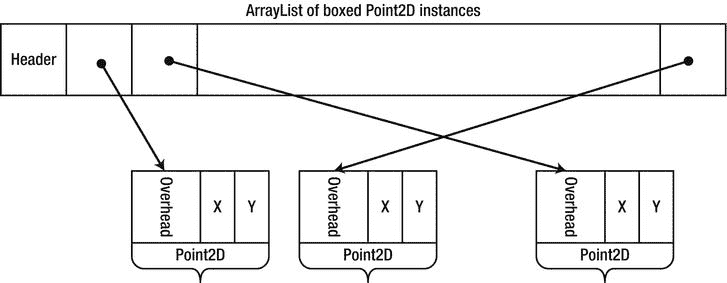
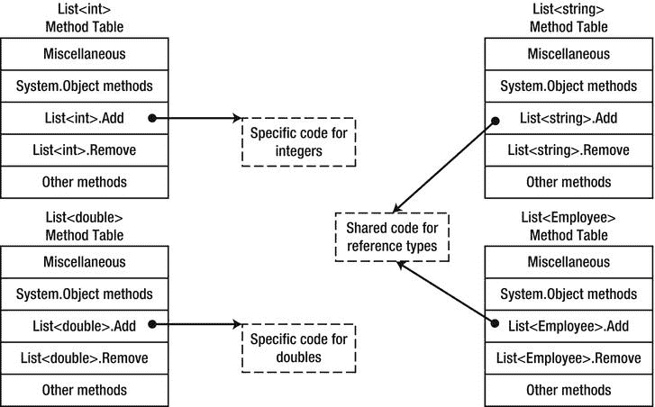
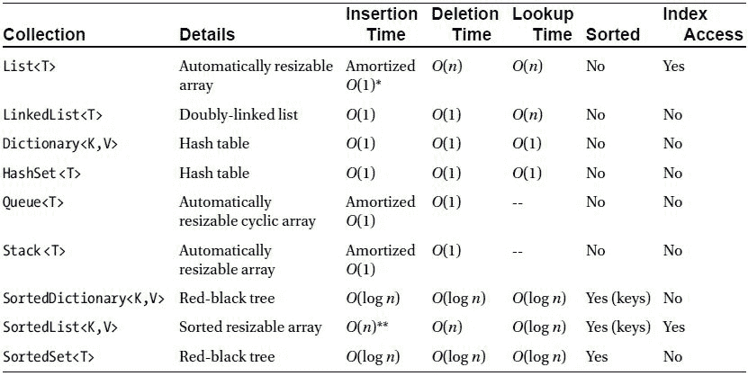
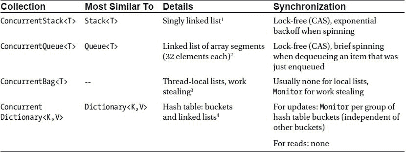
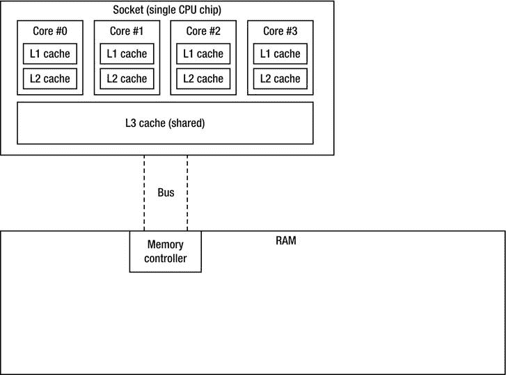
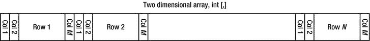
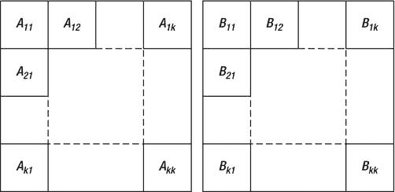
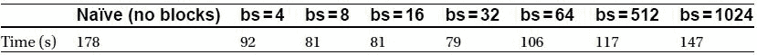
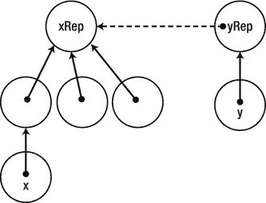
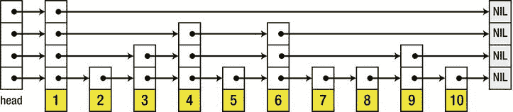

# 五、集合和泛型

几乎没有一个代码样本不使用列表<t>或字典 <k>这样的集合。大型应用可能有成千上万个并发使用的集合实例。为您的需求选择正确的集合类型，或者尝试通过编写自己的集合类型来做得更好，可以为许多应用提供显著的性能优势。因为截至。NET 2.0 中，集合与泛型类型的 CLR 实现密切相关，所以我们从泛型开始讨论。</k></t>

泛型

经常需要创建一个类或方法，可以很好地处理任何数据类型。多态和继承只能在一定程度上有所帮助；要求其参数完全泛型的方法被强制与 System 一起工作。对象，这导致了泛型编程在。之前的净值。NET 2.0:

*   类型安全 :如何在编译时验证泛型数据类型上的操作，并明确禁止任何可能在运行时失败的操作？
*   *不装箱* :当方法的参数为系统时，如何避免装箱值类型。对象引用？

这些都不是小问题。要了解原因，请考虑。NET 1.1，数组列表。下面是一个平凡的实现，尽管如此，它展示了上面提到的问题:

```cs
public class ArrayList : IEnumerable, ICollection, IList, ... {
  private object[] items;
  private int size;
  public ArrayList(int initialCapacity) {
   items = new object[initialCapacity];
  }
  public void Add(object item) {
   if (size < items.Length – 1) {
   items[size] = item;
   ++size;
   } else {
   //Allocate a larger array, copy the elements, then place ‘item’ in it
   }
  }
  public object this[int index] {
   get {
   if (index < 0 || index >= size) throw IndexOutOfBoundsException(index);
   return items[index];
   }
   set {
   if (index < 0 || index >= size) throw IndexOutOfBoundsException(index);
   items[index] = value;
   }
  }
  //Many more methods omitted for brevity
}
```

我们在整个代码中突出显示了 System。对象，它是集合所基于的“泛型”类型。尽管这可能看起来是一个完美有效的解决方案，但实际使用并不那么完美:

```cs
ArrayList employees = new ArrayList(7);
employees.Add(new Employee(“Kate”));
employees.Add(new Employee(“Mike”));
Employee first = (Employee)employees[0];
```

这种难看的对 Employee 的向下转换是必需的，因为 ArrayList 不保留任何关于其中元素类型的信息。此外，它不约束插入其中的对象具有任何共同的特征。考虑一下:

```cs
employees.Add(42);                              //Compiles and works at runtime!
Employee third = (Employee)employees[2];        //Compiles and throws an exception at runtime...
```

事实上，数字 42 不属于 employees 集合，但是我们没有指定 ArrayList 仅限于特定类型的实例。尽管可以创建一个 ArrayList 实现，将其项限制为特定类型，但这仍然是一个开销很大的运行时操作和一个类似 employees 的语句。Add(42)不会编译失败。

这就是*型安全*的问题；基于系统的“通用”集合。对象不能保证编译时类型安全并将所有检查(如果有)推迟到运行时。然而，从*性能*的角度来看，这可能是我们最不关心的——但事实证明，当涉及值类型时，会出现严重的性能问题。检查下面的代码，它使用了第 3 章中[的 Point2D](03.html) 结构(一个带有 X 和 Y 整数坐标的简单值类型):

```cs
ArrayList line = new ArrayList(1000000);
for (int i = 0; i < 1000000; ++i) {
  line.Add(new Point2D(i, i));
}
```

插入 ArrayList 的 Point2D 的每个实例都被装箱，因为它的 Add 方法接受引用类型参数(System。对象)。对于 boxed Point2D 对象，这会导致 1，000，000 次堆分配的成本。正如我们在第 3 章中看到的，在 32 位堆上，1，000，000 个 boxed Point2D 对象将占用 16，000，000 字节的内存(相比之下，普通值类型占用 8，000，000 字节的内存)。此外，数组列表中的条目引用数组至少有 1，000，000 个引用，这相当于另外 4，000，000 字节——总共 20，000，000 字节(见[图 5-1](#Fig1) ),其中 8，000，000 字节就足够了。事实上，正是这个问题导致我们放弃了将 Point2D 作为引用类型的想法；ArrayList 向我们强加了一个只能很好地处理引用类型的集合！



[图 5-1](#_Fig1) 。包含装箱的 Point2D 对象的 ArrayList 存储占用额外内存的引用，并迫使 Point2D 对象在堆上装箱，这也增加了它们的开销

还有改进的空间吗？事实上，我们可以为二维点编写一个专门的集合，如下所示(尽管我们还必须为点编写专门的 IEnumerable、ICollection 和 IList 接口...).它与“泛型”数组列表完全相同，但是在我们之前有 object 的地方有 Point2D:

```cs
public class Point2DArrayList : IPoint2DEnumerable, IPoint2DCollection, IPoint2DList, ... {
  private Point2D[] items;
  private int size;
  public ArrayList(int initialCapacity) {
   items = new Point2D[initialCapacity];
  }
  public void Add(Point2D item) {
   if (size < items.Length – 1) {
   items[size] = item;
   ++size;
   } else {
   //Allocate a larger array, copy the elements, then place ‘item’ in it
   }
  }
  public Point2D this[int index] {
   get {
   if (index < 0 || index >= size) throw IndexOutOfBoundsException(index);
   return items[index];
   }
   set {
   if (index < 0 || index >= size) throw IndexOutOfBoundsException(index);
   items[index] = value;
   }
  }
  //Many more methods omitted for brevity
}
```

一个类似的 Employee 对象的专用集合可以解决我们前面考虑过的类型安全问题。不幸的是，为每种数据类型开发一个专门的集合几乎是不切实际的。这正是语言编译器的作用。NET 2.0——允许在类和方法中使用泛型数据类型，同时实现类型安全并取消装箱。

。网络泛型

泛型类和方法允许*真正的*泛型代码，它不会退回到系统。对象，另一方面不需要对每种数据类型进行专门化。下面是一个泛型类型的草图，List < T > ，它取代了我们之前的 ArrayList 实验，并解决了类型安全和装箱问题:

```cs
public class List<T> : IEnumerable<T>, ICollection<T>, IList<T>, ... {
  private T[] items;
  private int size;
  public List(int initialCapacity) {
   items = new T[initialCapacity];
  }
  public void Add(T item) {
   if (size < items.Length – 1) {
   items[size] = item;
   ++size;
   } else {
   //Allocate a larger array, copy the elements, then place ‘item’ in it
   }
  }
  public T this[int index] {
   get {
   if (index < 0 || index >= size) throw IndexOutOfBoundsException(index);
   return items[index];
   }
   set {
   if (index < 0 || index >= size) throw IndexOutOfBoundsException(index);
   items[index] = value;
   }
   }
   //Many more methods omitted for brevity
}
```

 **注**如果你对 C# 泛型的语法一点都不熟悉，Jon Skeet 的《C# 深度》(Manning，2010)是一本很好的教材。在本章的其余部分，我们假设你已经编写了一个泛型类或者至少使用了泛型类，比如。NET Framework 的集合。

如果您曾经编写过泛型类或方法，您就会知道基于 System 转换伪泛型代码是多么容易。对象实例到真正的通用代码，带有一个或多个*通用类型参数*。通过在必要的地方替换*泛型类型参数*，使用泛型类和方法也异常容易:

```cs
List<Employee> employees = new List<Employee>(7);
employees.Add(new Employee(“Kate”));
Employee first = employees[0];    //No downcast required, completely type-safe
employees.Add(42);                //Does not compile!
List<Point2D> line = new List<Point2D>(1000000);
for (int i = 0; i < 1000000; ++i) {
  line.Add(new Point2D(i, i));    //No boxing, no references stored
}
```

几乎神奇的是，泛型集合是类型安全的(因为它不允许不适当的元素存储在其中)，并且不需要对值类型进行装箱。甚至内部存储——items 数组——也相应地适应泛型类型参数:当 T 是 Point2D 时，items 数组是 Point2D[]，它存储*值*而不是引用。稍后我们将展示这种魔力，但是现在我们有一个有效的语言级解决方案来解决泛型编程的基本问题。

当我们需要通用参数的一些额外功能时，这个解决方案本身似乎是不够的。考虑一个在排序数组中执行二分搜索法的方法。一个完全通用的版本将无法进行搜索，因为系统。对象没有配备任何与比较相关的工具:

```cs
public static int BinarySearch<T>(T[] array, T element) {
  //At some point in the algorithm, we need to compare:
  if (array[x] < array[y]) {
   ...
  }
}
```

系统。对象没有静态操作符<，这就是这个方法无法编译的原因！事实上，我们必须向编译器证明，对于我们提供给方法的每一个泛型类型参数，它都能够解析对它的所有方法调用(包括操作符)。这就是通用约束进入画面的地方。

通用约束

泛型约束向编译器表明，在使用泛型类型时，只允许将某些类型作为泛型类型参数。有五种类型的约束:

```cs
//T must implement an interface:
public int Format(T instance) where T : IFormattable {
  return instance.ToString(“N”, CultureInfo.CurrentUICulture);
  //OK, T must have IFormattable.ToString(string, IFormatProvider)
}
//T must derive from a base class:
public void Display<T>(T widget) where T : Widget {
  widget.Display(0, 0);
  //OK, T derives from Widget which has the Display(int, int) method
}
//T must have a parameterless constructor:
public T Create<T>() where T : new() {
  return new T();
  //OK, T has a parameterless constructor
  //The C# compiler compiles ’new T()’ to a call to Activator.CreateInstance<T>(),
  //which is sub-optimal, but there is no IL equivalent for this constraint
}
//T must be a reference type:
public void ReferencesOnly<T>(T reference) where T : class

//T must be a value type:
public void ValuesOnly<T>(T value) where T : struct

```

如果我们重温一下二分搜索法的例子，接口约束被证明是非常有用的(事实上，它是最常用的一种约束)。具体来说，我们可以要求 T 实现 IComparable ，并使用 IComparable 比较数组元素。比较法。但是，IComparable 不是泛型接口，它的 CompareTo 方法接受一个系统。对象参数，导致值类型的装箱成本。按理说，应该有一个通用版本的 IComparable，IComparable < T >，它在这里完美地服务了:

```cs
//From the .NET Framework:
public interface IComparable<T> {
  int CompareTo(T other);
}
public static int BinarySearch<T>(T[] array, T element) where T : IComparable<T> {
  //At some point in the algorithm, we need to compare:
  if (array[x].CompareTo(array[y]) < 0) {
   ...
  }
}
```

这个二分搜索法版本在比较值类型实例时不会引发装箱，可以处理任何实现 IComparable <t>的类型(包括所有内置的原始类型、字符串和许多其他类型)，并且是完全类型安全的，因为它不需要运行时发现比较功能。</t>

接口约束和等式<t>和</t>

在第 3 章中，我们已经看到了值类型的关键性能优化是覆盖 Equals 方法并实现 IEquatable < T >接口。为什么这个界面如此重要？考虑以下代码:

公共静态 void CallEquals <t>(T 实例){</t>

实例。Equals(实例)；

}

方法内部的 Equals 调用遵从对 Object 的虚拟调用。Equals，它接受一个系统。对象参数并导致对值类型进行装箱。这是 C# 编译器认为保证在我们使用的每个 T 上都存在的唯一选择。如果我们想让编译器相信 T 有一个接受 T 的 Equals 方法，我们需要使用一个显式约束:

//从。NET 框架:

公共接口资格 <t>{</t>

bool 等于(T other)；

}

public static void call equals<t>(T instance)**其中 T : IEquatable < T >**</t>

实例。Equals(实例)；

}

最后，您可能希望允许调用者使用任何类型作为 T，但是如果 T 提供了 IEquatable <t>实现，那么就遵从它，因为它不需要装箱，而且效率更高。List <t>在这方面做的事情相当有趣。如果 List <t>在其泛型类型参数上需要 IEquatable < T >约束，那么对于没有实现该接口的类型来说就没有用了。因此，列表< T >没有等式< T >约束。为了实现 Contains 方法(以及其他需要比较对象是否相等的方法)，List < T >依赖于一个*相等比较器*——抽象 EqualityComparer < T >类的具体实现(顺便提一下，它实现了 IEqualityComparer < T >接口，由一些集合直接使用，包括 HashSet<T>T6】和 Dictionary < K，V >)。</t></t></t>

当列出<t>。Contains 需要在集合的两个元素上调用 Equals，它使用 EqualityComparer <t>。默认静态属性检索适合于比较 T 的实例的相等比较器实现，并调用其 Equals(T，T)虚方法。这是平等比较器<t>。CreateComparer 私有静态方法，该方法在第一次请求相等比较器时创建适当的相等比较器，随后将其缓存在静态字段中。当 CreateComparer 看到 T 实现了 IEquatable <t>时，它返回 genericequitycomparer<t>的一个实例，这个实例有一个 IEquatable <t>约束，通过接口调用 Equals。否则，CreateComparer 将求助于 ObjectEqualityComparer <t>类，该类对 T 没有约束，并调用 Object 提供的 Equals 虚拟方法。</t></t></t></t></t></t></t>

List <t>用于等式检查的这个技巧也可以用于其他目的。当约束可用时，您的泛型类或方法可以使用不依赖于运行时类型检查的潜在更有效的实现。</t>

 **提示**如您所见，没有通用的约束来表达数学运算符，如加法或乘法。这意味着您不能编写在泛型参数上使用表达式(如 a+b)的泛型方法。编写泛型数值算法的标准解决方案是使用一个助手结构，该结构通过所需的算术运算实现 IMath < T >接口 ，并在泛型方法中实例化该结构。有关更多详细信息，请参见 Rüdiger Klaehn 的 CodeProject 文章“使用泛型进行计算”，可在[http://www . code project . com/Articles/8531/Using-generics-for-calculation](http://www.codeproject.com/Articles/8531/Using-generics-for-calculations)获得。

在研究了 C# 中泛型的大多数语法特性之后，我们转向它们的运行时实现。在我们关心这个问题之前，最重要的是问一下*是否是*泛型的运行时表示——我们很快就会看到，C++模板,一种类似的机制，没有运行时表示可言。如果你看看反射在运行时对泛型类型*所能做的奇迹*，这个问题很容易回答:

```cs
Type openList = typeof(List<>);
Type listOfInt = openList.MakeGenericType(typeof(int));
IEnumerable<int> ints = (IEnumerable<int>)Activator.CreateInstance(listOfInt);

Dictionary<string, int> frequencies = new Dictionary<string, int>();
Type openDictionary = frequencies.GetType().GetGenericTypeDefinition();
Type dictStringToDouble = openDictionary.MakeGenericType(typeof(string), typeof(double));
```

如您所见，我们可以从现有的泛型类型动态创建泛型类型，并参数化“开放”泛型类型以创建“封闭”泛型类型的实例。这表明泛型是一等公民，并且有运行时表示，我们现在将对此进行研究。

CLR 泛型的实现

CLR 泛型的语法特征非常类似于 Java 泛型，甚至有点类似于 C++模板。然而，事实证明，它们的内部实现和对使用它们的程序的限制与 Java 和 C++非常不同。为了理解这些差异，我们应该简要回顾一下 Java 泛型和 C++模板。

Java 泛型

Java 中的泛型类可以有泛型类型参数，甚至还有一个与。NET 必须提供的(有界类型参数和通配符)。例如，下面是将我们的列表 <t>转换成 Java 的第一次尝试:</t>

```cs
public class List<E> {
  private E[] items;
  private int size;
  public List(int initialCapacity) {
   items = new E[initialCapacity];
  }
  public void Add(E item) {
   if (size < items.Length – 1) {
   items[size] = item;
   ++size;
   } else {
   //Allocate a larger array, copy the elements, then place ‘item’ in it
   }
  }
  public E getAt(int index) {
   if (index < 0 || index >= size) throw IndexOutOfBoundsException(index);
   return items[index];
  }
  //Many more methods omitted for brevity
}
```

不幸的是，这段代码无法编译。具体来说，表达式 new E[initialCapacity]在 Java 中是不合法的。原因与 Java 编译通用代码的方式有关。Java 编译器删除了所有提到的泛型类型参数，并用 java.lang.Object 替换它们，这个过程称为*类型擦除* 。因此，运行时只有一种类型——List、 *raw* 类型——并且所提供的关于泛型类型参数的任何信息都将丢失。(公平地说，通过使用类型擦除，Java 保留了与泛型之前创建的库和应用的二进制兼容性。NET 2.0 不提供。NET 1.1 代码。)

然而，并不是所有的都失去了。通过使用对象数组 来代替，我们可以协调编译器，并且仍然有一个在编译时工作良好的类型安全泛型类:

```cs
public class List<E> {
  private Object[] items;
  private int size;
  public void List(int initialCapacity) {
   items = new Object[initialCapacity];
  }
  //The rest of the code is unmodified
}
List<Employee> employees = new List<Employee>(7);
employees.Add(new Employee(“Kate”));
employees.Add(42); //Does not compile!
```

然而，在 CLR 中采用这种方法引发了一个问题:值类型会变成什么样？引入泛型的两个原因之一是我们想不惜任何代价避免装箱。将值类型插入对象数组需要装箱，这是不可接受的。

C++模板

与 Java 泛型相比，C++模板可能看起来很吸引人。(它们也极其强大:你可能听说过模板解析机制 本身就是图灵完备的。)C++编译器不执行类型擦除——恰恰相反——也不需要约束，因为编译器很乐意编译任何妨碍它的东西。让我们从列表示例开始，然后考虑约束会发生什么:

```cs
template <typename T>
class list {
private:
  T* items;
  int size;
  int capacity;
public:
  list(int initialCapacity) : size(0), capacity(initialCapacity) {
   items = new T[initialCapacity];
  }
  void add(const T& item) {
   if (size < capacity) {
   items[size] = item;
   ++size;
   } else {
   //Allocate a larger array, copy the elements, then place ‘item’ in it
   }
  }
  const T& operator[](int index) const {
   if (index < 0 || index >= size) throw exception(“Index out of bounds”);
   return items[index];
  }
  //Many more methods omitted for brevity
};
```

列表模板类 是完全类型安全的:*模板的每个*实例化都会创建一个新类，它使用模板定义作为...模板。虽然这发生在引擎盖下，这里有一个它*可能*样子的例子:

```cs
//Original C++ code:
list<int> listOfInts(14);
//Expanded by the compiler to:
class __list__int {
private:
  int* items;
  int size;
  int capacity;
public:
  __list__int(int initialCapacity) : size(0), capacity(initialCapacity) {
   items = new int[initialCapacity];
  }
};
__list__int listOfInts(14);
```

请注意，add 和 operator[]方法没有扩展——调用代码没有使用它们，编译器只生成模板定义中用于特定实例化的部分。还要注意，编译器不会从模板定义中生成任何东西；它在生成任何代码之前等待特定的实例化。

这就是为什么 C++模板中不需要约束。回到我们的二分搜索法例子，下面是一个非常合理的实现:

```cs
template <typename T>
int BinarySearch(T* array, int size, const T& element) {
  //At some point in the algorithm, we need to compare:
  if (array[x] < array[y]) {
   ...
  }
}
```

不需要向 C++编译器证明什么。毕竟模板定义是没有意义的；编译器会仔细等待任何实例化:

```cs
int numbers[10];
BinarySearch(numbers, 10, 42); //Compiles, int has an operator <
class empty {};
empty empties[10];
BinarySearch(empties, 10, empty()); //Does not compile, empty does not have an operator <
```

虽然这种设计非常诱人，但是 C++模板有着不吸引人的成本和限制 ，这对于 CLR 泛型来说是不可取的:

*   因为模板扩展发生在编译时，所以无法在不同的二进制文件之间共享模板实例。例如，加载到同一个进程中的两个 dll 可能有不同的 list <int>编译版本。这消耗了大量的内存，导致编译时间过长，而这正是 C++的著名之处。</int>
*   出于同样的原因，两个不同二进制文件中的模板实例化被认为是不兼容的。从 dll 导出模板实例化没有干净和受支持的机制(比如返回 list <int>的导出函数)。</int>
*   没有办法生成包含模板定义的二进制库。模板定义仅存在于源代码中，作为头文件，可以# 包含在 C++文件中。

泛型内部

在充分考虑了 Java 泛型 C++模板的设计之后，我们可以更好地理解 CLR 泛型的实现选择。CLR 泛型实现如下。泛型类型——即使是开放类型，如 List<>——也是一流的运行时公民。每个通用类型和系统都有一个方法表和一个 EEClass(见第 3 章)。也可以生成类型实例。泛型类型可以从程序集中导出，并且在编译时只存在泛型类型的一个定义。泛型类型在编译时不会扩展，但是正如我们所看到的，编译器会确保在泛型类型参数实例上尝试的任何操作都与指定的泛型约束兼容。

当 CLR 需要创建一个封闭泛型类型的实例时，比如 List <int>，它会基于开放类型创建一个方法表和 EEClass。和往常一样，方法表包含方法指针，这些指针由 JIT 编译器动态编译。然而，这里有一个至关重要的优化:具有引用类型参数的封闭泛型类型上的已编译方法体可以共享。为了消化这一点，我们来考虑一下列表<t>。当 T 是引用类型时，添加方法并尝试将其编译为 x86 指令:</t></int>

```cs
//C# code:
public void Add(T item) {
  if (size < items.Length – 1) {
   items[size] = item;
   ++size;
  } else {
   AllocateAndAddSlow(item);
  }
}
; x86 assembly when T is a reference type
; Assuming that ECX contains ‘this’ and EDX contains ‘item’, prologue and epilogue omitted
mov eax, dword ptr [ecx+4] ; items
mov eax, dword ptr [eax+4] ; items.Length
dec eax
cmp dword ptr [ecx+8], eax ; size < items.Length - 1
jge AllocateAndAddSlow
mov eax, dword ptr [ecx+4]
mov ebx, dword ptr [ecx+8]
mov dword ptr [eax+4*ebx+4], edx ; items[size] = item
inc dword ptr [eax+8] ; ++size
```

很明显，该方法的代码不以任何方式依赖于 T，并且对任何引用类型都同样有效。这个观察允许 JIT 编译器保存资源(时间和内存)并共享 List <t>的方法表指针。在 T 是引用类型的所有方法表中添加。</t>

 **注**这个想法需要一些进一步的完善，我们不会执行。例如，如果方法体包含一个新的 T[10]表达式，它将需要为每个 T 提供一个单独的代码路径，或者至少需要一种在运行时获取 T 的方法(例如，通过传递给方法的附加隐藏参数)。此外，我们还没有考虑约束如何影响代码生成——但是现在您应该相信，通过基类调用接口方法或虚方法需要相同的代码，而不管类型如何。

同样的想法不适用于值类型。例如，当 T 很长时，赋值语句 items[size] = item 需要不同的指令，因为必须复制 8 个字节而不是 4 个字节。更大的值类型甚至可能需要不止一条指令；等等。

为了在一个简单的设置中演示图 5-2 ，我们可以使用 SOS 来检查封闭泛型类型的方法表，这些方法表都是同一个开放泛型类型的实现。例如，考虑一个只有 Push 和 Pop 方法的 BasicStack < T >类，如下所示:



[图 5-2](#_Fig2) 。列表< T >的引用类型实现的添加方法表条目具有指向单个方法实现的共享指针，而值类型实现的条目具有单独的代码版本

```cs
class BasicStack<T> {
   private T[] items;
   private int topIndex;
   public BasicStack(int capacity = 42) {
   items = new T[capacity];
   }
   public void Push(T item) {
   items[topIndex++] = item;
   }
   public T Pop() {
   return items[--topIndex];
  }
}
```

基本堆栈<string>、基本堆栈<int>、基本堆栈<int>和基本堆栈<double>的方法表如下所示。注意，具有引用类型泛型类型参数的封闭类型的方法表条目(即代码地址)是共享的，而对于值类型则不是:</double></int></int></string>

```cs
0:004> !dumpheap –stat
...
00173b40 1 16 BasicStack`1[[System.Double, mscorlib]]
00173a98 1 16 BasicStack`1[[System.Int32, mscorlib]]
00173a04 1 16 BasicStack`1[[System.Int32[], mscorlib]]
001739b0 1 16 BasicStack`1[[System.String, mscorlib]]
...
0:004> !dumpmt -md 001739b0
EEClass: 001714e0
Module: 00172e7c
Name: BasicStack`1[[System.String, mscorlib]]
...
MethodDesc Table
   Entry MethodDe JIT Name
...
00260360 00173924 JIT BasicStack`1[[System.__Canon, mscorlib]].Push(System.__Canon)
00260390 0017392c JIT BasicStack`1[[System.__Canon, mscorlib]].Pop()
0:004> !dumpmt -md 00173a04
EEClass: 001714e0
Module: 00172e7c
Name: BasicStack`1[[System.Int32[], mscorlib]]
...
MethodDesc Table
   Entry MethodDe JIT Name
...
00260360 00173924 JIT BasicStack`1[[System.__Canon, mscorlib]].Push(System.__Canon)
00260390 0017392c JIT BasicStack`1[[System.__Canon, mscorlib]].Pop()
0:004> !dumpmt -md 00173a98
EEClass: 0017158c
Module: 00172e7c
Name: BasicStack`1[[System.Int32, mscorlib]]
...
MethodDesc Table
   Entry MethodDe JIT Name
...
002603c0 00173a7c JIT BasicStack`1[[System.Int32, mscorlib]].Push(Int32)
002603f0 00173a84 JIT BasicStack`1[[System.Int32, mscorlib]].Pop()
0:004> !dumpmt -md 00173b40
EEClass: 001715ec
Module: 00172e7c
Name: BasicStack`1[[System.Double, mscorlib]]
...
MethodDesc Table
   Entry MethodDe JIT Name
...
00260420 00173b24 JIT BasicStack`1[[System.Double, mscorlib]].Push(Double)
00260458 00173b2c JIT BasicStack`1[[System.Double, mscorlib]].Pop()
```

最后，如果我们检查实际的方法体，很明显引用类型版本根本不依赖于实际类型(它们所做的只是四处移动引用)，而值类型版本*依赖于类型。复制一个整数，毕竟不同于复制一个双浮点数。下面是 Push 方法的反汇编版本，突出显示了实际移动数据的行:*

```cs
0:004> !u 00260360
Normal JIT generated code
BasicStack`1[[System.__Canon, mscorlib]].Push(System.__Canon)
00260360 57                push    edi
00260361 56                push    push    esi
00260362 8b7104            push    mov     esi,dword ptr [ecx+4]
00260365 8b7908            push    mov     edi,dword ptr [ecx+8]
00260368 8d4701            push    lea     eax,[edi+1]
0026036b 894108            push    mov     dword ptr [ecx+8],eax
0026036e 52                push    edx
0026036f 8bce              push     mov    ecx,esi
00260371 8bd7              push     mov    edx,edi
00260373 e8f4cb3870        push    call    clr!JIT_Stelem_Ref (705ecf6c)
00260378 5e                push    pop     esi
00260379 5f                push    pop     edi
0026037a c3                push    ret    

0:004> !u 002603c0
Normal JIT generated code
BasicStack`1[[System.Int32, mscorlib]].Push(Int32)
002603c0 57          push   edi
002603c1 56          push   esi
002603c2 8b7104      mov    esi,dword ptr [ecx+4]
002603c5 8b7908      mov    edi,dword ptr [ecx+8]
002603c8 8d4701      lea    eax,[edi+1]
002603cb 894108      mov    dword ptr [ecx+8],eax
002603ce 3b7e04      cmp    edi,dword ptr [esi+4]
002603d1 7307        jae    002603da
002603d3 8954be08    mov    dword ptr [esi+edi*4+8],edx
002603d7 5e          pop    esi
002603d8 5f          pop    edi
002603d9 c3          ret    
002603da e877446170  call   clr!JIT_RngChkFail (70874856)
002603df cc    int    3

0:004> !u 00260420
Normal JIT generated code
BasicStack`1[[System.Double, mscorlib]].Push(Double)
00260420 56            push   esi
00260421 8b5104        mov    edx,dword ptr [ecx+4]
00260424 8b7108        mov    esi,dword ptr [ecx+8]
00260427 8d4601        lea    eax,[esi+1]
0026042a 894108        mov    dword ptr [ecx+8],eax
0026042d 3b7204        cmpyg  esi,dword ptr [edx+4]
00260430 730c          jae    0026043e
00260432 dd442408      fld    qword ptr [esp+8]
00260436 dd5cf208     fstp    qword ptr [edx+esi*8+8]
0026043a 5e           pop     esi
0026043b c20800       ret     8
0026043e e813446170   call    clr!JIT_RngChkFail (70874856)
00260443 cc    int    3
```

我们已经看到。NET 泛型实现在编译时是完全类型安全的。唯一要做的就是确定在泛型集合中使用值类型时不会产生装箱成本。事实上，因为 JIT 编译器为每个封闭的泛型类型编译单独的方法体，其中泛型类型参数是值类型，所以不需要装箱。

综上所述，。与 Java 泛型或 C++模板相比，NET 泛型提供了显著的优势。与 C++提供的狂野西部相比，泛型约束机制有些受限，但是跨程序集共享泛型类型带来的灵活性和按需生成(并共享)代码带来的性能优势是压倒性的。

收藏

那个。NET Framework 附带了大量的集合，本章的目的并不是对它们一一进行回顾，这是一项最好留给 MSDN 文档来完成的任务。但是，在选择集合时，需要考虑一些重要的因素，尤其是对性能敏感的代码。我们将在本节中探讨这些考虑事项。

 **注意**除了内置数组，一些开发者对使用任何集合类都很谨慎。数组非常不灵活，不可调整大小，因此很难高效地实现某些操作，但众所周知，它们是所有集合实现中开销最小的。只要你配备了良好的测量工具，比如我们在[第二章](02.html)中考虑的那些工具，你就不应该害怕使用内置集合。的内部实现细节。本节中讨论的 NET 集合也将有助于做出好的决策。琐事的一个例子:在 foreach 循环中迭代 List < T >比在 for 循环中花费的时间稍长，因为 foreach- enumeration 必须验证底层集合在整个循环中没有被更改。

首先，回忆一下附带的集合类。NET 4.5(不包括我们单独讨论的并发集合)及其运行时性能特征。比较集合的插入、删除和查找性能是获得满足您需求的最佳候选项的合理方法。下表仅列出了泛型集合(非泛型对应集合已在中停用)。NET 2.0):

我们可以从系列设计中学到一些东西，包括入选的系列选择。NET 框架，以及一些集合的实现细节:

*   不同系列的存储要求差别很大。在本章的后面，我们将通过 List<T>T1】和 LinkedList < T >来了解内部集合布局如何影响缓存性能。又如 SortedSet < T >和 List < T >类；前者是根据具有用于 *n* 元素的 *n* 节点的二叉查找树来实现的，而后者是根据 *n* 元素的连续阵列来实现的。在 32 位系统上，在一个有序集合中存储大小为 *s* 的 *n* 值类型需要(20 + *s* ) *n* 字节的存储，而链表只需要 *sn* 字节。
*   一些集合对它们的元素有额外的要求,以达到令人满意的性能。例如，正如我们在第 3 章中看到的，任何哈希表的实现都需要访问哈希表元素的良好哈希代码。
*   (1)成本归集的摊销*在执行得好的情况下，很难与* (1)成本归集的真实*区分开来。毕竟很少有程序员(和程序！)都警惕 List < T >的事实。Add 有时会导致大量的内存分配开销，并且运行的时间与列表元素的数量成线性关系。摊销时间分析是一个有用的工具；它已经被用来证明许多算法和集合的最优性界限。*
*   无处不在的时空权衡出现在集合设计中，甚至出现在选择将哪些集合包含在。NET 框架。SortedList < K，V >以线性时间插入和删除为代价，提供了非常紧凑和有序的元素存储，而 SortedDictionary < K，V > 占用了更多的空间，并且是无序的，但提供了所有操作的对数界限。

 **注意**没有比提到字符串更好的机会了，字符串也是一个简单的集合类型——字符的集合。系统内部。String 类实现为不可变的、不可调整大小的字符数组。对字符串的所有操作都会导致一个新对象的创建。这就是为什么通过将数千个较小的字符串连接在一起来创建长字符串是非常低效的。系统。StringBuilder 类解决了这些问题，因为它的实现类似于 List < T >，当它变异时，它的内部存储加倍。每当您需要从大量(或未知)较小的字符串中构造一个字符串时，请使用 StringBuilder 进行中间操作。

集合类的丰富性可能看起来让人不知所措，但是有时没有一个内置集合是合适的。我们将在后面考虑几个例子。直到。NET 4.0 中，对内置集合抱怨的一个常见原因是缺乏线程安全性:表 5-1 中的集合对于多线程的并发访问都是不安全的。英寸 NET 4.0 系统。Concurrent 命名空间引入了几个新的集合，它们是为并发编程环境而全新设计的。

[表 5-1。](#_Tab1)收藏在。NET 框架



*本例中的“摊销”是指有些操作可能花费 *O* ( *n* )时间，但大多数操作将花费 *O* (1)时间，因此跨越 *n* 操作的平均时间为 *O* (1)。

**除非数据按排序顺序插入，在这种情况下， *O* (1)。

并发收款

随着任务并行库的出现。NET 4.0 之后，对线程安全集合的需求变得更加迫切。在第 6 章中，我们将看到几个从多线程并发访问数据源或输出缓冲区的例子。现在，我们将重点放在可用的并发集合及其性能特征上，这与我们之前研究的标准(非线程安全)集合的精神是一致的。

表 5-2。中的并发集合。NET 框架



“详细信息”栏的说明:

1.在第 6 章中，我们将看到一个使用 CAS 的无锁栈的草图实现，并讨论 CAS 原子原语本身的优点。

2.ConcurrentQueue <t>类管理数组段的链表，这允许它用有限的内存模拟无限的队列。将项目入队或出队只涉及将指针递增到数组段中。在几个位置需要同步，例如，以确保在入队线程完成入队操作之前，项目不会出队。但是，所有同步都是基于 CAS 的。</t>

3.ConcurrentBag <t>类管理一个没有特定顺序的项目列表。项目存储在线程本地列表中；向线程本地列表添加或移除项目是在列表的开头完成的，通常不需要同步。当线程必须从其他线程的列表中窃取项目时，它们会从列表的尾部窃取，只有当列表中的项目少于三个时，才会导致争用。</t>

4.ConcurrentDictionary <k>使用一个经典的散列表实现链接(链表挂在每个桶上；关于哈希表结构的一般描述，请参见第 3 章。锁定是在存储桶级别管理的——特定存储桶上的所有操作都需要一个锁，锁的数量由构造函数的 concurrencyLevel 参数决定。与不同锁相关联的存储桶上的操作可以无争用地并发进行。最后，所有的读操作都不需要任何锁，因为所有的变异操作都是原子性的(例如，向悬挂在桶上的列表中插入一个新项)。</k>

尽管大多数并发集合与其非线程安全的对应集合非常相似，但它们的 API 略有不同，这是由它们的并发特性决定的。例如，ConcurrentDictionary <k>类具有 helper 方法，可以极大地减少所需的锁数量，并解决在不小心访问字典时可能出现的微妙竞争情况:</k>

```cs
//This code is prone to a race condition between the ContainsKey and Add method calls:
Dictionary<string, int> expenses = ...;
if (!expenses.ContainsKey(“ParisExpenses”)) {
  expenses.Add(“ParisExpenses”, currentAmount);
} else {
  //This code is prone to a race condition if multiple threads execute it:
  expenses[“ParisExpenses”] += currentAmount;
}
//The following code uses the AddOrUpdate method to ensure proper synchronization when
//adding an item or updating an existing item:
ConcurrentDictionary<string, int> expenses = ...;
expenses.AddOrUpdate(“ParisExpenses”, currentAmount, (key, amount) => amount + currentAmount);
```

AddOrUpdate 方法保证了围绕复合“添加或更新”操作的必要同步；有一个类似的 GetOrAdd helper 方法，它可以检索一个现有的值，或者如果它不存在就将其添加到字典中，然后返回它。

高速缓存注意事项

选择正确的集合不仅仅是考虑其性能。对于 CPU 受限的应用来说，数据在内存中的布局方式通常比任何其他标准都更为关键，集合对这种布局有很大的影响。仔细检查内存中的数据布局背后的主要因素是 CPU 缓存。

现代系统配有大容量的主存储器。8gb 内存在中档工作站或游戏笔记本电脑上是相当标准的。快速 DDR3 SDRAM 内存单元的内存访问延迟为 15 ns，理论传输速率为 15 GB/s。另一方面，快速处理器每秒可发出数十亿条指令；从理论上讲，在等待内存访问时拖延 15 ns 可以阻止几十条(有时甚至上百条)CPU 指令的执行。内存访问停顿是一种被称为*撞上内存墙* 的现象。

为了让应用远离这道墙，现代处理器配备了几级*高速缓冲存储器*，其内部特征与主存储器不同，往往非常昂贵且相对较小。例如，作者的英特尔 i7-860 处理器配备了三个高速缓存级别(参见[图 5-3](#Fig3) ):



[图 5-3](#_Fig3) 。英特尔 i7-860 高速缓存、内核和内存关系示意图

*   用于程序指令的一级高速缓存，32 KB，每个内核一个(总共 4 个高速缓存)。
*   用于数据的一级缓存，32 KB，每个内核一个(总共 4 个缓存)。
*   数据的二级缓存，256 KB，每个内核一个(总共 4 个缓存)。
*   用于数据的 3 级缓存，8 MB，共享(共 1 个缓存)。

当处理器试图访问一个内存地址时，它首先检查数据是否已经在它的 L1 缓存中。如果是，则从缓存中满足内存访问，这需要 5 个 CPU 周期(这称为*缓存命中* )。如果不是，则检查 L2 缓存；满足来自 L2 高速缓存的访问需要 10 个周期。类似地，满足 L3 缓存的访问需要 40 个周期。最后，如果数据不在任何一级高速缓存中，处理器将暂停系统的主内存(这被称为*高速缓存未命中*)。当处理器访问主存储器时，它读取的不是单个字节或字，而是一个*缓存行* ，在现代系统中，它由 32 或 64 个字节组成。访问同一高速缓存行上的任何字都不会涉及另一次高速缓存未命中，直到该行被从高速缓存中逐出。

虽然这种描述并没有公正对待 SRAM 高速缓存和 DRAM 存储器如何工作的真正硬件复杂性，但它为思考和讨论我们的高级软件算法如何受到存储器中数据布局的影响提供了足够的素材。我们现在考虑一个简单的例子，它涉及单个内核的高速缓存；在第 6 章中，我们将看到多处理器程序会因不恰当地利用多核缓存而遭受额外的性能损失。

假设手头的任务是遍历一个大的整数集合，并对它们执行一些聚合，比如求它们的和或平均值。下面是两种选择；一个从 LinkedList < int >中访问数据，另一个从整数数组(int[])中访问数据，其中两个是内置的。净收藏。

```cs
LinkedList<int> numbers = new LinkedList<int>(Enumerable.Range(0, 20000000));
int sum = 0;
for (LinkedListNode<int> curr = numbers.First; curr != null; curr = curr.Next) {
  sum += curr.Value;
}
int[] numbers = Enumerable.Range(0, 20000000).ToArray();
int sum = 0;
for (int curr = 0; curr < numbers.Length; ++curr) {
  sum += numbers[curr];
}
```

在上面提到的系统上，第二个版本的代码运行速度比第一个版本快 2 倍。这是一个不可忽略的差异，如果您只考虑发出的 CPU 指令的数量，您可能不相信应该有任何差异。毕竟，遍历链表需要从一个节点移动到下一个节点，而遍历数组需要在数组中增加一个索引。(事实上，如果没有 JIT 优化，访问数组元素也需要范围检查，以确保索引在数组的边界内。)

```cs
; x86 assembly for the first loop, assume ‘sum’ is in EAX and ‘numbers’ is in ECX
xor eax, eax
mov ecx, dword ptr [ecx+4] ; curr = numbers.First
test ecx, ecx
jz LOOP_END
LOOP_BEGIN:
add eax, dword ptr [ecx+10] ; sum += curr.Value
mov ecx, dword ptr [ecx+8] ; curr = curr.Next
test ecx, ecx
jnz LOOP_BEGIN ; total of 4 instructions per iteration

LOOP_END:
...
; x86 assembly for the second loop, assume ‘sum’ is in EAX and ‘numbers’ is in ECX
mov edi, dword ptr [ecx+4] ; numbers.Length
test edi, edi
jz LOOP_END
xor edx, edx ; loop index
LOOP_BEGIN:
add eax, dword ptr [ecx+edx*4+8] ; sum += numbers[i], no bounds check
inc edx
cmp esi, edx
jg LOOP_BEGIN ; total of 4 instructions per iteration

LOOP_END:
...
```

考虑到这两个循环的代码生成 (并禁止优化，例如使用 SIMD 指令遍历内存中连续的数组)，很难通过只检查执行的指令来解释显著的性能差异。事实上，我们必须分析这段代码的内存访问模式，才能得出任何可接受的结论。

在这两个循环中，每个整数只被访问一次，缓存考虑似乎并不重要，因为没有可重用的数据可以从缓存命中中受益。尽管如此，数据在内存中的布局方式极大地影响了这个程序的性能——不是因为数据被重用，而是因为它被放入内存的方式。当访问数组元素时，高速缓存行开始处的高速缓存未命中会将 16 个连续整数带入高速缓存(高速缓存行= 64 字节= 16 个整数)。因为数组访问是顺序的，所以接下来的 15 个整数现在在缓存中，可以被访问而不会出现缓存缺失。这是一个近乎理想的场景，缓存缺失率为 1:16。另一方面，当访问链接列表元素时，在高速缓存行开始的高速缓存未命中可以将最多 3 个连续的链接列表节点带入高速缓存*，1:4 的高速缓存未命中比率！(一个节点由后向指针、前向指针和整数数据组成，在 32 位系统上占用 12 个字节；引用类型头使计数达到每个节点 20 个字节。)*

高得多的缓存缺失率是我们上面测试的两段代码之间的大部分性能差异的原因。此外，我们假设所有链表节点在内存中顺序定位的理想场景，只有在它们被同时分配且没有其他分配发生的情况下才会出现这种情况，这是相当不可能的。如果链表节点在内存中的分布不太理想，缓存未命中比率会更高，性能会更差。

展示高速缓存相关效应的另一方面的结论性实例是通过分块的矩阵乘法的已知算法。矩阵乘法(在讨论 C++ AMP 时，我们将在第 6 章中再次讨论)是一个相当简单的算法，它可以从 CPU 缓存中受益匪浅，因为元素可以多次重用。下面是简单的算法实现:

```cs
public static int[,] MultiplyNaive(int[,] A, int[,] B) {
  int[,] C = new int[N, N];
  for (int i = 0; i < N; ++i)
   for (int j = 0; j < N; ++j)
   for (int k = 0; k < N; ++k)
   C[i, j] += A[i, k] * B[k, j];
  return C;
}
```

在内部循环的中心，存在第一矩阵的第 *i* 行与第二矩阵的第 *j* 列的标量积；遍历整个第 *i* 行和第 *j* 列。缓存重用的可能性源于这样一个事实，即通过重复遍历第一个矩阵的第 *i* 行来计算输出矩阵中的第 *i* 行。相同的元素被多次重复使用。第一个矩阵以一种非常缓存友好的方式被遍历:它的第一行被完全迭代 *N* 次，然后它的第二行被完全迭代 *N* 次，依此类推。但是这并没有帮助，因为在外部循环使用迭代 *i* 完成后，该方法不再使用第 *i* 行。不幸的是，第二个矩阵是以一种非常不利于缓存的方式迭代的:它的第一个*列*被完全迭代了 *N* 次，然后是它的第二个*列*，依此类推。(这种缓存不友好的原因是矩阵，一个 int[，]，是以行优先的顺序存储在内存中的，如图 5-4 所示。)



[图 5-4](#_Fig4) 。二维数组的内存布局(int[，])。在内存中，行是连续的，列不是

如果高速缓存足够大以容纳整个第二矩阵，那么在外部循环的单次迭代之后，整个第二矩阵将在高速缓存中，并且以列优先顺序对其的后续访问仍将从高速缓存中得到满足。然而，如果第二个矩阵不适合高速缓存，高速缓存未命中将非常频繁地发生:元素 *(i，j)* 的高速缓存未命中将产生包含来自行 *i* 的元素但不包含来自列 *j* 的额外元素的高速缓存行，这意味着每次访问都有高速缓存未命中！

分块矩阵乘法引入了以下思想。将两个矩阵相乘可以通过上面的简单算法来实现，或者将它们分割成更小的矩阵(块)，将这些块相乘，然后对结果执行一些额外的运算。



[图 5-5](#_Fig5) 。以块的形式给出矩阵 A 和 B，每个矩阵有 k × k 个块

具体来说，如果矩阵 *A* 和 *B* 以分块形式给出，如图[图 5-5](#Fig5) ，那么矩阵 *C* = *AB* 可以分块计算，这样*C*<sub>*ij*</sub>=*A*<sub>*i1*</sub>*B*<sub><sub>...+*A*<sub>*ik*</sub>*B*<sub>*kj*</sub>。在实践中，这会导致以下代码:</sub></sub>

```cs
public static int[,] MultiplyBlocked(int[,] A, int[,] B, int bs) {
  int[,] C = new int[N, N];
  for (int ii = 0; ii < N; ii += bs)
   for (int jj = 0; jj < N; jj += bs)
     for (int kk = 0; kk < N; kk += bs)
      for (int i = ii; i < ii + bs; ++i)
        for (int j = jj; j < jj + bs; ++j)
        for (int k = kk; k < kk + bs; ++k)
        C[i, j] += A[i, k] * B[k, j];
  return C;
}
```

看似复杂的*六个*嵌套循环非常简单——最里面的三个循环执行两个块的简单矩阵乘法，最外面的三个循环迭代这些块。为了测试分块乘法算法，我们使用了前面示例中的同一台机器(它有一个 8 MB 的 L3 缓存),并对 2048 × 2048 个整数矩阵进行乘法运算。两个矩阵的总大小为 2048 × 2048 × 4 × 2 = 32 MB，缓存中放不下。不同块尺寸的结果如[表 5-3](#Tab3) 所示。在[表 5-3](#Tab3) 中，你可以看到分块有很大的帮助，找到最佳的分块大小对性能有显著的次要影响:

[表 5-3](#_Tab3) 。不同块大小的块乘法的时序结果



即使在算法设计和集合优化领域之外，缓存考虑因素也是非常重要的，还有很多其他例子。还有一些关于高速缓存和内存相关的更精细的方面:不同级别的高速缓存之间的关系、高速缓存关联性的影响、内存访问依赖性和排序，以及许多其他方面。如需更多示例，请考虑阅读 Igor Ostrovsky 的简明文章“处理器缓存效果图库”([http://igoro . com/archive/Gallery-of-Processor-Cache-Effects/](http://igoro.com/archive/gallery-of-processor-cache-effects/)，2010)。

定制收藏

在计算机科学文献中有许多著名的集合，但它们没有被列入。NET 框架。其中一些是相当常见的，您的应用可能会受益于使用它们而不是内置的。此外，它们中的大多数都提供了足够简单的算法，可以在合理的时间内实现。尽管我们并不打算探究这些种类繁多的收藏，但下面是两个与现有收藏有很大不同的例子。NET 集合，并深入了解自定义集合可能有用的情况。

*不相交集*数据结构(通常称为*联合发现*)是一个集合，其中存储了划分为不相交子集的元素。它与众不同。NET 集合，因为您没有在其中存储元素。相反，有一个元素域，其中每个元素形成一个集合，对数据结构的连续操作将集合连接在一起，形成更大的集合。该数据结构被设计成有效地执行两种操作:

*   联合:将两个子集连接在一起，形成一个子集。
*   *Find* :确定一个特定的元素属于哪个子集。(最常用于确定两个元素是否属于同一个子集。)

通常，集合被作为代表元素来处理，每个集合有一个代表。然后，union 和 find 操作接收并返回代表，而不是整个集合。

union-find 的一个简单实现包括使用一个集合来表示每个集合，并在必要时将集合合并在一起。例如，当使用链表存储每个集合时，如果每个元素都有一个指向集合代表的指针，则合并需要线性时间，而查找操作可以在常数时间内实现。

Galler-Fischer 实现具有更好的运行时复杂性。集合存储在森林(树的集合)中；在每棵树中，每个节点都包含一个指向其父节点的指针，树的根是集合代表。为了确保生成的树是平衡的，当合并树时，较小的树总是附加到较大的树的根上(这需要跟踪树的深度)。此外，当 find 操作执行时，它会压缩从所需元素到其代表的路径。下面是一个草图实现:

```cs
public class Set<T> {
  public Set Parent;
  public int Rank;
  public T Data;
  public Set(T data) {
   Parent = this;
   Data = data;
  }
  public static Set Find(Set x) {
   if (x.Parent != x) {
   x.Parent = Find(x.Parent);
   }
   return x.Parent;
  }
  public static void Union(Set x, Set y) {
   Set xRep = Find(x);
   Set yRep = Find(y);
   if (xRep == yRep) return; //It’s the same set
   if (xRep.Rank < yRep.Rank) xRep.Parent = yRep;
   else if (xRep.Rank > yRep.Rank) yRep.Parent = xRep;
   else {
   yRep.Parent = xRep;
   ++xRep.Rank; //Merged two trees of equal rank, so rank increases
   }
  }
```

}



[图 5-6](#Fig6) 。两个集合 x 和 y 的合并，其中 y 的集合较小。虚线箭头是合并的结果

对这种数据结构进行准确的运行时分析相当复杂；一个简单的上限是，在具有 *n* 个元素的森林中，每个操作的分摊时间是 *O* (log <sup>*</sup> *n* )，其中 log **n*(n*n*的重对数)是必须应用对数函数以获得小于 1 的结果的次数，即“log”必须出现在不等对数 log 中的最小次数...log *n* ≤ 1。对于 *n* 的实际值，例如 *n* ≤ 10 <sup>50</sup> ，这不超过 5，即“有效常数”

跳过列表

*跳转列表*是一种数据结构，它存储元素的排序链表，并允许在 *O* (对数 *n* )时间内查找，类似于数组中的二分搜索法或平衡二叉树中的查找。显然，在链表中执行二分搜索法的主要问题是链表不允许通过索引进行随机访问。跳过列表通过使用逐渐稀疏的链接列表的层次结构来解决这个限制:第一个链接列表将所有节点链接在一起；第二链表将节点 0、2、4，...；第三个链表将节点 0、4、8，...；第四个链表将节点 0、8、16，...；等等。

为了对跳过列表中的元素执行查找，该过程首先迭代最稀疏的列表。当遇到大于或等于所需元素的元素时，该过程返回到上一个元素，并转到层次结构中的下一个列表。重复此过程，直到找到该元素。通过使用层次结构中的 *O* (log *n* )列表，可以保证 *O* (log *n* )查找时间。

不幸的是，维护跳转列表元素一点也不简单。如果在添加或删除元素时必须重新分配整个链表层次结构，那么它与简单的数据结构(如 SortedList <t>)相比没有任何优势，sorted list<t>只是维护一个排序数组。一种常见的方法是随机化列表的层次结构(见[图 5-7](#Fig7) ，这导致插入、删除和查找元素的预期对数时间。如何维护跳转列表的精确细节可以在 William Pugh 的论文“跳转列表:平衡树的概率替代方法”(ACM，1990)中找到。</t></t>



[图 5-7](#_Fig7) 。层次结构中有四个随机化列表的 Skip 列表结构(图片来自维基百科:[http://upload . wikimedia . org/Wikipedia/commons/8/86/Skip _ list . SVG](http://upload.wikimedia.org/wikipedia/commons/8/86/Skip_list.svg)，发布到公共领域。)

一次性收藏

也可能是您有一个独特的情况，需要使用完全自定义的集合。我们称这些*一次性集合为*，因为它们可能是为你的特定领域量身定制的无可否认的新发明。随着时间的推移，您可能会发现您实现的一些一次性集合实际上是非常可重用的；在这一小节中，我们将看一个例子。

考虑下面的应用。您正在运行一个糖果交易系统，该系统让糖果交易商了解各种糖果的最新价格。您的主数据表存储在内存中，包含每种类型糖果的一行，列出其当前价格。[表 5-4](#Tab4) 是某一时刻的数据示例:

[表 5-4](#_Tab4) 。糖果交换系统的数据表示例

| 糖果的类型 | 价格($) |
| --- | --- |
| Twix 先生 | Zero point nine three |
| 火星 | Zero point eight eight |
| 士力架 | One point zero two |
| 吻 | Zero point six six |

您的系统中有两种类型的客户端:

*   糖果商通过 TCP 套接字连接到您的系统，并定期向您询问某种糖果的最新信息。交易者的典型要求是“Twix 的价格是多少？”而你的回答是“$0.93”。每秒钟有几万个这样的请求。
*   糖果供应商通过 UDP 套接字连接到您的系统，并定期向您发送糖果价格更新。有两种类型的请求:
    *   “将火星的价格更新为 0.91 美元”。不需要回应。每秒钟有数千个这样的请求。
    *   “新增一款糖果，雪花，起价 0.49 美元”。不需要回应。每天不超过几十个这样的请求。

还知道 99.9 %的操作读取或更新在交易开始时存在的糖果类型的价格；只有 0.1 %的操作访问由 add 操作添加的糖果类型。

有了这些信息，您开始设计一个数据结构——一个集合——来将数据表存储在内存中。这个数据结构必须是线程安全的，因为在给定的时间内，数百个线程可能会竞争对它的访问。你不需要关心把数据复制到持久存储器；我们只检查它在内存中的性能特征。

我们的系统所服务的数据形状和请求类型强烈建议我们应该使用散列表来存储糖果价格。同步对哈希表的访问最好留给 ConcurrentDictionary <k>来完成。从并发字典中读取数据不需要任何同步，而更新和添加操作需要相当细粒度的同步。虽然这可能是一个合适的解决方案，但我们为自己设置了一个更高的标准:我们希望在对已存在的糖果类型的 99.9 %的操作中，读取和更新不需要任何同步。</k>

这个问题的一个可能的解决方案是*安全-不安全缓存*。这个集合是一组两个哈希表，即*安全表*和*不安全表*。在交易开始时，保险箱的桌子上已经放满了各种糖果；不安全的表开始是空的。在没有任何锁的情况下，安全表上的操作是令人满意的，因为它没有发生变异；新的糖果类型被添加到不安全的桌子上。下面是使用字典< K，V >和并发字典< K，V >的可能实现:

```cs
//Assumes that writes of TValue can be satisfied atomically, i.e. it must be a reference
//type or a sufficiently small value type (4 bytes on 32-bit systems).
public class SafeUnsafeCache<TKey, TValue> {
  private Dictionary<TKey, TValue> safeTable;
  private ConcurrentDictionary<TKey, TValue> unsafeTable;
public SafeUnsafeCache(IDictionary<TKey, TValue> initialData) {
   safeTable = new Dictionary<TKey, TValue>(initialData);
   unsafeTable = new ConcurrentDictionary<TKey, TValue>();
  }
  public bool Get(TKey key, out TValue value) {
   return safeTable.TryGetValue(key, out value) || unsafeTable.TryGetValue(key, out value);
  }
  public void AddOrUpdate(TKey key, TValue value) {
   if (safeTable.ContainsKey(key)) {
   safeTable[key] = value;
   } else {
   unsafeTable.AddOrUpdate(key, value, (k, v) => value);
   }
  }
}
```

进一步的改进是定期停止所有交易操作，并将不安全表合并到安全表中。这将进一步改善糖果数据操作所需的预期同步。

实现 IENUMERABLE <t>和其他接口</t>

几乎任何集合最终都会实现 IEnumerable <t>以及其他可能与集合相关的接口。遵循这些接口的好处有很多。NET 3.5 和 LINQ 有着千丝万缕的联系。毕竟，任何实现 IEnumerable < T >的类都*自动*配备了系统提供的各种扩展方法。Linq 和可以与内置集合平等地参与 C# 3.0 LINQ 表达式。</t>

不幸的是，在集合中天真地实现 IEnumerable <t>会让调用者在枚举接口方法时付出代价。考虑下面的代码片段，它枚举了一个列表<int>:</int></t>

列表<int>列表=...；</int>

IEnumerator <int>枚举器=列表。get enumerator()；</int>

长乘积= 1；

while(枚举器。MoveNext()) {

乘积*=枚举器。当前；

}

这里每次迭代有两次接口方法调用，对于遍历一个列表并寻找其元素的乘积来说，这是一个不合理的开销。你可能还记得第 3 章中的内容，内联接口方法调用并不简单，如果 JIT 不能成功内联它们，代价会很高。

有几种方法可以帮助避免接口方法调用的开销。当在值类型变量上直接调用接口方法时，可以直接调度接口方法。因此，如果上面例子中的枚举器变量是值类型(而不是 IEnumerator <t>)，那么接口调度成本就可以避免。只有当集合实现可以直接从其 GetEnumerator 方法返回值类型，并且调用方将使用该值类型而不是接口时，这种方法才有效。</t>

为了实现这一点，List <t>拥有 IEnumerable <t>的显式接口实现。GetEnumerator，它返回 IEnumerator <t>，另一个名为 GetEnumerator 的公共方法，它返回 List <t>。枚举器—内部值类型:</t></t></t></t>

公共类列表 <t>: IEnumerable <t>，...{</t></t>

公共枚举器 GetEnumerator() {

返回新的枚举器(this)；

}

英数字元<t>不计其数<t>。get numeric stepper(){ }</t></t>

返回新的枚举器(this)；

}

...

公共**结构**枚举器{...}

}

这将启用以下调用代码，该代码完全消除了接口方法调用:

列表<int>列表=...；</int>

**列表。枚举器<int>T1】枚举器= list。get enumerator()；**

长乘积= 1；

while(枚举器。MoveNext()) {

乘积*=枚举器。当前；

}

另一种方法是将枚举数设为引用类型，但对其 MoveNext 方法和 Current 属性重复相同的显式接口实现技巧。这也将允许调用者直接使用该类来避免接口调用成本。

摘要

在本章中，我们已经看到了十几个集合实现，并从内存密度、运行时复杂性、空间需求和线程安全的角度对它们进行了比较。你现在应该对选择收藏和证明你的选择的最优性有了更好的直觉，不应该害怕偏离。NET Framework 必须提供并实现一次性集合，或者使用计算机科学文献中的思想。