# 六、并发与并行

多年来，计算机系统的处理能力呈指数增长。每个型号的处理器都变得越来越快，旨在挑战昂贵工作站硬件资源的程序被移植到笔记本电脑和手持设备上。这个时代在几年前就结束了，今天处理器的速度*并没有指数级增长；他们的*数量*呈指数增长。当多处理器系统罕见且昂贵时，编写程序以利用多处理核心的 并不容易，今天，当智能手机配备双核和四核处理器时，这也变得不容易。*

 *在本章中，我们将开始在. NET 中的现代并行编程的世界中进行一次旋风式的旅行。尽管这一适度的章节不能开始描述并行编程今天的所有 API、框架、工具、缺陷、设计模式和架构模型，但是没有一本关于性能优化的书是不完整的，除非讨论一种明显最便宜的提高应用性能的方法，即扩展到多个处理器。

挑战和收获

利用并行性 的另一个挑战是多处理器系统日益增长的异构性。CPU 制造商以提供价格合理的面向消费者的四核或八核处理系统以及几十核高端服务器系统而自豪。然而，如今中档工作站或高端笔记本电脑通常配备了强大的图形处理单元(GPU)，支持*数百*并发线程。似乎这两种并行还不够，基础设施即服务(IaaS)的价格每周都在下降，使得一眨眼就可以访问千核云。

 **注** Herb Sutter 在他的文章《欢迎来到丛林》(2011)中对等待并行框架的异构世界进行了出色的概述。在 2005 年的另一篇文章“免费的午餐结束了”中，他塑造了日常编程中对并发和并行框架的兴趣的复苏。如果您发现自己渴望获得比这一章所能提供的更多的关于并行编程的信息，我们可以推荐以下关于并行编程主题的优秀书籍。特别是. NET 并行框架:Joe Duffy，“Windows 上的并发编程”(Addison-Wesley，2008)；Joseph Albahari，“C# 中的线程化”(在线，2011)。为了更详细地了解操作系统围绕线程调度和同步机制的内部工作，马克·鲁西诺维奇、大卫·所罗门和亚历克斯·约内斯库的《Windows Internals，5 <sup> th </sup> Edition》(微软出版社，2009 年)是一篇很好的文章。最后，MSDN 是我们将在本章看到的 API 的一个很好的信息来源，比如任务并行库。

并行性带来的性能提升不容忽视。通过将 I/O 卸载到单独的线程，执行异步 I/O 以提供更高的响应能力，以及通过发出多个 I/O 操作 进行扩展，I/O 绑定的应用可以受益匪浅。通过利用所有可用的 CPU 内核，CPU 受限的应用可以在典型的消费类硬件上扩展一个数量级，或者通过利用所有可用的 GPU 内核扩展两个数量级。在这一章的后面，你将会看到一个执行矩阵乘法的简单算法是如何通过仅仅改变几行在 GPU 上运行的代码而被加速 130 倍的。

和往常一样，通往并行的道路充满了陷阱——死锁、竞争条件、饥饿和内存损坏在每一步都等着我们。最近的并行框架，包括任务并行库(。NET 4.0)和 C++ AMP ，我们将在本章中使用，目的是降低编写并行应用的复杂性，并获得成熟的性能收益。

为什么是并发和并行？

在应用中引入多线程控制有很多原因。这本书致力于提高应用的性能，事实上并发和并行的大部分原因在于性能领域。下面是一些例子:

*   发出异步 I/O 操作可以提高应用的响应能力。大多数 GUI 应用都有一个负责所有 UI 更新的控制线程；这个线程绝不能被长时间占用，以免 UI 对用户操作没有反应。
*   跨多个线程并行化工作可以更好地利用系统资源。配备了多个 CPU 内核甚至更多 GPU 内核的现代系统可以通过简单 CPU 限制算法的并行化获得数量级的性能提升。
*   一次执行几个 I/O 操作(例如，同时从多个旅游网站检索价格，或者更新几个分布式 Web 存储库中的文件)有助于提高整体吞吐量，因为大部分时间都在等待 I/O 操作完成，并且可以用于发出额外的 I/O 操作或者对已经完成的操作执行结果处理。

从线程到线程池再到任务

起初有线。线程是并行化应用和分配异步工作的最基本手段；它们是用户模式程序可用的最低级的抽象。线程在结构和控制方面提供的很少，编程线程直接类似于很久以前的非结构化编程，那时子例程、对象和代理还没有普及。

考虑下面这个简单的任务:给你一个大范围的自然数，要求你找出这个范围内的所有质数，并将它们存储在一个集合中。这是一个纯粹受 CPU 限制的任务，看起来很容易并行化。首先，让我们编写一个在单个 CPU 线程上运行的代码的简单版本:

```cs
//Returns all the prime numbers in the range [start, end)
public static IEnumerable < uint > PrimesInRange(uint start, uint end) {
  List < uint > primes = new List < uint > ();
  for (uint number = start; number < end; ++number) {
    if (IsPrime(number)) {
    primes.Add(number);
    }
  }
  return primes;
}
private static bool IsPrime(uint number) {
  //This is a very inefficient O(n) algorithm, but it will do for our expository purposes
  if (number == 2) return true;
  if (number % 2 == 0) return false;
  for (uint divisor = 3; divisor < number; divisor += 2) {
    if (number % divisor == 0) return false;
  }
  return true;
}
```

这里有什么需要改进的地方吗？也许算法太快了，试图优化它没有任何好处？嗯，对于一个相当大的范围，比如[100，200000]，上面的代码在现代处理器上运行几秒钟，为优化留下了足够的空间。

您可能对算法的效率有很大的保留(例如，有一个微不足道的优化使它在 *O* (√ *n* )时间内运行，而不是线性时间)，但不管算法的最优性如何，它似乎很可能很好地适应并行化。毕竟，发现 4977 是否是质数与发现 3221 是否是质数 是独立的，所以并行化上述代码的一个明显简单的方法是将范围划分为许多块，并创建一个单独的线程来处理每个块(如图 6-1 所示)。显然，我们必须同步对素数集合的访问，以防止它被多线程破坏。一种简单的方法是遵循以下原则:

```cs
public static IEnumerable < uint > PrimesInRange(uint start, uint end) {
  List < uint > primes = new List < uint > ();
  uint range = end - start;
  uint numThreads = (uint)Environment.ProcessorCount; //is this a good idea?
  uint chunk = range / numThreads; //hopefully, there is no remainder
  Thread[] threads = new Thread[numThreads];
  for (uint i = 0; i < numThreads; ++i) {
    uint chunkStart = start + i*chunk;
    uint chunkEnd = chunkStart + chunk;
    threads[i] = new Thread(() = > {
     for (uint number = chunkStart; number < chunkEnd; ++number) {
       if (IsPrime(number)) {
          lock(primes) {
             primes.Add(number);
             }
          }
       }
    });
    threads[i].Start();
  }
  foreach (Thread thread in threads) {
    thread.Join();
  }
  return primes;
```

}

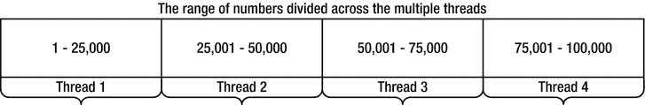

[图 6-1](#_Fig00061) 。在多线程之间划分质数的范围

在英特尔 i7 系统 上，顺序代码遍历范围【100，200000】平均需要 2950 ms，而并行版本平均需要 950 ms。从具有 8 个 CPU 内核的系统中，您期望获得更好的结果，但是这种特殊的 i7 处理器使用超线程，这意味着只有 4 个物理内核(每个物理内核托管两个逻辑内核)。4 倍的加速比是更合理的预期，我们获得了 3 倍的加速，这仍然是不可忽略的。然而，正如图 [**6-2**](#Fig00062) 和 [6-3](#Fig00063) 中并发分析器的报告所示，一些线程比其他线程完成得更快，导致整体 CPU 利用率远低于 100%(要在您的应用上运行并发分析器，请参考[第 2 章](02.html))。

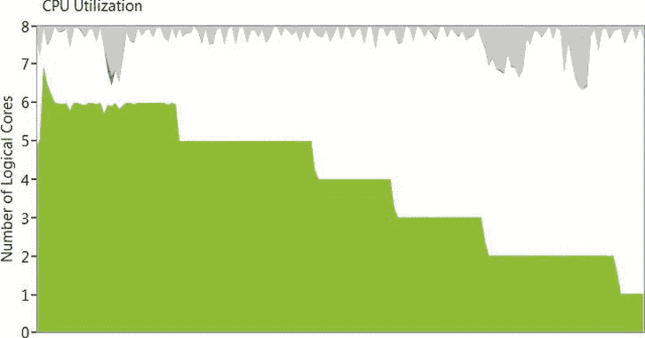

[图 6-2](#_Fig00062) 。总体 CPU 利用率上升到几乎 8 个逻辑核心(100%)，然后在运行结束时下降到只有一个逻辑核心

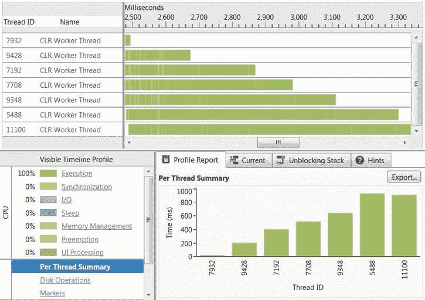

[图 6-3](#_Fig00063) 。有些线程比其他线程完成得快得多。线程 9428 运行时间不到 200 毫秒，而线程 5488 运行时间超过 800 毫秒

事实上，这个程序可能比顺序版本运行得更快(尽管*不会*线性扩展)，特别是如果你在混合中加入了很多内核。这招致几个疑问 ，然而:

*   多少线程是最佳的？如果系统有八个 CPU 核心，我们应该创建八个线程吗？
*   我们如何确保不独占系统资源或造成超额订阅？例如，如果我们的进程中有另一个线程需要计算质数，并试图运行与我们相同的并行算法，该怎么办？
*   线程如何同步对结果集合的访问？从多个线程访问一个列表< uint >是不安全的，会导致数据损坏，我们将在后面的章节中看到。然而，每当我们向集合中添加一个质数时(这是上面的天真解决方案所做的)获取一个锁将被证明是极其昂贵的，并且抑制了我们将算法扩展到更多处理核心的能力。
*   对于一个小范围的数字，是否值得产生几个新线程，或者在一个线程上同步执行整个操作可能是一个更好的主意？(在 Windows 上创建和销毁一个线程很便宜，但不如找出 20 个小数字是质数还是合数便宜。)
*   我们如何确保所有线程的工作量相等？有些线程可能比其他线程完成得更快，尤其是那些处理较小数量的线程。对于分成四等份的范围[100，100000]，负责范围[100，25075]的线程的完成速度将是负责范围[75025，100000]的线程的两倍多，因为我们的素性测试算法在遇到大素数时会变得越来越慢。
*   我们应该如何处理其他线程可能出现的异常？在这种特殊情况下，IsPrime 方法似乎不会出现错误，但在现实世界的示例中，并行化工作可能会遇到潜在的陷阱和异常情况。(CLR 的默认行为是当线程因未处理的异常而失败时终止整个进程，这通常是一个好主意—快速失败语义—但根本不允许 PrimesInRange 的调用方处理异常。)

这些问题的好答案远非微不足道，开发一个允许并行工作执行而不产生太多线程的框架，避免超额订阅并确保工作在所有线程中均匀分布，可靠地报告错误和结果，并与流程中的其他并行资源合作，这正是任务并行库的设计者的任务，我们将在接下来处理。

从手动线程管理开始，自然的第一步是走向线程池 。线程池 T3 是一个组件，它管理一组可用于工作项目执行的线程。不是创建一个线程来执行某个任务，而是将该任务排队到线程池中，线程池选择一个可用的线程并分派该任务来执行。线程池有助于解决上面强调的一些问题-它们降低了为极短的任务创建和销毁线程的成本，通过限制应用使用的线程总数来帮助避免资源独占和超额订阅，并自动决定给定任务的最佳线程数。

在我们的特殊情况下，我们可能决定将这个数字范围分成更大数量的块(在极端情况下，每个循环迭代一个块)，并将它们排队到线程池中。下面是一个块大小为 100 的方法示例:

```cs
public static IEnumerable < uint > PrimesInRange(uint start, uint end) {
  List < uint > primes = new List < uint > ();
  const uint ChunkSize = 100;
  int completed = 0;
  ManualResetEvent allDone = new ManualResetEvent(initialState: false);
  uint chunks = (end - start) / ChunkSize; //again, this should divide evenly
  for (uint i = 0; i < chunks; ++i) {
    uint chunkStart = start + i*ChunkSize;
    uint chunkEnd = chunkStart + ChunkSize;
    ThreadPool.QueueUserWorkItem(_ => {
    for (uint number = chunkStart; number < chunkEnd; ++number) {
       if (IsPrime(number)) {
          lock(primes) {
             primes.Add(number);
             }
          }
       }
       if (Interlocked.Increment(ref completed) == chunks) {
          allDone.Set();
       }
    });
  }
  allDone.WaitOne();
  return primes;
}
```

这个版本的代码比我们之前考虑的版本更具可伸缩性，执行速度也更快。它改进了简单的基于线程版本所需的 950 ms(范围为[100，300000])，平均在 800 ms 内完成(与顺序版本相比，几乎提高了 4 倍)。此外，正如图 6-4 的[中的](#Fig00064) 所示，CPU 使用率一直保持在接近 100%的水平。

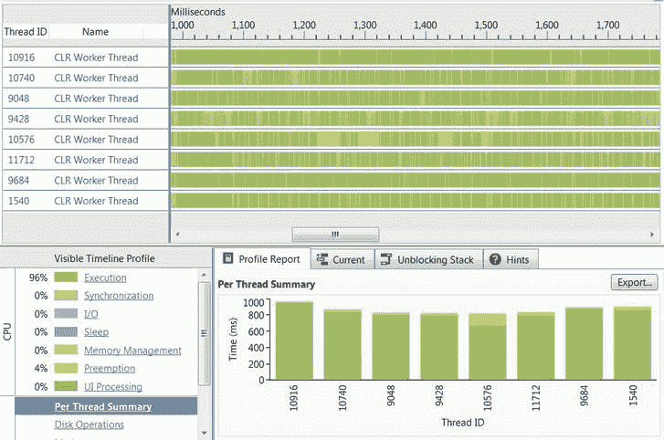

[图 6-4](#_Fig00064) 。在程序执行期间，CLR 线程池使用了 8 个线程(每个逻辑内核一个线程)。每个线程几乎运行了整个持续时间

从 CLR 4.0 开始，CLR 线程池由几个协同工作的组件组成。当一个不属于线程池的线程(比如应用的主线程)将工作项目分派到线程池时，它们会被放入一个全局 FIFO(先进先出)队列。每个线程池线程都有一个本地 LIFO(后进先出)队列，它会将在该线程上创建的工作项排入队列(参见[图 6-5](#Fig00065) )。当线程池线程寻找工作时，它首先查询自己的 LIFO 队列，只要工作项可用，就执行其中的工作项。如果一个线程的 LIFO 队列耗尽，它将尝试*工作窃取*——查询其他线程的本地队列，并从它们那里获取工作项目，按照 FIFO 的顺序。最后，如果所有的本地队列都是空的，线程将查询全局(FIFO)队列，并从那里执行工作项目。

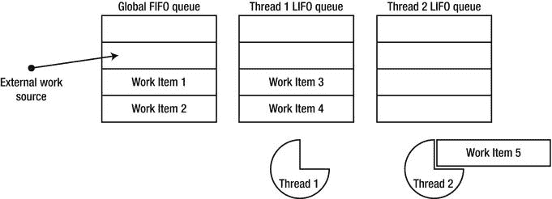

[图 6-5](#_Fig00065) 。线程#2 当前正在执行工作项目# 5；完成执行后，它将从全局 FIFO 队列中借用工作。线程#1 将在处理任何其他工作之前清空其本地队列

线程池 FIFO 和 LIFO 语义

明显古怪的 FIFO 和 LIFO 队列语义背后的原因如下:当工作在全局队列中排队时，没有特定的线程对执行该工作有任何偏好，公平是选择执行工作的唯一标准。这就是 FIFO 语义适合全局队列的原因。然而，当线程池线程将工作项排队以供执行时，它很可能使用与当前执行的工作项相同的数据和相同的指令；这就是为什么将它放入属于同一线程的 LIFO 队列是有意义的——它将在当前执行的工作项之后不久执行，并利用 CPU 数据和指令缓存。

此外，与访问全局队列相比，访问线程的本地队列上的工作项需要较少的同步，并且不太可能遇到来自其他线程的争用。类似地，当一个线程从另一个线程的队列中窃取工作时，它会按照 FIFO 的顺序进行窃取，这样就可以保持相对于原始线程处理器上的 CPU 缓存的 LIFO 优化。这种线程池结构对工作项层次结构非常友好，在这种层次结构中，加入全局队列的单个工作项将产生许多额外的工作项，并为几个线程池线程提供工作。

与任何抽象 一样，线程池从应用开发人员手中夺走了对线程生命周期和工作项目调度的一些粒度控制。虽然 CLR 线程池有一些控件 API，比如 thread pool。控制线程数量的 SetMinThreads 和 SetMaxThreads，它没有内置的 API 来控制其线程或任务的*优先级。然而，通常情况下，应用在更强大的系统上自动伸缩的能力，以及不必为短期任务创建和销毁线程所带来的性能提升，大大弥补了这种控制的损失。*

 *排队到线程池中的工作项目是极其不称职的；它们没有状态，不能携带异常信息，不支持异步延续和取消，也没有任何从已经完成的任务中获取结果的机制。任务平行库 中。NET 4.0 引入了*任务*，这是线程池工作项之上的强大抽象。任务是线程和线程池工作项的结构化替代，就像对象和子例程是基于 goto 的汇编语言编程的结构化替代一样。

任务并行度

任务并行性是一种范式和一组 API，用于将一个大任务分解成一组较小的任务，并在多个线程上执行它们。任务并行库(TPL)拥有一流的 API，可以同时管理数百万个任务(通过 CLR 线程池)。第三方物流的核心是系统。Threading.Tasks.Task 类，代表一个任务。任务类 提供了以下功能:

*   为在未指定的线程上独立执行调度工作。(执行给定任务的特定线程由*任务调度器*决定；默认的任务计划程序将任务排入 CLR 线程池，但也有一些计划程序将任务发送到特定的线程，如 UI 线程。)
*   等待任务完成并获得其执行结果。
*   提供应该在任务完成后立即运行的延续。(这通常被称为回调，但我们将在本章通篇使用术语*延续*。)
*   处理单个任务中出现的异常，甚至是调度任务执行的原始线程上的任务层次结构中出现的异常，或者是对任务结果感兴趣的任何其他线程中出现的异常。
*   取消尚未开始的任务，并将取消请求传达给正在执行的任务。

因为我们可以将任务视为线程之上的高级抽象，所以我们可以重写用于素数计算的代码，以使用任务而不是线程。事实上，这将使代码更短——至少，我们不需要已完成任务计数器和 ManualResetEvent 对象来跟踪任务执行。然而，正如我们将在下一节中看到的，TPL 提供的数据并行性 API 甚至更适合于并行化在一个范围内寻找所有质数的循环。相反，我们应该考虑一个不同的问题。

有一种众所周知的基于递归比较的排序算法叫做 QuickSort，它非常容易实现并行化(并且平均 case 运行时复杂度为 *O* ( *n* log( *n* ))，这是最优的——尽管目前很少有大型框架使用 QuickSort 来排序任何东西)。快速排序算法 如下进行:

```cs
public static void QuickSort < T > (T[] items) where T : IComparable < T > {
  QuickSort(items, 0, items.Length);
}
private static void QuickSort < T > (T[] items, int left, int right) where T : IComparable < T > {
  if (left == right) return;
  int pivot = Partition(items, left, right);
  QuickSort(items, left, pivot);
  QuickSort(items, pivot + 1, right);
}
private static int Partition < T > (T[] items, int left, int right) where T : IComparable < T > {
  int pivotPos = . . .; //often a random index between left and right is used
  T pivotValue = items[pivotPos];
  Swap(ref items[right-1], ref items[pivotPos]);
  int store = left;
  for (int i = left; i < right - 1; ++i) {
    if (items[i].CompareTo(pivotValue) < 0) {
    Swap(ref items[i], ref items[store]);
    ++store;
    }
  }
  Swap(ref items[right-1], ref items[store]);
  return store;
}
private static void Swap < T > (ref T a, ref T b) {
  T temp = a;
  a = b;
  b = temp;
}
```

[图 6-6](#Fig00066) 是分割方法 T3 的一个单独步骤的示意图。选择第四个元素(其值为 5)作为轴心。首先，它被移到数组的最右边。接下来，所有大于轴心的元素都向数组的右侧传播。最后，定位枢轴，使其右侧的所有元素严格大于它，其左侧的所有元素小于或等于它。

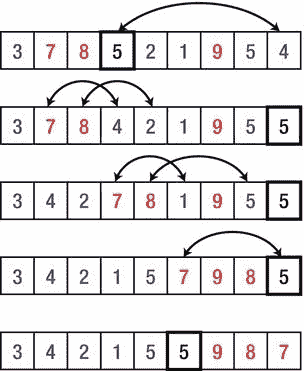

[图 6-6](#_Fig00066) 。对 Partition 方法的单次调用的说明。

QuickSort 在每一步进行的递归调用必须设置并行化警报。对数组的左右部分进行排序是独立的任务，它们之间不需要同步，Task 类非常适合表达这一点。下面是使用任务并行化快速排序的首次尝试:

```cs
public static void QuickSort < T > (T[] items) where T : IComparable < T > {
  QuickSort(items, 0, items.Length);
}
private static void QuickSort < T > (T[] items, int left, int right) where T : IComparable < T > {
  if (right - left < 2) return;
  int pivot = Partition(items, left, right);
  Task leftTask = Task.Run(() => QuickSort(items, left, pivot));
  Task rightTask = Task.Run(() => QuickSort(items, pivot + 1, right));
  Task.WaitAll(leftTask, rightTask);
}
private static int Partition < T > (T[] items, int left, int right) where T : IComparable < T > {
  //Implementation omitted for brevity
}
```

任务。Run 方法 创建一个新任务(相当于调用 new task())并调度它执行(相当于新创建任务的 Start 方法)。任务。WaitAll 静态方法等待两个任务都完成，然后返回。请注意，我们不必指定如何等待任务完成，也不必指定何时创建线程以及何时销毁线程。

有一种有用的实用方法叫做并行。调用 ，它执行提供给它的一组任务，并在所有任务完成后返回。这将允许我们用下面的代码重写快速排序方法的核心:

```cs
Parallel.Invoke(
    () => QuickSort(items, left, pivot),
    () => QuickSort(items, pivot + 1, right)
);
```

不管我们是否使用并行。手动调用或创建任务，如果我们尝试将这个版本与简单的顺序版本进行比较，我们会发现它的运行速度明显*慢*，尽管它似乎利用了所有可用的处理器资源。事实上，使用 1，000，000 个随机整数的数组，顺序版本运行(在我们的测试系统上)平均需要 250 ms，而并行版本平均需要将近 650 ms 才能完成！

问题是并行需要足够粗的粒度；尝试对三元素数组进行并行排序是徒劳的，因为创建任务对象、将工作项目调度到线程池以及等待它们完成执行所带来的开销完全超过了所需的少量比较操作。

递归算法中的节流并行

你打算如何抑制并行性，以防止这种开销减少我们优化的任何回报？有几种可行的方法:

*   只要要排序的数组的大小大于某个阈值(比如说 500 项)，就使用并行版本，一旦它变小，就切换到顺序版本。
*   只要递归深度小于某个阈值，就使用并行版本，一旦递归非常深，就切换到顺序版本。(这个选项比前一个稍逊一筹，除非轴心总是正好位于数组的中间。)
*   只要未完成任务的数量(该方法必须手动维护)小于某个阈值，就使用并行版本，否则切换到顺序版本。(当没有其他限制并行性的标准(如递归深度或输入大小)时，这是唯一的选择。)

事实上，在上面的案例中，限制大于 500 个元素的数组的并行化在作者的英特尔 i7 处理器上产生了出色的结果，与顺序版本相比，执行时间提高了 4 倍。代码更改非常简单，尽管在生产质量的实现中不应该硬编码阈值:

```cs
private static void QuickSort < T > (T[] items, int left, int right) where T : IComparable < T > {
  if (right - left < 2) return;
  int pivot = Partition(items, left, right);
  if (right - left > 500) {
    Parallel.Invoke(
    () => QuickSort(items, left, pivot),
    () => QuickSort(items, pivot + 1, right)
    );
  } else {
    QuickSort(items, left, pivot);
    QuickSort(items, pivot + 1, right);
  }
}
```

递归分解的更多例子

通过应用类似的递归分解 ，可以并行化许多附加算法。事实上，几乎所有将输入分成几个部分的递归算法都被*设计成*在每个部分上独立执行，然后组合结果。在本章的后半部分，我们将考虑不那么容易屈服于并行化的例子，但首先让我们来看几个这样做的例子:

*   斯特拉森矩阵乘法算法(概述见`http://en.wikipedia.org/wiki/Strassen_algorithm`)。这种矩阵乘法的算法比我们将在本章后面看到的简单的立方算法提供了更好的性能。Strassen 的算法将一个大小为 2 <sup>n</sup> × 2 <sup>n</sup> 的矩阵递归分解成大小为 2 <sup>n-1</sup> × 2 <sup>n-1</sup> 的四个相等的分块矩阵，并使用了一个依靠*七次*乘法而不是八次乘法的聪明绝招来获得渐近运行时间∽*O*(*n*T15】2.807)。在快速排序的例子中，对于足够小的矩阵，Strassen 算法的实际实现通常会退回到标准的立方算法；当使用递归分解并行化 Strassen 算法时，为较小的矩阵设置一个并行化阈值甚至更为重要。
*   快速傅立叶变换(库利-图基算法，见`http://en.wikipedia.org/wiki/Cooley%E2%80%93Tukey_FFT_algorithm`)。该算法通过将长度为 2 <sup>n</sup> 的向量递归分解为两个大小为 2 <sup>n-1</sup> 的向量来计算该向量的 DFT(离散傅立叶变换)。并行化这种计算是相当容易的，但是同样重要的是要警惕为足够小的向量设置并行化的阈值。
*   图形遍历(深度优先搜索或广度优先搜索)。正如我们在第 4 章中看到的，CLR 垃圾收集器遍历一个图，其中对象是顶点，对象之间的引用是边。使用 DFS 或 BFS 的图遍历可以从并行化以及我们考虑过的其他递归算法中受益匪浅；然而，与快速排序或 FFT 不同，当并行化图遍历的分支时，很难预先估计递归调用所代表的工作量。这种困难需要启发式方法来决定如何将搜索空间划分给多线程:我们已经看到服务器 GC 风格相当粗糙地执行这种划分，基于每个处理器分配对象的独立堆。

如果您正在寻找更多的例子来练习您的并行编程技能，也可以考虑 Karatsuba 的乘法算法，该算法依靠递归分解将∽*O*(*n*<sup>1.585</sup>)运算中的 *n* 位数字相乘；依赖递归分解进行排序的归并排序，类似于快速排序；以及许多动态编程算法，这些算法通常需要高级技巧来在并行计算的不同分支中采用记忆化(我们将在后面研究一个例子)。

例外和取消

我们还没有挖掘出任务类的全部能力。假设我们想要处理递归调用 QuickSort 时可能出现的异常，并在排序操作尚未完成时提供取消整个排序操作的支持。

任务执行环境提供了基础结构，用于将任务中出现的异常封送回到被认为适合接收它的任何线程。假设快速排序任务的一个递归调用遇到了一个异常，可能是因为我们没有仔细考虑数组的边界，给数组的任何一边引入了一个差 1 的错误。这个异常会在线程池线程上出现，线程池线程不受我们的显式控制，并且不允许任何总体异常处理行为。幸运的是，TPL 将捕获异常，并将其存储在 Task 对象中，供以后传播。

当程序试图等待任务完成(使用任务)时，任务中出现的异常将被重新抛出(包装在 AggregateException 对象中)。等待实例方法)或检索其结果(使用任务。结果属性)。这允许在创建任务的代码中进行自动和集中的异常处理，并且不需要将错误手动传播到中央位置和同步错误报告活动。下面的最小代码示例演示了 TPL 中的异常处理范例:

```cs
int i = 0;
Task < int > divideTask = Task.Run(() = > { return 5/i; });
try {
  Console.WriteLine(divideTask.Result); //accessing the Result property eventually throws
} catch (AggregateException ex) {
  foreach (Exception inner in ex.InnerExceptions) {
    Console.WriteLine(inner.Message);
  }
}
```

 **注意**当从现有任务的主体中创建任务时，TaskCreationOptions。AttachedToParent 枚举值在新子任务和创建它的父任务之间建立关系。我们将在本章后面看到，任务之间的父子关系影响任务执行的取消、继续和调试方面。然而，就异常处理而言，等待父任务完成意味着等待所有子任务完成，并且子任务的任何异常也会传播到父任务。这就是为什么 TPL 抛出一个 AggregateException 实例，该实例包含一个层次结构的异常，这些异常可能是从一个层次结构的任务中产生的。

取消现有工作是另一个需要考虑的问题。假设我们有一个任务层次结构，比如使用 TaskCreationOptions 时由 QuickSort 创建的层次结构。AttachedToParent 枚举值。即使可能有数百个任务同时运行，我们也可能希望向用户提供取消语义，例如，如果不再需要排序后的数据。在其他场景中，取消未完成的工作可能是任务执行的一个组成部分。例如，考虑使用 DFS 或 BFS 在图中查找节点的并行算法。当找到所需的节点时，应该调用执行查找的整个任务层次结构。

取消任务涉及 CancellationTokenSource 和 CancellationToken 类型，协同执行。换句话说，如果一个任务的执行已经在进行中，就不能使用 TPL 的取消机制粗暴地终止它。取消已经执行的工作需要执行该工作的代码的配合。然而，尚未开始执行的任务可以被完全取消，而不会产生任何不良后果。

下面的代码演示了一个二叉树查找,其中每个节点包含一个可能很长的需要线性遍历的元素数组；呼叫者可以使用 TPL 的取消机制来取消整个查找。一方面，未开始的任务将被 TPL 自动取消；另一方面，已经启动的任务将周期性地监视它们的取消令牌以获得取消指令，并在需要时协作停止。

```cs
public class TreeNode < T > {
  public TreeNode < T > Left, Right;
  public T[] Data;
}
public static void TreeLookup < T > (
  TreeNode < T > root, Predicate < T > condition, CancellationTokenSource cts) {
  if (root == null) {
    return;
  }
  //Start the recursive tasks, passing to them the cancellation token so that they are
  //cancelled automatically if they haven't started yet and cancellation is requested
  Task.Run(() => TreeLookup(root.Left, condition, cts), cts.Token);
  Task.Run(() => TreeLookup(root.Right, condition, cts), cts.Token);
  foreach (T element in root.Data) {
    if (cts.IsCancellationRequested) break; //abort cooperatively
    if (condition(element)) {
    cts.Cancel(); //cancels all outstanding work
    //Do something with the interesting element
    }
  }
}
//Example of calling code:
CancellationTokenSource cts = new CancellationTokenSource();
Task.Run(() = > TreeLookup(treeRoot, i = > i % 77 == 0, cts);
//After a while, e.g. if the user is no longer interested in the operation:
cts.Cancel();
```

不可避免地，会有一些算法的例子需要一种更简单的方法来表达并行性。考虑我们开始的素性测试例子。我们可以手动将该范围划分为块，为每个块创建一个任务，然后等待所有任务完成。事实上，有一个完整的算法家族，其中有一个特定操作所应用的数据范围。这些算法要求比任务并行更高层次的抽象。我们现在转向这个抽象概念。

数据并行度

任务并行性主要处理任务，而数据并行性旨在将任务从直接视图中移除，并用更高级的抽象(并行循环)来取代它们。换句话说，并行性的来源不是算法的*代码*，而是它操作的*数据*。任务并行库提供了几个提供数据并行的 API。

平行。对于和平行。ForEach

for 和 foreach 循环 通常是并行化的绝佳选择。事实上，自从并行计算出现以来，已经有人尝试自动并行化这种循环。一些尝试已经走上了语言变化或语言扩展的道路，例如 OpenMP 标准(引入了#pragma omp parallel for 等指令来并行化 for 循环)。任务并行库通过显式 API 提供了循环并行性，尽管如此，它还是非常接近于它们的语言对应物。这些 API 是并行的。对于和平行。foreach，尽可能匹配语言中 for 和 ForEach 循环的行为。

回到并行化素性测试的例子，我们有一个在大范围数字上迭代的循环，检查每个数字的素性并将其插入到一个集合中，如下所示:

```cs
for (int number = start; number < end; ++number) {
  if (IsPrime(number)) {
    primes.Add(number);
  }
}
```

将此代码转换为使用并行。因为几乎是一个机械的任务，尽管同步访问素数集合需要一些小心(还有更好的方法，比如聚合，我们稍后会考虑):

```cs
Parallel.For(start, end, number => {
  if (IsPrime(number)) {
    lock(primes) {
    primes.Add(number);
    }
  }
});
```

通过用 API 调用替换语言级循环，我们获得了循环迭代的自动并行化。此外，平行。For API 不是一个直接的循环，它在每次迭代中生成一个任务，或者为范围内每个硬编码的块大小的部分生成一个任务。而是平行。For 缓慢适应单个迭代的执行速度，考虑当前正在执行的任务数量，并通过动态划分迭代范围来防止过于细粒度的行为。手动实现这些优化并不简单，但是您可以使用另一个并行重载来应用特定的定制(比如控制并发执行任务的最大数量)。这需要一个 ParallelOptions 对象，或者使用一个定制的分割器来确定如何在不同的任务之间划分迭代范围。

一个类似的 API 处理 foreach 循环，其中当循环开始时，数据源可能没有被完全枚举，并且实际上可能不是有限的。假设我们需要从 Web 上下载一组 RSS 提要，指定为 IEnumerable < string>。循环的骨架将具有以下形状:

```cs
IEnumerable < string > rssFeeds = . . .;
WebClient webClient = new WebClient();
foreach (string url in rssFeeds) {
  Process(webClient.DownloadString(url));
}
```

这个循环可以通过机械转换来并行化，其中 foreach 循环被对 Parallel 的 API 调用所取代。ForEach 。注意，数据源(rssFeeds 集合)不必是线程安全的，因为它是并行的。ForEach 将在从几个线程访问它时使用同步。

```cs
IEnumerable < string > rssFeeds = . . .; //The data source need
*not*be thread-safe
WebClient webClient = new WebClient();
Parallel.ForEach(rssFeeds, url => {
  Process(webClient.DownloadString(url));
});
```

 **注意**您可以表达对在无限数据源上执行操作的担忧。然而，事实证明，开始这样的操作并期望在满足某些条件时尽早终止它是非常方便的。例如，考虑一个无限的数据源，比如所有的自然数(在代码中由返回 IEnumerable < BigInteger >的方法指定)。我们可以编写并并行化一个循环，寻找一个数字和为 477 但不能被 133 整除的数。希望有这样一个数，我们的循环会终止。

并行化循环并不像上面讨论的那样简单。在我们将这个工具牢牢地系在腰带上之前，我们需要考虑几个“缺失”的特征。首先，C# 循环有 break 关键字，它可以提前终止循环。当我们甚至不知道哪个迭代正在我们自己的线程之外的线程上执行时，我们如何终止一个已经跨多个线程并行化的循环呢？

ParallelLoopState 类表示并行循环的执行状态，并允许从循环中提前中断。这里有一个简单的例子:

```cs
int invitedToParty = 0;
Parallel.ForEach(customers, (customer, loopState) = > {
  if (customer.Orders.Count > 10 && customer.City == "Portland") {
    if (Interlocked.Increment(ref invitedToParty) > = 25) {
    loopState.Stop(); //no attempt will be made to execute any additional iterations
    }
  }
});
```

注意，Stop 方法并不保证最后执行的迭代就是调用它的那个——已经开始执行的迭代将运行到完成(除非它们轮询 ParallelLoopState)。ShouldExitCurrentIteration 属性)。但是，已经排队的额外迭代将不会开始执行。

ParallelLoopState 的缺点之一。Stop 的一个缺点是，它不能保证直到某一次迭代的所有迭代都已执行。例如，如果有 1，000 个客户，则可能客户 1–100 已被完全处理，客户 101–110 根本没有被处理，而客户 111 是在调用 Stop 之前最后被处理的。如果您希望保证某个迭代之前的所有迭代都已经执行(即使它们还没有开始！)，应该使用 ParallelLoopState。请改用 Break 方法。

平行 LINQ (PLINQ)

并行计算的最高抽象层次可能是这样的:你声明:“我希望这段代码并行运行”，剩下的留给框架来实现。这就是平行 LINQ 的意义所在。但是首先，应该对 LINQ 进行一个简短的回顾。LINQ(语言集成查询)是在 C# 3.0 和中引入的一个框架和一组语言扩展。NET 3.5，模糊了命令式编程和声明式编程在数据迭代方面的界限。例如，下面的 LINQ 查询从名为 customers 的数据源(可能是内存中的集合、数据库表或更奇特的来源)中检索在过去十个月中至少购买了三次 10 美元以上商品的华盛顿客户的姓名和年龄，并将其打印到控制台:

```cs
var results = from customer in customers
          where customer.State == "WA"
          let custOrders = (from order in orders
          where customer.ID == order.ID
          select new { order.Date, order.Amount })
          where custOrders.Count(co => co.Amount >= 10 &&
                   co.Date >= DateTime.Now.AddMonths(−10)) >= 3
          select new { customer.Name, customer.Age };
foreach (var result in results) {
  Console.WriteLine("{0} {1}", result.Name, result.Age);
}
```

这里要注意的主要事情是，大多数查询都是以声明方式指定的——非常像 SQL 查询。它不使用循环来过滤对象或将来自不同数据源的对象组合在一起。通常，您不应该担心同步查询的不同迭代，因为大多数 LINQ 查询都是纯函数性的，没有副作用——它们将一个集合(IEnumerable < T>)转换为另一个集合，而不修改过程中的任何其他对象。

为了并行执行上述查询，唯一需要的代码更改是将源集合从通用 IEnumerable < T >修改为 ParallelQuery < T>。AsParallel 扩展方法 负责这一点，并允许以下优雅的语法:

```cs
var results = from customer in customers.AsParallel()
    where customer.State == "WA"
    let custOrders = (from order in orders
    where customer.ID == order.ID
    select new { order.Date, order.Amount })
    where custOrders.Count(co => co.Amount >= 10 &&
    co.Date > = DateTime.Now.AddMonths(−10)) >= 3
    select new { customer.Name, customer.Age };
foreach (var result in results) {
  Console.WriteLine("{0} {1}", result.Name, result.Age);
}
```

PLINQ 使用三级处理流水线来执行并行查询 ，如图[图 6-7](#Fig00067) 所示。首先，PLINQ 决定应该使用多少线程来并行执行查询。接下来，工作线程从源集合中检索工作块，确保它在锁定状态下被访问。每个线程继续独立执行它的工作项，并且结果在每个线程内本地排队。最后，所有本地结果都被缓冲到一个结果集合中，在上面的示例中，这个结果集合由一个 foreach 循环进行轮询。

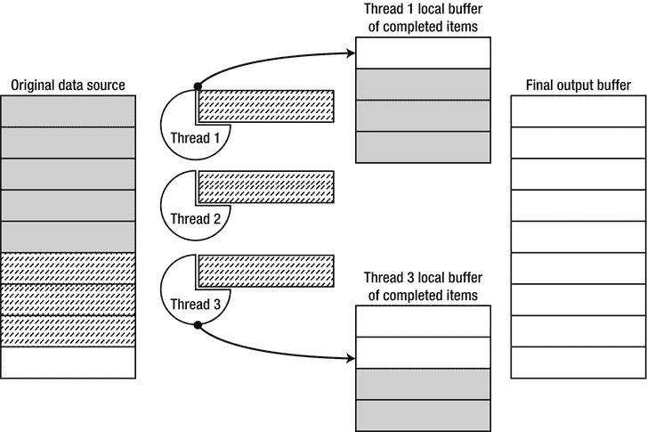

[图 6-7](#_Fig00067) 。PLINQ 中的工作项执行。实心灰色的工作项已经完成并被放置在线程本地缓冲区 中，它们随后从那里被移动到调用者可用的最终输出缓冲区。虚线工作项当前正在执行

PLINQ 相比并行的主要优势 。ForEach 源于这样一个事实，即 PLINQ 在执行查询的每个线程中本地自动处理临时处理结果的聚合。使用并行时。为了找到质数，我们必须访问一个质数的全局集合来聚合结果(在本章的后面，我们将考虑使用聚合的优化)。这种全局访问需要连续的同步，并且引入了大量的开销。我们可以通过使用 PLINQ 实现相同的结果，如下所示:

```cs
List < int > primes = (from n in Enumerable.Range(3, 200000).AsParallel()
    where IsPrime(n)
    select n).ToList();
//Could have used ParallelEnumerable.Range instead of Enumerable.Range(. . .).AsParallel()
```

定制并行循环和 PLINQ

并联回路 (并联。对于和平行。ForEach)和 PLINQ 有几个定制 API，这使它们非常灵活，在丰富性和表达性方面接近我们之前考虑过的显式任务并行 API。并行循环 API 接受具有各种属性的 ParallelOptions 对象，而 PLINQ 依赖于 ParallelQuery < T >的附加方法。这些选项包括:

*   限制并行度(允许并发执行的任务数量)
*   提供用于取消并行执行的取消令牌
*   强制并行查询的输出排序
*   控制并行查询的输出缓冲(合并模式)

对于并行循环，最常见的是使用 ParallelOptions 类来限制并行度，而对于 PLINQ，您通常会自定义查询的合并模式和排序语义。有关这些定制选项的更多信息，请参考 MSDN 文档。

C# 5 异步方法

到目前为止，我们考虑了丰富的 API，这些 API 允许使用任务并行库的类和方法来表达各种并行解决方案。然而，在 API 笨拙或不够简洁的地方，其他并行编程环境有时依赖语言扩展来获得更好的表达能力。在这一节中，我们将看到 C# 5 如何通过提供一种更容易表达延续的语言扩展来适应并发编程世界的挑战。但是首先，我们必须考虑异步编程世界中的延续。

通常，您会希望将一个*延续* (或回调)与一个特定的任务相关联；当任务完成时，应该执行延续。如果您可以控制任务，也就是说，您可以调度任务的执行，那么您可以将回调嵌入到任务本身中，但是如果您从另一个方法接收任务，那么显式的 continuation API 是理想的。TPL 提供了 ContinueWith instance 方法和 continue when all/continue when any 静态方法(不言自明)来控制几种设置中的延续。可以仅在特定情况下(例如，仅当任务运行完成时或仅当任务遇到异常时)调度该继续，并且可以使用 TaskScheduler API 在特定线程或线程组上调度该继续。以下是各种 API 的一些示例:

```cs
Task < string > weatherTask = DownloadWeatherInfoAsync(. . .);
weatherTask.ContinueWith(_ => DisplayWeather(weatherTask.Result), TaskScheduler.Current);
Task left = ProcessLeftPart(. . .);
Task right = ProcessRightPart(. . .);
TaskFactory.ContinueWhenAll(
  new Task[] { left, right },
  CleanupResources
);
TaskFactory.ContinueWhenAny(
  new Task[] { left, right },
  HandleError,
  TaskContinuationOptions.OnlyOnFaulted
);
```

延续是编写异步应用的一种合理方式，在 GUI 环境中执行异步 I/O 时非常有价值。例如，为了确保 Windows 8 Metro 风格的应用保持响应迅速的用户界面，Windows 8 中的 WinRT (Windows 运行时)API 只提供所有可能运行超过 50 毫秒的操作的异步版本。由于多个异步调用链接在一起，嵌套的延续变得有些笨拙，如下例所示:

```cs
//Synchronous version:
private void updateButton_Clicked(. . .) {
  using (LocationService location = new LocationService())
  using (WeatherService weather = new WeatherService()) {
    Location loc = location.GetCurrentLocation();
    Forecast forecast = weather.GetForecast(loc.City);
    MessageDialog msg = new MessageDialog(forecast.Summary);
    msg.Display();
  }
}
//Asynchronous version:
private void updateButton_Clicked(. . .) {
  TaskScheduler uiScheduler = TaskScheduler.Current;
  LocationService location = new LocationService();
  Task < Location > locTask = location.GetCurrentLocationAsync();
  locTask.ContinueWith(_ => {
    WeatherService weather = new WeatherService();
    Task < Forecast > forTask = weather.GetForecastAsync(locTask.Result.City);
    forTask.ContinueWith(__ => {
       MessageDialog message = new MessageDialog(forTask.Result.Summary);
       Task msgTask = message.DisplayAsync();
       msgTask.ContinueWith(___ => {
          weather.Dispose();
          location.Dispose();
       });
    }, uiScheduler);
  });
}
```

这种深度嵌套并不是显式基于延续的编程的唯一危险。考虑以下需要转换到异步版本 的同步循环:

```cs
//Synchronous version:
private Forecast[] GetForecastForAllCities(City[] cities) {
  Forecast[] forecasts = new Forecast[cities.Length];
  using (WeatherService weather = new WeatherService()) {
    for (int i = 0; i < cities.Length; ++i) {
    forecasts[i] = weather.GetForecast(cities[i]);
    }
  }
  return forecasts;
}
//Asynchronous version:
private Task < Forecast[] > GetForecastsForAllCitiesAsync(City[] cities) {
  if (cities.Length == 0) {
    return Task.Run(() = > new Forecast[0]);
  }
  WeatherService weather = new WeatherService();
  Forecast[] forecasts = new Forecast[cities.Length];
  return GetForecastHelper(weather, 0, cities, forecasts).ContinueWith(_ => forecasts);
}
private Task GetForecastHelper( WeatherService weather, int i, City[] cities, Forecast[] forecasts) {
  if (i >= cities.Length) return Task.Run(() => { });
  Task < Forecast > forecast = weather.GetForecastAsync(cities[i]);
  forecast.ContinueWith(task => {
    forecasts[i] = task.Result;
    GetForecastHelper(weather, i + 1, cities, forecasts);
  });
  return forecast;
}
```

转换这个循环需要完全重写原来的方法，并安排一个延续，本质上是以一种相当不直观和递归的方式执行下一次迭代。这是 C# 5 的设计者通过引入两个新的关键字 async 和 await 选择在语言层面上解决的问题。

异步方法必须用 async 关键字标记，并且可能返回 void、Task 或 Task < T>。在异步方法中，await 运算符可用于表示延续，而无需使用 ContinueWith API。考虑以下示例:

```cs
private async void updateButton_Clicked(. . .) {
  using (LocationService location = new LocationService()) {
    Task < Location > locTask = location.GetCurrentLocationAsync();
    Location loc = await locTask;
    cityTextBox.Text = loc.City.Name;
  }
}
```

在此示例中，await locTask 表达式为 GetCurrentLocationAsync 返回的任务提供了延续。continuation 的主体是方法的其余部分(从对 loc 变量的赋值开始)，await 表达式计算任务返回的内容，在本例中是 Location 对象。此外，延续是在 UI 线程上隐式调度的，这是我们之前使用 TaskScheduler API 时必须明确处理的事情。

C# 编译器负责与方法体相关的所有相关语法特性。比如在我们刚刚写的方法中，有一个尝试。。。隐藏在 using 语句后面的 finally 块。编译器重写延续，以便调用位置变量上的处置方法 ，而不管任务是成功完成还是发生异常。

这种智能重写允许将同步 API 调用转换为异步调用。编译器支持异常处理 、复杂循环、递归方法调用——难以*与显式延续传递 API 结合的语言构造。例如，下面是先前给我们带来麻烦的预测-检索循环的异步版本:*

```cs
private async Task < Forecast[] > GetForecastForAllCitiesAsync(City[] cities) {
  Forecast[] forecasts = new Forecast[cities.Length];
  using (WeatherService weather = new WeatherService()) {
    for (int i = 0; i < cities.Length; ++i) {
    forecasts[i] = await weather.GetForecastAsync(cities[i]);
    }
  }
  return forecasts;
}
```

请注意，变化很小，编译器处理的细节是获取预测变量 (类型为 Forecast[])我们的方法返回并围绕它创建任务< Forecast[] >支架。

只有两个简单的语言特性 (其实现一点也不简单！)，C# 5 极大地降低了异步编程的门槛，并使使用返回和操作任务的 API 变得更加容易。此外，await 操作符的语言实现没有绑定到任务并行库；Windows 8 中的本机 WinRT API 返回 IAsyncOperation < T >，而不是任务实例(这是一个托管概念)，但仍可以等待，如下例所示，它使用了一个真正的 WinRT API:

```cs
using Windows.Devices.Geolocation;
. . .
private async void updateButton_Clicked(. . .) {
  Geolocator locator = new Geolocator();
  Geoposition position = await locator.GetGeopositionAsync();
  statusTextBox.Text = position.CivicAddress.ToString();
}
```

第三方物流中的高级模式

到目前为止，在这一章中，我们已经考虑了相当简单的并行算法的例子。在本节中，我们将简要介绍一些高级技巧，您可能会发现这些技巧在处理现实世界的问题时很有用；在一些情况下，我们可以从非常令人惊讶的地方获得性能提升。

当并行化具有共享状态的循环时，首先要考虑的优化是*聚合* (有时也称为*缩减* )。当在并行循环中使用共享状态时，由于共享状态访问上的同步，可伸缩性通常会丢失；添加到组合中的 CPU 内核越多，由于同步的原因，增益就越小(这种现象是阿姆达尔定律的直接推论，通常被称为*收益递减定律*)。在执行并行循环的每个线程或任务中聚合本地状态，并在循环执行结束时组合本地状态以获得最终结果，通常可以大幅提升性能。处理循环执行的 TPL APIs 配备了处理这种本地聚合的重载。

例如，考虑我们之前实现的素数计算。可伸缩性的主要障碍之一是需要将新发现的素数插入到共享列表中，这需要同步。相反，我们可以在每个线程中使用一个本地列表，并在循环完成时将这些列表聚集在一起:

```cs
List < int > primes = new List < int > ();
Parallel.For(3, 200000,
  () => new List < int > (), //initialize the local copy
  (i, pls, localPrimes) => { //single computation step, returns new local state
    if (IsPrime(i)) {
    localPrimes.Add(i); //no synchronization necessary, thread-local state
    }
    return localPrimes;
  },
  localPrimes => { //combine the local lists to the global one
    lock(primes) { //synchronization is required
    primes.AddRange(localPrimes);
    }
  }
);
```

在上面的例子中，使用的锁的数量比以前少得多——我们只需要为每个执行并行循环的线程使用一次锁，而不是为我们发现的每个素数使用一次锁。我们*确实*引入了将列表组合在一起的额外成本，但是与本地聚合获得的可伸缩性相比，这个成本可以忽略不计。

优化的另一个来源是循环迭代太小，无法有效地并行化。即使数据并行性 API 将多次迭代组合在一起，也可能有循环体完成得如此之快，以至于它们被调用每次迭代的循环体所需的委托调用所控制。在这种情况下，Partitioner API 可用于手动提取迭代块，从而最大限度地减少委托调用的数量:

```cs
Parallel.For(Partitioner.Create(3, 200000), range => { //range is a Tuple < int,int>
  for (int i = range.Item1; i < range.Item2; ++i) . . . //loop body with no delegate invocation
});
```

有关自定义分区的更多信息，这也是数据并行程序可用的一个重要优化，请参考 MSDN 的文章“用于 PLINQ 和 TPL 的自定义分区器”，位于`http://msdn.microsoft.com/en-us/library/dd997411.aspx`。

最后，有些应用可以从定制的任务调度程序中受益。一些例子包括在 UI 线程上调度工作(我们已经使用 TaskScheduler 完成了一些工作。当前对 UI 线程的延续进行排队)，通过将任务调度到更高优先级的调度器来区分任务的优先级，以及通过将任务调度到使用具有特定 CPU 关联的线程的调度器来将任务关联到特定 CPU。可以扩展 TaskScheduler 类来创建自定义任务计划程序。关于自定义任务调度器的例子，请参考 MSDN 的文章“如何:创建一个限制并发度的任务调度器”，位于`http://msdn.microsoft.com/en-us/library/ee789351.aspx`。

同步

对并行编程的处理至少需要粗略地提及同步这个庞大的主题。在贯穿本文的简单示例中，我们已经看到了许多多线程访问共享内存位置的情况，无论是复杂的集合还是单个整数。除了只读数据，对共享内存位置的每次访问都需要同步，但并非所有同步机制都具有相同的性能和可伸缩性成本。

在开始之前，让我们回顾一下访问少量数据时同步的必要性。现代的 CPU 可以对内存进行原子读写；例如，一个 32 位整数的写操作总是自动执行。这意味着，如果一个处理器将值 0xDEADBEEF 写入先前用值 0 初始化的存储器位置，另一个处理器将不会观察到部分更新的存储器位置，例如 0xDEAD0000 或 0x0000BEEF。不幸的是，对于较大的内存位置，情况就不一样了；例如，即使在 64 位处理器上，将 20 个字节写入内存也不是原子操作，不能以原子方式执行。

然而，即使在访问 32 位存储单元但发出多个操作时，同步问题也会立即出现。例如，操作++i(其中 I 是 int 类型的堆栈变量)通常被翻译成三个机器指令的序列:

```cs
mov eax, dword ptr [ebp-64] ;copy from stack to register
inc eax ;increment value in register
mov dword ptr [ebp-64], eax ;copy from register to stack
```

这些指令中的每一个都是自动执行的，但是如果没有额外的同步，两个处理器可能同时执行指令序列的一部分，导致*丢失更新*。假设变量的初始值是 100，检查下面的执行历史:

**1 号处理器 2 号处理器**

```cs
mov eax, dword ptr [ebp-64]
    mov eax, dword ptr [ebp-64] inc eax
inc eax
mov dword ptr [ebp-64], eax
    mov dword ptr [ebp-64], eax
```

在这种情况下，该变量的最终值将是 101，尽管两个*处理器已经执行了递增操作，并且应该将它带到 102。这种竞争情况——希望是显而易见且容易检测到的——是保证小心同步的情况的典型例子。*

其他方向

许多研究人员和编程语言设计人员认为，如果不完全改变编程语言、并行性框架或处理器内存模型的语义，就无法解决管理共享内存同步的情况。这一领域有几个有趣的方向:

*   硬件或软件中的事务性内存提出了一个围绕内存操作的显式或隐式隔离模型，以及一系列内存操作的回滚语义。目前，这种方法的性能成本阻碍了它们在主流编程语言和框架中的广泛采用。
*   基于代理的语言将并发模型深植于语言之中，并要求代理(对象)之间在消息传递方面进行显式通信，而不是共享内存访问。
*   消息传递处理器和内存架构使用私有内存范例来组织系统，其中对共享内存位置的访问必须通过硬件级的消息传递来明确。

在本节的其余部分，我们将假设一个更实用的观点，并试图通过提供一组同步机制和模式来解决共享内存同步的问题。然而，作者坚信同步比它应该的更困难；我们的共享经验表明，当今软件中的大多数疑难错误都源于通过不正确地同步并行程序来破坏共享状态的简单性。我们希望在几年或几十年后，计算社区会提出更好的替代方案。

无锁代码

同步的一种方法是将负担放在操作系统上。毕竟，操作系统提供了创建和管理线程的工具，并承担了调度线程执行的全部责任。然后很自然地期望它提供一组同步原语。尽管我们将很快讨论 Windows 同步机制，这种方法回避了操作系统如何实现 T2 这些同步机制的问题。当然，Windows 本身需要同步访问其内部数据结构——甚至是代表其他同步机制的数据结构——并且它不能通过递归地遵从它们来实现同步机制。事实还证明，Windows 同步机制通常需要一个系统调用(用户模式到内核模式的转换)和线程上下文切换来确保同步，如果需要同步的操作非常廉价(例如增加一个数字或向链表中插入一个项目)，这将是相对昂贵的。

所有可以运行 Windows 的处理器家族都实现了一个叫做比较交换(CAS) 的*硬件*同步原语。CAS 具有以下语义(在伪代码中)，并且原子地执行*:*

```cs
WORD CAS(WORD* location, WORD value, WORD comparand) {
  WORD old = *location;
  if (old == comparand) {
    *location = value;
  }
  return old;
}
```

简单地说，CAS 将内存位置与提供的值进行比较。如果内存位置包含提供的值，则用另一个值替换它；否则不变。在任何情况下，操作之前的存储单元的内容被返回。

例如，在 Intel x86 处理器上，LOCK CMPXCHG 指令实现了这个原语。翻译 CAS(&a，b，c)调用来锁定 CMPXCHG 是一个简单的机械过程，这就是为什么我们将满足于在本节的剩余部分使用 CAS。在。NET Framework 中，CAS 是使用一组称为 Interlocked 的重载实现的。比较交换。

```cs
//C# code:
int n = . . .;
if (Interlocked.CompareExchange(ref n, 1, 0) == 0) { //attempt to replace 0 with 1
  //. . .do something
}
//x86 assembly instructions:
mov eax, 0 ;the comparand
mov edx, 1 ;the new value
lock cmpxchg dword ptr [ebp-64], edx ;assume that n is in [ebp-64]
test eax, eax ;if eax = 0, the replace took place
jnz not_taken
;. . .do something
not_taken:
```

单个 CAS 操作通常不足以确保任何有用的同步，除非理想的语义是执行一次性的检查和替换操作。但是，当与循环结构结合使用时，CAS 可以用于各种不可忽略的同步任务。首先，我们考虑一个简单的原地乘法的例子。我们希望以原子方式执行操作 x * = y，其中 x 是可能被其他线程同时写入的共享内存位置，y 是不被其他线程修改的常量值。以下基于 CAS 的 C# 方法执行此任务:

```cs
public static void InterlockedMultiplyInPlace(ref int x, int y) {
  int temp, mult;
  do {
    temp = x;
    mult = temp * y;
  } while(Interlocked.CompareExchange(ref x, mult, temp) ! = temp);
}
```

每次循环迭代都是从将 x 的值读入一个临时堆栈变量开始的，该变量不能被另一个线程修改。接下来，我们找到乘法结果，准备放入 x 中。最后，当且仅当 CompareExchange 报告它成功地用乘法结果替换了 x 的值时，循环终止，假设原始值没有被修改。我们不能保证循环将在有限的迭代次数内终止；然而，即使在其他处理器的压力下，当试图用新值替换 x 时，单个处理器也不太可能被跳过多次。尽管如此，循环必须准备好面对这种情况(并重试)。考虑以下在两个处理器上 x = 3，y = 5 的执行历史:

```cs
Processor #1    Processor #2
temp = x; (3)
    temp = x; (3)
mult = temp * y; (15)
    mult = temp * y; (15)
    CAS(ref x, mult, temp) == 3 (== temp)
CAS(ref x, mult, temp) == 15 (! = temp)
```

即使是这个极其简单的例子也非常容易出错。例如，以下循环可能会导致更新丢失:

```cs
public static void InterlockedMultiplyInPlace(ref int x, int y) {
  int temp, mult;
  do {
    temp = x;
    mult = x * y;
  } while(Interlocked.CompareExchange(ref x, mult, temp) ! = temp);
}
```

为什么呢？快速连续读取 x 的值两次并不能保证我们看到相同的值！下面的执行历史演示了在两个处理器上 x = 3，y = 5 的情况下，如何产生不正确的结果——在执行结束时 x = 60！

```cs
Processor #1    Processor #2
temp = x; (3)
    x = 12;
mult = x * y; (60!)
    x = 3;
CAS(ref x, mult, temp) == 3 (== temp)
```

我们可以将这个结果推广到任何只需要读取一个变异的内存位置并用一个新值替换它的算法，不管它有多复杂。最通用的版本如下:

```cs
public static void DoWithCAS < T > (ref T location, Func < T,T > generator) where T : class {
  T temp, replace;
  do {
    temp = location;
    replace = generator(temp);
  } while (Interlocked.CompareExchange(ref location, replace, temp) ! = temp);
}
```

用这个通用版本来表达乘法方法非常容易:

```cs
public static void InterlockedMultiplyInPlace(ref int x, int y) {
  DoWithCAS(ref x, t => t * y);
}
```

具体来说，有一个简单的同步机制叫做*自旋锁* ，可以使用 CAS 来实现。这里的想法如下:获取锁是为了确保试图获取它的任何其他线程都将失败并重试。因此，自旋锁是一种锁，它允许单个线程获取它，而所有其他线程在试图获取它时*旋转*(“浪费”CPU 周期):

```cs
public class SpinLock {
  private volatile int locked;
  public void Acquire() {
    while (Interlocked.CompareExchange(ref locked, 1, 0) ! = 0);
  }
  public void Release() {
    locked = 0;
  }
}
```

记忆模型和易变变量

对同步的完整论述将包括对记忆模型的讨论和对易变变量的需求。然而，我们缺乏足够的空间来涵盖这一主题，只提供一个简短的说明。Joe Duffy 的书《Windows 上的并发编程》(Addison-Wesley，2008)提供了深入详细的描述。

一般来说，特定语言/环境的内存模型描述了编译器和处理器硬件如何对不同线程执行的内存操作进行重新排序——线程通过共享内存的交互。尽管大多数内存模型都同意在*相同的*内存位置上的读和写操作不能被重新排序，但是在*不同的*内存位置上的读和写操作的语义上很少有一致意见。例如，当从状态 f = 0，x = 13 开始时，下面的程序可能输出 13:

```cs
Processor #1    Processor #2
while (f == 0);    x = 42;
print(x);    f = 1;
```

产生这种不直观结果的原因是，编译器和处理器可以自由地对处理器#2 上的指令进行重新排序，使得对 f 的写入在对 x 的写入之前完成，并对处理器#1 上的指令进行重新排序，使得对 x 的读取在对 f 的读取之前完成。

在处理内存重新排序问题时，C# 开发人员可以采取几种补救措施。首先是 volatile 关键字，它防止编译器重新排序和大多数处理器围绕特定变量的操作重新排序。其次是一组互锁的 API 和线程。MemoryBarrier，它引入了一个就重新排序而言不能单向或双向跨越的栅栏。幸运的是，Windows 同步机制(包括一个系统调用)以及 TPL 中的任何无锁同步原语都会在必要时发出内存屏障。但是，如果您尝试实现您自己的低级同步的已经有风险的任务，您应该投入大量的时间来理解您的目标环境的内存模型的细节。

我们不能再强调这一点:如果你选择直接处理内存排序，那么理解你用来编写多线程应用的每种语言和硬件组合的内存模型是绝对重要的。将没有框架来守护你的脚步。

在我们的 spinlock 实现中，0 代表一个自由锁，1 代表一个被占用的锁。我们的实现试图用 1 替换它的内部值，前提是它的当前值为 0，即获取锁，前提是它当前没有被获取。因为不能保证拥有它的线程会很快释放锁，所以使用自旋锁意味着您可能会让一组线程不停地旋转，浪费 CPU 周期，等待锁变得可用。这使得自旋锁不适用于保护数据库访问、将大文件写到磁盘、通过网络发送数据包以及类似的长时间运行的操作。然而，当受保护的代码段非常快时，自旋锁非常有用——修改一个对象上的一组字段，在一行中增加几个变量，或者将一个项目插入一个简单的集合。

事实上，Windows 内核本身广泛使用自旋锁来实现内部同步。内核数据结构，例如调度程序数据库、文件系统高速缓存块列表、内存页帧号数据库和其他数据结构，由一个或多个自旋锁保护。此外，Windows 内核对上面描述的简单自旋锁实现引入了额外的优化，这带来了两个问题:

1.  就 FIFO 语义而言，自旋锁是不公平的。一个处理器可能是十个处理器中最后一个调用 Acquire 方法并在其中旋转的，但也可能是第一个在它被所有者释放后实际获取它的。
2.  当自旋锁所有者释放自旋锁时，它会使当前在 Acquire 方法中旋转的所有处理器的缓存失效，尽管实际上只有一个处理器会获取它。(我们将在本章后面重新讨论高速缓存失效。)

Windows 内核使用*栈内排队自旋锁*；栈内排队自旋锁维护一个等待锁的处理器队列，并且每个等待锁的处理器围绕一个独立的存储器位置旋转，该存储器位置不在其他处理器的高速缓存中。当自旋锁的所有者释放该锁时，它会找到队列中的第一个处理器，并向该特定处理器正在等待的位发出信号。这保证了 FIFO 语义，并防止了除成功获得锁的处理器之外的所有处理器上的缓存失效。

 **注意**自旋锁的生产级实现在遇到故障时可以更加健壮，避免自旋超过合理的阈值(通过将自旋转换为阻塞等待)，跟踪拥有线程以确保自旋锁被正确获取和释放，允许递归获取锁，并提供额外的功能。任务并行库中的自旋锁类型是一个推荐的实现。

有了 CAS 同步原语，我们现在实现了一个令人难以置信的工程壮举——无锁堆栈。在第 5 章中，我们已经考虑了一些并发集合，不再重复讨论，但是 ConcurrentStack < T >的实现仍然有些神秘。几乎不可思议的是，ConcurrentStack < T > 允许多个线程从其中推送和弹出项目，但从不需要阻塞同步机制(我们接下来会考虑)来这样做。

我们将通过使用一个单链表来实现一个无锁堆栈。堆栈的顶部元素是列表的头部；将一个项目压入堆栈或从堆栈中弹出一个项目意味着替换列表的头部。为了以同步的方式做到这一点，我们依赖 CAS 原语；事实上，我们可以使用之前介绍的 DoWithCAS < T> 助手:

```cs
public class LockFreeStack < T > {
  private class Node {
    public T Data;
    public Node Next;
  }
  private Node head;
  public void Push(T element) {
    Node node = new Node { Data = element };
    DoWithCAS(ref head, h => {
    node.Next = h;
    return node;
    });
  }
  public bool TryPop(out T element) {
    //DoWithCAS does not work here because we need early termination semantics
    Node node;
    do {
    node = head;
    if (node == null) {
    element = default(T);
    return false; //bail out – nothing to return
    }
    } while (Interlocked.CompareExchange(ref head, node.Next, node) ! = node);
    element = node.Data;
    return true;
  }
}
```

Push 方法试图用一个新节点替换列表头，新节点的下一个指针指向当前列表头。同样，TryPop 方法试图用当前头的下一个指针所指向的节点替换列表头，如图[图 6-8](#Fig00068) 所示。

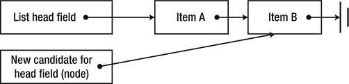

[图 6-8](#_Fig00068) 。TryPop 操作试图用新列表头替换当前列表头

您可能会认为世界上的每一个数据结构都可以使用 CAS 和类似的无锁原语来实现。事实上，现在还有一些无锁集合被广泛使用的例子:

*   无锁双向链表
*   无锁队列(有头有尾)
*   无锁简单优先级队列

然而，有很多种集合无法使用无锁代码轻松实现，并且仍然依赖于阻塞同步机制。此外，有相当多的代码需要同步，但不能使用 CAS，因为执行时间太长。我们现在来讨论“真正的”同步机制，它包括由操作系统实现的阻塞。

Windows 同步机制

Windows 为用户模式程序提供了许多同步机制，比如事件、信号量、互斥和条件变量。我们的程序可以通过句柄和 Win32 API 调用来访问这些同步机制，它们代表我们发出相应的系统调用。那个。NET Framework 将大多数 Windows 同步机制包装在面向对象的瘦包中，如 ManualResetEvent、Mutex、Semaphore 等。在现有的同步机制之上。NET 提供了几个新的，比如 ReaderWriterLockSlim 和 Monitor。我们不会详尽地检查每一种同步机制，这是最好留给 API 文档来完成的任务；然而，理解它们的一般性能特征是很重要的。

当锁不可用时，Windows 内核通过阻塞试图获取锁的线程来实现我们现在讨论的同步机制。阻塞一个线程包括将它从 CPU 中移除，将其标记为等待，并调度另一个线程来执行。该操作涉及一个系统调用，这是一个用户模式到内核模式的转换，两个线程之间的上下文切换，以及在内核中执行的一小组数据结构更新(参见[图 6-9](#Fig00069) )以将线程标记为等待，并将其与它所等待的同步机制相关联。

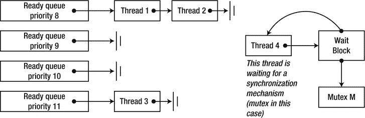

[图 6-9](#_Fig00069) 。由操作系统调度程序维护的数据。准备执行的线程放在 FIFO 队列中，按优先级排序。被阻塞的线程通过称为等待块的内部结构引用它们的同步机制

总的来说，阻塞一个线程可能会花费数千个 CPU 周期，当同步机制可用时，需要类似数量的周期来解除阻塞。很明显，如果使用内核同步机制来保护长时间运行的操作，比如向文件写入一个大的缓冲区或执行网络往返，这种开销是可以忽略的，但是如果使用内核同步机制来保护++i 这样的操作，这种开销会导致不可原谅的速度下降。

同步机制窗口和。NET 提供给应用不同之处主要在于它们的获取和释放语义，也称为它们的信号状态。当同步机制收到信号时，它会唤醒一个线程(或一组线程)等待它变得可用。下面是当前可访问的一些同步机制的信号状态语义。网络应用:

表 6-1。一些同步机制的信号状态语义

| 同步机制 | 它什么时候变得有信号？ | 哪些线程被唤醒？ |
| --- | --- | --- |
| 互斥（体）… | 当一个线程调用互斥时。释放互斥 | 正在等待互斥体的线程之一 |
| 旗语 | 当一个线程调用信号量时。释放；排放；发布 | 正在等待信号量的线程之一 |
| 手动重置事件 | 当线程调用 ManualResetEvent 时。一组 | 等待事件的所有线程 |
| 自动重置事件 | 当线程调用 AutoResetEvent 时。一组 | 正在等待事件的线程之一 |
| 班长 | 当线程调用 Monitor 时。出口 | 正在等待监视器的线程之一 |
| 屏障 | 当所有参与线程都调用了 Barrier。信号和等待 | 等待屏障的所有线程 |
| ReaderWriterLock—用于阅读 | 当没有编写器线程，或者最后一个编写器线程已经释放了用于写入的锁时 | 等待进入锁进行读取的所有线程 |
| ReaderWriterLock—用于写作 | 当没有读线程或写线程时 | 等待进入锁进行写入的线程之一 |

除了信号状态语义，一些同步机制在内部实现方面也有所不同。例如，Win32 临界区和 CLR 监视器实现了对当前可用锁的优化。通过这种优化，试图获取可用锁的线程可以直接获取它，而无需执行系统调用。另一方面，同步机制的读取器-写入器锁家族区分访问某个对象的读取器和写入器，当数据最常被读取时，这允许更好的可伸缩性。

从窗口和列表中选择合适的同步机制。NET 必须提供的功能通常是困难的，有时自定义同步机制可能提供比现有机制更好的性能特征或更方便的语义。我们将不再考虑同步机制；在编写并发应用时，您有责任在无锁同步原语和阻塞同步机制之间做出负责任的选择，并确定要使用的同步机制的最佳组合。

 **注意**如果不强调为并发性而从头设计的数据结构(集合),任何关于同步的讨论都是不完整的。这种集合是线程安全的——它们允许来自多个线程的安全访问——并且是可伸缩的，不会由于锁定而导致不合理的性能下降。关于并发集合的讨论，以及并发集合的设计，请参考第五章。

高速缓存注意事项

我们之前已经在集合实现和内存密度的上下文中讨论过处理器缓存的主题。在并行程序中，考虑单个处理器上的缓存大小和命中率同样重要，但考虑多个处理器的缓存如何交互更为重要。我们现在将考虑一个有代表性的例子，它展示了面向缓存的优化的重要性，并强调了好工具在总体性能优化方面的价值。

首先，检查下面的顺序方法。它执行对二维整数数组中的所有元素求和的基本任务，并返回结果。

```cs
public static int MatrixSumSequential(int[,] matrix) {
  int sum = 0;
  int rows = matrix.GetUpperBound(0);
  int cols = matrix.GetUpperBound(1);
  for (int i = 0; i < rows; ++i) {
    for (int j = 0; j < cols; ++j) {
    sum + = matrix[i,j];
    }
  }
  return sum;
}
```

我们的武器库中有一大套用于并行化这类程序的工具。然而，想象一下，我们没有 TPL，而是选择直接使用线程。以下并行化尝试可能看起来非常合理，足以收获多核执行的果实，甚至实现了一个粗略的聚合，以避免共享总和变量上的同步:

```cs
public static int MatrixSumParallel(int[,] matrix) {
  int sum = 0;
  int rows = matrix.GetUpperBound(0);
  int cols = matrix.GetUpperBound(1);
  const int THREADS = 4;
  int chunk = rows/THREADS; //should divide evenly
  int[] localSums = new int[THREADS];
  Thread[] threads = new Thread[THREADS];
  for (int i = 0; i < THREADS; ++i) {
    int start = chunk*i;
    int end = chunk*(i + 1);
    int threadNum = i; //prevent the compiler from hoisting the variable in the lambda capture
    threads[i] = new Thread(() => {
    for (int row = start; row < end; ++row) {
    for (int col = 0; col < cols; ++col) {
    localSums[threadNum] + = matrix[row,col];
    }
    }
    });
    threads[i].Start();
  }
  foreach (Thread thread in threads) {
    thread.Join();
  }
  sum = localSums.Sum();
  return sum;
}
```

在英特尔 i7 处理器上分别执行这两种方法 25 次，对于 2，000 × 2，000 的整数矩阵产生了以下结果:顺序方法平均在 325 毫秒内完成，而并行方法平均耗时 935 毫秒，比顺序方法慢三倍！

这显然是不可接受的，但为什么呢？这不是另一个太细粒度并行的例子，因为线程的数量只有 4 个。如果您接受这个问题在某种程度上与缓存相关的前提(因为这个例子出现在“缓存注意事项”一节)，那么测量由这两种方法引入的缓存未命中的数量是有意义的。Visual Studio 探查器(在每 2，000 次缓存未命中时采样)在并行版本中报告了 963 个独占样本，而在顺序版本中仅报告了 659 个独占样本；绝大多数样本位于从矩阵读取的内环线上。

再问一次，为什么？为什么写入 localSums 数组的代码行将比写入 sum 局部变量的代码行引入更多的缓存未命中？简单的答案是，对共享阵列*的写入使其他处理器*的缓存线无效，导致阵列上的每个+ =操作都是缓存未命中。

正如您在第 5 章中回忆的那样，处理器缓存是按缓存行组织的，相邻的内存位置共享同一个缓存行。当一个处理器写入另一个处理器的缓存中的内存位置时，硬件会导致缓存失效，将另一个处理器的缓存中的缓存线标记为无效。访问无效的高速缓存线会导致高速缓存未命中。在我们上面的例子中，很可能整个 localSums 数组适合一个缓存行，并且同时驻留在应用的线程正在其上执行的所有*四个处理器的缓存中。在任一处理器上对数组的任何元素执行的每一次写操作都会使所有其他处理器上的缓存行无效，从而导致缓存无效的持续往复(参见[图 6-10](#Fig000610) )。*

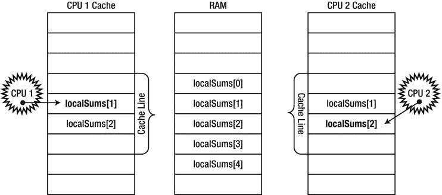

[图 6-10](#_Fig000610) 。CPU 1 写入 localSums[1]，而 CPU 2 写入 localSums[2]。因为两个数组元素是相邻的，并且适合两个处理器高速缓存中的同一高速缓存行，所以每次这样的写入都会导致另一个处理器上的高速缓存无效

为了确保问题完全与缓存失效相关，可以使阵列跨度足够大，以使缓存失效不会发生，或者将对阵列的直接写入替换为对每个线程中的局部变量的写入，该写入最终在线程完成时刷新到阵列。这两种优化都恢复了世界的健全性，并使并行版本在足够多的内核上比顺序版本更快。

缓存失效(或缓存冲突)是一个令人讨厌的问题，在实际的应用中非常难以检测，即使有强大的分析器帮助。在设计受 CPU 限制的算法时，提前考虑这一点将会为您节省大量时间，并减少以后的麻烦。

 **注意**作者在一个生产场景中遇到了一个类似的缓存失效案例，在两个不同的处理器上执行的两个线程之间有一个共享的工作项队列。当对队列类的字段的内部结构进行了某些微小的更改时，在后续的构建中会检测到显著的性能下降(大约 20%)。经过长时间的详细检查，很明显，对 queue 类中的字段进行重新排序是导致性能下降的原因；由不同线程写入的两个字段靠得太近，被放置在同一高速缓存行上。在字段之间添加填充符将队列的性能恢复到可接受的水平。

通用图形处理器计算

到目前为止，我们对并行编程的报道只局限于 CPU 内核。事实上，我们掌握了多种技能，可以在多个内核上并行化程序，同步访问共享资源，并使用高速 CPU 原语实现无锁同步。正如我们在本章开始时提到的，我们的程序还有另一个并行来源——GPU，它在现代硬件上提供了比高端 CPU 多得多的内核。GPU 核非常适合数据并行算法，其庞大的数量弥补了在其上运行程序的笨拙。在这一节中，我们将研究一种在 GPU 上运行程序的方法，使用一组名为 C++ AMP 的 C++语言扩展。

 **注意** C++ AMP 是基于 C++的，这也是为什么本节会使用 C++代码示例的原因。然而，通过使用适量的。NET 互操作性，您可以在您的。NET 应用也是如此。我们将在这一节的最后回到这个主题。

C++简介 AMPT2】

从本质上来说，GPU 是一种与其他处理器一样的处理器，具有特定的指令集、众多内核和内存访问协议。然而，现代 GPU 和 CPU 之间存在显著差异，理解它们对于编写高效的基于 GPU 的程序至关重要:

*   现代 CPU 只有一小部分指令可以在 GPU 上使用。这意味着一些限制:没有函数调用，数据类型有限，库函数缺失，等等。其他操作，如分支，可能会带来 CPU 无法比拟的性能成本。显然，这使得将大量代码从 CPU 移植到 GPU 是一项相当大的工作。
*   与中档 CPU 插槽相比，中档显卡上的内核数量要多得多。有些工作单元太小，或者不能分成足够多的部分，无法从 GPU 上的并行化中适当受益。
*   很少支持执行任务的 GPU 核之间的同步，也不支持执行不同任务的 GPU 核之间的同步。这需要在 CPU 上执行 GPU 工作的同步和编排。

什么任务适合在 GPU 上执行？

并不是每个算法都适合在 GPU 上执行。例如，GPU 不能访问其他 I/O 设备，所以你几乎不能通过使用 GPU 来提高从 Web 获取 RSS 提要的程序的性能。然而，许多 CPU 绑定的数据并行算法可以移植到 GPU，并从中获得大规模并行化。以下是一些例子(该列表绝非详尽无遗):

*   图像模糊、锐化和其他变换
*   快速傅里叶变换
*   矩阵转置和乘法
*   数字排序
*   强力哈希反转

Microsoft Native Concurrency team blog(`http://blogs.msdn.com/b/nativeconcurrency/`)是其他示例的一个很好的来源，其中有示例代码和对已经移植到 C++ AMP 的各种算法的解释。

C++ AMP 是 Visual Studio 2012 附带的一个框架，它为 C++开发人员提供了在 GPU 上运行计算的简单方法，并且只需要运行 DirectX 11 驱动程序。微软已经发布了 C++ AMP 作为一个开放的规范(在撰写本文时可以在线获得)，任何编译器供应商都可以实现它。在 C++ AMP 中，代码可以在代表计算设备的*加速器*上执行。C++ AMP 使用 DirectX 11 驱动程序动态发现所有加速器。开箱即用，C++ AMP 还附带了一个执行软件仿真的参考加速器和一个基于 CPU 的加速器 WARP，WARP 是没有 GPU 或有 GPU 但没有 DirectX 11 驱动程序并使用多核和 SIMD 指令的计算机上的合理后备。

事不宜迟，让我们考虑一个可以在 GPU 上轻松并行化的算法。下面的算法取两个相同长度的向量，计算逐点结果。没有什么比这更简单的了:

```cs
void VectorAddExpPointwise(float* first, float* second, float* result, int length) {
  for (int i = 0; i < length; ++i) {
    result[i] = first[i] + exp(second[i]);
  }
}
```

在 *CPU* 上并行化该算法需要将迭代范围分成几个块，并创建一个线程来处理每个部分。事实上，我们已经花了相当多的时间在我们的素性测试示例上——我们已经看到了如何通过手动创建线程、向线程池发出工作项以及使用并行来实现并行化。用于自动并行化功能。此外，回想一下，当在 CPU 上并行化类似的算法时，我们非常小心地避免了过于细粒度的工作项目(例如，每次迭代一个工作项目是不行的)。

在 *GPU* 上，不需要这样的小心。GPU 配备了许多可以非常快速地执行线程的内核，上下文切换的成本明显低于 CPU。下面是使用 C++ AMP 的 parallel_foreach API 所需的代码:

```cs
#include < amp.h>
#include < amp_math.h>
using namespace concurrency;
void VectorAddExpPointwise(float* first, float* second, float* result, int length) {
  array_view < const float,1 > avFirst (length, first);
  array_view < const float,1 > avSecond(length, second);
  array_view < float,1> avResult(length, result);
  avResult.discard_data();
  parallel_for_each(avResult.extent, [=](index < 1 > i) restrict(amp) {
    avResult[i] = avFirst[i] + fast_math::exp(avSecond[i]);
  });
  avResult.synchronize();
}
```

我们现在分别检查代码的每个部分。首先，保持了主循环的一般形状，尽管原来的 for 循环被替换为对 parallel_foreach 的 API 调用。事实上，将循环转换成 API 调用的原理并不新鲜——我们已经在 TPL 的 Parallel 中看到了同样的原理。对于和平行。ForEach APIs。

接下来，传递给方法的原始数据(第一个、第二个和结果参数)被包装在 array_view 实例中。array_view 类包装必须移动到加速器(GPU)的数据。它的模板参数是数据的类型及其维度。如果我们希望 GPU 执行访问最初在 CPU 上的数据的指令，一些实体必须负责将数据复制到 GPU，因为当今的大多数 GPU 都是具有自己的内存的分立设备。这是 array_view 实例的任务，它们确保按需复制数据，并且只在需要时复制。

当 GPU 上的工作完成时，数据被复制回其原始位置。通过创建带有 const 模板类型参数的 array_view 实例，我们确保第一个和第二个实例仅从 GPU 的*复制到*，而不必从 GPU 的复制回*。类似地，通过调用 discard_data 方法，我们确保 result 不会从 CPU 复制到 GPU，而只会在有值得复制的结果时从 GPU 复制到 CPU。*

parallel_foreach API 接受一个*范围*，这是我们正在处理的数据的形状，以及一个为该范围中的每个元素执行的函数。我们在上面的代码中使用了 lambda 函数，这是 2011 ISO C++标准(C++11)中对 C++的一个受欢迎的补充。restrict(amp)关键字指示编译器验证函数体是否可以在 GPU 上执行，从而禁止大部分 C++语法——不能编译为 GPU 指令的语法。

lambda 函数的参数是一个 index < 1 >对象，表示一个一维索引。这必须与我们使用的范围相匹配—如果我们声明一个二维范围(如矩阵的数据形状)，索引也必须是二维的。我们很快就会看到这样的例子。

最后，方法末尾的 synchronize 方法调用确保在 VectorAdd 返回时，CPU 上对 avResult array_view 所做的更改被复制回其原始容器 Result array 中。

这就结束了我们对 C++ AMP 世界的第一次探索，我们准备更深入地研究正在发生的事情，以及一个更好的示例，它将从 GPU 并行化中获得好处。向量加法不是最令人兴奋的算法，也不是卸载到 GPU 的好选择，因为内存传输超过了计算的并行化。在接下来的小节中，我们来看两个更有趣的例子。

矩阵乘法

我们要考虑的第一个“真实世界”的例子是矩阵乘法。我们将优化矩阵乘法的简单立方时间算法，而不是运行在亚立方时间的 Strassen 算法。给定两个适当维数的矩阵，A 是 m 乘 w，B 是 w 乘 n，下面的顺序程序产生它们的乘积，矩阵 C 是 m 乘 n:

```cs
void MatrixMultiply(int* A, int m, int w, int* B, int n, int* C) {
  for (int i = 0; i < m; ++i) {
    for (int j = 0; j < n; ++j) {
    int sum = 0;
    for (int k = 0; k < w; ++k) {
    sum + = A[i*w + k] * B[k*w + j];
    }
    C[i*n + j] = sum;
    }
  }
}
```

这里有几个并行性的来源，如果您愿意在 CPU 上并行化这段代码，那么建议我们并行化外部循环并完成它可能是正确的。然而，在 GPU 上，有足够多的内核，如果我们只并行化外部循环，我们可能无法为所有内核创建足够的工作。因此，并行化两个外部循环是有意义的，同时为内部循环留下一个丰富的算法:

```cs
void MatrixMultiply(int* A, int m, int w, int* B, int n, int* C) {
  array_view < const int,2 > avA(m, w, A);
  array_view < const int,2 > avB(w, n, B);
  array_view < int,2> avC(m, n, C);
  avC.discard_data();
  parallel_for_each(avC.extent, [=](index < 2 > idx) restrict(amp) {
    int sum = 0;
    for (int k = 0; k < w; ++k) {
    sum + = avA(idx[0]*w, k) * avB(k*w, idx[1]);
    }
    avC[idx] = sum;
  });
}
```

除了索引是二维的，由内部循环使用[]操作符访问之外，一切都与我们前面看到的顺序乘法和向量加法非常相似。与顺序 CPU 相比，这个版本怎么样？为了乘以两个 1024 × 1024 的整数矩阵，CPU 版本平均需要 7350 毫秒，而 GPU 版本——抓紧——平均需要 50 毫秒，提高了 *147 倍*！

n-体模拟

到目前为止，我们看到的例子在 GPU 上调度的内部循环中有非常琐碎的代码。显然，情况不一定总是如此。我们提到的 Native Concurrency team 博客上的一个例子演示了一个 N 体模拟，它模拟了重力作用下粒子之间的相互作用。模拟由无限数量的步骤组成；在每一步中，它必须确定每个粒子的更新的加速度矢量，然后确定它的新位置。这里的可并行化组件是粒子向量——有了足够多的粒子(几千个或更多),所有 GPU 核心都有足够的工作要同时完成。

决定两个物体之间交互结果的内核是以下代码，这些代码可以非常容易地移植到 GPU:

```cs
//float4 here is a four-component vector with pointwise operations
void bodybody_interaction(
  float4& acceleration, const float4 p1, const float4 p2) restrict(amp) {
  float4 dist = p2 – p1;
  float absDist = dist.x*dist.x + dist.y*dist.y + dist.z*dist.z; //w is unused here
  float invDist = 1.0f / sqrt(absDist);
  float invDistCube = invDist*invDist*invDist;
  acceleration + = dist*PARTICLE_MASS*invDistCube;
}
```

每个模拟步骤都采用一组粒子位置和速度，并根据模拟结果生成一组新的粒子位置和速度:

```cs
struct particle {
  float4 position, velocity;
  //ctor, copy ctor, and operator = with restrict(amp) omitted for brevity
};
void simulation_step(array < particle,1 > & previous, array < particle,1 > & next, int bodies) {
  extent < 1 > ext(bodies);
  parallel_for_each(ext, [&](index < 1 > idx) restrict(amp) {
    particle p = previous[idx];
    float4 acceleration(0, 0, 0, 0);
    for (int body = 0; body < bodies; ++body) {
    bodybody_interaction(acceleration, p.position, previous[body].position);
    }
    p.velocity + = acceleration*DELTA_TIME;
    p.position + = p.velocity*DELTA_TIME;
    next[idx] = p;
  });
}
```

有了合适的 GUI，这个模拟非常有趣。C++ AMP 团队提供的完整示例可以在 Native Concurrency 博客上找到。在作者的系统上，英特尔 i7 处理器配有 ATI 镭龙 HD 5800 显卡，10，000 个粒子的模拟从顺序 CPU 版本产生了 2.5 帧每秒(步数)和从优化 GPU 版本产生了 160 帧每秒(步数)(见[图 6-11](#Fig000611) )，这是一个令人难以置信的改进。

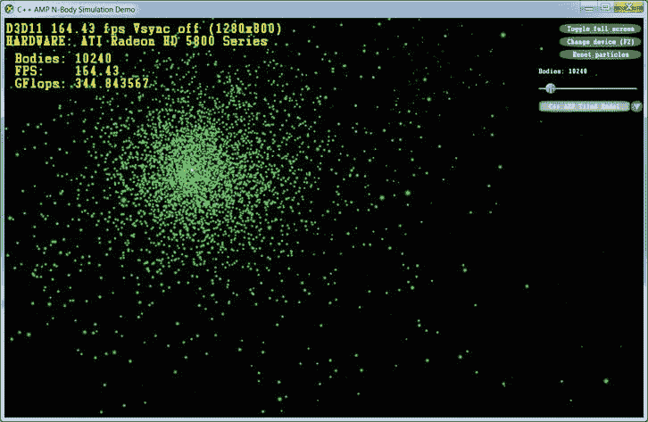

[图 6-11](#_Fig000611) 。N-body 模拟 UI 演示，展示了使用优化的 C++ AMP 实现和 10，240 个模拟粒子时>每秒 160 帧(模拟步骤)

图块和共享内存

在我们结束本节之前，C++ AMP 有一个非常重要的优化，可以进一步提高我们的 GPU 代码的性能。GPU 提供可编程数据缓存(通常称为*共享内存*)。存储在其中的值在同一个*瓦片*中的所有线程之间共享。通过使用分块内存，C++ AMP 程序可以将数据从 GPU 的主内存中一次性读取到共享的分块内存中，然后从同一个分块中的*多个*线程快速访问它，而无需从 GPU 的主内存中重新读取它。访问共享的 tile 内存比访问 GPU 的主内存快 10 倍左右——换句话说，你有理由继续阅读。

为了执行并行循环的分块版本，parallel_for_each 方法接受 tiled_extent 域和 tiled_index lambda 参数，前者将多维范围细分为多维分块，后者指定范围内的全局线程 ID 和分块内的本地线程 ID。例如，一个 16 × 16 的矩阵可以被细分成 2 × 2 的块(见[图 6-12](#Fig000612) )，然后被传递到 parallel_for_each :

```cs
extent < 2 > matrix(16,16);
tiled_extent < 2,2 > tiledMatrix = matrix.tile < 2,2 > ();
```

parallel_for_each(tiledMatrix，[=](tiled _ index< 2,2 >idx)restrict(amp){。。。});

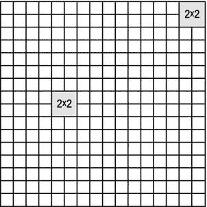

[图 6-12](#_Fig000612) 。一个 16 × 16 的矩阵被分成 2 × 2 的小块。属于同一瓦片的每四个线程可以在它们之间共享数据

在 GPU 内核中，idx.global 可以用来代替我们之前在矩阵上执行操作时看到的标准索引< 2 >。但是，巧妙使用本地图块内存和本地图块索引可以获得显著的性能优势。为了声明在同一个 tile 中的所有线程之间共享的 tile 特定的内存，tile_static storage 说明符可以应用于内核内部的局部变量。通常声明一个共享内存位置，并让 tile 中的每个线程初始化其中的一小部分:

```cs
parallel_for_each(tiledMatrix, [=](tiled_index < 2,2 > idx) restrict(amp) {
  tile_static int local[2][2]; //32 bytes shared between all threads in the tile
  local[idx.local[0]][idx.local[1]] = 42; //assign to this thread's location in the array
});
```

显然，只有当所有线程都能够同步它们对共享内存的访问时，才可能从同一个块中的其他线程共享的内存中获得任何好处；即，在它们的相邻线程初始化它们之前，它们不应该试图访问共享存储器位置。tile_barrier 对象同步 tile 中所有线程的执行——它们可以在调用 tile_barrier.wait 之后继续执行，只有在 tile 中的所有线程也调用 tile_barrier.wait 之后(这类似于 TPL 的 barrier 类)。例如:

```cs
parallel_for_each(tiledMatrix, [](tiled_index < 2,2 > idx) restrict(amp) {
  tile_static int local[2][2]; //32 bytes shared between all threads in the tile
  local[idx.local[0]][idx.local[1]] = 42; //assign to this thread's location in the array
  idx.barrier.wait(); //idx.barrier is a tile_barrier instance
  //Now this thread can access "local" at other threads' indices!
});
```

现在是时候将所有这些知识应用到一个具体的例子中了。我们将重新讨论之前在没有平铺的情况下实现的矩阵乘法算法，并在其中引入基于平铺的优化。让我们假设矩阵维数可被 256 整除——这允许我们使用 16 × 16 的线程块。矩阵乘法包含固有的阻塞，这可以为我们所用(事实上，CPU 上极大矩阵乘法最常见的优化之一是通过使用阻塞来获得更好的缓存行为)。主要的观察可以归结为以下几点。为了找到 *C* <sub>*i，j*</sub> (结果矩阵中行 *i* 和列 *j* 的元素)，我们必须找到 *A* <sub>*i，**</sub> (第一个矩阵的整个*I*-第行)和 *B* <sub>**，j*</sub> 之间的标量积但是，这相当于求部分行和部分列的标量积，并将结果相加。我们可以用它来将我们的矩阵乘法算法转换成平铺的版本:

```cs
void MatrixMultiply(int* A, int m, int w, int* B, int n, int* C) {
  array_view < const int,2 > avA(m, w, A);
  array_view < const int,2 > avB(w, n, B);
  array_view < int,2> avC(m, n, C);
  avC.discard_data();
  parallel_for_each(avC.extent.tile < 16,16 > (), [=](tiled_index < 16,16 > idx) restrict(amp) {
    int sum = 0;
    int localRow = idx.local[0], localCol = idx.local[1];
    for (int k = 0; k < w; k += 16) {
    tile_static int localA[16][16], localB[16][16];
    localA[localRow][localCol] = avA(idx.global[0], localCol + k);
    localB[localRow][localCol] = avB(localRow + k, idx.global[1]);
    idx.barrier.wait();
    for (int t = 0; t < 16; ++t) {
    sum + = localA[localRow][t]*localB[t][localCol];
    }
    idx.barrier.wait(); //to avoid having the next iteration overwrite the shared memory
    }
    avC[idx.global] = sum;
  });
}
```

分块优化的本质是分块中的每个线程(有 256 个线程，分块为 16 × 16)在来自 *A* 和 *B* 输入矩阵的子块的 16 × 16 本地副本中初始化它自己的元素(参见[图 6-13](#Fig000613) )。瓦片中的每个线程只需要这些子块的一行和一列，但是所有线程一起将访问每行 16 次和每列 16 次，显著减少了主存储器访问的次数。

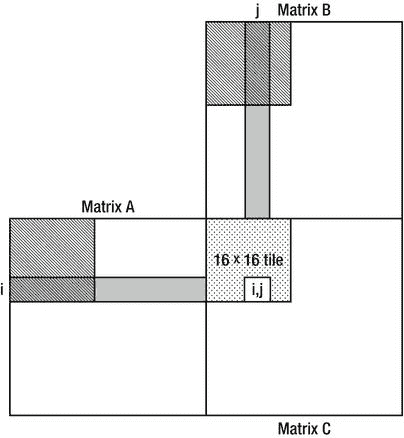

[图 6-13](#_Fig000613) 。为了找到结果矩阵中的元素(I，j ),该算法需要第一个矩阵的整个第 I 行和第二个矩阵的第 j 列。当图中所示的 16 × 16 tile 中的线程执行且 k = 0 时，第一个和第二个矩阵中的阴影区域最终将被读入共享内存。负责结果矩阵中第(I，j)个元素的线程将具有来自第 I 行的前 k 个元素与来自第 j 行的前 k 个元素的部分标量积

在这种情况下，平铺是一种值得的优化。矩阵乘法的平铺版本比简单版本的执行速度快得多，平均需要 17 毫秒才能完成(使用相同的 1024 × 1024 矩阵)。与 CPU 版本相比， 的速度提升了 *430 倍！*

在我们结束 C++ AMP 之前，有必要提一下可供 C++ AMP 开发人员使用的开发工具(Visual Studio)。Visual Studio 2012 有一个 GPU 调试器，可以用来在 GPU 内核中放置断点，检查模拟调用栈，读取和修改局部变量(有些加速器支持 GPU 调试；对于其他应用，Visual Studio 使用软件仿真器)和一个分析器，该分析器可用于评估您的应用从使用 GPU 并行化中获得了什么。有关 Visual Studio GPU 调试体验的更多信息，请参考 MSDN 的文章“演练:调试 C++ AMP 应用”，位于`http://msdn.microsoft.com/en-us/library/hh368280(v=VS.110).aspx`。

。GPGPU 计算的 NET 替代方案

尽管到目前为止，这一整节都专门讨论了 C++，但是从托管应用中利用 GPU 的能力有几种选择。一种选择是使用托管-本机互操作性(在第 8 章中讨论过)，遵从本机 C++组件来实现 GPU 内核。如果您喜欢 C++ AMP，或者有一个可重用的 C++ AMP 组件，既可以在托管应用中使用，也可以在本地应用中使用，那么这是一个合理的选择。

另一种选择是使用一个库，直接从托管代码中使用 GPU。有几个这样的库可用，例如 GPU.NET 和 CUDAfy.NET(都是商业提供)。这里有一个来自 GPU.NET GitHub 库的例子，展示了两个向量的标量积:

```cs
[Kernel]
public static void MultiplyAddGpu(double[] a, double[] b, double[] c) {
 int ThreadId = BlockDimension.X * BlockIndex.X + ThreadIndex.X;
 int TotalThreads = BlockDimension.X * GridDimension.X;
 for (int ElementIdx = ThreadId; ElementIdx < a.Length; ElementIdx += TotalThreads) {
 c[ElementIdx] = a[ElementIdx] * b[ElementIdx];
}
}
```

在作者看来，语言扩展(C++ AMP 方法)比纯粹在库级别上试图弥合差距或通过引入重要的 IL 重写更有效，也更容易学习。

这一节几乎没有触及 C++ AMP 提供的可能性的表面。我们只看了一些 API，并行化了一两个算法。如果你对 C++ AMP 的更多细节感兴趣，我们强烈推荐 Kate Gregory 和 Ade Miller 的书《C++ AMP:用 Microsoft Visual C++加速大规模并行性》(微软出版社，2012)。

摘要

通过本章的学习，并行化已经成为性能优化工作的重要工具。在世界各地的许多服务器和工作站上，CPU 和 GPU 闲置并浪费了宝贵的硬件资源，因为应用未能发挥机器的全部计算能力。有了任务并行库，利用所有可用的 CPU 内核比以前更容易了，尽管同步问题、超额订阅和不平等的工作分配留下了一些有趣的问题和陷阱需要处理。在 GPU 方面，C++ AMP 和其他通用 GPU 计算库正在蓬勃发展，它们的算法和 API 可以在数百个 GPU 核心上并行化您的代码。最后，本章未探讨的是分布式计算带来的性能提升，即*云*，这是当今 IT 的最大趋势。****