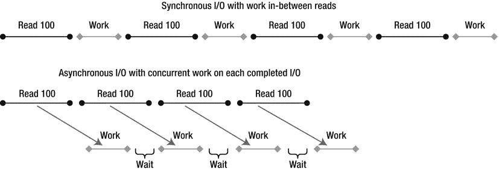
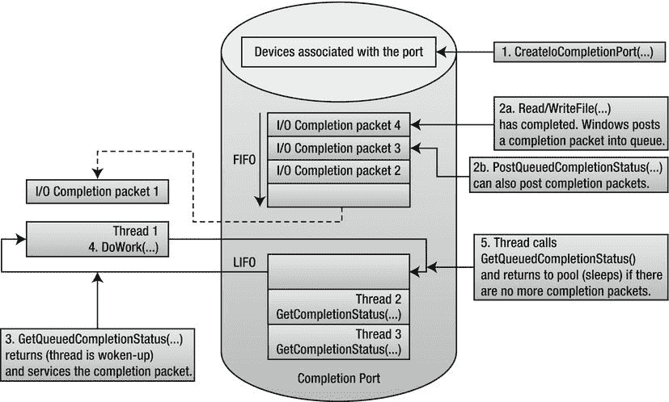
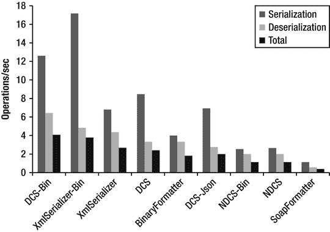
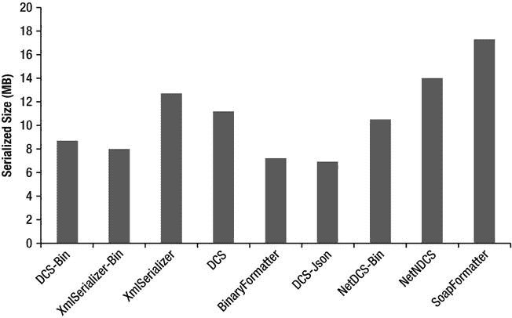

# 七、网络、I/O、串行化

本书的大部分内容集中在优化应用性能的计算方面。我们已经看到了无数的例子，比如调优垃圾收集，并行化循环和递归算法，甚至通过提出更好的算法来降低运行时成本。

对于某些应用，只优化计算方面会导致有限的性能提升，因为性能瓶颈在于 I/O 工作，如网络传输或磁盘访问。根据我们的经验，现场遇到的相当一部分性能问题并不是由未优化的算法或过度的 CPU 利用率引起的，而是由于系统 I/O 设备的低效利用。让我们考虑优化 I/O 可以带来性能提升的两种情况:

*   由于 I/O 的低效使用，应用可能会产生大量的计算(CPU)开销，这是以有用功为代价的。更糟糕的是，这种开销可能非常高，以至于成为实现 I/O 设备全部潜在容量的限制因素。
*   I/O 设备可能未得到充分利用，或者由于低效的使用模式而浪费了其容量，例如进行许多小型 I/O 传输，或者未能保持通道得到充分利用。

本章讨论提高 I/O 性能的一般策略，特别是网络 I/O 性能。此外，我们还讨论了序列化性能，并比较了几种序列化程序。

通用输入/输出概念

本节探讨了 I/O 概念，并提供了与任何类型的 I/O 相关的性能指南。这个建议适用于网络应用、繁重的磁盘访问过程，甚至是为访问定制的高带宽硬件设备而设计的软件。

同步和异步输入/输出

对于同步 I/O，I/O 传递函数(例如 ReadFile、WriteFile 或 DeviceIoControl Win32 API 函数)会一直阻塞，直到 I/O 操作完成。这种模式虽然用起来很方便，但是效率不是很高。在发出连续 I/O 请求的时间间隔内，设备可能处于空闲状态，因此可能未得到充分利用。同步 I/O 的另一个问题是，对于每个并发的 I/O 请求，线程都被“浪费”了。例如，在一个并发服务于许多客户机的服务器应用中，您可能最终会为每个会话创建一个线程。这些线程基本上都是空闲的，它们正在浪费内存，并可能造成一种称为*线程颠簸*的情况，其中许多线程在 I/O 完成时醒来，并相互竞争 CPU 时间，导致许多上下文切换和较差的可伸缩性。

Windows I/O 子系统(包括设备驱动程序)是内部异步的——当 I/O 操作正在进行时，程序流的执行可以继续。几乎所有现代硬件本质上都是异步的，不需要轮询来传输数据或确定 I/O 操作是否完成。相反，大多数设备依靠直接内存访问(DMA)控制器在设备和计算机 RAM 之间传输数据，在传输过程中不需要 CPU 的注意，然后发出中断信号以表示数据传输完成。只有在应用级别，Windows 才允许内部实际异步的同步 I/O。

在 Win32 中，异步 I/O 被称为*重叠*T3】I/O(参见[图 7-1](#Fig00071) 比较同步和重叠 I/O)。一旦应用发出重叠的 I/O，Windows 要么立即完成 I/O 操作，要么返回指示 I/O 操作仍处于挂起状态的状态代码。然后线程可以发出更多的 I/O 操作，或者它可以做一些计算工作。程序员有几种选择来接收关于 I/O 操作完成的通知:



[图 7-1](#_Fig00071) 。*同步和重叠 I/O 的比较*

*   Win32 事件的信号:当 I/O 完成时，对此事件的等待操作也将完成。
*   通过异步过程调用(APC)机制调用用户回调例程:发布线程必须处于 *alertable wait* 状态才能允许 APC。
*   通过 I/O 完成端口通知:这通常是最有效的机制。我们将在本章后面详细探讨 I/O 完成端口。

 **注意**如果应用可以保持少量 I/O 请求挂起，一些 I/O 设备(例如以无缓冲模式打开的文件)会受益(通过提高设备利用率)。推荐的策略是预先发出一定数量的 I/O 请求，并且对于每个完成的请求，重新发出另一个请求。这确保了设备驱动程序可以尽快启动下一个 I/O，而无需等待应用发出下一个 I/O 响应。但是，不要夸大挂起数据的数量，因为它会消耗有限的内核内存资源。

输入输出完成端口

Windows 提供了一种高效的异步 I/O 完成通知机制，称为 *I/O 完成端口* (IOCP) 。它是通过。NET 线程池。BindHandle 方法。几个。处理 I/O 的. NET 类型在内部利用这种功能:FileStream、Socket、SerialPort、HttpListener、PipeStream 等等。NET 远程处理信道。

一个 IOCP(见[图 7-2](#Fig00072) )与零个或多个以重叠模式打开的 I/O 句柄(套接字、文件和专用设备驱动程序对象)以及用户创建的线程相关联。一旦相关联的 I/O 句柄的 I/O 操作完成，Windows 将完成通知排队到适当的 IOCP，并且相关联的线程处理完成通知 。通过拥有服务于完成的线程池和智能地控制线程唤醒，减少了上下文切换并最大化了多处理器并发性。高性能服务器(如 Microsoft SQL Server)使用 I/O 完成端口不足为奇。



[图 7-2](#_Fig00072) 。*I/O 完成端口的结构和操作*

通过调用 CreateIoCompletionPortWin32 API 函数、传递最大并发值、完成键并可选地将其与支持 I/O 的句柄相关联，来创建完成端口。完成键是用户指定的值，用于在完成时区分不同的 I/O 句柄。通过再次调用 CreateIoCompletionPort 并指定现有的完成端口句柄，可以将更多的 I/O 句柄与相同或不同的 IOCP 相关联。

然后，用户创建的线程调用 GetCompletionStatus 绑定到指定的 IOCP 并等待完成。一个线程一次只能绑定到一个 IOCP。GetQueuedCompletionStatus 会一直阻塞，直到有可用的 I/O 完成通知(或超时时间已过)，此时它会返回 I/O 操作的详细信息，如传输的字节数、完成键和 I/O 期间传递的重叠结构。如果另一个 I/O 在所有关联线程都忙时完成(即，在 GetQueuedCompletionStatus 上没有阻塞)，IOCP 会按 LIFO 顺序唤醒另一个线程，直到达到最大并发值。如果线程调用 GetQueuedCompletionStatus 并且通知队列不为空，则调用会立即返回，而不会在 OS 内核中阻塞线程。

还可以通过调用 PostQueuedCompletionStatus 来手动发布完成通知，而不涉及 I/O。

下面的代码清单显示了一个使用 ThreadPool 的示例。Win32 文件句柄上的 BindHandle。首先来看 TestIOCP 方法 。在这里，我们调用 CreateFile，这是一个 P/Invoke'd Win32 函数，用于打开或创建文件或设备。我们必须指定 EFileAttributes。调用中的 Overlapped 标志，以使用任何类型的异步 I/o。create file 如果成功，将返回 Win32 文件句柄，然后我们将绑定到该句柄。我们通过调用 ThreadPool.BindHandle 来创建一个自动重置事件，该事件用于在进行中的 I/O 操作太多的情况下临时阻止线程发出 I/O 操作(限制由 MaxPendingIos 常量设置)。

然后，我们开始一个异步写操作循环。在每次迭代中，我们分配一个包含要写入的数据的缓冲区。我们还分配了一个 Overlapped 结构，其中包含文件偏移量(在这里，我们总是写入偏移量 0)、一个在 I/O 完成时发出信号的事件句柄(不用于 I/O 完成端口)以及一个可选的用户创建的 IAsyncResult 对象，该对象可用于将状态传递给完成函数。然后我们调用 Overlapped structure 的 Pack 方法 ，它以完成函数和数据缓冲区作为参数。它从非托管内存中分配一个等效的本机重叠结构，并固定数据缓冲区。本机结构必须手动释放，以释放它所占用的非托管内存，并取消固定托管缓冲区。

如果没有太多正在进行的 I/O 操作，我们调用 WriteFile，同时指定本机重叠结构。否则，我们会一直等待，直到事件变为有信号状态，这表明挂起的 I/O 操作数已降至限制以下。

I/O 完成函数 WriteComplete 由调用。当 I/O 完成时，NET I/O 完成线程池线程。它接收指向本机重叠结构的指针，该指针可以被解包以将其转换回托管重叠结构 。

```cs
using System;
using System.Threading;
using Microsoft.Win32.SafeHandles;
using System.Runtime.InteropServices;

[DllImport("kernel32.dll", SetLastError = true, CharSet = CharSet.Auto)]
internal static extern SafeFileHandle CreateFile(
  string lpFileName,
  EFileAccess dwDesiredAccess,
  EFileShare dwShareMode,
  IntPtr lpSecurityAttributes,
  ECreationDisposition dwCreationDisposition,
  EFileAttributes dwFlagsAndAttributes,
  IntPtr hTemplateFile);

[DllImport("kernel32.dll", SetLastError = true)]
[return: MarshalAs(UnmanagedType.Bool)]
static unsafe extern bool WriteFile(SafeFileHandle hFile, byte[] lpBuffer,
  uint nNumberOfBytesToWrite, out uint lpNumberOfBytesWritten,
  System.Threading.NativeOverlapped *lpOverlapped);

[Flags]
enum EFileShare : uint {
  None = 0x00000000,
  Read = 0x00000001,
  Write = 0x00000002,
  Delete = 0x00000004
}

enum ECreationDisposition : uint {
  New = 1,
  CreateAlways = 2,
  OpenExisting = 3,
  OpenAlways = 4,
  TruncateExisting = 5
}

[Flags]
enum EFileAttributes : uint {
  //Some flags not present for brevity
  Normal = 0x00000080,
  Overlapped = 0x40000000,
  NoBuffering = 0x20000000,
}

[Flags]
enum EFileAccess : uint {
  //Some flags not present for brevity
  GenericRead = 0x80000000,
  GenericWrite = 0x40000000,
}

static long _numBytesWritten;
static AutoResetEvent _waterMarkFullEvent; // throttles writer thread
static int _pendingIosCount;

const int MaxPendingIos = 10;

//Completion routine called by .NET ThreadPool I/O completion threads
static unsafe void WriteComplete(uint errorCode, uint numBytes, NativeOverlapped* pOVERLAP) {
  _numBytesWritten + = numBytes;
  Overlapped ovl = Overlapped.Unpack(pOVERLAP);

  Overlapped.Free(pOVERLAP);
  //Notify writer thread that pending I/O count fell below watermark
  if (Interlocked.Decrement(ref _pendingIosCount) < MaxPendingIos)
  _waterMarkFullEvent.Set();
}

static unsafe void TestIOCP() {
    //Open file in overlapped mode
    var handle = CreateFile(@"F:\largefile.bin",
     EFileAccess.GenericRead | EFileAccess.GenericWrite,
     EFileShare.Read | EFileShare.Write,
     IntPtr.Zero, ECreationDisposition.CreateAlways,
     EFileAttributes.Normal | EFileAttributes.Overlapped, IntPtr.Zero);

     _waterMarkFullEvent = new AutoResetEvent(false);
  ThreadPool.BindHandle(handle);
  for (int k = 0; k < 1000000; k++) {
    byte[] fbuffer = new byte[4096];

    //Args: file offset low & high, event handle, IAsyncResult object
    Overlapped ovl = new Overlapped(0, 0, IntPtr.Zero, null);
    //The CLR takes care to pin the buffer
    NativeOverlapped* pNativeOVL = ovl.Pack(WriteComplete, fbuffer);
    uint numBytesWritten;

    //Check if too many I/O requests are pending
    if (Interlocked.Increment(ref _pendingIosCount) < MaxPendingIos) {
  if (WriteFile(handle, fbuffer, (uint)fbuffer.Length, out numBytesWritten,
  pNativeOVL)) {
  //I/O completed synchronously
  _numBytesWritten + = numBytesWritten;
  Interlocked.Decrement(ref _pendingIosCount);
  } else {
  if (Marshal.GetLastWin32Error() ! = ERROR_IO_PENDING) {
  return; //Handle error
  }
  }
  } else {
    Interlocked.Decrement(ref _pendingIosCount);
    while (_pendingIosCount > = MaxPendingIos) {
    _waterMarkFullEvent.WaitOne();
   }
    }
   }
}

```

总之，当使用高吞吐量 I/O 设备时，使用带有完成端口的重叠 I/O，方法是直接在非托管库中创建和使用自己的完成端口，或者将 Win32 句柄与。NET 的完成端口。

网络线程池

那个。NET 线程池 有多种用途，每种用途由不同种类的线程提供服务。[第 6 章](06.html)展示了线程池 API，我们用它来挖掘线程池的能力，以并行处理 CPU 受限的计算。然而，线程池适用于许多类型的工作:

*   *工作线程*处理用户委托的异步调用(例如 BeginInvoke 或 ThreadPool。QueueUserWorkItem)。
*   *I/O 完成线程*处理全局 IOCP 的完成。
*   *等待线程*处理注册等待。注册等待通过将几个等待合并为一个等待(使用 WaitForMultipleObjects)来节省线程，最多可达 Windows 限制(MAXIMUM_WAIT_OBJECTS = 64)。注册等待用于不使用 I/O 完成端口的重叠 I/O。
*   *定时器线程*组合等待多个定时器。
*   *Gate thread* 监控线程池线程的 CPU 使用情况，并增加或减少线程数量(在预设限制内)以获得最佳性能。

 **注意**你可以发出一个看似异步的 I/O 操作，尽管它实际上并不是。比如调用 ThreadPool。委托上的 QueueUserWorkItem，然后执行同步 I/O 操作并不能使它成为真正的异步，并不比在常规线程上执行更好。

复制内存

通常，从硬件设备接收的数据缓冲区被一遍又一遍地复制，直到应用完成对它的处理。复制会成为 CPU 开销的重要来源，因此，对于高吞吐量 I/O 代码路径，应该避免复制。我们现在调查一些复制数据的场景以及如何避免复制。

非托管内存

英寸 NET 中，使用非托管内存缓冲区比使用托管字节【】更麻烦，所以程序员通常采取简单的方法，只是将缓冲区复制到托管内存中。

如果您的 API 或库允许您指定自己的内存缓冲区或具有用户定义的分配器回调，请分配一个托管缓冲区并固定它，以便可以通过指针和托管引用来访问它。如果缓冲区太大(> 85，000 字节)，它被分配在大型对象堆中，请尝试重用该缓冲区。如果由于不确定的对象生存期而导致重用不重要，那么使用内存池，如第 8 章中的[所述。](08.html)

在其他情况下，API 或库坚持分配自己的(非托管)内存缓冲区。您可以使用指针(需要不安全的代码)或使用包装类(如 UnmanagedMemoryStream 或 UnmanagedMemoryAccessor)直接访问它。但是，如果您需要将缓冲区传递给一些只处理 byte[]或 string 对象的代码，复制可能是不可避免的。

即使您无法避免复制内存，如果您的部分或大部分数据在早期被过滤(例如网络数据包)，也可以通过先检查数据是否有用而不复制它来避免不必要的内存复制。

暴露缓冲区的部分

正如第 8 章所解释的，程序员有时会假设一个字节[]只包含所需的数据，并且从开始一直延续到结束，迫使调用者拼接缓冲区(分配一个新的字节[]并只复制所需的部分)。这种情况经常在解析协议栈时出现。相比之下，等效的非托管代码将接受一个指针，不知道它是否指向分配的开始，并且必须接受一个长度参数来告诉它数据的结束位置。

为了避免不必要的内存复制，在使用 byte[]参数的地方使用 offset 和 length 参数。使用 length 参数代替数组的 Length 属性，并将偏移量值添加到索引中。

分散–收集 I/O

scatter–gather 是一种 Windows I/O 功能，支持 I/O 在一组不连续的内存位置之间来回传输，就像它们是连续的一样。Win32 通过 ReadFileScatter 和 WriteFileGather 函数公开了这一功能。Windows Sockets 库也通过自己的函数支持分散-聚集:WSASend、WSARecv 以及其他函数。

分散-聚集在以下情况下很有用:

*   每个数据包的有效载荷前都有一个固定的报头。这使您不必每次都复制头来创建连续的缓冲区。
*   您希望通过在一个系统调用中对多个缓冲区执行 I/O 来节省系统调用开销。

虽然 ReadFileScatter 和 WriteFileGather 有局限性，因为每个缓冲区必须正好是系统页面大小，并且这些函数要求句柄以重叠和无缓冲的方式打开(这施加了更多的约束)，但基于套接字的分散收集更实用，因为它没有这些限制。那个。NET Framework 通过套接字的 Send 和 Receive 方法的重载来公开套接字分散-收集，但不公开一般的分散/收集函数。

分散-聚集用法的一个例子是 HttpWebRequest。它将 HTTP 头和有效负载结合在一起，而不需要构建一个连续的缓冲区来保存这两者。

文件输入/输出

通常，文件 I/O 通过文件系统缓存，这有一些性能优势:缓存最近访问的数据、预读(推测性地从磁盘预取数据)、后写(异步地将数据写入磁盘)以及合并小型写入。通过向 Windows 提示您期望的文件访问模式，您可以获得更高的性能。如果您的应用确实有重叠的 I/O，并且能够智能地处理一些复杂的缓冲区，那么完全绕过缓存会更有效。

缓存提示

创建或打开文件时，您可以为 CreateFile Win32 API 函数指定标志和属性，其中一些会影响缓存行为:

*   FILE_FLAG_SEQUENTIAL_SCAN 向缓存管理器提示文件是顺序访问的，可能会跳过某些部分，但很少随机访问。缓存将进一步提前读取。
*   FILE_FLAG_RANDOM_ACCESS 提示文件是以随机顺序访问的，因此缓存管理器提前读取的数据较少，因为应用实际上不太可能会请求这些数据。
*   FILE_ATTRIBUTE_TEMPORARY 提示文件是临时的，因此可以延迟刷新磁盘写入(以防止数据丢失)。

NET 通过接受 FileOptions 枚举参数的 FileStream 构造函数重载来公开这些选项(最后一个选项除外)。

 **注意**随机存取不利于性能，尤其是在磁盘介质上，因为读/写磁头必须物理移动。从历史上看，磁盘吞吐量随着平均存储密度的增加而提高，但延迟却没有。现代磁盘可以智能地(将磁盘旋转考虑在内)对随机存取 I/O 进行重新排序，从而最大限度地减少磁头移动的总时间。这被称为本地命令队列(NCQ)。为了有效地工作，磁盘控制器必须预先知道几个 I/O 请求。换句话说，如果可能的话，应该有几个异步 I/O 请求挂起。

无缓冲输入/输出

无缓冲 I/O 完全绕过 Windows 缓存。这既有好处也有坏处。与缓存提示一样，无缓冲 I/O 是在文件创建期间通过“标志和属性”参数启用的，但是。NET 不公开此功能:

*   FILE_FLAG_NO_BUFFERING 防止读取或写入的数据被缓存，但对磁盘控制器的硬件缓存没有影响。这避免了内存复制(从用户缓冲区到缓存)并防止缓存污染(以牺牲更重要的数据为代价用无用的数据填充缓存)。但是，读取和写入必须遵守对齐要求。以下参数必须与磁盘扇区大小对齐，或者其大小是磁盘扇区大小的整数倍:I/O 传输大小、文件偏移量和内存缓冲区地址。通常，扇区大小为 512 字节长。最近的高容量磁盘驱动器具有 4，096 字节扇区(称为“高级格式”)，但它们可以在模拟 512 字节扇区的兼容模式下运行(以性能为代价)。
*   FILE_FLAG_WRITE_THROUGH 指示缓存管理器刷新缓存的写入(如果 FILE_FLAG_NO_BUFFERING 未指定),并指示磁盘控制器立即将写入提交到物理介质，而不是将它们存储在硬件缓存中。

预读通过保持磁盘利用率来提高性能，即使应用进行同步读取，并且读取之间有延迟。这取决于 Windows 正确预测应用下一步将请求文件的哪一部分。通过禁用缓冲，您还可以禁用预读，并通过挂起多个重叠的 I/O 操作来保持磁盘繁忙。

Write-behind 还通过给人一种磁盘写入很快完成的错觉，提高了进行同步写入的应用的性能。应用可以更好地利用 CPU，因为它阻塞的时间更少。当禁用缓冲时，写入会在将其写入磁盘的实际时间内完成。因此，当使用无缓冲 I/O 时，进行异步 I/O 变得更加重要。

建立关系网

网络访问是大多数现代应用的基本功能。处理客户端请求的服务器应用努力最大化可伸缩性及其吞吐能力，以便更快地为客户端提供服务，并在每台服务器上为更多的客户端提供服务，而客户端的目标是最小化网络访问延迟或减轻其影响。本节提供了最大限度提高网络性能的建议和提示。

网络协议

应用网络协议(OSI 第 7 层)的构建方式对性能有着深远的影响。本节探讨了一些优化技术，以更好地利用可用的网络容量并最小化开销。

流水线作业

在非流水线协议中，客户端向服务器发送请求，然后等待响应到达，然后才能发送下一个请求。使用这种协议，网络容量没有得到充分利用，因为在网络往返时间(即网络数据包到达服务器并返回所需的时间)期间，网络是空闲的。相反，在管道连接中，客户端可以继续发送更多的请求，甚至在服务器处理完之前的请求之前。更好的是，服务器可以决定不按顺序响应请求，首先响应琐碎的请求，而推迟处理计算要求更高的请求。

管道化 越来越重要，因为尽管互联网带宽在全球范围内持续增长，但延迟的改善速度却慢得多，因为它受到光速所施加的物理限制的限制。

HTTP 1.1 是真实协议中管道的一个例子，但是由于兼容性问题，它在大多数服务器和 web 浏览器上通常是默认禁用的。Google SPDY，一个实验性的类似 HTTP 的协议，由 Chrome 和 Firefox web 浏览器以及一些 HTTP 服务器支持，以及即将到来的 HTTP 2.0 协议要求管道支持。

流式传输

流媒体不仅仅用于视频和音频，还可以用于信息传递。通过流式传输，应用甚至在完成之前就开始通过网络发送数据。流式传输减少了延迟并提高了网络通道利用率。

例如，如果服务器应用为响应请求而从数据库中获取数据，它可以将数据一个一个地读入数据集(这会消耗大量内存)，也可以使用 DataReader 一次检索一条记录。在前一种方法中，服务器必须等到整个数据集到达后才能开始向客户机发送响应，而在后一种方法中，服务器可以在第一个 DB 记录到达后立即开始向客户机发送响应。

消息分块

通过网络一次发送一小块数据是一种浪费。以太网、IP 和 TCP/UDP 报头并没有变小，因为有效负载变小了，所以尽管带宽利用率仍然很高，但最终您会将它浪费在报头上，而不是实际的数据上。此外，Windows 本身的每次调用开销与数据块大小无关或很少相关。一个协议可以通过允许几个请求被组合来减轻这个问题。例如，域名服务(DNS)协议允许客户端在一个请求中解析多个域名。

闲聊协议

有时，即使协议允许，客户端也不能通过管道发送请求，因为下一个请求取决于前面的回复的内容。

考虑一个聊天式协议会话 的例子。当您浏览到一个网页时，浏览器通过 TCP 连接到 web 服务器，发送一个 HTTP GET 请求来请求您要访问的 URL，并接收一个 HTML 页面作为响应。然后，浏览器解析 HTML，确定需要检索哪些 JavaScript、CSS 和图像资源，并分别下载它们。然后执行 JavaScript 脚本，它可以获取更多的内容。总之，客户机并不立即知道它必须检索来呈现页面的所有内容。相反，它必须反复获取内容，直到发现并下载所有内容。

为了缓解这个问题，服务器可能会提示客户端需要检索哪些 URL 来呈现页面，甚至可能在客户端没有请求的情况下发送内容。

消息编码和冗余

网络带宽通常是一种有限的资源，而浪费的消息格式对性能没有帮助。以下是优化消息格式的一些技巧:

*   不要一遍又一遍地发送相同的内容，保持标题较小。
*   对数据使用智能编码或表示。例如，字符串可以用 UTF 8 编码，而不是 UTF-16。二进制协议比人类可读的协议要简洁许多倍。如果可能，避免封装，如 Base64 编码。
*   对高度可压缩的数据(如文本)使用压缩。对于不可压缩的数据，如已经压缩的视频、图像和音频，请避免使用它。

网络插座

套接字 API 是应用使用网络协议(如 TCP 和 UDP)的标准方式。最初，sockets API 是在 BSD UNIX 操作系统中引入的，此后几乎成为所有操作系统的标准，有时还带有专有扩展，如微软的 WinSock。在 Windows 中有许多方法可以实现套接字 I/O:阻塞、带有轮询的非阻塞和异步。使用正确的 I/O 模型和套接字参数可以实现更高的吞吐量、更低的延迟和更好的可扩展性。本节概述了与 Windows 套接字相关的性能优化。

异步套接字

。NET 通过 Socket 类支持异步 I/O。然而，异步 API 有两个家族:BeginXXX 和 XXXAsync，其中 XXX 代表接受、连接、接收、发送和其他操作。前者使用。NET 线程池的注册等待功能来等待重叠的 I/O 完成，而后者使用。NET 线程池的 I/O 完成端口机制，这是更高的性能和可伸缩性。后面的 API 是在中引入的。NET 框架 2.0 SP1。

套接字缓冲区

Socket 对象公开了两个可设置的缓冲区大小:ReceiveBufferSize 和 SendBufferSize，它们指定 TCP/IP 堆栈分配的缓冲区大小(在 OS 内存空间中)。默认情况下，两者都设置为 8，192 字节。接收缓冲区用于保存应用尚未读取的接收数据。发送缓冲区用于保存应用已经发送但尚未被接收方确认的数据。如果需要重新传输，来自发送缓冲区的数据将被重新传输。

当应用从套接字读取数据时，它会根据读取的数据量来填充接收缓冲区。当接收缓冲区变空时，调用要么阻塞，要么挂起，这取决于使用的是同步还是异步 I/O。

当应用写入套接字时，它可以无阻塞地写入数据，直到发送缓冲区已满而无法容纳数据，或者直到接收方的接收缓冲区变满。接收方通过每个确认通告其接收缓冲区大小有多满。

对于高带宽、高延迟的连接，如卫星链路，默认的缓冲区大小可能太小。发送端很快填满其发送缓冲区，并不得不等待确认，由于等待时间长，确认到达的速度很慢。等待时，管道不会保持满，端点仅利用可用带宽的一部分。

在完全可靠的网络中，理想的缓冲区大小是带宽和延迟的乘积。例如，在往返时间为 5 毫秒的 100Mbps 连接中，理想的缓冲区窗口大小应为(100，000，000 / 8) × 0.005 = 62，500 字节。数据包丢失会降低该值。

纳格尔算法

如前所述，小数据包是一种浪费，因为与有效负载相比，数据包报头可能很大。Nagle 的算法 通过将应用的多次写入合并成一个完整数据包的数据，提高了 TCP 套接字的性能。然而，这项服务并不是免费的，因为它会在发送数据之前引入延迟。对延迟敏感的应用应该通过设置套接字来禁用 Nagle 的算法。NoDelay 属性设置为 true。一个编写良好的应用一次会发送大量缓冲区，不会从 Nagle 的算法中受益。

注册输入输出

Registered I/O (RIO) 是 WinSock 在 Windows Server 2012 中的新扩展，提供了非常高效的缓冲区注册和通知机制。RIO 消除了 Windows I/O 中最严重的低效问题:

*   用户缓冲区探测(检查页面访问权限)、锁定和解锁(确保缓冲区驻留在 RAM 中)。
*   句柄查找(将 Win32 句柄翻译成内核对象指针)。
*   进行的系统调用(例如，将 I/O 完成通知出队)。

这些是为了将应用与操作系统和其他应用隔离开来而支付的“税”，目的是确保安全性和可靠性。如果没有力拓，你需要为每笔交易支付这些税，在高 I/O 率的情况下，这些税变得很重要。相反，在 RIO 中，您只需在初始化期间支付一次“税收”成本。

RIO 要求注册缓冲区，这将缓冲区锁定在物理内存中，直到它们被注销(当应用或子系统取消初始化时)。由于缓冲区保持分配并驻留在内存中，Windows 可以跳过每次调用的探测、锁定和解锁。

RIO 请求和完成队列驻留在进程的内存空间中，并且可以被它访问，这意味着不再需要系统调用来轮询队列或使完成通知出队。

里约支持三种通知机制:

*   轮询:这具有最低的延迟，但意味着逻辑处理器专用于轮询网络缓冲区。
*   输入输出完成端口。
*   发出 Windows 事件的信号。

在写这篇文章的时候，力拓还没有被曝光。NET 框架，但它可以通过标准。NET 互操作性机制(在第 8 章中讨论)。

数据序列化和反序列化

序列化是以一种可以写入磁盘或通过网络发送的格式来表示对象的行为。反序列化是从序列化表示中重建对象的行为。例如，哈希表可以序列化为键值记录的数组。

串行器基准

那个。NET Framework 附带了几个通用序列化程序，可以序列化和反序列化用户定义的类型。本节从序列化吞吐量和序列化消息大小的角度衡量了每种基准序列化程序的优缺点。

首先，我们回顾一下可用的序列化器:

*   系统。XML . serialize . XML serializer

*   序列化为 XML，文本或二进制。
*   处理子对象，但不支持循环引用。
*   仅适用于公共字段和属性，明确排除的除外。
*   只使用一次反射来代码生成序列化程序集，以提高操作效率。您可以使用 sgen.exe 工具预先创建序列化程序集。
*   允许自定义 XML 架构。
*   要求事先知道参与序列化的所有类型:它自动推断出这些信息，除非使用继承类型。

*   系统。runtime . serialization . formatters . binary . binary formatter

*   序列化为专有的二进制格式，只能由使用。NET BinaryFormatter。
*   由使用。NET 远程处理，但也可以独立用于一般序列化。
*   在公共和非公共领域工作。
*   处理循环引用。
*   不需要要序列化的类型的先验知识。
*   要求通过应用[Serializable]属性将类型标记为可序列化。

*   系统。runtime . serialization . formatters . soap . soap formatter

*   在功能上类似于 BinaryFormatter，但序列化为 SOAP XML 格式，这种格式更具互操作性，但不太紧凑。
*   不支持泛型和泛型集合，因此在。NET 框架。

*   系统。runtime . serialization . datacontractserializer

*   序列化为 XML，文本或二进制。
*   由 WCF 使用，但也可以独立用于常规序列化。
*   通过使用[DataContract]和[DataMember]属性将类型和字段序列化为选择性加入:如果类由[Serializable]属性标记，则所有字段都将被序列化。
*   要求事先知道参与序列化的所有类型:它自动推断出这些信息，除非使用继承类型。

*   系统。runtime . serialization . netdatacontractserializer

*   类似于 DataContractSerializer，只是它嵌入了。序列化数据中特定于. NET 的类型信息。
*   不需要参与序列化的类型的先验知识。
*   需要共享包含序列化类型的程序集。

*   系统。runtime . serialization . datacontractjsonserializer

*   类似于 DataContractSerializer，但序列化为 JSON 格式而不是 XML 格式。

[图 7-3](#Fig00073) 展示了前面列出的序列化程序的基准测试结果。有些序列化程序针对文本 XML 输出和二进制 XML 输出测试了两次。基准测试涉及高复杂性对象图的序列化和反序列化，该对象图由 5 种类型的 3，600 个实例组成，具有树状引用模式。每种类型都由 string 和 double 字段及其数组组成。不存在循环引用，因为并非所有序列化程序都支持循环引用。然而，那些支持循环引用的序列化器在它们存在的情况下运行速度要慢得多。此处显示的基准测试结果运行于。NET Framework 4.5 RC，它比。NET Framework 3.5，用于使用二进制 XML 的测试，但在其他方面没有明显的区别。

基准测试结果显示，DataContractSerializer 和 XmlSerializer 在处理二进制 XML 格式时总体上是最快的。



[图 7-3](#_Fig00073) 。序列化程序吞吐量基准结果，以操作/秒为单位

接下来，我们比较序列化器的序列化数据大小(参见[图 7-4](#Fig00074) )。在这个度量中，有几个彼此非常接近的序列化器。这可能是因为对象树的大部分数据都是字符串形式的，这在所有序列化程序中都以相同的方式表示。

最紧凑的序列化表示由 DataContractJsonSerializer 生成，当与二进制 XML 编写器一起使用时，紧随其后的是 XmlSerializer 和 DataContractSerializer。也许令人惊讶的是，BinaryFormatter 的表现优于大多数其他序列化程序。



[图 7-4](#_Fig00074) 。序列化数据大小的比较

数据集序列化

数据集是通过 DataAdapter 从数据库中检索的数据的内存缓存。它包含 DataTable 对象的集合，这些对象包含数据库架构和数据行，每个数据行包含序列化对象的集合。数据集对象很复杂，消耗大量内存，并且序列化时计算量很大。然而，许多应用在应用的不同层之间传递它们。减少序列化开销的技巧包括:

*   调用数据集。序列化数据集之前应用 Changes 方法。数据集存储原始值和更改后的值。如果不需要序列化旧值，请调用 ApplyChanges 来丢弃它们。
*   仅序列化您需要的数据表。如果数据集包含您不需要的其他表，请考虑只将所需的表复制到新的 DataSet 对象中，并将其序列化。
*   使用列名别名(作为关键字)来给出较短的名称并减少序列化的长度。例如，考虑以下 SQL 语句:选择 EmployeeID 作为 I，Name 作为 N，Age 作为 A

Windows 通信基础

Windows 通信基金会(WCF)，发布于。NET 3.0 正迅速成为大多数网络需求的事实上的标准。NET 应用。它提供了无与伦比的网络协议和定制选择，并不断通过新的。净释放量。本节介绍 WCF 性能优化。

节流

WCF，尤其是以前。默认情况下，NET Framework 4.0 具有保守的限制值。这些都是为了防止拒绝服务(DoS)攻击而设计的，但不幸的是，在现实世界中，它们通常被设置得太低而没有用。

可以通过编辑 app.config(针对桌面应用)或 web.config(针对 ASP.NET 应用)中的 system.serviceModel 部分来修改限制设置:

```cs
<system.serviceModel>
  <behaviors>
    <serviceBehaviors>
     <behavior>
      <serviceThrottling>
       <serviceThrottling maxConcurrentCalls = "16"
        maxConcurrentSessions = "10" maxConcurrentInstances = "26" />

```

更改这些参数的另一种方法是在服务创建期间设置 ServiceThrottling 对象的属性:

```cs
Uri baseAddress = new Uri("http://localhost:8001/Simple");
ServiceHost serviceHost = new ServiceHost(typeof(CalculatorService), baseAddress);

serviceHost.AddServiceEndpoint(
  typeof(ICalculator),
  new WSHttpBinding(),
  "CalculatorServiceObject");

serviceHost.Open();

IChannelListener icl = serviceHost.ChannelDispatchers[0].Listener;
ChannelDispatcher dispatcher = new ChannelDispatcher(icl);
ServiceThrottle throttle = dispatcher.ServiceThrottle;

```

**油门。MaxConcurrentSessions****=****10；**

**油门。MaxConcurrentCalls****=****16；**

**油门。MaxConcurrentInstances****=****26；**

让我们来理解这些参数是什么意思。

*   maxConcurrentSessions 限制 ServiceHost 上当前处理的消息数。超过限制的呼叫将被排队。的默认值为 10。NET 中处理器数量的 3.5 倍和 100 倍。NET 4。
*   maxConcurrentCalls 限制在 ServiceHost 上一次执行的 InstanceContext 对象的数量。创建额外实例的请求被排队，并在低于限制的位置可用时完成。
*   的默认值为 16。NET 中处理器数量的 3.5 和 16 倍。NET 4。
*   maxConcurrentInstances 限制 ServiceHost 对象可以接受的会话数。该服务接受超过限制的连接，但只有低于限制的通道是活动的(从通道中读取消息)。
*   的默认值是 26。NET 中处理器数量的 3.5 倍和 116 倍。NET 4。

另一个重要的限制是每个主机允许的应用并发连接数，默认情况下是两个。如果您的 ASP.NET 应用调用外部 WCF 服务，这个限制可能是一个严重的瓶颈。这是一个设置这些限制的配置示例:

```cs
<system.net>
    <connectionManagement>
     <add address = "*" maxconnection = "100" />
  </connectionManagement>
</system.net>

```

流程模型

编写 WCF 服务时，您需要确定其激活和并发模型。这分别由 ServiceBehavior 属性的 InstanceContextMode 和 ConcurrencyMode 属性控制。InstanceContextMode 值的含义如下:

*   per call–为每个呼叫创建一个服务对象实例。
*   PerSession(默认)–为每个会话创建一个服务对象实例。如果通道不支持会话，这类似于 PerCall。
*   单一–单一服务实例可重复用于所有呼叫。

并发模式值的含义如下:

*   Single(默认)–服务对象是单线程的，不支持重入。如果 InstanceContextMode 设置为 Single，并且它已经为一个请求提供了服务，那么其他请求必须等待轮到它们。
*   可重入——服务对象是单线程的，但可重入。如果该服务调用另一个服务，它可能会被重新输入。在调用另一个服务之前，您有责任确保对象状态保持一致。
*   multiple——不保证同步，服务必须自己处理同步，以确保状态的一致性。

不要将 Single 或 Reentrant ConcurrencyMode 与 Single InstanceContextMode 一起使用。如果使用多并发模式，请使用细粒度的锁定，以便实现更好的并发性。

WCF 从。NET 线程池 I/O 完成线程，在本章前面已经介绍过。如果在服务期间执行同步 I/O 或 do 等待，您可能需要通过编辑 ASP.NET 应用的 system.web 配置部分(见下文)或调用 thread pool 来增加线程池线程的数量。SetMinThreads 和 ThreadPool。桌面应用中的 SetMaxThreads。

```cs
<system.web>
  <processModel
  ...
  enable = "true"
  autoConfig = "false"

```

**maxworkerthread =****80**

**maxIoThreads =****80**

**minWorkerThreads =**"**40**

**miniothhreads =****40**

```cs
  />

```

缓存

WCF 没有内置缓存支持。即使您将 WCF 服务托管在 IIS 中，默认情况下它仍无法使用其缓存。要启用缓存，请使用 aspnetcompatibility requirements 属性标记您的 WCF 服务。

```cs
[AspNetCompatibilityRequirements(RequirementsMode = AspNetCompatibilityRequirementsMode.Allowed)]

```

此外，通过编辑 web.config 并在 system.serviceModel 部分下添加以下元素来启用 ASP.NET 兼容性:

```cs
<serviceHostingEnvironment aspNetCompatibilityEnabled = "true" />

```

从……开始。NET Framework 4.0，可以使用新系统。实现缓存的缓存类型。它不依赖于系统。网络大会，所以它不仅限于 ASP.NET。

异步 WCF 客户端和服务器

WCF 允许你在客户端和服务器端发布异步操作。每一方都可以独立地决定是同步操作还是异步操作。

在客户端，有两种异步调用服务的方式:基于事件的和。基于 NET 异步模式。基于事件的模型与使用 ChannelFactory 创建的通道不兼容。要使用基于事件的模型，请使用带有/async 和/tcv:Version35 开关的 svcutil.exe 工具来生成服务代理:

```cs
svcutil /n:http://Microsoft.ServiceModel.Samples,Microsoft.ServiceModel.Sampleshttp://localhost:8000/servicemodelsamples/service/mex /async /tcv:Version35
```

然后，可以按如下方式使用生成的代理:

```cs
// Asynchronous callbacks for displaying results.
static void AddCallback(object sender, AddCompletedEventArgs e) {
  Console.WriteLine("Add Result: {0}", e.Result);
}

static void Main(String[] args) {
  CalculatorClient client = new CalculatorClient();
  client.AddCompleted + = new EventHandler < AddCompletedEventArgs > (AddCallback);
  client.AddAsync(100.0, 200.0);
}

```

在基于 IAsyncResult 的模型中，您使用 svcutil 创建一个指定/async 开关但不指定/tcv:Version35 开关的代理。然后调用代理上的 BeginXXX 方法，并提供一个完成回调，如下所示:

```cs
static void AddCallback(IAsyncResult ar) {
  double result = ((CalculatorClient)ar.AsyncState).EndAdd(ar);
  Console.WriteLine("Add Result: {0}", result);
}

static void Main(String[] args) {
  ChannelFactory < ICalculatorChannel > factory = new ChannelFactory < ICalculatorChannel > ();
  ICalculatorChannel channelClient = factory.CreateChannel();
  IAsyncResult arAdd = channelClient.BeginAdd(100.0, 200.0, AddCallback, channelClient);
}

```

在服务器上，异步是通过创建契约操作的 BeginXX 和 EndXX 版本来实现的。您不应该有另一个名称相同但没有开始/结束前缀的操作，因为 WCF 将调用它。遵循这些命名约定，因为 WCF 要求这样做。

BeginXX 方法应该接受输入参数并返回 IAsyncResult，几乎不做任何处理；I/O 应该异步完成。BeginXX 方法(只有它)应该应用 OperationContract 属性，并将 AsyncPattern 参数设置为 true。

EndXX 方法应该接受一个 IAsyncResult，具有所需的返回值，并具有所需的输出参数。IAsyncResult 对象(从 BeginXX 返回)应该包含返回结果所需的所有信息。

此外，WCF 4.5 在服务器和客户端代码中都支持新的基于任务的异步/等待模式。例如:

```cs
//Task-based asynchronous service
public class StockQuoteService : IStockQuoteService {
    async public Task<double> GetStockPrice(string stockSymbol) {
     double price = await FetchStockPriceFromDB();
     return price;
  }
}

//Task-based asynchronous client
public class TestServiceClient : ClientBase < IStockQuoteService>, IStockQuoteService {
   public Task<double> GetStockPriceAsync(string stockSymbol) {
    return Channel.GetStockPriceAsync();
  }
}

```

绑定

设计 WCF 服务时，选择正确的绑定非常重要。每个绑定都有自己的功能和性能特征。选择最简单的绑定，并使用满足您需求的最少数量的绑定功能。可靠性、安全性和身份验证等特性会增加大量开销，所以只在必要时才使用它们。

对于同一台机器上的进程之间的通信，命名管道绑定提供了最佳性能。对于跨机器双向通信，Net TCP 绑定提供了最佳性能。但是，它不能互操作，只能与 WCF 客户端一起工作。它也不是负载平衡器友好的，因为会话变得与特定的服务器地址密切相关。

您可以使用自定义二进制 HTTP 绑定来获得 TCP 绑定的大部分性能优势，同时保持与负载平衡器的兼容性。下面是配置此类绑定的示例:

```cs
<bindings>
  < customBinding>
    <binding name = "NetHttpBinding">
     <reliableSession />
     <compositeDuplex />
     <oneWay />
     <binaryMessageEncoding />
     <httpTransport />
     </binding>
   </customBinding>
  <basicHttpBinding>
  <binding name = "BasicMtom" messageEncoding = "Mtom" />
  </basicHttpBinding>
  <wsHttpBinding>
     <binding name = "NoSecurityBinding">
              <security mode = "None" />
     </binding>
    </wsHttpBinding>
</bindings>
<services>
  <service name =    "MyServices.CalculatorService">
              <endpoint address = " " binding = "customBinding" bindingConfiguration = "NetHttpBinding"
                          contract = "MyServices.ICalculator" />
  </service>
</services>

```

最后，选择基本的 HTTP 绑定，而不是 WS 兼容的。后者的消息格式更加冗长。

摘要

正如您在本章中所看到的，通过提高应用的 I/O 性能，您可以带来巨大的变化，并避免任何与计算相关的优化。本章内容:

*   研究了同步和异步 I/O 之间的区别。
*   探索了各种 I/O 完成通知机制。
*   给出了关于 I/O 的一般技巧，比如最小化内存缓冲区复制。
*   讨论了特定于文件 I/O 的优化。
*   检查了特定于套接字的优化。
*   展示了如何优化网络协议以充分利用可用的网络容量。
*   比较和基准测试了内置于。NET 框架。
*   涵盖 WCF 优化。