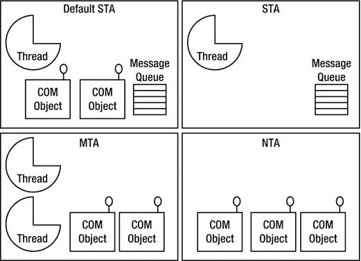

# 八、不安全代码和互操作性

很少有真实世界的应用是严格由托管代码组成的。取而代之的是，他们经常使用内部的或者第三方的用本地代码实现的 T2 库。那个。NET 框架提供了多种机制来与本地代码进行互操作，这些本地代码是通过多种广泛使用的技术 实现的:

*   P/Invoke:支持与导出 C 风格函数的 dll 的互操作性。
*   COM Interop:允许托管代码使用 COM 对象以及公开。NET 类作为供本机代码使用的 COM 对象。
*   C++/CLI 语言:通过混合编程语言实现与 C 和 C++的互操作性。

事实上，基础类库(BCL)是。NET 框架(mscorlib.dll 是主要的)包含。NET Framework 的内置类型使用所有上述机制。因此，可以说，任何重要的托管应用实际上都是一个混合应用，在某种意义上，它调用本机库。

虽然这些机制非常有用，但是理解与每个互操作机制相关的性能含义以及如何最小化它们的影响是很重要的。

不安全代码

托管代码提供了类型安全、内存安全和安全保证，从而消除了本机代码中普遍存在的一些最难诊断的错误和安全漏洞，如堆损坏和缓冲区溢出。通过禁止使用指针直接访问内存，转而使用强类型引用，检查数组访问边界，并确保只对对象进行合法的强制转换，就可以做到这一点。

但是，在某些情况下，这些约束可能会使原本简单的任务变得复杂，并通过迫使您使用安全的替代方法来降低性能。例如，一个人可能将数据从一个文件读入一个 byte[]中，但希望将该数据解释为一个双精度值数组。在 C/C++中，您可以简单地将 char 指针转换为 double 指针。相比之下在保险箱里。NET 代码中，可以用 MemoryStream 对象包装缓冲区，并在前者之上使用 BinaryReader 对象将每个内存位置作为双精度值读取；另一种选择是使用 BitConverter 类。这些解决方案是可行的，但是它们比在非托管代码中实现要慢。幸运的是，C# 和 CLR 通过指针和指针转换支持不安全的内存访问。其他不安全的特性是堆栈内存分配和结构中的嵌入式数组。不安全代码的缺点是安全性受到损害，这可能导致内存损坏和安全漏洞，因此在编写不安全代码时应该非常小心。

要使用不安全代码，必须先在 C# 项目 设置中启用编译不安全代码(参见[图 8-1](#Fig00081) )，这导致将/unsafe 命令行参数传递给 C# 编译器。接下来，您应该标记允许不安全代码或不安全变量的区域，这可以是整个类或结构、整个方法或方法中的一个区域。


[图 8-1](#_Fig00081) 。*在 C# 项目设置中启用不安全代码(Visual Studio 2012)*

锁定和垃圾收集句柄

因为位于 GC 堆上的托管对象在不可预知的时间发生垃圾收集期间可能会被重新定位，所以您必须固定它们，以便获得它们的地址，并防止它们在内存中被四处移动。

锁定可以通过使用 C# 中的固定作用域(参见清单 8-1 中的例子)或者分配一个锁定 GC 句柄(参见清单 8-2 中的[)来完成。](#list2) P/Invoke 存根，我们将在后面介绍，也以一种等同于 fixed 语句的方式固定对象。如果固定要求可以限制在函数的范围内，请使用 fixed，因为它比 GC 句柄方法更有效。否则，使用 GCHandle。Alloc 分配一个锁定句柄来无限期锁定一个对象(直到您通过调用 GC handle 显式释放 GC 句柄。免费)。堆栈对象(值类型)不需要固定，因为它们不受垃圾收集的影响。通过使用&符号(&)引用操作符，可以直接获得堆栈定位对象的指针。

***[清单 8-1。](#_list1)*** *使用固定范围和指针强制转换来重新解释缓冲区中的数据*

```cs
using (var fs = new FileStream(@"C:\Dev\samples.dat", FileMode.Open)) {
  var buffer = new byte[4096];
  int bytesRead = fs.Read(buffer, 0, buffer.Length);
  unsafe {
   double sum = 0.0;
   fixed (byte* pBuff = buffer) {
     double* pDblBuff = (double*)pBuff;
     for (int i = 0; i < bytesRead / sizeof(double); i++)
      sum + = pDblBuff[i];
   }
  }
}

```

 **注意**从 fixed 语句中获得的指针一定不能在 fixed 作用域之外使用，因为当作用域结束时，被钉住的对象会被解除钉住。您可以在值类型数组、字符串和托管类的特定值类型字段上使用 fixed 关键字。请务必指定结构内存布局。

GC 句柄是一种通过不可变的指针大小的句柄值(即使对象的地址发生变化)来引用驻留在 GC 堆上的托管对象的方法，该句柄值甚至可以由本机代码存储。GC 句柄有四种类型，由 GCHandleType 枚举指定:弱、WeakTrackRessurection、普通和固定。Normal 和 Pinned 类型防止对象被垃圾回收，即使没有对它的其他引用。Pinned 类型还会固定对象，并允许获取其内存地址。Weak 和 WeakTrackResurrection 不会阻止对象被回收，但是如果对象还没有被垃圾回收，则可以获得正常(强)引用。它由 WeakReference 类型使用。

***[清单 8-2。](#_list2)*** *使用锁定 GCHandle 进行锁定和指针转换来重新解释缓冲区中的数据*

```cs
using (var fs = new FileStream(@"C:\Dev\samples.dat", FileMode.Open)) {
  var buffer = new byte[4096];
  int bytesRead = fs.Read(buffer, 0, buffer.Length);
  GCHandle gch = GCHandle.Alloc(buffer, GCHandleType.Pinned);
  unsafe {
   double sum = 0.0;
   double* pDblBuff = (double *)(void *)gch.AddrOfPinnedObject();
   for (int i = 0; i < bytesRead / sizeof(double); i++)
     sum + = pDblBuff[i];
   gch.Free();
  }
}

```

 **警告**如果触发了垃圾收集(即使是由另一个并发运行的线程触发)，钉住可能会导致托管堆碎片。碎片浪费内存并降低垃圾收集器算法的效率。为了最大限度地减少碎片，不要将对象固定得过长。

生命周期管理

在许多情况下，本机代码在函数调用中继续持有非托管资源，并且需要显式调用来释放资源。如果是这种情况，除了终结器之外，还要在包装托管类中实现 IDisposable 接口。这将使客户端能够确定性地释放非托管资源，而终结器应该是在您忘记显式释放时的最后一道安全屏障。

分配非托管内存

占用超过 85，000 字节的托管对象(通常是字节缓冲区和字符串)被放在大对象堆(LOH)上，它与 GC 堆的 Gen2 一起被垃圾收集，这是非常昂贵的。LOH 也经常变得支离破碎，因为它从未被压缩；如果可能的话，相当自由的空间被重新使用。这两个问题都会增加垃圾收集器对内存和 CPU 的使用。因此，使用托管内存池或从非托管内存中分配这些缓冲区(例如，通过调用 Marshal)会更有效。AllocHGlobal)。如果以后需要从托管代码中访问非托管缓冲区，请使用“流”方法，即将非托管缓冲区的小块复制到托管内存中，一次处理一个块。你可以使用系统。UnmanagedMemoryStream 和 System。UnmanagedMemoryAccessor 使工作更容易。

内存池

如果您大量使用缓冲区与本机代码通信，您可以从 GC 堆或从非托管堆分配它们。对于高分配率和缓冲区不是很小的情况，前一种方法变得低效。需要固定托管缓冲区，这会导致碎片。后一种方法也有问题，因为大多数托管代码希望缓冲区是托管字节数组(byte[])而不是指针。如果不复制，就不能将指针转换为托管数组，但这对性能不利。

 **提示**你可以在 GC 下的性能计数器中查找% Time。NET CLR 内存性能计数器类别来估计被 GC“浪费”的 CPU 时间，但是这并不能告诉您是什么代码造成的。在投入优化工作之前，使用一个分析器(参见[第 2 章](02.html))，并参见[第 4 章](04.html)以获得更多关于垃圾收集性能的提示。

我们提出了一个解决方案(见[图 8-2](#Fig00082) ),它提供了从托管和非托管代码的免复制访问，并且不会给 GC 带来压力。其思想是分配位于大型对象堆上的大型托管内存缓冲区(段)。固定这些段不会带来任何损失，因为它们已经是不可重定位的了。

一个简单的分配器，其中一个段的分配指针(实际上是一个索引)在每次分配时只向前移动，然后分配不同大小的缓冲区(直到段大小),并返回这些缓冲区周围的包装器对象。一旦指针接近末尾，分配失败，就从段池中获得一个新的段，并再次尝试分配。

段有一个引用计数，该计数在每次分配时递增，在包装对象被释放时递减。一旦它的引用计数达到零，就可以通过将指针设置为零来重置它，并且可以选择用零填充存储器，然后将其返回到段池。

包装对象存储段的 byte[]、数据开始的偏移量、长度和一个非托管指针。实际上，包装器是进入段的大缓冲区的窗口。它还将引用该段，以便在包装被释放后减少段使用计数。包装器可以提供方便的方法，例如安全的索引器访问，它考虑了偏移量并验证访问是否在界限内。

自从。NET 开发人员习惯于假设缓冲区数据总是从索引 0 开始，并持续整个数组长度，您将需要修改代码，而不是假设，而是依赖于将与缓冲区一起传递的附加偏移量和长度参数。大多数。使用缓冲区的. NET BCL 方法具有显式接受偏移量和长度的重载。

这种方法的主要缺点是失去了自动内存管理。为了回收段，您必须显式地释放包装对象。实现终结器不是一个好的解决方案，因为这将抵消更多的性能优势。


[图 8-2](#_Fig00082) 。*提出内存池方案*

p/调用

平台调用，更好的说法是 P/Invoke ，支持调用 C 风格的函数，这些函数由 dll 从托管代码中导出。要使用 P/Invoke，托管调用方声明一个静态 extern 方法，其签名(参数类型和返回值类型)等同于 C 函数的签名。然后用 DllImport 属性标记该方法，同时至少指定导出该函数的 DLL。

```cs
// Native declaration from WinBase.h:
HMODULE WINAPI LoadLibraryW(LPCWSTR lpLibFileName);

// C# declaration:
class MyInteropFunctions {
  [DllImport("kernel32.dll", SetLastError = true)]
  public static extern IntPtr LoadLibrary(string fileName);
}

```

在前面的代码中，我们将 LoadLibrary 定义为一个函数，它接受一个字符串并返回一个 IntPtr ，这是一个不能直接取消引用的指针类型，因此使用它不会导致代码不安全。DllImport 属性指定该函数由 kernel32.dll(它是主 Win32 API DLL)导出，并且 Win32 上一个错误代码应保存在线程本地存储中，以便不会被未显式完成的对 Win32 函数的调用覆盖(例如，在 CLR 内部)。DllImport 属性 也可以用来指定 C 函数的调用约定、字符串编码、导出名称解析选项等。

如果本机函数的签名包含复杂类型，如 C 结构，则等效的结构或类必须由托管代码定义，对每个字段使用等效的类型。相对结构字段顺序、字段类型和对齐方式必须符合 C 代码的要求。在某些情况下，您需要对字段、函数参数或返回值应用 MarshalAs 属性来修改默认的封送处理行为。例如，受管系统。布尔(bool)类型在本机代码中可以有多种表示形式:Win32 BOOL 类型有四个字节长，true 值是任何非零值，而在 C++中，BOOL 值有一个字节长，true 值等于 1。

在下面的代码清单中，应用于 WIN32 _ FIND _ DATAstruct 的 StructLayout 属性指定需要一个连续的内存中字段布局。没有它，CLR 可以自由地重新排列字段以提高效率。应用于 cFileName 和 cAlternativeFileName 字段的 MarshalAs 属性指定字符串应该作为嵌入在结构中的固定大小的字符串进行封送，而不仅仅是指向结构外部的字符串的指针。

```cs
// Native declaration from WinBase.h:
typedef struct _WIN32_FIND_DATAW {
  DWORD dwFileAttributes;
  FILETIME ftCreationTime;
  FILETIME ftLastAccessTime;
  FILETIME ftLastWriteTime;
  DWORD nFileSizeHigh;
  DWORD nFileSizeLow;
  DWORD dwReserved0;
  DWORD dwReserved1;
  WCHAR cFileName[MAX_PATH];
  WCHAR cAlternateFileName[14];
} WIN32_FIND_DATAW;

HANDLE WINAPI FindFirstFileW(__in LPCWSTR lpFileName,
  __out LPWIN32_FIND_DATAW lpFindFileData);

// C# declaration:
[StructLayout(LayoutKind.Sequential, CharSet = CharSet.Auto)]
struct WIN32_FIND_DATA {
  public uint dwFileAttributes;
  public FILETIME ftCreationTime;
  public FILETIME ftLastAccessTime;
  public FILETIME ftLastWriteTime;
  public uint nFileSizeHigh;
  public uint nFileSizeLow;
  public uint dwReserved0;
  public uint dwReserved1;
  [MarshalAs(UnmanagedType.ByValTStr, SizeConst = 260)]
  public string cFileName;
  [MarshalAs(UnmanagedType.ByValTStr, SizeConst = 14)]
  public string cAlternateFileName;
}

[DllImport("kernel32.dll", CharSet = CharSet.Auto)]
static extern IntPtr FindFirstFile(string lpFileName, out WIN32_FIND_DATA lpFindFileData);

```

当您在前面的代码清单中调用 FindFirstFile 方法 时，CLR 会加载导出函数的 DLL(kernel 32 . DLL)，定位所需的函数(FindFirstFile)，并将参数类型从其托管表示形式转换为本机表示形式(反之亦然)。在此示例中，输入 lpFileName 字符串参数被转换为本机字符串，而对 lpFindFileData 参数所指向的 WIN32_FIND_DATAW 本机结构的写入被转换为对托管 WIN32_FIND_DATA 结构的写入。在下面的章节中，我们将详细描述每个阶段。

PInvoke.net 和 P/调用互操作助手

创建 P/Invoke 签名可能既困难又乏味。有很多规则要遵守，有很多细微差别要知道。产生不正确的签名会导致难以诊断的错误。幸运的是，有两个资源可以使这变得更容易:PInvoke.net 网站和 P/Invoke Interop Assistant 工具。

PInvoke.net 是一个非常有用的维基风格的网站，在那里你可以找到并贡献各种微软 API 的 P/Invoke 签名。PInvoke.net 是由亚当·内森创造的，他是微软的高级软件开发工程师，曾在。NET CLR 质量保证小组，并撰写了大量关于 COM 互操作性的书籍。您还可以下载一个免费的 Visual Studio 加载项，以便在不离开 Visual Studio 的情况下访问 P/Invoke 签名。

P/Invoke Interop Assistant 是微软的一个免费工具，可从 CodePlex 下载，并附带源代码。它包含一个数据库(一个 XML 文件),描述用于生成 P/Invoke 签名的 Win32 函数、结构和常数。给定 C 函数声明，它还可以生成 P/Invoke 签名；给定托管程序集，它还可以生成本机回调函数声明和本机 COM 接口签名。


[图 8-3](#_Fig00083) 。显示 CreateFile 的 P/Invoke 签名的 P/Invoke 互操作实例的屏幕截图

[图 8-3](#Fig00083) 显示了微软的 P/Invole Interop Assistant 工具，在左侧显示了“CreateFile”的搜索结果，P/Invoke 签名以及相关的结构显示在右侧。P/Invoke Interop Assistant 工具(以及其他有用的 CLR interop 相关工具)可以从 http://clrinterop.codeplex.com/[获得。](http://clrinterop.codeplex.com/)

装订

当您第一次调用 P/Invoke 函数时，本机 DLL 及其依赖项通过 Win32 LoadLibrary 函数加载到进程中(如果它们尚未加载)。接下来，搜索所需的导出函数，可能首先搜索损坏的变量。搜索行为取决于 DllImport 的 CharSet 和 ExactSpelling 字段的值。

*   如果 ExactSpelling 为 true，P/Invoke 只搜索具有确切名称的函数，只考虑调用约定混乱。如果失败，P/Invoke 将不会继续搜索其他名称变体，并将抛出 EntryPointNotFoundException。

*   如果 ExactSpelling 为 false，则行为由 CharSet 属性决定:

*   如果设置为字符集。Ansi(默认)，P/Invoke 首先搜索精确的(未混淆的)名称，然后搜索被破坏的名称(附加“A”)。
*   如果设置为字符集。Unicode，P/Invoke 首先搜索损坏的名称(附加“W”)，然后搜索非托管名称。

对于 C# 来说，ExactSpelling 的默认值是 false，对于 value 来说是 True。字符集。Auto value 的行为类似于 CharSet。任何现代操作系统(比 Windows ME 更晚)上的 Unicode。

 **提示**使用 Unicode 版本的 Win32 函数。Windows NT 和更高版本本身是 Unicode (UTF16)。如果调用 ANSI 版本的 Win32 函数，字符串将被转换为 Unicode，这会导致性能下降，并且调用 Unicode 版本的函数。那个。NET 字符串表示形式本身也是 UTF16，因此如果字符串参数已经是 UTF16，则封送字符串参数会更快。设计您的代码，尤其是接口要与 Unicode 兼容，这也有全球化的好处。将 ExactSpelling 设置为 true，这将通过消除不必要的函数搜索来加快初始加载时间。

编组员存根

当您第一次调用 P/Invoke'd 函数时，在加载本机 DLL 之后，将根据需要生成 P/Invoke 封送拆收器存根，并将在后续调用中重用。一旦被调用，编组器执行以下步骤:

1.  检查调用方的非托管代码执行权限。
2.  将托管参数转换为其适当的本机内存表示形式，可能会分配内存。
3.  将线程的垃圾收集模式设置为先发制人，这样垃圾收集无需等待线程到达安全点即可发生。
4.  调用本机函数。
5.  将线程 GC 模式恢复为合作模式。
6.  可以选择将 Win32 错误代码保存在线程本地存储中，供 Marshal.GetLastWin32Error 以后检索。
7.  可以选择将 HRESULT 转换为异常并引发它。
8.  如果引发到托管异常，则转换本机异常。
9.  将返回值和输出参数转换回它们的托管内存表示形式。
10.  清理所有临时分配的内存。

P/Invoke 也可以用来从本机代码调用托管代码。可以为委托生成反向封送拆收器存根(通过封送。GetFunctionPointerForDelegate)，如果它作为参数在对本机函数的 P/Invoke 调用中传递。本机函数将接收一个代替委托的函数指针，它可以调用该指针来调用托管方法。函数指针指向一个动态生成的存根，除了参数封送，它还知道目标对象的地址(这个指针)。

英寸 NET Framework 1.x 中，封送拆收器存根由生成的汇编代码(用于简单签名)或生成的 ML(封送处理语言)代码(用于复杂签名)组成。ML 是内部字节码，由内部解释器执行。随着中 AMD64 和安腾支持的引入。NET Framework 2.0 之后，微软意识到为每个 CPU 架构实现并行 ML 基础设施将是一个巨大的负担。相反，64 位版本的。NET Framework 2.0 专门在生成的 IL 代码中实现。虽然 IL 存根比解释的 ML 存根快得多，但它们仍然比 x86 生成的程序集存根慢，所以微软选择保留 x86 实现。英寸 NET Framework 4.0 中，IL 存根生成基础结构得到了显著优化，这使得 IL 存根甚至比 x86 程序集存根更快。这允许微软完全移除 x86 特定的存根实现，并在所有架构上统一存根生成。

 **提示**跨越托管到本机边界的函数调用至少比相同环境中的直接调用慢一个数量级。如果您同时控制本机代码和托管代码，则以最小化本机代码到托管代码的往返行程的方式构造接口(聊天式接口)。尝试将几个“工作项目”合并成一个呼叫(分块接口)。类似地，将几个简单函数的调用(例如简单的 Get/Set 函数)组合成一个外观，在一个调用中完成相同的工作。

微软从 CodePlex 提供了一个名为 *IL Stub Diagnostics* 的免费下载工具以及源代码。它订阅 CLR ETW IL 存根生成/缓存命中事件，并在 UI 中显示生成的 IL 存根代码。

下面我们展示一个带注释的示例 IL 封送处理存根，由五个代码部分组成:初始化、输入参数的封送处理、调用、返回值和/或输出参数的封送处理以及清理。封送拆收器存根用于以下签名:

```cs
// Managed signature:
[DllImport("Server.dll")]static extern int Marshal_String_In(string s);
// Native Signature:
unmanaged int __stdcall Marshal_String_In(char *s)

```

在初始化部分，存根声明局部(堆栈)变量，获取存根上下文并要求非托管代码执行权限。

```cs
// IL Stub:
// Code size	153 (0x0099)
.maxstack 3
// Local variables are:
// IsSuccessful, pNativeStrPtr, SizeInBytes, pStackAllocPtr, result, result, result
.locals (int32,native int,int32,native int,int32,int32,int32)

call native int [mscorlib] System.StubHelpers.StubHelpers::GetStubContext()
// Demand unmanaged code execution permissioncall void [mscorlib] System.StubHelpers.StubHelpers::DemandPermission(native int)

```

在封送处理部分，存根封送处理输入参数本机函数。在这个例子中，我们封送一个字符串输入参数。封送拆收器可以调用系统下的帮助器类型。StubHelpersnamespace 或系统。帮助将特定类型和类型类别从托管表示形式转换到本机表示形式以及从本机表示形式转换回来的类。在本例中，我们调用 CSTRMarshaler::convert native 来封送字符串。

这里有一个小小的优化:如果托管字符串足够短，它将被封送到堆栈上分配给的内存中(这样更快)。否则，必须从堆中分配内存。

```cs
   ldc.i4     0x0     // IsSuccessful = 0 [push 0 to stack]
   stloc.0     //     [store to IsSuccessful]
IL_0010:
       nop //     argument {
       ldc.i4     0x0     // pNativeStrPtr = null [push 0 to stack]
       conv.i     //     [convert to an int32 to "native int" (pointer)]
       stloc.3     //     [store result to pNativeStrPtr]
       ldarg.0     // if (managedString == null)
       brfalse     IL_0042     // goto IL_0042
       ldarg.0     // [push managedString instance to stack]
       // call the get Length property (returns num of chars)
       call     instance int32 [mscorlib] System.String::get_Length()
   ldc.i4     0x2     // Add 2 to length, one for null char in managedString and
       // one for an extra null we put in [push constant 2 to stack]
       add     // [actual add, result pushed to stack]
       //     load static field, value depends on lang. for non-Unicode
       //     apps system setting
   ldsfld System.Runtime.InteropServices.Marshal::SystemMaxDBCSCharSize
       mul     // Multiply length by SystemMaxDBCSCharSize to get amount of
   // bytes
   stloc.2 // Store to SizeInBytes
   ldc.i4 0x105 // Compare SizeInBytes to 0x105, to avoid allocating too much
   // stack memory [push constant 0x105]
       //     CSTRMarshaler::ConvertToNative will handle the case of
       //     pStackAllocPtr == null and will do a CoTaskMemAlloc of the
   // greater size
   ldloc.2 // [Push SizeInBytes]
   clt // [If SizeInBytes > 0x105, push 1 else push 0]
   brtrue IL_0042 // [If 1 goto IL_0042]
   ldloc.2 // Push SizeInBytes (argument of localloc)
   localloc // Do stack allocation, result pointer is on top of stack
   stloc.3 // Save to pStackAllocPtr
IL_0042:
   ldc.i4 0x1 // Push constant 1 (flags parameter)
       ldarg.0     //     Push managedString argument
   ldloc.3 // Push pStackAllocPtr (this can be null)
   // Call helper to convert to Unicode to ANSI
   call  native int [mscorlib]System.StubHelpers.CSTRMarshaler::ConvertToNative(int32,string,   native   int)
     stloc.1     // Store result in pNativeStrPtr,
   // can be equal to pStackAllocPtr
       ldc.i4 0x1     // IsSuccessful = 1 [push 1 to stack]
   stloc.0 // [store to IsSuccessful]
   nop
   nop
   nop

```

在下一节中，存根从存根上下文获得本机函数指针并调用它。call 指令实际上做了比我们在这里看到的更多的工作，例如改变 GC 模式和捕捉本机函数的返回，以便在 GC 正在进行并且处于需要暂停托管代码执行的阶段时暂停托管代码的执行。

```cs
   ldloc.1     // Push pStackAllocPtr to stack,
               //     for the user function, not for GetStubContext
   call     native int [mscorlib] System.StubHelpers.StubHelpers::GetStubContext()
   ldc.i4     0x14 // Add 0x14 to context ptr
   add     //     [actual add, result is on stack]
   ldind.i // [deref ptr, result is on stack]
   ldind.i     //     [deref function ptr, result is on stack]
   calli     unmanaged stdcall int32(native int) // Call user function

```

下面的部分实际上由两部分组成，分别处理返回值和输出参数的“解组”(本机类型到托管类型的转换)。在本例中，本机函数返回一个不需要封送处理的 int，它只是按原样复制到一个局部变量。由于没有输出参数，后一部分是空的。

```cs
// UnmarshalReturn {
     nop   //   return {
     stloc.s   0x5   // Store user function result (int) into x, y and z
     ldloc.s   0x5
     stloc.s   0x4
     ldloc.s   0x4
     nop   // } return
     stloc.s   0x6
    //   } UnmarshalReturn
  // Unmarshal {
     nop // argument {
     nop // } argument
     leave   IL_007e // Exit try protected block
  IL_007e:
     ldloc.s   0x6   // Push z
     ret   //   Return z
  //   }   Unmarshal

```

最后，清理部分释放为了封送而临时分配的内存。它在 finally 块中执行清理，这样即使本机函数抛出异常，清理也会发生。它也可能只在出现异常的情况下执行一些清理。在 COM interop 中，它可以将指示错误的 HRESULT 返回值转换为异常。

```cs
// ExceptionCleanup {
IL_0081:
// } ExceptionCleanup
// Cleanup {
   ldloc.0 // If (IsSuccessful && !pStackAllocPtr)
   ldc.i4 0x0 // Call ClearNative(pNativeStrPtr)
   ble IL_0098
   ldloc.3
   brtrue IL_0098
   ldloc.1
   call void [mscorlib] System.StubHelpers.CSTRMarshaler::ClearNative(native int)
IL_0098:
   endfinally
IL_0099:
// } Cleanup
.try IL_0010 to IL_007e finally handler IL_0081 to IL_0099

```

总之，即使对于这个简单的函数签名，IL 封送拆收器存根也不是简单的。复杂的签名会导致更长更慢的 IL 封送拆收器存根。

可直接复制到本机结构中的类型

大多数本机类型与托管代码共享一个公共的内存表示形式。这些类型称为*可直接复制到本机结构中的类型*，不需要转换，并且按原样跨托管到本机的边界传递，这比封送非可直接复制到本机结构中的类型要快得多。事实上，封送拆收器存根可以通过固定托管对象并将指向托管对象的直接指针传递给本机代码来进一步优化这种情况，从而避免一两次内存复制操作(每个所需的封送方向一次)。

可直接复制到本机结构中的类型是下列类型之一:

*   系统。字节(字节)
*   系统。SByte
*   系统。Int16(短)
*   系统。UInt16 (ushort)
*   系统。Int32(整数)
*   系统。UInt32 (uint)
*   -系统。Int64(长)
*   系统。UInt64 (ulong)
*   系统。句柄
*   System.UIntPtr
*   系统。单一(浮动)
*   系统。双倍(双倍)

此外，可直接复制到本机结构中的类型的一维数组(其中所有元素的类型都相同)也是可直接复制到本机结构中的，只包含可直接复制到本机结构中的字段的结构或类也是如此。

一个系统。Boolean (bool)不是 blittable，因为它在本机代码(系统)中可以有 1、2 或 4 个字节的表示形式。Char (char)不是 blittable，因为它可以表示 ANSI 或 Unicode 字符和系统。String(字符串)不是 blittable，因为它的本机表示可以是 ANSI 或 Unicode，它可以是 C 风格的字符串或 COM BSTR，并且托管字符串需要是不可变的(如果本机代码修改了字符串，这是有风险的，会破坏不变性)。包含对象引用字段的类型不是可直接复制到本机结构中的，即使它是对可直接复制到本机结构中的类型或其数组的引用。封送非直接复制到本机结构中的类型包括分配内存来保存参数的转换版本，适当地填充它，最后释放以前分配的内存。

通过手动封送字符串输入参数，可以获得更好的性能(有关示例，请参见下面的代码)。本机被调用方必须接受一个 C 样式的 UTF-16 字符串，并且它不应该写入该字符串所占用的内存，因此这种优化并不总是可行的。手动封送处理包括固定输入字符串，修改 P/Invoke 签名以采用 IntPtr 而不是字符串，并传递一个指向固定字符串对象的指针。

```cs
class Win32Interop {
  [DllImport("NativeDLL.DLL", CallingConvention = CallingConvention.Cdecl)]
  public static extern void NativeFunc(IntPtr pStr); // takes IntPtr instead of string

*}*

//Managed caller calls the P/Invoke function inside a fixed scope which does string pinning:
unsafe
{
   string str = "MyString";
   fixed (char *pStr = str) {
   //You can reuse pStr for multiple calls.
   Win32Interop.NativeFunc((IntPtr)pStr);
   }
}

```

将本机 C 样式的 UTF-16 字符串转换为托管字符串也可以通过使用 System。String 的构造函数以 char*作为参数。系统。字符串构造函数将制作缓冲区的副本，以便在创建托管字符串后可以释放本机指针。请注意，没有进行任何验证来确保字符串只包含有效的 Unicode 字符。

封送方向、值和引用类型

如前所述，封送拆收器存根可以单向或双向封送函数参数。参数的封送方向由许多因素决定:

*   参数是值类型还是引用类型。
*   参数是通过值传递还是通过引用传递。
*   该类型是否可直接复制到本机结构中。
*   是否封送方向修改属性(系统。属性和系统。RuntimeInteropService . out attribute)应用于该参数。

出于讨论的目的，我们将“in”方向定义为托管到本机封送方向；相反,“向外”方向是管理方向的原生方向。下面是默认封送方向规则的列表:

*   通过值传递的参数，不管它们是值类型还是引用类型，都只按“入”的方向进行封送。

*   您不需要手动应用 In 属性。
*   StringBuilder 是这个规则的一个例外，它总是被“in/out”封送。

*   通过引用传递的参数(通过 ref C# 关键字或 ByRef VB。NET 关键字)，不管它们是值类型还是引用类型，都被“入/出”封送。

单独指定 OutAttribute 将禁止“in”封送，因此本机被调用方可能看不到调用方完成的初始化。C# out 关键字的行为类似于 ref 关键字，但增加了一个 OutAttribute。

 **提示**如果参数在 P/Invoke 调用中不可直接复制到本机结构中，并且您只需要在“out”方向上封送，那么您可以通过使用 out C# 关键字而不是 ref 关键字来避免不必要的封送。

由于上面提到的可直接复制到本机结构中的参数固定优化，可直接复制到本机结构中的引用类型将获得有效的“入/出”封送，即使上面的规则另有说明。如果您需要“out”或“in/out”封送处理行为，则不应该依赖于此行为，而是应该显式指定方向属性，因为如果您稍后添加了一个非直接复制到本机结构中的字段，或者这是一个跨越单元边界的 COM 调用，则此优化将停止工作。

封送值类型和引用类型之间的差异体现在它们在堆栈上的传递方式上。

*   由值传递的值类型作为副本被推送到堆栈上，因此不管修改属性如何，它们总是被有效地封送到“in”中。
*   通过引用传递的值类型和通过值传递的引用类型通过指针传递。
*   通过引用传递的引用类型作为指针传递给指针。

 **注意**通过值传递大的值类型参数(十几个字节长)比通过引用传递开销更大。对于大的返回值也是如此，其中 out 参数是一种可能的选择。

代码访问安全性

的。NET 代码访问安全 机制支持在沙箱中运行部分受信任的代码，对运行时功能(例如 P/Invoke)和 BCL 功能(例如文件和注册表访问)的访问受到限制。调用本机代码时，CAS 要求其方法出现在调用堆栈中的所有程序集都具有 UnmanagedCode 权限。封送拆收器存根将为每个调用要求此权限，这包括遍历调用堆栈以确保所有代码都具有此权限。

 **提示**如果您只运行完全受信任的代码，或者您有其他方法来确保安全性，您可以通过将 SuppressUnmanagedCodeSecurityAttribute 放在 P/Invoke 方法声明、类(在这种情况下，它适用于包含的方法)、接口或委托上来获得显著的性能提升。

COM 互操作性

COM 的设计目的就是用任何支持 COM 的语言/平台编写组件，并在任何(其他)支持 COM 的语言/平台上使用这些组件。。NET 也不例外，它允许您轻松地使用 COM 对象并公开。NET 类型作为 COM 对象。

对于 COM interop，基本思想与 P/Invoke 相同:声明 COM 对象的托管表示，CLR 创建处理封送处理的包装对象。有两种包装器:运行时可调用包装器(RCW ) ，使托管代码能够使用 COM 对象(参见[图 8-4](#Fig00084) )，以及 COM 可调用包装器(CCW) ，使 COM 代码能够调用托管类型(参见[图 8-5](#Fig00085) )。第三方 COM 组件通常附带一个主互操作程序集，该程序集包含供应商批准的互操作定义，并且具有强名称(签名)并安装在 GAC 中。其他时候，您可以使用 tlbimp.exe 工具，它是 Windows SDK 的一部分，根据类型库中包含的信息自动生成互操作程序集。

COM interop 重用 P/Invoke 参数封送处理基础结构，但在默认情况下有一些更改(例如，默认情况下将字符串封送到 BSTR)，因此本章 P/Invoke 部分提供的建议也适用于此处。

COM 有其自身的性能问题，这是由特定于 COM 的特性造成的，如单元线程模型和 COM 的引用计数特性与。NET 垃圾收集方法。


[图 8-4](#_Fig00084) 。托管客户端调用非托管 COM 对象


[图 8-5](#_Fig00085) 。非托管客户端调用托管 COM 对象

生命周期管理

中保存对 COM 对象的引用时。NET，您实际上持有对 RCW 的引用。RCW 总是保存对基础 COM 对象的单个引用，并且每个 COM 对象只有一个 RCW 实例。RCW 维护自己的引用计数，与 COM 引用计数分开。该引用计数的值通常为 1，但是如果已经封送了多个接口指针，或者如果同一接口已经被多个线程封送，则该值可以更大。

通常，当对 RCW 的最后一个托管引用消失，并且在 RCW 驻留的代上有后续的垃圾收集时；RCW 的终结器运行，并通过调用 COM 基础对象的 IUnknown 接口指针上的释演法来减少 COM 对象的引用计数(为 1)。COM 对象随后自我销毁并释放其内存。

自从。NET GC 在不确定的时间运行，并且不知道由它保持 rcw 和随后的 COM 对象活动所引起的非托管内存负担，它不会加速垃圾回收，并且内存使用率可能会变得非常高。

如果有必要，你可以打电话给法警。方法显式释放对象。每次调用都会减少 RCW 的引用计数，当它达到零时，底层 COM 对象的引用计数也会减少(就像 RCW 的终结器正在运行的情况一样)，从而释放它。您必须确保在调用 Marshal.ReleaseComObject 后不继续使用 RCW。如果 RCW 引用计数大于零，您将需要调用 Marshal。循环中的 ReleaseComObject，直到返回值等于零。最佳做法是调用 Marshal。finally 块中的 ReleaseComObject，以确保即使在 COM 对象的实例化和释放之间的某个地方引发了异常，也会发生释放。

公寓编组

COM 实现了自己的线程同步机制来管理跨线程调用，甚至是针对不是为多线程设计的对象。如果没有意识到这些机制，它们会降低性能。虽然这个问题不是与的互操作性所特有的。尽管如此，它仍然值得讨论，因为这是一个常见的陷阱，可能是因为开发人员习惯了典型的。NET 线程同步约定可能不知道 COM 在幕后做什么。

COM 分配对象和线程*单元* ，它们是 COM 调度调用的边界。COM 有几种公寓类型:

*   单线程单元(STA) ，每个单元都托管一个线程，但是可以托管任意数量的对象。一个流程中可以有任意数量的 STA 单元。
*   多线程单元(MTA) ，托管任意数量的线程和任意数量的对象，但是在一个进程中只有一个 MTA 单元。这是的默认设置。网螺纹。
*   中性线程单元(NTA) ，托管对象而不是线程。只有一个 NTA 公寓在处理中。

当调用 CoInitialize 或 CoInitializeEx 来初始化线程的 COM 时，该线程被分配给一个单元。调用 CoInitialize 会将线程分配给一个新的 STA 单元，而 CoInitializeEx 允许您指定 STA 或 MTA 分配。英寸 NET 中，不直接调用这些函数，而是用 STAThread 或 MTAThread 属性标记线程的入口点(或 Main)。或者，您可以调用 Thread。SetApartmentState 方法或线程。线程启动前的 ApartmentState 属性。如果没有特别说明，。NET 将线程(包括主线程)初始化为 MTA。

COM 对象根据 *ThreadingModel* 注册表值分配给单元，该值可以是:

*   单一对象驻留在默认 STA 中。
*   单元(STA)-对象必须驻留在任何 STA 中，并且只允许该 STA 的线程直接调用该对象。不同的实例可以驻留在不同的 STA 中。
*   自由(MTA)-对象位于 MTA。任何数量的 MTA 线程都可以直接并发地调用它。对象必须确保线程安全。
*   两者——对象位于创建者的公寓(STA 或 MTA)。本质上，它一旦被创造出来，就变成类似 STA 或类似 MTA 的物体。
*   neutral–对象驻留在中性单元中，从不需要封送。这是最有效的模式。

关于单元、线程和对象的可视化表示，参见[图 8-6](#Fig00086) 。



[图 8-6](#_Fig00086) 。进程划分成 COM 单元

如果你创建一个对象，它的线程模型与创建者线程单元的线程模型不兼容，你将收到一个接口指针，它实际上指向一个代理。如果需要将 COM 对象的接口传递给属于不同单元的不同线程，则不应直接传递接口指针，而是需要封送处理。COM 将根据需要返回一个代理对象。

封送处理包括将函数调用(包括参数)转换成消息，该消息将被发送到接收方 STA 单元的消息队列。对于 STA 对象，这被实现为一个隐藏窗口，其窗口过程接收消息并通过存根将调用发送到 COM 对象。这样，STA COM 对象总是由同一个线程调用，这显然是线程安全的。

当调用者的单元与 COM 对象的单元不兼容时，会发生线程切换和跨线程参数封送处理。

 **提示**通过将 COM 对象的单元与创建线程的单元相匹配来避免线程间的性能损失。在 STA 线程上创建和使用单元线程(STA) COM 对象，在 MTA 线程上创建和使用自由线程 COM 对象。标记为支持这两种模式的 COM 对象可以在任一线程中使用，而不会受到影响。

从 ASP.NET 调用 STA 对象

默认情况下，ASP.NET 在 MTA 线程上执行页面。如果您调用 STA 对象，它们将经历封送处理。如果您主要调用 STA 对象，这将降低性能。您可以通过用 ASPCOMPAT 属性标记页面来解决这个问题，如下所示:

<%@Page Language = "vb" AspCompat = "true" %>

请注意，页面构造函数仍然在 MTA 线程中执行，因此将 STA 对象的创建推迟到 Page_Load 和 Page_Init 事件。

TLB 导入和代码访问安全性

代码访问安全性执行与 P/Invoke 中相同的安全检查。您可以将/unsafe 开关与 tlbimp.exe 实用工具一起使用，该实用工具将对生成的类型发出 SuppressUnmanagedCodeSecurity 属性。仅在完全信任的环境中使用此选项，因为这可能会带来安全问题。

诺比

之前。在. NET Framework 4.0 中，您不得不将互操作程序集或主互操作程序集(PIA)与您的应用或外接程序一起分发。这些程序集往往很大(与使用它们的代码相比更是如此)，并且它们通常不是由 COM 组件的供应商安装的；相反，它们是作为可再发行的软件包安装的，因为 COM 组件本身的操作并不需要它们。不安装 pia 的另一个原因是，它们必须安装在 GAC 中，这使得. NET Framework 依赖于完全本机应用的安装程序。

从……开始。NET Framework 4.0 中，C# 和 VB.NET 编译器可以检查哪些 COM 接口和其中的哪些方法是必需的，并且可以仅将必需的接口定义复制和嵌入到调用程序集中，从而消除了分发 PIA DLLs 的需要并减小了代码大小。微软将这一功能称为 NoPIA。它对主互操作程序集和一般的互操作程序集都有效。

PIA 程序集有一个重要的特性，叫做类型等价。由于它们有一个强名称并被放入 GAC，不同的托管组件可以交换 rcw，并从。从. NET 的角度来看，它们应该有等价的类型。相比之下，由 tlbimp.exe 生成的互操作程序集没有此功能，因为每个组件都有自己独特的互操作程序集。对于 NoPIA，因为没有使用强名称程序集，所以 Microsoft 提出了一个解决方案，只要接口具有相同的 GUID，就将来自不同程序集的 rcw 视为相同的类型。

要启用 NoPIA，选择引用下的互操作程序集的属性，并将“嵌入互操作类型”设置为真(参见[图 8-7](#Fig00087) )。


[图 8-7](#_Fig00087) 。在互操作程序集引用属性中启用 NoPIA

例外情况

大多数 COM 接口方法通过 HRESULT 返回值报告成功或失败。负的 HRESULT 值(设置了最高有效位)表示失败，而零(S_OK)或正值表示成功。此外，通过调用 SetErrorInfo 函数，传递通过调用 CreateErrorInfo 创建的 IErrorInfo 对象，COM 对象可以提供更丰富的错误信息。当通过 COM interop 调用 COM 方法时，封送拆收器存根根据 HRESULT 值和 IErrorInfo 对象中包含的数据将 HRESULT 转换为托管异常。由于引发异常的代价相对较高，因此频繁失败的 COM 函数会对性能产生负面影响。可以通过用 PreserveSigAttribute 标记方法来禁止自动异常转换。您必须更改托管签名以返回一个 int，retval 参数将成为一个“out”参数。

C++/CLI 语言扩展

C++/CLI 是一组 C++语言扩展，支持创建混合托管和本机 dll。在 C++/CLI 中，即使在同一个中，也可以有托管和非托管类或函数。cpp 文件。您可以使用托管类型以及本机 C 和 C++类型，就像在普通 C++中一样，即通过包含一个头文件并链接到库。这些强大的功能可用于构造可从任何。NET 语言以及本机包装类和函数(公开为。dll，。lib 和。h 文件)，这些文件可由本机 C/C++代码调用。

C++/CLI 中的封送处理是手动完成的，开发人员可以更好地控制封送处理，并且更清楚封送处理的性能损失。C++/CLI 可以成功用于 P/Invoke 无法应对的场景，比如可变长度结构的封送。C++/CLI 的另一个优势 是，即使您不控制被调用者的代码，您也可以通过重复调用本机方法来模拟粗块接口方法，而不必每次都跨越托管到本机的界限。

在下面的代码清单中，我们实现了一个本机 NativeEmployee 类和一个托管 Employee 类，包装了前者。只有后者可以从托管代码中访问。

如果查看清单，您会看到 Employee 的构造函数展示了两种托管到本机字符串转换的技术:一种是分配需要显式释放的 GlobalAlloc 内存 ，另一种是将托管字符串临时固定在内存中并返回一个直接指针。后一种方法速度更快，但只有在本机代码需要 UTF-16 空终止字符串的情况下才有效，并且您可以保证指针所指向的内存不会发生写操作。此外，长时间锁定被管理对象会导致内存碎片(见[第四章](04.html))，所以如果不能满足上述要求，你将不得不求助于复制。

Employee 的 GetName 方法 展示了三种本机到托管字符串转换的技术:一种使用系统。runtime . interop services . marshal 类，一个使用在 msclr/marshal.h 头文件中定义的 marshal_as 模板函数(我们将在后面讨论),最后一个使用 System。String 的构造函数，这是最快的。

Employee 的 DoWork 方法 接受一个托管数组或托管字符串，并将其转换为一个 wchar_t 指针数组，每个指针指向一个字符串；本质上，它是一个 C 风格的字符串数组。托管到原生字符串的转换是通过 marshal_context 的 marshal_as 方法完成的。与 marshal_as 全局函数不同，marshal_context 用于需要清理的转换。通常这些都是托管到非托管转换，在调用 marshal_as 期间分配非托管内存，一旦不再需要就需要释放。marshal_context 对象包含一个清理操作的链表，当它被销毁时执行这些操作。

```cs
#include <msclr/marshal.h>
#include <string>
#include <wchar.h>
#include <time.h>

using namespace System;
using namespace System::Runtime::InteropServices;

class NativeEmployee {
public:
  NativeEmployee(const wchar_t *employeeName, int age)
   : _employeeName(employeeName), _employeeAge(age) { }

  void DoWork(const wchar_t **tasks, int numTasks) {
   for (int i = 0; i < numTasks; i++) {
   wprintf(L"Employee %s is working on task %s\n",
       _employeeName.c_str(), tasks[i]);
   }
  }

  int GetAge() const {
   return _employeeAge;
  }

  const wchar_t *GetName() const {
   return _employeeName.c_str();
  }

private:
  std::wstring _employeeName;
  int _employeeAge;
};

#pragma managed

namespace EmployeeLib {
  public ref class Employee {
  public:
   Employee(String ^employeeName, int age) {
   //OPTION 1:
   //IntPtr pEmployeeName = Marshal::StringToHGlobalUni(employeeName);
   //m_pEmployee = new NativeEmployee(
   // reinterpret_cast<wchar_t *>(pEmployeeName.ToPointer()), age);
   //Marshal::FreeHGlobal(pEmployeeName);

     //OPTION 2 (direct pointer to pinned managed string, faster):
       pin_ptr<const wchar_t> ppEmployeeName = PtrToStringChars(employeeName);
       _employee = new NativeEmployee(ppEmployeeName, age);
       }

     ∼Employee() {
     delete _employee;
     _employee = nullptr;
     }
     int GetAge() {
     return _employee->GetAge();
     }

     String ^GetName() {
     //OPTION 1:
     //return Marshal::PtrToStringUni(
     // (IntPtr)(void *) _employee->GetName());

     //OPTION 2:
     return msclr::interop::marshal_as<String ^>(_employee->GetName());
     //OPTION 3 (faster):
     return gcnew String(_employee->GetName());
   }

     void DoWork(array<String^>^ tasks) {
     //marshal_context is a managed class allocated (on the GC heap)
     //using stack-like semantics. Its IDisposable::Dispose()/d’tor will
     //run when exiting scope of this function.
     msclr::interop::marshal_context ctx;
     const wchar_t **pTasks = new const wchar_t*[tasks->Length];
     for (int i = 0; i < tasks->Length; i++) {
     String ^t = tasks[i];
     pTasks[i] = ctx.marshal_as<const wchar_t *>(t);
   }
   m_pEmployee->DoWork(pTasks, tasks->Length);
     //context d’tor will release native memory allocated by marshal_as
     delete[] pTasks;
   }

    private:
     NativeEmployee *_employee;
  };
}

```

总之，C++/CLI 提供了对封送处理的精细控制，并且不需要容易出错的重复函数声明，尤其是当您经常更改本机函数签名时。

marshal_as 助手库

在本节中，我们将详细介绍作为 Visual C++ 2008 和更高版本的一部分提供的 marshal_as 帮助器库。

marshal_as 是一个模板库，用于简化和方便地将托管类型封送到本机类型，反之亦然。它可以将许多本机字符串类型(如 char *、wchar_t *、std::string、std::wstring、CStringT <char>、CStringT <wchar_t>、BSTR、bstr_t 和 CComBSTR)封送到托管类型，反之亦然。它处理 Unicode/ANSI 转换，并自动处理内存分配/释放。</wchar_t></char>

该库是在 marshal.h(对于基类型)、marshal_windows.h(对于 windows 类型)、marshal_cppstd.h(对于 STL 数据类型)和 marshal_atl.h(对于 atl 数据类型)中内联声明和实现的。

marshal_as 可以扩展为处理用户定义类型的转换。这有助于在许多地方封送同一类型时避免代码重复，并允许对不同类型的封送使用统一的语法。

下面的代码是一个扩展 marshal_as 以处理托管字符串数组到等效的本机字符串数组的转换的示例。

```cs
namespace msclr {
 namespace interop {
   template<>
   ref class context_node<const wchar_t**, array<String^>^> : public context_node_base {
   private:
     const wchar_t** _tasks;
     marshal_context _context;
   public:
     context_node(const wchar_t**& toObject, array<String^>^ fromObject) {
     //Conversion logic starts here
     _tasks = NULL;
   const wchar_t **pTasks = new const wchar_t*[fromObject->Length];
   for (int i = 0; i < fromObject->Length; i++) {
   String ^t = fromObject[i];
   pTasks[i] = _context.marshal_as<const wchar_t *>(t);
   }
   toObject = _tasks = pTasks;
   }

   ∼context_node() {
   this->!context_node();
   }

   protected:
   !context_node() {
     //When the context is deleted, it will free the memory
   //allocated for the strings (belongs to marshal_context),
     //so the array is the only memory that needs to be freed.
     if (_tasks != nullptr) {
   delete[] _tasks;
     _tasks = nullptr;
   }
     }
   };
 }
}
//You can now rewrite Employee::DoWork like this:
  void DoWork(array<String^>^ tasks) {
    //All unmanaged memory is freed automatically once marshal_context
    //gets out of scope.
  msclr::interop::marshal_context ctx;
    _employee->DoWork(ctx.marshal_as<const wchar_t **>(tasks), tasks->Length);
}

```

IL 代码与本机代码

默认情况下，非托管类将被编译为 C++/CLI 中的 IL 代码，而不是机器代码。相对于优化的本机代码，这可能会降低性能，因为 Visual C++编译器比 JIT 更能优化代码。

您可以在一段代码前使用#pragma unmanaged 和#pragma managed 来重写复杂行为。此外，在 VC++项目中，您还可以为单个编译单元启用 C++/CLI 支持。cpp 文件)。

Windows 8 WinRT Interop

Windows Runtime (WinRT) 是专为 Windows 8 Metro 风格应用设计的新平台。WinRT 以本机代码实现(即 WinRT 不使用. NET Framework)，但是可以从 C++/CX 针对 WinRT，。NET 语言或 JavaScript。WinRT 取代了 Win32 和。NET BCL，它变得不可访问。WinRT 强调异步，对于任何可能需要 50 毫秒以上才能完成的操作，它都是强制性的。这样做是为了确保流畅的 UI 性能，这对于像 Metro 这样基于触摸的用户界面尤其重要。

WinRT 是建立在 COM 的高级版本之上的。以下是 WinRT 和 COM 之间的一些区别:

*   对象是使用 RoCreateInstance 创建的。
*   所有对象都实现 IInspectable 接口，该接口又派生自我们熟悉的 IUnknown 接口。
*   支持。NET 样式的属性、委托和事件(而不是接收器)。
*   支持参数化接口(“泛型”)。
*   使用。NET 元数据格式(。winmd 文件)而不是 TLB 和 IDL。
*   所有类型都是从 Platform::Object 派生的。

尽管借鉴了很多。由于 WinRT 完全是在本机代码中实现的，因此从非。NET 语言。

微软实现了*语言投影*，将 WinRT 概念映射到特定于语言的概念，无论是 C++/CX、C# 还是 JavaScript。例如，C++/CX 是 C++的新语言扩展，它自动管理引用计数，将 WinRT 对象激活(RoActivateInstance)转换为 C++构造函数，将 HRESULTs 转换为异常，将“retval”参数转换为返回值，等等。

当调用者和被调用者都被管理时，CLR 足够聪明，可以直接进行调用，而不涉及内部操作。对于跨越本机到托管边界的调用，会涉及常规 COM 互操作。当调用方和被调用方都用 C++实现，并且被调用方的头文件可供调用方使用时，不涉及 COM 互操作，调用非常快，否则，需要进行 COM 查询接口。

互操作的最佳实践

以下是高性能互操作的最佳实践摘要列表:

*   通过分块(组合)工作，设计接口以避免本机管理的转换。
*   用立面减少往返行程。
*   如果非托管资源跨调用持有，则实现 IDisposable。
*   考虑使用内存池或非托管内存。
*   考虑使用不安全代码来重新解释数据(例如在网络协议中)。
*   显式命名您调用的函数，并使用 ExactSpelling=true。
*   尽可能使用 blittable 参数类型。
*   尽可能避免 Unicode 到 ANSI 的转换。
*   手动整理进出 IntPtr 的字符串。
*   使用 C++/CLI 可以更好地控制 C/C++和 COM 互操作并提高性能。
*   指定[In]和[Out]属性以避免不必要的封送处理。
*   避免固定对象的长寿命。
*   考虑调用 ReleaseComObject。
*   考虑将 SuppressUnmanagedCodeSecurityAttribute 用于性能关键的完全信任方案。
*   对于性能关键的完全信任方案，考虑使用 TLBIMP /unsafe。
*   减少或避免跨公寓呼叫。
*   如果合适，在 ASP.NET 中使用 ASPCOMPAT 属性来减少或避免 COM 跨单元调用。

摘要

在本章中，您已经了解了不安全代码，各种互操作机制是如何实现的，每个实现细节如何对性能产生深远的影响，以及如何减轻这种影响。已经向您介绍了提高互操作性能和使编码更容易、更不容易出错的最佳实践和技术(例如，帮助生成 P/Invoke 签名和 marshal_as 库)。