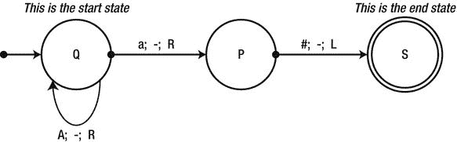

# 九、算法优化

一些应用的核心是为特定领域设计的专门算法，这些算法基于并不普遍适用的假设。其他应用依赖于经过充分测试的算法，这些算法适用于许多领域，并且在整个计算机软件领域已经存在了几十年。我们相信，每个软件开发人员都可以从算法研究皇冠上的宝石中受益并获得洞察力，以及软件框架所基于的算法类别。虽然如果你没有很强的数学背景，这一章的某些部分可能会有些困难，但是它们是值得你努力的。

这一章轻轻拂过计算机科学的一些支柱，并回顾了不朽算法及其复杂性分析的几个例子。有了这些例子，你应该对使用现有的算法感到更舒服，使它们适应你的需要，并发明你自己的算法。

 **注**这不是一本关于算法研究的教科书，也不是现代计算机科学中最重要的算法的介绍性文本。这一章故意写得很短，清楚地表明你不能从中学到所有你需要知道的东西。我们没有深入研究正式定义的任何细节。比如我们对图灵机和语言的处理一点都不严谨。关于算法的教科书介绍，考虑一下科尔曼、莱瑟森、里维斯特和斯坦的“算法介绍”(麻省理工学院出版社，2001 年)和达斯古普塔、帕帕迪米特里奥和瓦齐拉尼的“算法”(即将出版，目前在网上有草稿)。

复杂性分类

[第 5 章](05.html)曾有机会简要提及上某些操作的复杂性。NET 框架的集合和我们自己实现的一些集合。本节更准确地定义了 Big-Oh 复杂性的含义，并回顾了可计算性和复杂性理论中已知的主要复杂性类别。

Big-Oh 符号〔t0〕

当我们在第五章的[中讨论一个列表<t>上的查找操作的复杂度时，我们说它有运行时复杂度 *O* ( *n* )。我们的意思是非正式地说，当你有一个 1000 个条目的列表，并试图在其中找到另一个条目*，*时，那么该操作的*最坏情况*运行时间是通过列表的 1000 次迭代——也就是说，如果该条目不在列表中。因此，当输入变大时，我们试图估计运行时间增长的数量级。然而，当正式指定时，Big-Oh 符号可能会显得有点混乱:</t>](05.html)

*假设函数 thatn)返回在 n 个元素的输入大小上执行算法 A 所需的计算步骤的数量，设 f(n)是从正整数到正整数的单调函数。然后，T(A；n)是 O(f(n))，如果存在一个常数 c 使得对于所有的 n，thatn) ≤ cf(n)。*

简而言之，我们可以说一个算法的运行时复杂度是 *O* ( *f* ( *n* ))，如果 *f* ( *n* )是在大小为 *n* 的输入上执行该算法所需的实际步骤数的上界。界限不必太紧；比如我们也可以说 List < T > lookup 有运行时复杂度*O*(*n*T16】4)。然而，使用这样一个宽松的上限是没有帮助的，因为它没有捕捉到这样一个事实:即使列表中有 1，000，000 个元素，在列表中搜索一个元素也是现实的。如果 List < T > lookup 有严格的运行时复杂性*O*(*n*T24】4)，那么即使在有几千个元素的列表上执行查找也会非常低效。

此外，对于某些输入，界限可能很紧，但对于其他输入，界限可能不紧；例如，如果我们在列表中搜索一个恰好是它的第一个元素的项目，步骤的数量显然是恒定的(一个！)对于所有的列表大小——这就是为什么我们在前面的段落中提到了最差情况下的运行时间。

这种表示法如何使推理运行时间和比较不同算法变得更容易的一些例子包括:

*   如果一个算法的运行时复杂度为 2 *n* <sup>*3*</sup> + 4，而另一个算法的运行时复杂度为*n*<sup>3</sup>-*n*<sup>2</sup>，我们可以说这两个算法的运行时复杂度都为*O*(*n*<sup>3</sup>)，所以就 Big-Oh 复杂度而言，它们是等价的(试着找出常数*很容易证明，当谈到大-哦复杂性时，除了最大项，我们可以省略所有的项。*
*   如果一个算法的运行时复杂度为 *n* <sup>2</sup> ，而另一个算法的运行时复杂度为 100 *n* + 5000，我们仍然可以断言第一个算法在大输入时较慢，因为它具有大的复杂度 *O* ( *n* <sup>2</sup> )，而不是 *O* ( *n* )。事实上，对于*n*= 1000，第一种算法的运行速度明显慢于第二种算法。

类似于运行时复杂度上界的定义，也有下界(用ω(*f*(*n*)表示)和紧界(用θ(*f*(*n*)表示)。然而，它们很少被用来讨论算法复杂性，所以我们在这里省略了它们。

主定理

*主定理* 是一个简单的结果，为分析许多递归算法的复杂性提供了现成的解决方案，这些算法将原问题分解成更小的块。例如，考虑下面的代码，它实现了*合并排序*算法:

公共静态列表 <t>MergeSort(List <t>list)其中 T : IComparable < T ></t></t>

如果(列表。Count <= 1)返回列表；

int middle = list。count/2；

List <t>left = list。取(中)。to list()；</t>

列表<t>右=列表。跳过(中间)。to list()；</t>

left = MergeSort(左)；

right = MergeSort(右)；

返回合并(左，右)；

}

私有列表< T >合并(左侧列表< T >，右侧列表< T >其中 T : IComparable < T > {

列表< T >结果=新列表< T >()；

int i = 0，j = 0；

而(我

如果(我

如果(左[我]。CompareTo(right[j]) <= 0)

结果。Add(左[i++])；

其他

结果。Add(右[j++])；

} else if (i < left。计数){

结果。Add(左[i++]；

} else {

结果。Add(右++)；

}

}

返回结果；

}

分析该算法的运行时间复杂度，需要求解*递推方程*的运行时间 *T* ( *n* )，递推给出为*T*(*n*)= 2*T*(*n*/2)+*O*(*n*)。解释是，对于 MergeSort 的每次调用，我们递归到 MergeSort 中，对原始列表的每一半进行合并，并执行线性时间的列表合并工作(显然，Merge helper 方法对大小为 *n* 的原始列表执行精确的 *n* 操作)。

求解递归方程的一种方法是猜测结果，然后试图证明(通常通过数学归纳法)结果的正确性。在这种情况下，我们可以扩展一些术语，看看是否出现了一种模式:

t(n)= 2T(n/2)+O(n)= 2(2T(n/4)+O(n/2))+O(n)= 2(2(2T(n/8)+O(n/4))+O(n/2))+O(n)=)。。。

主定理为这个递推方程和许多其它方程提供了一个封闭形式的解。根据主定理，T(n) = O(n logn)，这是一个众所周知的关于归并排序复杂度的结果(其实对θ成立，对 O 也成立)。关于主定理的更多细节，请查阅维基百科在 http://en.wikipedia.org/wiki/Master_theorem 的文章。

图灵机和复杂类

通常将算法和问题称为“在 *P* 或“在 *NP* 或“*NP*-完成”。这些指的是不同的复杂性类别。将问题分成复杂的类别有助于计算机科学家轻松识别出有合理(*易处理*)解决方案的问题，并拒绝或寻找不合理问题的简化方案。

一台*图灵机* ( *TM* ) 是一台理论计算设备，模拟一台机器在一个无限*带*的*符号*上运行。机器的磁头可以从磁带上一次读取或写入一个符号，机器内部可以处于有限数量的*状态*中的一种。设备的操作完全由一组有限的*规则*(一种算法)决定，例如“当处于状态 Q 且磁带上的符号为‘A’时，写入‘A’”或“当处于状态 P 且磁带上的符号为‘A’时，将磁头向右移动并切换到状态 S”。还有两种特殊状态:机器开始运行的*开始状态*和*结束状态。*当机器到达结束状态时，通常说它永远循环或者简单地停止执行。[图 9-1](#Fig00091) 显示了图灵机定义的一个例子——圆圈是状态，箭头表示语法读取中的状态转换；写；头部 _ 移动 _ 方向。



[图 9-1](#_Fig00091) 。一个简单图灵机的状态图。最左边的箭头指向初始状态 Q。环形箭头表示当机器处于状态 Q 并读取符号 A 时，它向右移动并保持在状态 Q

在图灵机上讨论算法的复杂性时，不需要在含糊的“迭代”中推理——TM 的一个计算步骤就是一个单一的状态转移(包括从一个状态到自身的转移)。例如，当图 9-1 中的 TM 从其磁带上的输入“AAAa#”开始时，它正好执行四个计算步骤。我们可以概括地说，对于一个后面跟有“a#”的 *n* 的输入，机器执行 *O* ( *n* )步。(实际上，对于这样一个大小为 *n，*的输入，机器正好执行 *n* + 2 步，因此 *O* ( *n* )的定义成立，例如，常数 *c* = 3。)

使用图灵机对真实世界的计算进行建模是非常困难的——这在自动机理论的本科课程中是一个很好的练习，但没有实际用途。令人惊讶的结果是，每一个 C# 程序(事实上，每一个可以在现代计算机上执行的算法)都可以被翻译成图灵机，虽然很费力。粗略来说，如果一个用 C# 写的算法的运行时复杂度为 *O* ( *f* ( *n* )，那么同样的算法翻译成图灵机的运行时复杂度为*O*(*f*<sup>2</sup>(*n*))。这对于分析算法复杂性有非常有用的含义:如果一个问题对于图灵机有一个有效的算法，那么它对于现代计算机也有一个有效的算法；如果一个问题没有图灵机的有效算法，那么它通常也没有现代计算机的有效算法。

尽管我们可以称 *O* ( *n* <sup>2</sup> )算法高效，称任何“较慢”的算法低效，但复杂性理论的立场略有不同。 *P* 是图灵机可以在多项式时间内解决的所有问题的集合——换句话说，如果 *A* 是 *P* 中的一个问题(输入大小为 *n* )，那么存在一个图灵机，它在*多项式时间*内(即在*O*(*n*<sup>*k*</sup>内)在其磁带上产生期望的结果在复杂性理论的许多子领域中， *P* 中的问题被认为是简单的，在多项式时间内运行的算法被认为是有效的，即使 *k* 也是如此，因此，对于某些算法来说，运行时间可能非常长。

如果我们接受这个定义，本书迄今为止考虑的所有算法都是有效的。尽管如此，有些是“非常”有效的，而有些则不那么有效，这表明这种区分不够微妙。你甚至可能会问，是否有不在 *P* 中的问题，没有有效解决方案的问题。答案是响亮的“是”——事实上，从理论的角度来看，没有有效解决方案的问题比有有效解决方案的问题多*。*

首先，我们考虑一个图灵机无法解决的问题，不考虑效率。然后，我们看到了图灵机可以解决的问题，但不是在多项式时间内。最后，我们转向那些*我们不知道*是否有图灵机可以在多项式时间内解决它们，但强烈怀疑没有的问题。

**磕磕绊绊的问题**

从数学角度看，问题比图灵机多(我们说图灵机“可数”，问题不可数)，这意味着一定有无限多的问题是图灵机解决不了的。这类问题通常被称为*不可判定*问题。

你说的“可数”是什么意思？

在数学中，“无限”有很多种。很容易看出图灵机的数量是无限的——毕竟，你可以添加一个对任何图灵机都没有作用的虚拟状态，并获得一个新的、更大的图灵机。类似地，很容易看到有无限多的问题——这需要一个问题的正式定义(作为一种“语言”)，但会导致相同的结果。然而，为什么存在比图灵机“更多”的问题并不明显，特别是因为两者的数量都是无限的。

图灵机集合之所以说是*可数* ，是因为从自然数(1，2，3，.。。)到图灵机。如何构建这种对应关系可能不会立即显而易见，但这是可能的，因为图灵机可以被描述为有限字符串，并且所有*有限字符串的集合是可数的。*

但是，问题(语言)的集合是*不*可数的，因为自然数到语言的一一对应并不存在。一个可能的证明如下:考虑对应于所有实数的问题集，其中，对于任何实数 *r，*问题是打印该数或识别该数是否已作为输入被提供。一个众所周知的结果(康托定理)是实数是不可数的，因此，这组问题也是不可数的。

总而言之，这似乎是一个不幸的结论。不仅有图灵机不能解决(决定)的问题，而且有比图灵机能解决的问题多得多的问题。幸运的是，许多问题*可以*被图灵机解决，正如 20 世纪<sup>和</sup>计算机不可思议的进化所示，尽管理论结果如此。

我们现在介绍的*暂停问题*是不可判定的。问题如下:接收作为输入的程序 *T* (或者图灵机的描述)和程序的输入*w*；在 *w* 上执行时，如果 *T* 停止，则返回 TRUE，如果没有停止(进入无限循环)，则返回 FALSE。

你甚至可以把这个问题转化成一个 C# 方法，它接受一个程序的代码作为一个字符串:

```cs
public static bool DoesHaltOnInput(string programCode, string input) { . . . }

```

。。。或者甚至是一个 C# 方法，它接受一个委托和一个输入来支持它:

```cs
public static bool DoesHaltOnInput(Action< string > program, string input) { . . . }

```

虽然似乎有一种方法可以分析程序并确定它是否暂停(例如，通过检查它的循环、它对其他方法的调用等等)，但事实证明既没有图灵机也没有 C# 程序可以解决这个问题。如何得出这个结论？显然，要说图灵机可以解决问题，我们只需要证明图灵机——但是，要说不存在解决特定问题的图灵机，似乎我们必须检查所有可能的图灵机，这些图灵机的数量是无限的。

就像数学中经常出现的情况一样，我们用反证法来证明。假设有人提出了 DoesHaltOnInput 方法，该方法测试我们是否可以编写下面的 C# 方法:

```cs
public static void Helper(string programCode, string input) {
  bool doesHalt = DoesHaltOnInput(programCode, input);
  if (doesHalt) {
    while (true) {} //Enter an infinite loop
  }
}

```

现在只需要在 Helper 方法的源上调用 DoesHaltOnInput (第二个参数没有意义)。如果 DoesHaltOnInput 返回 true，则 Helper 方法进入无限循环；如果 DoesHaltOnInput 返回 false，则 Helper 方法不会进入无限循环。这个矛盾说明 DoesHaltOnInput 方法不存在。

 **注**磕磕绊绊的问题是一个令人羞愧的结果；简而言之，它证明了我们的计算设备的计算能力是有限的。下一次，当你责怪编译器没有找到一个明显微不足道的优化，或者你最喜欢的静态分析工具给了你一个永远不会发生的错误警告时，请记住，静态分析一个程序并对结果采取行动通常是不可决定的。优化、暂停分析、确定是否使用变量以及许多其他问题都是如此，这些问题对于给定特定程序的开发人员来说可能很容易，但通常无法由机器解决。

还有很多无法决定的问题。另一个简单的例子也源于计数论证。C# 程序的数量是可数的，因为每个 C# 程序都是符号的有限组合。然而，区间[0，1]中有不可计数的多个实数。因此，一定存在一个 C# 程序无法打印出来的实数。

**NP-完全问题**

即使在可判定问题的领域内——那些可以被图灵机解决的问题——也有没有有效解决方案的问题。在 *n* × *n* 棋盘上计算一局棋的完美策略需要 *n* 中的时间*指数*，这就把求解广义棋局的问题放在了 *P* 之外。(如果你喜欢跳棋，并且不喜欢计算机程序比人类更擅长玩跳棋，那么你应该感到欣慰的是，广义跳棋也不在 *P* 中。)

然而，有些问题被认为不太复杂，但是我们还没有多项式算法。这些问题中的一些在现实生活场景中非常有用:

*   *旅行推销员*问题:为一个必须走访 *n* 个不同城市的推销员找到一条成本最小的路径。
*   *最大团*问题:在一个图中找到节点的最大子集，使得子集中的每两个节点由一条边连接。
*   *最小割*问题:找到一种方法将一个图分成两个节点子集，使得从一个子集到另一个子集的边数最少。
*   *布尔可满足性*问题:确定一个特定形式的布尔公式(如“ *A* 和 *B* 或 *C* 而非 *A* ”)是否可以通过给其变量赋值真值来满足。
*   *缓存放置*问题:给定应用执行的内存访问的完整历史，决定将哪些数据放入缓存，哪些数据从缓存中清除。

这些问题属于另一组称为 *NP* 的问题。 *NP* 中的问题被刻画为:如果 *A* 是 *NP* 中的问题，那么存在一个图灵机能够*在多项式时间内验证 *A* 对于大小为 *n* 的输入的解。例如，验证变量的真值赋值是合法的并且解决了布尔可满足性问题显然是非常容易的，并且变量的数量是线性的。类似地，验证一个节点子集是一个集团也非常容易。换句话说，这些问题有容易验证的解决方案，但不知道是否有一种方法可以有效地提出这些解决方案。*

上述问题(以及许多其他问题)的另一个有趣的方面是，如果任何一个有一个有效的解决方案，那么它们所有的*都有一个有效的解决方案。原因是它们可以从一个*减少到另一个*。此外，如果*这些问题中的任何一个*有一个有效的解决方案，这意味着问题在 *P* 中，那么整个 *NP* 复杂性类就折叠成 *P* 使得 *P* = *NP* 。可以说，今天理论计算机科学中最大的谜团是 *P* = *NP* (大多数计算机科学家认为这些复杂性类别是不相等的)。*

对 *P* 和 *NP* 有这种崩塌效应的问题称为*NP-完全*问题。对于大多数计算机科学家来说，证明一个问题是 *NP* 完备的，就足以拒绝任何为它设计有效算法的尝试。随后的章节考虑一些 *NP* 的例子——具有可接受的近似或概率解的完整问题。

记忆和动态编程

记忆是一种保留中间计算结果的技术，如果稍后需要它们，而不是重新计算它们。它可以被认为是一种缓存形式。经典的例子来自计算斐波那契数，这通常是用来教授递归 的第一个例子:

```cs
public static ulong FibonacciNumber(uint which) {
  if (which == 1 || which == 2) return 1;
  return FibonacciNumber(which-2) + FibonacciNumber(which-1);
}

```

这种方法看起来很吸引人，但它的性能非常糟糕。对于小至 45°的输入，此方法需要几秒钟才能完成；用这种方法找到第 100 个斐波纳契数是不切实际的，因为它的复杂性呈指数增长。

这种低效率的原因之一是中间结果被多次计算。例如，通过递归计算 fibonaccinnumber(10)来查找 fibonaccinnumber(11)和 fibonaccinnumber(12)，并再次查找 fibonaccinnumber(12)和 fibonaccinnumber(13)，以此类推。将中间结果存储在数组中可以显著提高该方法的性能:

```cs
public static ulong FibonacciNumberMemoization(uint which) {
  if (which == 1 || which == 2) return 1;
  ulong[] array = new ulong[which];
  array[0] = 1; array[1] = 1;
  return FibonacciNumberMemoization(which, array);
}
private static ulong FibonacciNumberMemoization(uint which, ulong[] array) {
  if (array[which-3] == 0) {
    array[which-3] = FibonacciNumberMemoization(which-2, array);
  }
  if (array[which-2] == 0) {
    array[which-2] = FibonacciNumberMemoization(which-1, array);
  }
  array[which-1] = array[which-3] + array[which-2];
  return array[which-1];
}

```

这个版本在不到一秒的时间内找到第 10，000 个斐波纳契数，并线性缩放。顺便提一下，这个计算可以用更简单的术语来表达，只存储最后两个计算的数字 :

```cs
public static ulong FibonacciNumberIteration(ulong which) {
  if (which == 1 || which == 2) return 1;
  ulong a = 1, b = 1;
  for (ulong i = 2; i < which; ++i) {
    ulong c = a + b;
    a = b;
    b = c;
  }
  return b;
}

```

 **注**值得注意的是，斐波那契数列有一个基于黄金比例的封闭公式(详见[http://en . Wikipedia . org/wiki/Fibonacci _ number # Closed-form _ expression](http://en.wikipedia.org/wiki/Fibonacci_number#Closed-form_expression))。然而，使用这个封闭的公式来找到一个准确的值可能涉及到不平凡的算术。

存储后续计算所需结果的简单想法在许多将大问题分解为一组较小问题的算法中非常有用。这种技术通常被称为*动态编程* 。我们现在考虑两个例子。

编辑距离

两个字符串之间的*编辑距离* 是将一个字符串转换成另一个字符串所需的字符替换(删除、插入和替换)次数。例如，“猫”和“帽子”之间的编辑距离是 1(用“h”替换“c”)，而“猫”和“groat”之间的编辑距离是 3(插入“g”，插入“r”，用“o”替换“c”)。在许多情况下，有效地找到两个字符串之间的编辑距离是很重要的，例如纠错和带有替换建议的拼写检查。

高效算法的关键是将大问题分解成小问题。例如，如果我们知道“猫”和“帽子”之间的编辑距离是 1，那么我们也知道“猫”和“帽子”之间的编辑距离是 2——我们使用已经解决的子问题来设计更大问题的解决方案。在实践中，我们更小心地运用这种技术。给定两个数组形式的字符串， *s[1。。。m]* 和 *t[1。。。n]* ，以下持有:

*   空字符串与 *t* 的编辑距离为 *n* ， *s* 与空字符串的编辑距离为 *m* (通过添加或删除所有字符)。
*   如果*s【I】*=*t【j】*和*s【1】之间的编辑距离。。。i-1]* 和 *t[1。。。j-1]* 是 *k* ，那么我们可以保留第 *i* 个字符和*s【1】之间的编辑距离。。。i]* 和 *t[1。。。j]* 是 *k* 。
*   如果*s【I】*≦*t【j】*，那么*s【1。。。i]* 和 *t[1。。。j]* 的最小值是:

*   *s[1]之间的编辑距离。。。我]* 和 *t[1。。。j-1]* ，+1 插入*t【j】*；
*   *s[1]之间的编辑距离。。。i-1]* 和 *t[1。。。j]* ，+1 删除*s【I】*；
*   *s[1]之间的编辑距离。。。i-1]* 和 *t[1。。。j-1]* ，+1 用*t【j】*替换*s【I】*。

下面的 C# 方法通过为每个子字符串构造一个编辑距离表，然后在表的最后一个单元格中返回编辑距离，来查找两个字符串之间的编辑距离:

```cs
public static int EditDistance(string s, string t) {
  int m = s.Length, n = t.Length;
  int[,] ed = new int[m,n];
  for (int i = 0; i < m; ++i) {
    ed[i,0] = i + 1;
  }
  for (int j = 0; j < n; ++j) {
    ed[0,j] = j + 1;
  }
  for (int j = 1; j < n; ++j) {
    for (int i = 1; i < m; ++i) {
    if (s[i] == t[j]) {
    ed[i,j] = ed[i-1,j-1]; //No operation required
    } else { //Minimum between deletion, insertion, and substitution
    ed[i,j] = Math.Min(ed[i-1,j] + 1, Math.Min(ed[i,j-1] + 1, ed[i-1,j-1] + 1));
    }
    }
  }
  return ed[m-1,n-1];
}

```

该算法逐列填充编辑距离表，因此它从不尝试使用尚未计算的数据。[图 9-2](#Fig00092) 显示了在输入“口吃”和“暴食”上运行时，算法构建的编辑距离表。


[图 9-2](#_Fig00092) 。完整填写的编辑距离表

该算法使用 *O* ( *mn* )空间，运行时间复杂度为 *O* ( *mn* )。不使用记忆化的类似递归解决方案将具有指数级的运行时间复杂度，并且即使对于中等大小的字符串也不能充分执行。

所有对最短路径

*所有对最短路径*问题是寻找图中每两对顶点之间的最短距离。这对于规划工厂车间、估计城市间的旅行距离、评估所需的燃料成本以及许多其他现实生活场景 都很有用。作者在一次咨询活动中遇到了这个问题。这是客户提供的问题描述(原故事见萨沙·戈尔德施泰因在[的博文 http://blog . sashag . net/archive/2010/12/16/all-pairs-shortest-paths-algorithm-in-real-life . aspx](http://blog.sashag.net/archive/2010/12/16/all-pairs-shortest-paths-algorithm-in-real-life.aspx)):

*   我们正在实施一项管理一组物理备份设备的服务。有一组交叉的传送带和机械手，它们在房间内操纵备份磁带。该服务得到请求，例如“将一盘新磁带 *X* 从存储柜 13 转移到备份柜 89，并确保通过格式化站 *C* 或 *D* ”。
*   当系统启动时，我们计算从每个机柜到其他机柜的所有最短路径，包括特殊请求，例如通过特定的计算机。该信息存储在一个大的哈希表中，该哈希表由路由描述索引，并以路由作为值。
*   具有 1，000 个节点和 250 个交叉点的系统启动需要 30 多分钟，内存消耗达到大约 5GB 的峰值。这是不可接受的。

首先，我们观察到约束“确保通过格式化计算机 *C* 或 *D* ”并没有带来显著的额外挑战。从 *A* 经过 *C* 到 *B* 的最短路径是从 *A* 到 *C* 的最短路径，其次是从 *C* 到 *B* 的最短路径(这个证明几乎是一个重言式)。

Floyd-Warshall 算法 寻找图中每对顶点之间的最短路径，并使用分解成更小的问题，与我们之前看到的非常相似。这一次，递归公式使用了与上面相同的观察结果:从 *A* 到 *B* 的最短路径经过某个顶点 *V* 。然后为了找到从 *A* 到 *B、*的最短路径，我们需要首先找到从 *A* 到 *V* 的最短路径，然后找到从 *V* 到 *B* 的最短路径，并将它们连接在一起。因为我们不知道什么是 *V* ，我们需要考虑所有可能的中间顶点——一种方法是从 1 到 n 对它们进行编号。

现在，仅使用顶点 1、.。。， *k* 由以下递推公式给出，假设从 *i* 到 *j* 没有边:

*SP* ( *i* 、 *j* 、*k*= min {*sp*(*I*、 *j*

要了解原因，请考虑顶点 *k* 。从 *i* 到 *j* 的最短路径要么使用这个顶点，要么不使用。如果最短路径不使用顶点 *k* ，那么我们不必使用这个顶点，并且可以依赖于仅使用顶点 1，.。。， *k* -1。如果最短路径使用顶点 *k* ，那么我们有我们的分解——最短路径可以从从 *i* 到 *k* 的最短路径缝合在一起(只使用顶点 1，.。。， *k* -1)以及从 *k* 到 *j* 的最短路径(仅使用顶点 1，.。。， *k* -1)。参见[图 9–3](#Fig00093)中的示例。


[图 9-3](#_Fig00093) 。在图的上半部分，从 I 到 j 的最短路径(通过顶点 2 和 5)不使用顶点 k。因此，我们可以使用顶点 1，.。。，k-1。在下半部分，从 I 到 j 的最短路径使用顶点 k。因此，从 I 到 j 的最短路径是从 I 到 k 的最短路径，与从 k 到 j 的最短路径缝合在一起

为了摆脱递归调用，我们使用记忆化——这次我们有一个三维表要填充，在找到所有顶点对的 *SP* 的值和 *k* 的所有值之后，我们就有了所有对最短路径问题的解决方案。

我们可以通过注意到，对于每一对顶点 *i* 、 *j、*，我们实际上不需要从 1 到 *n* 的 *k* 的所有值——我们只需要迄今为止获得的最小值，来进一步减少存储空间的量。这使得表格是二维的，存储只有*O*(*n*T12】2)。运行时间复杂度保持*O*(*n*T18】3)，考虑到我们在图中每两个顶点之间寻找最短路径，这是相当不可思议的。

最后，在填充表格时，我们需要为每对顶点 *i* 、 *j* 记录下一个顶点 *x* ，如果我们想要找到顶点之间的实际最短路径，我们应该继续进行。将这些想法翻译成 C# 代码非常容易，基于最后一个观察 重构路径也是如此:

```cs
static short[,] costs;
static short[,] next;

public static void AllPairsShortestPaths(short[] vertices, bool[,] hasEdge) {
  int N = vertices.Length;
  costs = new short[N, N];
  next = new short[N, N];
  for (short i = 0; i < N; ++i) {
    for (short j = 0; j < N; ++j) {
       costs[i, j] = hasEdge[i, j] ? (short)1 : short.MaxValue;
       if (costs[i, j] == 1)
          next[i, j] = −1; //Marker for direct edge
    }
  }
  for (short k = 0; k < N; ++k) {
    for (short i = 0; i < N; ++i) {
       for (short j = 0; j < N; ++j) {
          if (costs[i, k] + costs[k, j] < costs[i, j]) {
             costs[i, j] = (short)(costs[i, k] + costs[k, j]);
                next[i, j] = k;
          }
       }
    }
  }
}
public string GetPath(short src, short dst) {
    if (costs[src, dst] == short.MaxValue) return " < no path > ";
    short intermediate = next[src, dst];
    if (intermediate == −1)
       return "- > "; //Direct path
    return GetPath(src, intermediate) + intermediate + GetPath(intermediate, dst);
}

```

这个简单的算法极大地提高了应用的性能。在一个有 300 个节点且每个节点平均扇出 3 条边的模拟中，构建完整的路径集需要 3 秒，回答 100，000 个关于最短路径的查询需要 120 毫秒，仅使用 600KB 的内存。

近似值

本节考虑了两种算法，这两种算法不能为提出的问题提供精确的解决方案，但是它们给出的解决方案可以是适当的*近似*。如果我们寻找某个函数 *f* ( *x* )的最大值，那么一个返回的结果总是在实际值 *c* 的一个因子内(这可能很难找到)的算法被称为 *c 近似*算法 。

近似对于没有已知多项式算法的 *NP* 完全问题尤其有用。在其他情况下，使用近似比完全解决问题更有效地找到解决方案，牺牲了过程中的一些准确性。例如， *O* (对数*n*)2-逼近算法可能比 *O* ( *n* <sup>3</sup> )精确算法更适用于大输入。

旅行推销员

为了执行一个正式的分析，我们需要将前面提到的*旅行推销员*问题形式化。我们得到了一个带有权重函数 *w* 的图，它给图的边赋予了正值——你可以把这个权重函数想象成城市之间的距离。权重函数满足三角形不等式，如果我们继续类比在欧几里得表面上的城市间旅行，则该不等式肯定成立:

对于所有顶点 *x，y，z w* ( *x* 、*和* ) + *w* ( *y* 、*z*)*

那么，任务就是精确地访问图中的每个顶点(推销员地图上的每个城市)一次，然后返回起始顶点(公司总部)，确保沿着这条路径的边权重之和最小。设 *wOPT* 为这个最小重量。(等价的决策问题是*NP*——完全，如我们所见。)

近似算法如下进行。首先，为图构造一棵*最小生成树* (MST) 。设 *wMST* 为树的总重量。(最小生成树是一个子图，它接触每个顶点，没有圈，并且在所有这样的树中具有最小的总边权。)

我们可以断言 *wMST* ≤ *wOPT，*，因为 *wOPT* 是一条*循环*路径访问每个顶点的总权重；去掉任何一条边都会生成一棵生成树，而 *wMST* 就是*最小*生成树的总重量。有了这个观察，我们使用最小生成树产生一个对 *wOPT* 的 2-近似，如下所示:

1.  构建一个 MST。对此有一个已知的 *O* ( *n* log *n* )贪婪算法。
2.  通过访问每个节点并返回到根节点，从根节点开始遍历 MST。这条路径的总权重为 2 *wMST* ≤ 2 *wOPT* 。
3.  Fix the resulting path such that no vertex is visited more than once. If the situation in [Figure 9-4](#Fig00094) arises—the vertex *y* was visited more than once—then fix the path by removing the edges (*x*, *y*) and (*y*, *z*) and replacing them with the edge (*x*, *z*). This can only *decrease* the total weight of the path because of the triangle inequality.

    

    [图 9-4](#_Fig00094) 。我们可以用路径(X，Z)代替路径(X，Y，Z ),而不是遍历 Y 两次

结果是一个 2-近似算法，因为产生的路径的总权重仍然最多是最佳路径权重的两倍。

最大切削量

给我们一个图，我们需要找到一个*割*——将它的顶点分成两个不相交的集合——使得在集合之间交叉的边的数量(穿过割)是*最大的*。这就是所谓的*最大割*问题，解决它对许多工程领域的规划都非常有用。

我们提出了一个非常简单直观的算法，它可以产生一个 2-近似值:

1.  将顶点分成两个任意不相交的集合， *A* 和 *B* 。
2.  在 *A* 中找到一个顶点 *v* ，它在 *A* 中的邻居比在 *B* 中的邻居多。如果找不到，停止。
3.  将 *v* 从 *A* 移动到 *B* 并返回步骤 2。

首先，设 *A* 是顶点的子集， *v* 是 *A* 中的一个顶点。我们用 deg<sub>*A*</sub>(*v*)表示 *A* 中与 *v* 有边的顶点的数量(即 *A* 中它的邻居的数量)。接下来，给定顶点的两个子集 *A* 、 *B* ，我们用 *e* ( *A* 、 *B* )表示两个不同集合中顶点之间的边数，用 *e* ( *A* )表示集合 *A* 中顶点之间的边数。

当算法终止时，对于 *A、*中的每个 *v* ，保持 deg<sub>*B*</sub>(*v*)≥deg<sub>*A*</sub>(*v*)——否则算法将重复步骤 2。对所有顶点求和，得到 *e* ( *A* ，*B*)≥deg<sub>*B*</sub>(*v*<sub>1</sub>)+。。+deg<sub>*B*</sub>(*v*<sub>*k*</sub>)≥deg<sub>*A*</sub>(*v*<sub>1</sub>)+。。+deg<sub>*A*</sub>(*v*<sub>*k*</sub>)≥2*e*(*A*)，因为右手边的每一条边都数了两次。同样， *e* ( *A* ，*B*)≥2*e*(*B*)，因此，2 *e* ( *A* ，*B*)≥2*e*(*A 由此我们得到 2 个 *e* ( *A* ，*B*)≥*e*(*A*，*B*)+*e*(*A*)+*e*(*B*)，但是右手边是总因此，穿过切口的边数至少是图中边总数的一半。穿过切割的边的数量不能大于图中边的总数，所以我们有一个 2-近似值。*

最后，值得注意的是，该算法运行了许多步骤，这些步骤与图中的边数成线性关系。每当步骤 2 重复时，穿过切割的边的数量至少增加 1，并且它由图中的边的总数从上面限制，因此步骤的数量也由该数量从上面限制。

概率算法

当考虑近似算法时，我们仍然受到产生确定性解的要求的约束。然而，在某些情况下，将随机来源引入算法可以提供概率上合理的结果，尽管不再可能*绝对保证*算法的正确性或有限的运行时间。

概率最大割

原来，随机选取两个不相交的集合，就可以得到最大割问题的一个 2-近似(具体来说，就是对每个顶点抛硬币，决定它是进入 *A* 还是 *B* )。通过概率分析，穿过切口的预期边数是边的总数。

为了表明穿过切口的预期边数是边的总数，考虑特定边( *u* ， *v* )穿过切口的概率。有四个等概率的备选方案:边在*A*；边缘在*B*； *v* 在 *A、*内 *u* 在 *B* 内；并且 *v* 在 *B、*内 *u* 在 *A* 内。因此，边缘穿过切口的概率为。

对于一条边 *e* ，指示变量*X*<sub>T5】e</sub>的期望值(当边穿过切口时等于 1)为。通过线性期望，期望的切割边数就是图中的边数。

请注意，我们不能再相信单轮的结果，但有一些随机化技术(如条件概率法)可以在少量恒定轮次后非常有可能成功。我们必须证明穿过切割的边的数量小于图中的边的数量的概率的一个界限——有几个概率工具，包括马尔可夫不等式，可以用于这个目的。但是，我们在这里不做这个练习。

费马素性检验

在一个范围内寻找质数是我们在第 6 章中并行化的一个操作，但是我们还没有找到一个更好的算法来测试一个数的质数。这个操作在应用密码学中很重要。例如，在互联网上普遍使用的 RSA 非对称加密算法依赖于寻找大素数来生成加密密钥。

一个简单的数论结果被称为*费马小定理* 陈述，如果 *p* 是质数，那么对于所有的数 1 ≤ *a* ≤ *p* ，数*a*<sup>*p*-1</sup>除以 *p* (表示为*a*<sup>t 20】p-1)时余数为 1 我们可以用这个想法为候选人 *n* 设计下面的概率素性测试:</sup>

1.  在区间[1， *n* 中任选一个随机数 *a* ，看费马小定理等式是否成立(即 *a* <sup>*p* -1</sup> 除以 *p* 是否有余数 1)。
2.  如果等式不成立，则拒绝该数为合成数。
3.  如果相等，接受该数为质数或重复步骤 1，直到达到所需的置信水平。

对于大多数合数，通过该算法的少量迭代检测到它是合数并拒绝它。当然，所有的质数重复多少次都会通过测试。

不幸的是，有无限多的数(称为 Carmichael 数)不是质数，但对于每一个值 *a* 和任何迭代次数都将通过测试。尽管 Carmichael 数非常罕见，但它们足以引起人们的关注，以便用能够检测 Carmichael 数的额外测试来改进 Fermat 素性测试。米勒-拉宾素性检验就是一个例子。

对于不是 Carmichael 的合数，选择等式不成立的数 *a* 的概率大于。因此，随着迭代次数的增加，错误地将一个合数识别为素数的概率呈指数下降:使用足够的迭代次数可以任意降低接受一个合数的概率。

索引和压缩

当存储大量数据时，例如搜索引擎的索引网页，压缩数据并在磁盘上有效地访问数据通常比纯粹的运行时复杂性更重要。本节考虑了两个简单的示例，这两个示例在保持高效访问时间的同时，最大限度地减少了特定类型数据所需的存储量。

可变长度编码

假设您有 50，000，000 个正整数存储在磁盘上，并且您可以保证每个整数都适合 32 位 int 变量。一个简单的解决方案是在磁盘上存储 50，000，000 个 32 位整数，总共 200，000，000 字节。我们寻求一种更好的替代方案，它将使用更少的磁盘空间。(在磁盘上压缩数据的一个原因可能是为了更快地将数据加载到内存中。)

*可变长度编码*是一种压缩技术，适用于包含许多小值的数字序列。在我们考虑它是如何工作的之前，我们需要保证在序列中有*将有*个小值——目前似乎不是这样。如果这 50，000，000 个整数均匀分布在[0，2 <sup>32</sup> 范围内，那么 99%以上都装不下 3 个字节，需要整整 4 个字节的存储。然而，我们可以在将数字存储到磁盘上之前对它们进行排序，并存储间隔，而不是存储数字。这种技巧被称为*间隙压缩* ，可能会使数字变得更小，同时仍然允许我们重建原始数据。

例如，序列(38，14，77，5，90)首先排序为(5，14，38，77，90)，然后使用间隙压缩编码为(5，9，24，39，13)。请注意，当使用间隙压缩时，这些数字要小得多，存储它们所需的平均位数也显著下降。在我们的例子中，如果 50，000，000 个整数均匀分布在范围[0，2<sup>32</sup>中，那么许多间隙很可能适合一个字节，它可以包含范围[0，256]中的值。

接下来，我们转向*可变字节长度编码*的核心，它只是信息论中大量可以压缩数据的方法之一。其思想是使用每个字节的最高有效位来表示它是否是编码单个整数的最后一个字节。如果该位为 off，则继续到下一个字节以重建数字；如果该位为 on，则停止并使用目前读取的字节来解码该值。

例如，数字 13 编码为 10001101，高位为 on，因此该字节包含一个完整的整数，其余部分只是二进制数字 13。接下来，数字 132 被编码为 00000001’10000100。第一个字节的高位为 off，所以记住 7 位 0000001，第二个字节的高位为 on，所以追加 7 位 0000000，得到 10000100，也就是二进制数 132。在本例中，其中一个数字仅用 1 个字节存储，另一个用 2 个字节存储。使用这种技术存储上一步中获得的间隙可能会将原始数据压缩近四倍。(您可以用随机生成的整数来建立这个结果。)

索引压缩

为了以有效的方式存储出现在网页上的单词的索引——这是粗糙的搜索引擎的基础——我们需要为每个单词存储它出现的页码(或 URL ),压缩数据，同时保持对它的有效访问。在典型的设置中，一个单词出现的页码不适合主存，但是单词字典可能适合。

在磁盘上存储字典单词出现的页码是一项最好留给可变长度编码的任务——我们刚刚考虑过。然而，存储字典本身有些复杂。理想情况下，字典是一个简单的条目数组，包含单词本身和单词所在页码的磁盘偏移量。为了实现对这些数据的高效访问，应该对其进行排序——这保证了 *O* (log *n* )的访问时间。

假设每个条目都是以下 C# 值类型的内存表示形式，并且整个字典都是它们的数组:

```cs
struct DictionaryEntry {
  public string Word;
  public ulong DiskOffset;
}
DictionaryEntry[] dictionary = . . .;

```

正如第 3 章所示，值类型数组只由值类型实例组成。但是，每个值类型都包含对字符串的引用；对于 *n* 个条目，这些引用连同磁盘偏移量，在 64 位系统上占据了 16 *n* 个字节。此外，字典单词本身占用了宝贵的空间，每个字典单词(作为单独的字符串存储)都有额外的 24 个字节的开销(16 个字节的对象开销+ 4 个字节用于存储字符串长度+ 4 个字节用于存储字符串内部使用的字符缓冲区中的字符数)。

我们可以通过将所有词典单词连接成一个长字符串，并将偏移量存储到 DictionaryEntry 结构的字符串中，从而大大减少存储词典条目所需的空间(见[图 9-5](#Fig00095) )。这些串联的字典字符串很少长于 2 <sup>24</sup> 字节= 16MB，这意味着索引字段可以是 3 字节的整数，而不是 8 字节的内存地址:

```cs
[StructLayout(LayoutKind.Sequential, Pack = 1, Size = 3)]
struct ThreeByteInteger {
  private byte a, b, c;
  public ThreeByteInteger() {}
  public ThreeByteInteger(uint integer) . . .
  public static implicit operator int(ThreeByteInteger tbi) . . .
}
struct DictionaryEntry {
  public ThreeByteInteger LongStringOffset;
  public ulong    DiskOffset;
}
class Dictionary {
  public DictionaryEntry[] Entries = . . .;
  public string    LongString;
}
```


[图 9-5](#_Fig00095) 。内存字典和字符串目录的一般结构

结果是，我们在数组上保持了二分搜索法语义——因为条目具有统一的大小——但是存储的数据量要小得多。我们在内存中为字符串对象保存了大约 24 个 *n* 字节(现在只有一个长字符串),为被偏移指针替换的字符串引用保存了另外 5 个 *n* 字节。

摘要

本章考察了理论计算机科学的一些支柱，包括运行时复杂性分析、可计算性、算法设计和算法优化。如你所见，算法优化并不局限于学术界的象牙塔；在现实生活中，选择适当的算法或使用压缩技术可以产生相当大的性能差异。具体来说，关于动态编程、索引存储和近似算法的部分包含了一些配方，您可以根据自己的应用进行调整。

本章中的例子甚至不是复杂性理论和算法研究的冰山一角。我们的主要希望是，通过阅读这一章，你学会了欣赏理论计算机科学和实际应用所使用的实际算法背后的一些思想。我们知道很多。NET 开发人员很少遇到需要发明全新算法的情况，但我们仍然认为理解该领域的分类并在您的工具带上有一些算法示例是很重要的。