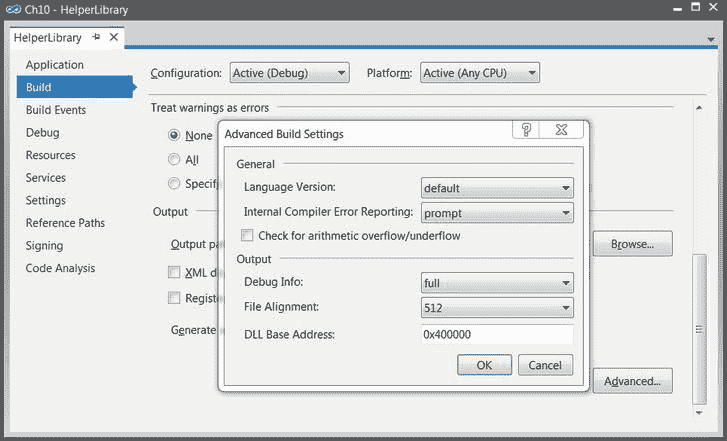

# 十、性能模式

这一章包含了我们在别处没有机会讨论的各种主题。虽然很小，但它们对于高性能应用极其重要。本章没有统一的思路来指导你，但是你希望在简单的紧循环和复杂的应用中获得一流的性能。

我们从 JIT 编译器优化开始这一章，这对于 CPU 受限的应用的良好性能至关重要。接下来，我们讨论启动性能，这对锻炼用户耐心的客户端应用至关重要。最后，我们讨论特定于处理器的优化，包括数据和指令级并行性，以及几个较小的主题。

JIT 编译器优化

在本书的前面，我们已经看到了 JIT 编译器执行的一些优化的重要性。具体来说，在第 3 章的[中，我们已经在研究虚拟和非虚拟方法的方法分派序列时详细讨论了内联。在这一节中，我们总结了 JIT 编译器执行的主要优化，以及如何确保您的代码不会妨碍 JIT 编译器执行这些优化的能力。JIT 优化主要影响受 CPU 限制的应用的性能，但在某种程度上也与其他类型的程序相关。](03.html)

要检查这些优化，您必须将调试器附加到一个正在运行的进程 JIT 编译器在检测到调试器存在时不会执行优化。具体来说，当附加到进程时，必须确保要检查的方法已经被调用和编译。

如果出于某种原因，您想要禁用 JIT 优化—例如，为了在面对内联和尾部调用(稍后讨论)时使调试更容易—您不必修改代码或使用调试版本。相反，您可以创建一个。ini 文件 ，该文件与您的应用可执行文件同名(例如，MyApp.ini ),并将以下三行代码放入其中。当下次启动时放在可执行文件旁边时，它将禁止 JIT 编译器执行任何优化。

```cs
[.NET Framework Debugging Control]
GenerateTrackingInfo = 1
AllowOptimize = 0

```

标准优化

每个优化编译器都会执行一些标准的优化 ，甚至是简单的优化。例如，JIT 能够将下面的 C# 代码减少到只有几条 x86 机器代码指令:

```cs
//Original C# code:
static int Add(int i, int j) {
  return i + j;
}
static void Main() {
  int i = 4;
  int j = 3*i + 11;
  Console.WriteLine(Add(i, j));
}
; Optimized x86 assembly code
call 682789a0       ; System.Console.get_Out()
mov ecx,eax
mov edx,1Bh       ; Add(i,j) was folded into its result, 27 (0x1B)
mov eax,dword ptr [ecx]       ; the rest is standard invocation sequence for the
mov eax,dword ptr [eax + 38h]       ; TextWriter.WriteLine virtual method
call dword ptr [eax + 14h]
```

 **注意**执行这种优化的不是 C# 编译器。如果您检查生成的 IL 代码，局部变量就在那里，就像对 Add 方法的调用一样。JIT 编译器负责所有的优化。

这种优化叫做*常数折叠* ，类似的简单优化还有很多，比如*常用子表达式约简* (像 a+(b * a)–(a * b * c)这样的语句中，a * b 的值只需要计算一次)。JIT 编译器执行这些标准的优化，但与优化编译器(如 Microsoft Visual C++编译器)相比，通常要差得多。原因是 JIT 编译器有一个非常严格的执行环境，必须能够快速编译方法，以防止在第一次调用方法时出现明显的延迟。

方法内联

这种优化通常会减少代码大小，并且通过用被调用者的主体替换方法调用位置，几乎总是会减少执行时间。正如我们在[第 3 章](03.html)中看到的，虚拟方法没有被 JIT 编译器内联(即使在派生类型上调用了密封方法)；接口方法通过推测性执行进行部分内联；只有静态和非虚方法可以总是被内联。对于对性能至关重要的代码，例如非常常访问的基础结构类上的简单属性和方法，请确保避免使用虚方法和接口实现。

JIT 编译器用来确定内联哪些方法的确切标准是不公开的。一些启发法可以通过实验发现:

*   具有复杂调用图(例如循环)的方法不被内联。
*   具有异常处理的方法不被内联。
*   递归方法不是内联的。
*   具有非基元值类型参数、局部变量或返回值的方法不会被内联。
*   具有大于 32 字节 IL 的主体的方法不会被内联。(MethodImplOptions。[MethodImpl]属性的 AggressiveInlining 值会覆盖此限制。)

在 CLR 的最新版本中，移除了对内联的一些人为限制。例如，截至。NET 3.5 SP1，32 位 JIT 编译器能够内联接受*一些*非原始值类型参数的方法，像[第 3 章](03.html)的 Point2D。该版本中所做的更改在特定条件下用基元类型上的等效操作替换了值类型上的操作(Point2D 被转换为两个 int ),并允许更好地优化与结构相关的代码，如复制传播、冗余赋值消除等。例如，考虑以下简单的代码:

```cs
private static void MethodThatTakesAPoint(Point2D pt) {
  pt.Y = pt.X ^ pt.Y;
  Console.WriteLine(pt.Y);
}
Point2D pt;
pt.X = 3;
pt.Y = 5;
MethodThatTakesAPoint(pt);
```

使用 CLR 4.5 JIT 编译器，这一整段代码被编译成道德上等同于控制台的代码。WriteLine(6)，这是 3 ^ 5 的结果。JIT 编译器能够在自定义值类型上使用内联和常数传播。使用 CLR 2.0 JIT 编译器时，对方法的实际调用是在调用位置发出的，并且在方法内部没有可见的优化:

```cs
; calling code
mov eax,3
lea edx,[eax + 2]
push edx
push eax
call dword ptr ds:[1F3350h] (Program.MethodThatTakesAPoint(Point2D), mdToken: 06000003)

; method code
push ebp
mov ebp,esp
mov eax,dword ptr [ebp + 8]
xor dword ptr [ebp + 0Ch],eax
call mscorlib_ni + 0x22d400 (715ed400) (System.Console.get_Out(), mdToken: 06000773)
mov ecx,eax
mov edx,dword ptr [ebp + 0Ch]
mov eax,dword ptr [ecx]
call dword ptr [eax + 0BCh]
pop ebp
ret 8
```

虽然如果 JIT 编译器不愿意执行的话，没有办法让*强制*内联，但是有一种方法可以关闭内联。MethodImplOptions。[MethodImpl]属性的 NoInlining 值禁用它所在的特定方法的内联——顺便提一下，这对于微基准测试非常有用，在[第 2 章](02.html)中讨论过。

范围检查消除

当访问数组元素时，CLR 必须确保用于访问数组的索引在数组的界限内。如果不进行这种检查，内存安全就会受到威胁；你可以初始化一个 byte[]对象，并用正负索引对其进行索引，以读/写内存中的任何位置。虽然绝对有必要，但这个范围检查需要几条指令的性能代价。下面是 JIT 编译器为标准数组访问发出的代码:

```cs
//Original C# code:
uint[] array = new uint[100];
array[4] = 0xBADC0FFE;
; Emitted x86 assembly instructions
mov ecx,offset 67fa33aa             ; type of array element
mov edx,64h             ; array size
call 0036215c             ; creates a new array (CORINFO_HELP_NEWARR_1_VC)
cmp dword ptr [eax + 4],4             ; eax + 4 contains the array length, 4 is the index
jbe NOT_IN_RANGE             ; if the length is less than or equal the index, jump away
mov dword ptr [eax + 18h],0BADC0FFEh             ; the offset was calculated at JIT time (0x18 = 8 + 4*4)
; Rest of the program's code, jumping over the NOT_IN_RANGE label
NOT_IN_RANGE:
call clr!JIT_RngChkFail             ; throws an exception
```

有一种特殊情况，JIT 编译器可以消除访问数组元素的范围检查——访问每个数组元素的索引 for 循环。如果没有这种优化，访问数组总是比在非托管代码中慢，这对科学应用和内存受限的工作来说是不可接受的性能损失。对于下面的循环，JIT 编译器将消除范围检查:

```cs
//Original C# code:
for (int k = 0; k < array.Length; ++k) {
    array[k] = (uint)k;
}
; Emitted x86 assembly instructions (optimized)
xor edx,edx             ; edx = k = 0
mov eax,dword ptr [esi + 4]             ; esi = array, eax = array.Length
test eax,eax             ; if the array is empty,
jle END_LOOP             ; skip the loop
NEXT_ITERATION:
mov dword ptr [esi + edx*4 +8],edx             ; array[k] = k
inc edx             ; ++k
cmp eax,edx             ; as long as array.Length > k,
jg NEXT_ITERATION             ; jump to the next iteration
END_LOOP:
```

在循环过程中只有一个检查，这个检查确保循环终止。然而，循环内部的数组访问是*而不是*检查的——突出显示的行写入数组中的第 k 个元素，而没有确保(再次)k 在数组边界内。

不幸的是，阻碍这种优化也相当容易。对循环所做的一些看似无害的更改，可能会在访问数组时产生强制范围检查的负面影响:

```cs
//The range-check elimination occurs
for (int k = 0; k < array.Length - 1; ++k) {
    array[k] = (uint)k;
}
//The range-check elimination occurs
for (int k = 7; k < array.Length; ++k) {
    array[k] = (uint)k;
}
//The range-check elimination occurs
//The JIT removes the -1 from the bounds check and starts from the second element
for (int k = 0; k < array.Length - 1; ++k) {
    array[k + 1] = (uint)k;
}
//The range-check elimination does not occur
for (int k = 0; k < array.Length / 2; ++k) {
    array[k * 2] = (uint)k;
}
//The range-check elimination does not occur
staticArray = array; //"staticArray" is a static field of the enclosing class
for (int k = 0; k < staticArray.Length; ++k) {
    staticArray[k] = (uint)k;
}
```

总而言之，范围检查消除是一种脆弱的优化，您应该确保代码中对性能至关重要的部分享受这种优化，即使这意味着您必须检查为您的程序生成的汇编代码。有关范围检查消除和其他极限情况的更多细节，请参见 Dave Detlefs 在`http://blogs.msdn.com/b/clrcodegeneration/archive/2009/08/13/array-bounds-check-elimination-in-the-clr.aspx`上发表的文章“CLR 中的数组边界检查消除”。

尾部呼叫

*尾调用* 是重用一个已有方法的堆栈框架来调用另一个方法的优化。这种优化对于许多类型的递归算法非常有用。事实上，如果广泛使用尾部调用优化，一些递归方法可以和基于迭代的方法一样有效。考虑下面的递归方法，它计算两个整数的最大公约数:

```cs
public static int GCD(int a, int b) {
  if (b == 0) return a;
  return GCD(b, a % b);
}
```

显然，GCD(b，a % b)的递归调用不受内联的影响——它毕竟是一个递归调用。然而，因为调用者和被调用者的堆栈框架是完全兼容的，并且因为调用者在递归调用之后不做任何事情，一个可能的优化是将这个方法重写如下:

```cs
public static int GCD(int a, int b) {
START:
  if (b == 0) return a;
  int temp = a % b;
  a = b;
  b = temp;
  goto START;
}
```

这种重写消除了所有的方法调用——实际上，递归算法已经变成了迭代算法。尽管每次遇到这种可能性时，您都可以手动执行这种重写，但是在某些情况下，JIT 编译器会自动执行。下面是两个版本的 GCD 方法—第一个使用 CLR 4.5 32 位 JIT 编译器编译，第二个使用 CLR 4.5 64 位 JIT 编译器编译:

```cs
; 32-bit version, parameters are in ECX and EDX
push ebp
mov ebp,esp
push esi
mov eax,ecx             ; EAX = a
mov ecx,edx             ; ECX = b
test ecx,ecx             ; if b == 0, returning a
jne PROCEED
pop esi
pop ebp
ret
PROCEED:
cdq
idiv eax,ecx             ; EAX = a / b, EDX = a % b
mov esi,edx
test esi,esi             ; if a % b == 0, returning b (inlined base of recursion)
jne PROCEED2
mov eax,ecx
jmp EXIT
PROCEED2:
mov eax,ecx
cdq
idiv eax,esi
mov ecx,esi             ; recursive call on the next line
call dword ptr ds:[3237A0h] (Program.GCD(Int32, Int32), mdToken: 06000004)
EXIT:
pop esi
pop ebp
ret             ; reuses return value (in EAX) from recursive return
; 64-bit version, parameters in ECX and EDX
sub rsp,28h             ; construct stack frame – happens only once!
START:
mov r8d,edx
test r8d,r8d             ; if b == 0, return a
jne PROCEED
mov eax,ecx
jmp EXIT
PROCEED:
cmp ecx,80000000h
jne PROCEED2:
cmp r8d,0FFFFFFFFh
je OVERFLOW             ; miscellaneous overflow checks for arithmetic
xchg ax,ax             ; two-byte NOP (0x66 0x90) for alignment purposes
PROCEED2:
mov eax,ecx
cdq
idiv eax,r8d             ; EAX = a / b, EDX = a % b
mov ecx,r8d             ; reinitialize parameters
mov r8d,edx             ; . . .
jmp START             ; and jump back to the beginning (no function call)
xchg ax,ax             ; two-byte NOP (0x66 0x90) for alignment purposes
EXIT:
add rsp,28h
ret
OVERFLOW:
call clr!JIT_Overflow
nop
```

显而易见，64 位 JIT 编译器使用尾部调用优化来消除递归方法调用，而 32 位 JIT 编译器则没有。对两个 JIT 编译器用来确定是否可以使用尾部调用的条件的详细处理超出了本书的范围——下面是一些启发性的方法:

*   64 位 JIT 编译器在尾部调用方面非常宽松，即使语言编译器(例如 C# 编译器)没有建议使用尾部，它也会经常执行尾部调用。IL 前缀。

*   后跟附加代码(而不是从方法返回)的调用不受尾部调用的影响。(CLR 4.0 中略有放宽。)
*   调用返回与调用方不同类型的方法。
*   对具有太多参数、未对齐参数或大值类型的参数/返回类型的方法的调用。(在 CLR 4.0 中放宽了很多。)

*   32 位 JIT 编译器不太倾向于执行这种优化，只有在尾部要求时才会发出尾部调用。IL 前缀。

 **注意**尾部调用含义的一个奇怪方面是无限递归的情况。如果递归的基本情况有一个会导致无限递归的错误，但是 JIT 编译器能够将递归方法调用转换为尾部调用，那么作为无限递归结果的常见 StackOverflowException 结果就会变成无限循环！

更多关于尾部的细节。用于向不情愿的 JIT 编译器建议尾部调用的 IL 前缀以及 JIT 编译器用来执行尾部调用的标准可在线获得:

*   尾巴。IL 前缀是 C# 编译器不发出的，但函数式语言编译器(包括 F#)经常使用，它在 MSDN 上被描述为系统的一部分。Reflection.Emit 类页面:`http://msdn.microsoft.com/en-us/library/system.reflection.emit.opcodes.tailcall.aspx`。
*   在 JIT 编译器(CLR 4.0 之前)中执行尾部调用的条件列表在 David Broman 的文章“尾部调用 JIT 条件”中有详细介绍，位于`http://blogs.msdn.com/b/davbr/archive/2007/06/20/tail-call-jit-conditions.aspx`。
*   CLR 4.0 JIT 编译器中的尾部调用优化更改在文章“中的尾部调用改进”中有详细描述。NET 框架 4”，在`http://blogs.msdn.com/b/clrcodegeneration/archive/2009/05/11/tail-call-improvements-in-net-framework-4.aspx`。

启动性能

对于客户端应用，快速启动是给用户或评估产品或进行演示的潜在客户留下的很好的第一印象。然而，应用越复杂，保持可接受的启动时间就越困难。区分*冷启动*和*热启动*非常重要，前者是指系统刚刚完成引导后首次启动应用，后者是指系统使用一段时间后启动应用(不是第一次)。始终在线的系统服务或后台代理需要快速的冷启动时间，以防止系统启动序列和用户登录花费太长时间。典型的客户端应用，如电子邮件客户端和网络浏览器，可能会有稍长的冷启动时间，但用户会希望它们在系统使用一段时间后快速启动。在这两种情况下，大多数用户都希望启动时间短。

启动时间长有几个因素。其中一些仅与冷启动相关；其他的与两种类型的启动都相关。

*   I/O 操作—要启动应用，Windows 和 CLR 必须从磁盘加载应用的程序集以及。NET Framework 程序集、CLR DLLs 和 Windows DLLs。这个因素主要与冷启动有关。
*   JIT 编译—应用启动期间第一次调用的每个方法都必须由 JIT 编译器编译。因为当应用终止时，由 JIT 编译的代码不会被保留，所以这个因素与冷启动和热启动都相关。
*   GUI 初始化——取决于您的 GUI 框架(Metro、WPF、Windows 窗体等)。)，要显示用户界面，必须执行特定于 GUI 的初始化步骤。这个因素与两种类型的启动都相关。
*   加载特定于应用的数据—您的应用可能需要来自文件、数据库或 Web 服务的一些信息来显示其初始屏幕。这个因素与两种类型的启动都相关，除非您的应用对这些数据采用某种缓存方案。

我们有几个测量工具可以用来诊断长启动时间及其可能的原因(见[第 2 章](02.html))。Sysinternals 进程监视器可以指向应用进程执行的 I/O 操作，而不管是 Windows、CLR 还是应用代码启动了这些操作。PerfMonitor 和。NET CLR JIT 性能计数器类别可以帮助诊断应用启动期间的过度 JIT 编译。最后，“标准”分析器(在采样或检测模式下)可以决定应用在启动时是如何花费时间的。

此外，您可以执行一个简单的实验来告诉您 I/O 是否是启动时间缓慢的主要原因:对应用的冷启动和热启动场景进行计时(您应该为这些测试使用干净的硬件环境，并确保冷启动测试中没有不必要的服务或其他初始化)。如果热启动明显快于冷启动，I/O 就是罪魁祸首。

提高特定于应用的数据加载取决于您；我们发布的每一条指导方针都太笼统，无法在实践中使用(除了提供一个闪屏来考验用户的耐心……)。然而，我们可以为 I/O 操作和 JIT 编译导致的启动性能不佳提供一些补救措施。在某些情况下，优化应用的启动时间可以减少一半或更多。

用 NGen 进行预 JIT 编译 (原生映像生成器)

尽管 JIT 编译器非常方便，并且只在调用方法时才编译它们，但是每当 JIT 运行时，您的应用仍然要付出性能代价。那个。NET Framework 提供了一个优化工具，叫做*原生映像生成器*(NGen.exe)，可以在运行前把你的程序集编译成机器码(*原生映像*)。如果应用需要的每个程序集都是以这种方式预编译的，那么就不需要加载 JIT 编译器，也不需要在应用启动时使用它。尽管生成的本机映像可能比原始程序集大，但在大多数情况下，冷启动时的磁盘 I/O 量实际上会减少，因为 JIT 编译器本身(clrjit.dll)和引用程序集的元数据不是从磁盘中读取的。

预编译还有另一个好处——与 JIT 编译器在运行时发出的代码不同，本机映像可以在进程间共享。如果同一台计算机上的几个进程对某个程序集使用本机映像，则物理内存消耗比 JIT 编译的情况要低。这在共享系统场景中尤其重要，此时多个用户通过终端服务会话连接到一台服务器，并运行相同的应用。

要预编译你的应用，你需要做的就是指向 NGen.exe 工具，它位于。NET Framework 的目录添加到应用的主程序集(通常是一个。exe 文件)。NGen 将继续定位您的主程序集拥有的所有静态依赖项，并将它们全部预编译为本机映像。生成的本机映像存储在您不必管理的缓存中，默认情况下，它存储在 GAC 旁边的 C:\ Windows \ Assembly \ native images _ *文件夹中。

 **提示**因为 CLR 和 NGen 自动管理本机映像缓存，所以*千万不要*将本机映像从一台机器复制到另一台机器。在特定系统上预编译托管程序集的唯一支持方式是在那个系统上运行*NGen 工具。实现这一点的理想时间是在应用安装期间(NGen 甚至支持“defer”命令，该命令会将预编译排队到后台服务)。这就是。NET Framework 安装程序为经常使用的。NET 程序集。*

下面是使用 NGen 预编译一个简单应用的完整示例，该应用由两个程序集组成 main。exe 文件和一个辅助。它引用的 dll。NGen 成功检测到依赖项，并将两个程序集预编译为本机映像:

```cs
> c:\windows\microsoft.net\framework\v4.0.30319\ngen install Ch10.exe
Microsoft (R) CLR Native Image Generator - Version 4.0.30319.17379
Copyright (c) Microsoft Corporation. All rights reserved.

Installing assembly D:\Code\Ch10.exe
1> Compiling assembly D:\Code\Ch10.exe (CLR v4.0.30319) . . .
2> Compiling assembly HelperLibrary, . . . (CLR v4.0.30319) . . .
```

在运行时，CLR 使用本机映像，根本不需要加载 clrjit.dll(在下面 lm 命令的输出中，没有列出 clrjit.dll)。类型方法表(见第三章)也存储在本地映像中，指向本地映像边界内的预编译版本。

```cs
0:007 > lm

start end module name
01350000 01358000 Ch10 (deferred)
2f460000 2f466000 Ch10_ni (deferred)
30b10000 30b16000 HelperLibrary_ni (deferred)
67fa0000 68eef000 mscorlib_ni (deferred)
6b240000 6b8bf000 clr (deferred)
6f250000 6f322000 MSVCR110_CLR0400 (deferred)
72190000 7220a000 mscoreei (deferred)
72210000 7225a000 MSCOREE (deferred)
74cb0000 74cbc000 CRYPTBASE (deferred)
74cc0000 74d20000 SspiCli (deferred)
74d20000 74d39000 sechost (deferred)
74d40000 74d86000 KERNELBASE (deferred)
74e50000 74f50000 USER32 (deferred)
74fb0000 7507c000 MSCTF (deferred)
75080000 7512c000 msvcrt (deferred)
75150000 751ed000 USP10 (deferred)
753e0000 75480000 ADVAPI32 (deferred)
75480000 75570000 RPCRT4 (deferred)
75570000 756cc000 ole32 (deferred)
75730000 75787000 SHLWAPI (deferred)
75790000 757f0000 IMM32 (deferred)
76800000 7680a000 LPK (deferred)
76810000 76920000 KERNEL32 (deferred)
76920000 769b0000 GDI32 (deferred)
775e0000 77760000 ntdll (pdb symbols)

0:007 > !dumpmt -md 2f4642dc
EEClass: 2f4614c8
Module: 2f461000
Name: Ch10.Program
mdToken: 02000002
File: D:\Code\Ch10.exe
BaseSize: 0xc
ComponentSize: 0x0
Slots in VTable: 6
Number of IFaces in IFaceMap: 0
--------------------------------------
MethodDesc Table
    Entry MethodDe JIT Name
68275450 68013524 PreJIT System.Object.ToString()
682606b0 6801352c PreJIT System.Object.Equals(System.Object)
68260270 6801354c PreJIT System.Object.GetHashCode()
68260230 68013560 PreJIT System.Object.Finalize()
2f464268 2f46151c PreJIT Ch10.Program..ctor()
2f462048 2f461508 PreJIT Ch10.Program.Main(System.String[])

0:007 > !dumpmt -md 30b141c0
EEClass: 30b114c4
Module: 30b11000
Name: HelperLibrary.UtilityClass
mdToken: 02000002
File: D:\Code\HelperLibrary.dll
BaseSize: 0xc
ComponentSize: 0x0
Slots in VTable: 6
Number of IFaces in IFaceMap: 0
--------------------------------------
MethodDesc Table
    Entry MethodDe JIT Name
68275450 68013524 PreJIT System.Object.ToString()
682606b0 6801352c PreJIT System.Object.Equals(System.Object)
68260270 6801354c PreJIT System.Object.GetHashCode()
68260230 68013560 PreJIT System.Object.Finalize()
30b14158 30b11518 PreJIT HelperLibrary.UtilityClass..ctor()
30b12048 30b11504 PreJIT HelperLibrary.UtilityClass.SayHello()
```

另一个有用的选项是“update”命令，它强制 NGen 重新计算缓存中所有本机映像的依赖关系，并再次预编译任何修改过的程序集。在目标系统上安装更新后，或者在开发过程中，您会用到它。

 **注意**理论上，NGen 可以使用与 JIT 编译器在运行时使用的完全不同的——更大的——优化集。毕竟 NGen 不像 JIT 编译器那样有时间限制。然而，在撰写本文时，除了 JIT 编译器使用的那些优化之外，NGen 没有其他优化方法。

在 Windows 8 上使用 CLR 4.5 时，NGen 不会被动地等待您的指令来预编译应用程序集。相反，CLR 生成由 NGen 的后台维护任务处理的程序集使用日志。该任务定期决定哪些程序集将受益于预编译，并运行 NGen 为它们创建本机映像。您仍然可以使用 NGen 的“display”命令来检查本机映像缓存(或者从命令行提示符检查其文件)，但是决定哪些程序集将受益于预编译的大部分负担现在都由 CLR 来决定。

多核后台 JIT 编译

从 CLR 4.5 开始，您可以指示 JIT 编译器生成在应用启动期间执行的方法的配置文件，并在随后的应用启动(包括冷启动场景)中使用该配置文件在后台编译这些方法。换句话说，当应用的主线程正在初始化时，JIT 编译器在后台线程上执行，这样方法很可能在需要时已经编译好了。配置文件信息会在每次运行时更新，因此即使应用以不同的配置启动了数百次，它也会保持最新。

 **注意**在 ASP.NET 和 Silverlight 5 应用中默认启用该功能。

要选择使用多核后台 JIT 编译 ，您需要在系统上调用两个方法。Runtime 优化类。第一个方法告诉探查器可以存储分析信息的位置，第二个方法告诉探查器正在执行哪个启动场景。第二种方法的目的是区分相当不同的场景，以便为特定场景定制优化。例如，可以使用“显示存档中的文件”参数调用存档实用程序，这需要一组方法，还可以使用“从目录创建压缩存档”参数，这需要一组完全不同的方法:

```cs
public static void Main(string[] args) {
  System.Runtime.ProfileOptimization.SetProfileRoot(
    Path.GetDirectoryName(Assembly.GetExecutingAssembly().Location));
  if (args[0] == "display") {
    System.Runtime.ProfileOptimization.StartProfile("DisplayArchive.prof");
  } else if (args[0] == "compress") {
    System.Runtime.ProfileOptimization.StartProfile("CompressDirectory.prof");
  }
  //. . .More startup scenarios
  //The rest of the application's code goes here, after determining the startup scenario
}
```

图像打包器

最小化 I/O 传输成本的一种常见方法是压缩原始数据。毕竟，如果一张 DVD 可以容纳 15GB 的未压缩 Windows 安装，那么下载它就没有什么意义了。同样的想法可以用于存储在磁盘上的托管应用。通过减少启动时执行的 I/O 操作的数量，压缩应用并仅在将其加载到内存中后再解压缩，可以显著降低冷启动成本。压缩是一把双刃剑，因为在内存中解压缩应用的代码和数据需要 CPU 时间，但是当降低冷启动成本至关重要时，付出 CPU 时间的代价是值得的，例如对于必须在系统打开后尽快启动的 kiosk 应用。

有几个商业的和开源的应用压缩工具(通常称为*打包器*)。如果你使用封隔器，确保它可以压缩。NET 应用——一些打包程序只能很好地处理非托管二进制文件。压缩工具的一个例子。NET applications 是 MPress，可以在`http://www.matcode.com/mpress.htm. Another example is the Rugland Packer for .NET Executables (RPX), an open source utility published at http://rpx.codeplex.com/`免费在线获得。下面是在一个非常小的应用上运行时，RPX 的一些示例输出:

```cs
> Rpx.exe Shlook.TestServer.exe Shlook.Common.dll Shlook.Server.dll
Rugland Packer for (.Net) eXecutables 1.3.4399.43191
```


```cs
Unpacked size :..............27.00 KB
 Packed size :..............13.89 KB
 Compression :..............48.55%
 ─────────────────────────────────────────
 Application target is the console
 ─────────────────────────────────────────
 Uncompressed size :..............27.00 KB
 Startup overhead :...............5.11 KB
 Final size :..............19.00 KB
 ─────────────────────────────────────────
 Total compression :..............29.63%
```

受管理的档案导向优化(MPGO )

managed profile guided optimization(MPGO)是 Visual Studio 11 和 CLR 4.5 中引入的工具，用于优化 NGen 生成的本机映像的磁盘布局。MPGO 从应用执行的指定时间段生成配置文件信息，并将其嵌入程序集中。随后，NGen 使用这些信息来优化生成的本机映像的布局。

MPGO 以两种主要方式优化本机映像的布局。首先，MPGO 确保频繁使用的代码和数据(热数据)一起放在磁盘上。因此，热数据的页面错误和磁盘读取将会减少，因为单个页面上可以容纳更多的热数据。其次，MPGO 将潜在的可写数据一起放在磁盘上。当与其他进程共享的数据页被修改时，Windows 会创建该页的私有副本供修改进程使用(这称为*写时复制*)。由于 MPGO 的优化，更少的共享页面被修改，从而导致更少的副本和更低的内存利用率。

要在您的应用上运行 MPGO，您需要提供要检测的程序集列表、放置优化的二进制文件的输出目录，以及一个超时值，在该超时值之后分析应该停止。MPGO 检测应用，运行它，分析结果，并为您指定的程序集创建优化的本机映像:

```cs
> mpgo.exe -scenario Ch10.exe -assemblylist Ch10.exe HelperLibrary.dll -OutDir . –NoClean

Successfully instrumented assembly D:\Code\Ch10.exe
Successfully instrumented assembly D:\Code\HelperLibrary.dll

 < output from the application removed > 

Successfully removed instrumented assembly D:\Code\Ch10.exe
Successfully removed instrumented assembly D:\Code\HelperLibrary.dll
Reading IBC data file: D:\Code\Ch10.ibc
The module D:\Code\Ch10-1.exe, did not contain an IBC resource
Writing profile data in module D:\Code\Ch10-1.exe
Data from one or more input files has been upgraded to a newer version.
Successfully merged profile data into new file D:\Code\Ch10-1.exe
Reading IBC data file: D:\Code\HelperLibrary.ibc
The module D:\Code\HelperLibrary-1.dll, did not contain an IBC resource
Writing profile data in module D:\Code\HelperLibrary-1.dll
Data from one or more input files has been upgraded to a newer version.
Successfully merged profile data into new file D:\Code\HelperLibrary-1.dll
```

 **注意**优化完成后，您需要在优化后的程序集上再次运行 NGen，以创建受益于 MPGO 的最终本机映像。本章前面已经介绍了在程序集上运行 NGen。

在撰写本文时，还没有将 MPGO 引入 Visual Studio 2012 用户界面的计划。命令行工具是为您的应用增加这些性能的唯一方法。因为它依赖于 NGen，所以这是另一个最好在目标机器上安装之后执行的优化。

关于启动性能的其他提示

有几个我们之前没有提到的额外的技巧可能会让你的应用的启动时间缩短几秒钟。

强名称程序集属于 GAC

如果您的程序集具有强名称，请确保将它们放在全局程序集缓存(GAC ) 中。否则，加载程序集需要接触几乎每一页来验证其数字签名。当程序集不在 GAC 中时验证强名称也会降低 NGen 的性能。

确保您的本机映像不需要重设基础

当使用 NGen 时，确保您的本机映像没有基址冲突，这需要重新设置基址。重置基础是一项开销很大的操作，涉及到在运行时修改代码地址，并创建共享代码页的副本。要查看本机映像的基址，请使用带有/headers 标志的 dumpbin.exe 实用程序，如下所示:

```cs
> dumpbin.exe /headers Ch10.ni.exe
Microsoft (R) COFF/PE Dumper Version 11.00.50214.1
Copyright (C) Microsoft Corporation. All rights reserved.

Dump of file Ch10.ni.exe

PE signature found

File Type: DLL

FILE HEADER VALUES
           14C machine (x86)
           4 number of sections
       4F842B2C time date stamp Tue Apr 10 15:44:28 2012
           0 file pointer to symbol table
           0 number of symbols
           E0 size of optional header
           2102 characteristics
           Executable
           32 bit word machine
           DLL

OPTIONAL HEADER VALUES
           10B magic # (PE32)
           11.00 linker version
           0 size of code
           0 size of initialized data
           0 size of uninitialized data
           0 entry point
           0 base of code
           0 base of data
       30000000 image base (30000000 to 30005FFF)
           1000 section alignment
           200 file alignment
           5.00 operating system version
           0.00 image version
           5.00 subsystem version
           0 Win32 version
           6000 size of image
 < more output omitted for brevity>
```

若要更改本机映像的基址，请在 Visual Studio 的项目属性中更改基址。打开高级对话框后，基址可位于构建选项卡上(见[图 10-1](#Fig00101) )。



[图 10-1](#_Fig00101) 。Visual Studio 高级生成设置对话框，该对话框允许修改 NGen 生成的本机映像的基址

截至。NET 3.5 SP1，当应用在 Windows Vista 或更新的平台上运行时，NGen 选择使用地址空间布局随机化(ASLR)。当使用 ASLR 时，出于安全原因，映像的基本加载地址在运行时是随机的。在这种配置下，在 Windows Vista 和更新的平台上，为避免基址冲突而重设程序集的基并不重要。

减少组件的总数

减少应用加载的程序集的数量。无论大小如何，每次程序集加载都会产生固定的开销，程序集间引用和方法调用在运行时的开销可能更大。加载数百个程序集的大型应用并不少见，如果将程序集合并到几个二进制文件中，它们的启动时间可以减少几秒钟。

处理器特定优化

理论上，。NET 开发人员不应该关心针对特定处理器或指令集的优化。毕竟，IL 和 JIT 编译的目的是允许托管应用在任何具有。NET Framework，并对操作系统位、处理器特性和指令集保持中立。然而，正如我们在本书中所看到的，从托管应用中挤出最后一点性能可能需要汇编语言级别的推理。在其他时候，理解处理器特定的特性是获得更大性能提升的第一步。

在这一小段中，我们将回顾一些针对特定处理器特性的优化示例，这些优化可能在一台机器上运行良好，但在另一台机器上可能会失效。我们主要关注英特尔处理器，尤其是 Nehalem、Sandy Bridge 和 Ivy Bridge 系列，但大多数指南也与 AMD 处理器相关。因为这些优化是危险的，并且有时是不可重复的，所以您不应该将这些例子作为明确的指导，而只是作为从您的应用中获得更多性能的动机。

单指令多数据(SIMD)

数据级并行，也称为*单指令多数据* (SIMD )，是现代处理器的一个特性，能够对一大组数据(大于机器字)执行单个指令。SIMD 指令集事实上的标准是 SSE(SIMD 流扩展)，自奔腾 III 以来，英特尔处理器一直在使用 SSE。该指令集增加了新的 128 位寄存器(带有 XMM 前缀)以及可以对其进行操作的指令。最近的英特尔处理器推出了*高级向量扩展* (AVX)，这是 SSE 的一个扩展，提供 256 位寄存器和更多 SIMD 指令。SSE 指令的一些例子包括:

*   整数和浮点运算
*   比较、洗牌、数据类型转换(整数到浮点)
*   位运算
*   最小、最大、条件副本、CRC32、群体计数(在 SSE4 和更高版本中引入)

您可能想知道在这些“新”寄存器上运行的指令是否比它们的标准对应物慢。如果是这样的话，任何性能提升都是骗人的。幸运的是，事实并非如此。在英特尔 i7 处理器上，32 位寄存器上的浮点加法(FADD ) 指令的吞吐量为每周期一条指令，延迟为 3 个周期。128 位寄存器上的等效 ADDPS 指令也具有每周期一条指令的吞吐量和 3 个周期的延迟。

晚期 NCY 和吞吐量

延迟和吞吐量是一般性能测量中的常用术语，但在讨论处理器指令的“速度”时尤其如此:

*   指令的延迟是指从开始到结束执行一个指令实例所花费的时间(通常以时钟周期来衡量)。
*   指令的吞吐量是指单位时间内(通常以时钟周期为单位)可以执行的相同类型指令的数量。

如果我们说 FADD 有 3 个周期的延迟，这意味着单个 FADD 操作将需要 3 个周期才能完成。如果我们说 FADD 具有每周期一条指令的吞吐量，这意味着通过并发地发出多个 FADD 实例，处理器能够维持每周期一条指令的执行速率，这将需要三条这样的指令并发地执行。

通常情况下，一条指令的吞吐量明显好于其延迟，因为处理器可以并行发出和执行多条指令(我们稍后将回到这个主题)。

与一次处理单个浮点或整数值的简单顺序程序相比，在高性能循环中使用这些指令可以提供高达 8 倍的性能提升。例如，考虑下面的(公认的琐碎)代码:

```cs
//Assume that A, B, C are equal-size float arrays
for (int i = 0; i < A.length; ++i) {
  C[i] = A[i] + B[i];
}
```

在这种情况下，JIT 发出的标准代码如下:

```cs
; ESI has A, EDI has B, ECX has C, EDX is the iteration variable
xor edx,edx
cmp dword ptr [esi + 4],0
jle END_LOOP
NEXT_ITERATION:
fld dword ptr [esi + edx*4 + 8]             ; load A[i], no range check
cmp edx,dword ptr [edi + 4]             ; range check before accessing B[i]
jae OUT_OF_RANGE
fadd dword ptr [edi + edx*4 + 8]             ; add B[i]
cmp edx,dword ptr [ecx + 4]             ; range check before accessing C[i]
jae OUT_OF_RANGE
fstp dword ptr [ecx + edx*4 + 8]             ; store into C[i]
inc edx
cmp dword ptr [esi + 4],edx             ; are we done yet?
jg NEXT_ITERATION
END_LOOP:
```

每次循环迭代执行一条 FADD 指令，将两个 32 位浮点数相加。但是，通过使用 128 位 SSE 指令，可以一次发出四次循环迭代，如下所示(下面的代码不执行范围检查，并假设迭代次数可被 4 整除):

```cs
xor edx, edx
NEXT_ITERATION:
movups xmm1, xmmword ptr [edi + edx*4 + 8]             ; copy 16 bytes from B to xmm1
movups xmm0, xmmword ptr [esi + edx*4 + 8]             ; copy 16 bytes from A to xmm0
addps xmm1, xmm0             ; add xmm0 to xmm1 and store the result in xmm1
movups xmmword ptr [ecx + edx*4 + 8], xmm1             ; copy 16 bytes from xmm1 to C
add edx, 4             ; increase loop index by 4
cmp edx, dword ptr [esi + 4]
jg NEXT_ITERATION
```

在 AVX 处理器上，我们可以在每次迭代中移动更多的数据(使用 256 位 YMM*寄存器)，从而实现更大的性能提升:

```cs
xor edx, edx
NEXT_ITERATION:
vmovups ymm1, ymmword ptr [edi + edx*4 + 8]             ; copy 32 bytes from B to ymm1
vmovups ymm0, ymmword ptr [esi + edx*4 + 8]             ; copy 32 bytes from A to ymm0
vaddps ymm1, ymm1, ymm0                                 ; add ymm0 to ymm1 and store the result in ymm1
vmovups ymmword ptr [ecx + edx*4 + 8], ymm1             ; copy 32 bytes from ymm1 to C
add edx, 8             ; increase loop index by 8
cmp edx, dword ptr [esi + 4]
jg NEXT_ITERATION
```

 **注意**这些例子中使用的 SIMD 指令只是冰山一角。现代应用和游戏使用 SIMD 指令来执行复杂的操作，包括标量积、在寄存器和内存中来回移动数据、校验和计算以及许多其他操作。英特尔的 AVX 门户是全面了解 AVX 所能提供的服务的好方法:`http://software.intel.com/en-us/avx/`

JIT 编译器只使用了少量的 SSE 指令，尽管它们在过去 10 年制造的几乎所有处理器上都可用。具体来说，JIT 编译器使用 SSE MOVQ 指令通过 XMM*寄存器复制中等大小的结构(对于大型结构，使用 REP MOVS 代替)，并使用 SSE2 指令进行浮点到整数的转换和其他极限情况。JIT 编译器*不会*通过统一迭代来自动矢量化循环，就像我们在前面的代码清单中手动做的那样，而现代 C++编译器(包括 Visual Studio 2012)会。

不幸的是，C# 没有提供任何将内联汇编代码嵌入托管程序的关键字。尽管您可以将对性能敏感的部分分解到 C++模块中并使用。NET 互操作性来访问它，这通常是笨拙的。还有另外两种嵌入 SIMD 码的方法，不需要借助单独的模块。

从托管应用中运行任意机器码的一种强力方法(尽管有一个轻量级互操作层)是动态发出机器码，然后调用它。法警。GetDelegateForFunctionPointer 方法是关键，因为它返回指向非托管内存位置的托管委托，该位置可能包含任意代码。下面的代码使用 EXECUTE_READWRITE 页面保护来分配虚拟内存，这使我们能够将代码字节复制到内存中，然后执行它们。结果，在英特尔 i7-860 CPU 上，执行时间提高了 2 倍以上！

```cs
[UnmanagedFunctionPointer(CallingConvention.StdCall)]
delegate void VectorAddDelegate(float[] C, float[] B, float[] A, int length);

[DllImport("kernel32.dll", SetLastError = true)]
static extern IntPtr VirtualAlloc(
  IntPtr lpAddress, UIntPtr dwSize, IntPtr flAllocationType, IntPtr flProtect);

//This array of bytes has been produced from the SSE assembly version – it is a complete
//function that accepts four parameters (three vectors and length) and adds the vectors
byte[] sseAssemblyBytes = { 0x8b, 0x5c, 0x24, 0x10, 0x8b, 0x74, 0x24, 0x0c, 0x8b, 0x7c, 0x24,
    0x08, 0x8b, 0x4c, 0x24, 0x04, 0x31, 0xd2, 0x0f, 0x10, 0x0c, 0x97,
    0x0f, 0x10, 0x04, 0x96, 0x0f, 0x58, 0xc8, 0x0f, 0x11, 0x0c, 0x91,
    0x83, 0xc2, 0x04, 0x39, 0xda, 0x7f, 0xea, 0xc2, 0x10, 0x00 };
IntPtr codeBuffer = VirtualAlloc(
    IntPtr.Zero,
    new UIntPtr((uint)sseAssemblyBytes.Length),
    0x1000 | 0x2000, //MEM_COMMIT | MEM_RESERVE
    0x40 //EXECUTE_READWRITE
);
Marshal.Copy(sseAssemblyBytes, 0, codeBuffer, sseAssemblyBytes.Length);
VectorAddDelegate addVectors = (VectorAddDelegate)
  Marshal.GetDelegateForFunctionPointer(codeBuffer, typeof(VectorAddDelegate));
//We can now use 'addVectors' to add vectors!
```

一种完全不同的方法是扩展 JIT 编译器来发出 SIMD 指令，不幸的是，这种方法在 Microsoft CLR 上不可用。这是 *Mono 采取的方法。Simd* 。使用 Mono 的托管代码开发人员。NET 运行库可以引用单声道。Simd 汇编并使用 JIT 编译器支持，将 Vector16b 或 Vector4f 等类型上的操作转换为适当的 SSE 指令。有关 Mono 的更多信息。Simd，见官方文档`http://docs.go-mono.com/index.aspx?link=N:Mono.Simd`。

指令级并行

与依赖特定指令一次对较大数据块进行操作的数据级并行性不同，*指令级并行性* (ILP )是一种在同一处理器上同时执行多条指令的机制。现代处理器有一个很深的流水线，其中包含几种类型的执行单元，例如访问内存的单元、执行算术运算的单元和解码 CPU 指令的单元。只要它们不竞争流水线的相同部分，并且只要它们之间没有*数据依赖性*，流水线就能够使多个指令的执行重叠。当一条指令需要在它之前执行的另一条指令的结果时，就会产生数据依赖性；例如，当一条指令从前一条指令已经写入的存储器位置读取时。

 **注**指令级并行是*而不是*与并行编程有关，我们在[第六章](06.html)中讨论过。当使用并行编程 API 时，应用在多个处理器上运行多个线程。指令级并行使单个处理器上的单个线程能够同时执行多条指令。与并行编程不同，ILP 更难控制，并且严重依赖于程序优化。

除了流水线之外，处理器还采用所谓的*超标量执行* ，它使用同一处理器上的多个冗余单元来一次执行多个相同类型的操作。此外，为了最小化数据依赖性对并行指令执行的影响，只要不违反任何数据依赖性，处理器就会不按其原始顺序执行指令。通过添加*推测性执行*(主要通过尝试猜测分支的哪一侧将被采用，但也通过其他方式)，处理器很可能能够执行额外的指令，即使原始程序顺序中的下一条指令由于数据依赖性而无法执行。

优化编译器以组织指令序列以最大化指令级并行性而闻名。JIT 编译器做得不是特别好，但是现代处理器的无序执行能力可能会抵消它。然而，指定不当的程序会引入不必要的数据依赖性，特别是在循环中，从而限制指令级并行性，从而显著影响性能。

考虑以下三个循环:

```cs
for (int k = 1; k < 100; ++k) {
    first[k] = a * second[k] + third[k];
}
for (int k = 1; k < 100; ++k) {
    first[k] = a * second[k] + first[k - 1];
}
for (int k = 1; k < 100; ++k) {
    first[k] = a * first[k - 1] + third[k];
}
```

我们在一台测试机器上执行这些循环，每一次都有 100 个整数的数组，迭代一百万次。第一个循环运行了 190 毫秒，第二个运行了 210 毫秒，第三个运行了 270 毫秒。这是一个源于指令级并行性的重大性能差异。第一个循环的迭代没有任何数据依赖性——多个迭代可以以任何顺序在处理器上发出，并在处理器的流水线中并发执行。第二个循环的迭代引入了一个数据依赖——为了分配 first[k]，代码依赖 first[k-1]。然而，至少乘法(必须在加法发生之前完成)可以在没有数据依赖性的情况下发出。在第三个循环中，情况非常糟糕:如果不等待来自上一次迭代的数据依赖，甚至连乘法都不能发出。

另一个例子是寻找整数数组中的最大值。在一个简单的实现中，每次迭代都依赖于前一次迭代中当前建立的最大值。奇怪的是，我们可以在这里应用在第 6 章中遇到的同样的想法——聚集，然后对局部结果求和。具体来说，查找整个数组的最大值相当于查找偶数和奇数元素上的最大值，然后执行一个额外的操作来查找全局最大值。两种方法如下所示:

```cs
//Naïve algorithm that carries a dependency from each loop iteration to the next
int max = arr[0];
for (int k = 1; k < 100; ++k) {
  max = Math.Max(max, arr[k]);
}

//ILP-optimized algorithm, which breaks down some of the dependencies such that within the
//loop iteration, the two lines can proceed concurrently inside the processor
int max0 = arr[0];
int max1 = arr[1];
for (int k = 3; k < 100; k + = 2) {
  max0 = Math.Max(max0, arr[k-1]);
  max1 = Math.Max(max1, arr[k]);
}
int max = Math.Max(max0, max1);
```

不幸的是，CLR JIT 编译器通过为第二个循环发出次优的机器码破坏了这种特殊的优化。在第一个循环中，重要的值放在寄存器中，max 和 k 存储在寄存器中。在第二个循环中，JIT 编译器不能容纳寄存器中的所有值；如果将 max1 或 max0 放在内存中，循环的性能会大大降低。相应的 C++实现提供了预期的性能增益——第一次展开操作将执行时间提高了两倍，再次展开(使用四个局部最大值)又节省了 25%。

指令级并行可以结合数据级并行。这里考虑的两个例子(乘加循环和最大值计算)都可以受益于使用 SIMD 指令的额外加速。在最大值的情况下，PMAXSD SSE4 指令对两组四个压缩的 32 位整数进行操作，并找到这两组中每对整数各自的最大值。以下代码(使用来自< smmintrin.h >的 Visual C++内部函数)的运行速度比之前最好的版本快 3 倍，比原始版本快 7 倍:

```cs
__m128i max0 = *(__m128i*)arr;
for (int k = 4; k < 100; k + = 4) {
  max0 = _mm_max_epi32(max0, *(__m128i*)(arr + k)); //Emits PMAXSD
}
int part0 = _mm_extract_epi32(max0, 0);
int part1 = _mm_extract_epi32(max0, 1);
int part2 = _mm_extract_epi32(max0, 2);
int part3 = _mm_extract_epi32(max0, 3);
int finalmax = max(part0, max(part1, max(part2, part3)));
```

当您最大限度地减少数据依赖性以从指令级并行性中获益时，数据级并行化(有时称为*矢量化*)通常会瞬间实现更大的性能优势。

托管代码与非托管代码

表达了一个共同的关注。CLR 的托管方面引入了性能成本，使得使用 C#、c# 和。NET 框架和 CLR。在整本书中，甚至在这一章中，我们已经看到了几个性能陷阱，如果您想从您的托管应用中获取每一点性能，您必须了解这些陷阱。不幸的是，总会有这样的情况:非托管代码(用 C++、C 甚至手工汇编编写)比托管代码有更好的性能。T3】

我们不打算对网上的每个例子进行分析和分类，在这些例子中，C++算法被证明比它的 C# 版本更有效。尽管如此，还是有一些比其他主题更经常出现的共同主题:

*   严格受 CPU 限制的数值算法在 C++中往往运行得更快，即使在 C# 中应用了特定的优化之后也是如此。原因往往在数组边界检查(JIT 编译器仅在某些情况下进行优化，并且仅针对一维数组)、C++编译器使用的 SIMD 指令以及 C++编译器擅长的其他优化(如复杂的内联和智能寄存器分配)之间波动。
*   某些内存管理模式对 GC 的性能是有害的(正如我们在第 4 章中看到的那样)。有时，C++代码可以通过使用池或重用从其他来源获得的非托管内存来“正确”管理内存。NET 代码将会很困难。
*   C++代码享有对 Win32 APIs 更直接的访问，并且不需要互操作性支持，例如参数封送和线程状态转换(在第 8 章的[中讨论)。高性能的应用与操作系统的交互比较繁琐，在中可能会运行较慢。由于这个互用性层。](08.html)

David Piepgrass 的优秀 CodeProject 文章“头对头的基准测试:C++ vs. NET”(可在`http://www.codeproject.com/Articles/212856/Head-to-head-benchmark-Csharp-vs-NET`获得)，打破了一些关于托管代码性能的误解。例如，皮普格拉斯证明了。NET 集合在某些情况下比它们的 C++ STL 等价物快得多；这同样适用于使用 ifstream 与 StreamReader 逐行读取文件数据。另一方面，他的一些基准测试强调了 64 位 JIT 编译器中仍然存在的缺陷，CLR 中缺乏 SIMD 内部函数(我们在前面讨论过)是 C++具有优势的另一个因素。

例外

如果正确并谨慎地使用，异常 并不是一个昂贵的机制。有一些简单的准则可以遵循，以避免抛出太多异常并导致巨大性能成本的风险:

*   针对异常情况使用异常:如果您预计异常会频繁发生，请考虑防御性编程，而不是抛出异常。这个规则也有例外(双关语)，但是在高性能场景中，10%的情况不应该通过抛出异常来处理。
*   在调用可能引发异常的方法之前，检查异常情况。这种方法的例子是流。CanRead 属性和 TryParse 系列的静态方法(例如 int。TryParse)。
*   不要抛出异常作为控制流机制:不要抛出异常来退出循环、停止读取文件或从方法返回信息。

与抛出和处理异常相关的最大性能成本可以分为几类:

*   构造一个异常需要一个堆栈审核(以填充堆栈跟踪)，堆栈越深，成本就越高。
*   抛出和处理异常需要与非托管代码(Windows 结构化异常处理(SEH)基础结构)进行交互，并通过堆栈上的 SEH 处理程序链运行。
*   异常将控制流和数据流从热区域转移，导致在访问冷数据和代码时出现页面错误和缓存缺失。

若要了解异常是否会导致性能问题，可以使用。NET CLR Exceptions 性能计数器类别(有关性能计数器的更多信息，请参见第 2 章[)。具体来说，如果每秒抛出数千个异常，每秒抛出的异常数计数器可以帮助查明潜在的性能问题。](02.html)

反射

Reflection 在许多复杂的应用中有着性能猪的坏名声。这种名声有些是有道理的:使用反射可以执行代价极其昂贵的操作，比如使用类型通过函数名调用函数。通过反射调用方法或设置字段值时的主要开销来自于必须在后台进行的工作，而不是可以由 JIT 编译成机器指令的强类型代码，使用反射的代码通过一系列代价高昂的方法调用在运行时被有效地解释。

例如，使用类型调用方法。InvokeMember 需要使用元数据和重载解析来确定要调用的方法，确保指定的参数与方法的参数匹配，必要时执行类型强制，验证任何安全问题，最后执行方法调用。因为反射很大程度上基于对象参数和返回值，所以装箱和取消装箱可能会增加额外的成本。

 **注**了解周边更多性能技巧。从内部的角度来看，考虑一下 Joel Pobar 在《MSDN》杂志上发表的文章“避开常见的性能陷阱，打造快速的应用”，这篇文章可以在网上的`http://msdn.microsoft.com/en-us/magazine/cc163759.aspx`找到。

通常，通过使用某种形式的*代码生成* ，可以从性能关键的场景中消除反射——而不是反射未知类型和动态调用方法/属性，您可以以强类型的方式生成代码(针对每种类型)。

代码生成

代码生成通常由序列化框架、对象/关系映射器(ORM)、动态代理和其他需要处理动态未知类型的性能敏感代码使用。控件中动态生成代码有几种方法。NET 框架，还有很多第三方代码生成框架 ，比如 LLBLGen 和 T4 模板。

*   轻量级代码生成(LCG ) ，又名动态方法。此 API 可用于生成方法，而无需创建类型和程序集来包含它。对于小块代码，这是最有效的代码生成机制。在 LCG 方法中发出代码需要 ILGenerator 类，它直接使用 IL 指令。
*   系统。Reflection.Emit 命名空间包含可用于在 IL 级别生成程序集、类型和方法的 API。
*   表达式树(在系统中。Linq.Expression 命名空间)可用于从序列化表示创建轻量级表达式。
*   CSharpCodeProvider 类可用于将 C# 源代码(以字符串形式提供或从文件中读取)直接编译成程序集。

从源代码生成代码

假设您正在实现一个序列化框架，它写出任意对象的 XML 表示。使用反射来获得非空的公共字段值并递归地写出它们是相当昂贵的，但是有利于一个简单的实现:

```cs
//Rudimentary XML serializer – does not support collections, cyclic references, etc.
public static string XmlSerialize(object obj) {
  StringBuilder builder = new StringBuilder();
  Type type = obj.GetType();
  builder.AppendFormat(" < {0} Type = '{1}'" > ", type.Name, type.AssemblyQualifiedName);
  if (type.IsPrimitive || type == typeof(string)) {
    builder.Append(obj.ToString());
  } else {
    foreach (FieldInfo field in type.GetFields()) {
    object value = field.GetValue(obj);
    if (value ! = null) {
    builder.AppendFormat(" < {0} > {1}</{0} > ", field.Name, XmlSerialize(value));
    }
    }
  }
  builder.AppendFormat("</{0} > ", type.Name);
  return builder.ToString();
}
```

相反，我们可以生成强类型代码来序列化特定类型并调用该代码。使用 CSharpCodeProvider，实现的要点如下:

```cs
public static string XmlSerialize<T>(T obj){
  Func<T,string> serializer = XmlSerializationCache<T>.Serializer;
  if (serializer == null){
    serializer = XmlSerializationCache<T>.GenerateSerializer();
  }
  return serializer(obj);
}

private static class XmlSerializationCache < T > {
  public static Func < T,string > Serializer;
  public static Func < T,string > GenerateSerializer() {
    StringBuilder code = new StringBuilder();
    code.AppendLine("using System;");
    code.AppendLine("using System.Text;");
    code.AppendLine("public static class SerializationHelper {");
    code.AppendFormat("public static string XmlSerialize({0} obj) {{", typeof(T).FullName);
    code.AppendLine("StringBuilder result = new StringBuilder();");
    code.AppendFormat("result.Append(\" < {0} Type = '{1}'" > \");", typeof(T).Name, typeof(T).AssemblyQualifiedName);
    if (typeof(T).IsPrimitive || typeof(T) == typeof(string)) {
    code.AppendLine("result.AppendLine(obj.ToString());");
    } else {
    foreach (FieldInfo field in typeof(T).GetFields()) {
       code.AppendFormat("result.Append(\" < {0} > \");", field.Name);
       code.AppendFormat("result.Append(XmlSerialize(obj.{0}));", field.Name);
       code.AppendFormat("result.Append(\"</{0} > \");", field.Name);
       }
    }
    code.AppendFormat("result.Append(\"</{0} > \");", typeof(T).Name);
    code.AppendLine("return result.ToString();");
    code.AppendLine("}");
    code.AppendLine("}");

    CSharpCodeProvider compiler = new CSharpCodeProvider();
    CompilerParameters parameters = new CompilerParameters();
    parameters.ReferencedAssemblies.Add(typeof(T).Assembly.Location);
    parameters.CompilerOptions = "/optimize + ";
    CompilerResults results = compiler.CompileAssemblyFromSource(parameters, code.ToString());
    Type serializationHelper = results.CompiledAssembly.GetType("SerializationHelper");
    MethodInfo method = serializationHelper.GetMethod("XmlSerialize");
    Serializer = (Func <T,string>)Delegate.CreateDelegate(typeof(Func <T,string>), method);
    return Serializer;
  }
}
```

基于反射的部分已经移动，因此只使用一次来生成强类型代码——结果缓存在静态字段中，并在每次必须序列化某个类型时重用。请注意，上面的序列化程序代码没有经过广泛的测试；这仅仅是一个概念证明，展示了代码生成的思想。简单的测量表明，基于代码生成的方法比原始的仅反射代码快两倍以上。

使用动态轻量级代码生成代码生成

另一个例子源于网络协议解析领域。假设您有一个很大的二进制数据流，比如网络数据包，您必须解析它以从中检索数据包报头并选择部分有效负载。例如，考虑下面的数据包报头结构(这是一个完全虚构的例子—TCP 数据包报头不是这样排列的):

```cs
public struct TcpHeader {
  public uint SourceIP;
  public uint DestIP;
  public ushort SourcePort;
  public ushort DestPort;
  public uint Flags;
  public uint Checksum;
}
```

在 C/C++中，从字节流中检索这样一个结构是一项简单的任务，如果通过指针访问，甚至不需要复制任何内存。事实上，从一个字节流中检索*任何*结构都是微不足道的:

```cs
template < typename T>
const T* get_pointer(const unsigned char* data, int offset) {
  return (T*)(data + offset);
}
template < typename T>
const T get_value(const unsigned char* data, int offset) {
  return *get_pointer(data, offset);
}
```

不幸的是，在 C# 中事情更复杂。从流中读取任意数据的方法有很多种。一种可能是使用反射来检查类型的字段，并从字节流中单独读取它们:

```cs
//Supports only some primitive fields, does not recurse
public static void ReadReflectionBitConverter < T > (byte[] data, int offset, out T value) {
  object box = default(T);
  int current = offset;
  foreach (FieldInfo field in typeof(T).GetFields()) {
    if (field.FieldType == typeof(int)) {
       field.SetValue(box, BitConverter.ToInt32(data, current));
       current + = 4;
    } else if (field.FieldType == typeof(uint)) {
       field.SetValue(box, BitConverter.ToUInt32(data, current));
       current + = 4;
    } else if (field.FieldType == typeof(short)) {
       field.SetValue(box, BitConverter.ToInt16(data, current));
       current + = 2;
    } else if (field.FieldType == typeof(ushort)) {
       field.SetValue(box, BitConverter.ToUInt16(data, current));
       current + = 2;
    }
    //. . .many more types omitted for brevity
    value = (T)box;
}
```

当在我们的一台测试机器上对一个 20 字节的 TcpHeader 结构执行 1，000，000 次时，这个方法平均需要 170 毫秒来执行。虽然运行时间看起来不算太长，但是所有装箱操作分配的内存量是相当大的。此外，如果您考虑 1Gb/s 的实际网络速率，预计每秒数千万个包是合理的，这意味着我们将不得不花费大部分 CPU 时间从传入数据中读取结构。

一个更好的方法是使用元帅。PtrToStructure 方法 ，用于将非托管内存块转换为托管结构。使用它需要固定原始数据以检索指向其内存的指针:

```cs
public static void ReadMarshalPtrToStructure < T > (byte[] data, int offset, out T value) {
  GCHandle gch = GCHandle.Alloc(data, GCHandleType.Pinned);
  try {
    IntPtr ptr = gch.AddrOfPinnedObject();
    ptr + = offset;
    value = (T)Marshal.PtrToStructure(ptr, typeof(T));
  } finally {
    gch.Free();
  }
}
```

这个版本要好得多，100 万个数据包平均耗时 39 毫秒。这是一个显著的性能改进，但是封送。PtrToStructure 仍然强制进行堆内存分配，因为它返回一个对象引用，对于每秒数千万个包来说，这仍然不够快。

在第 8 章中，我们讨论了 C# 指针和不安全代码，这似乎是一个使用它们的好机会。毕竟，C++版本之所以如此简单，正是因为它使用了指针。事实上，下面的代码对于 1，000，000 个数据包来说要快得多，只需 0.45 毫秒，这是一个令人难以置信的改进！

```cs
public static unsafe void ReadPointer(byte[] data, int offset, out TcpHeader header) {
  fixed (byte* pData = &data[offset]) {
    header = *(TcpHeader*)pData;
  }
}
```

为什么这个方法这么快？因为负责四处复制数据的实体不再是 Marshal 这样的 API 调用。ptrto structure—它是 JIT 编译器本身。为该方法生成的汇编代码可以被内联(实际上，64 位 JIT 编译器选择这样做),并且可以使用 3-4 条指令来复制内存(例如，在 32 位系统上使用 MOVQ 指令一次复制 64 位)。唯一的问题是我们设计的 ReadPointer 方法不是泛型的，不像它的 C++对应物。下意识的反应是实现它的通用版本—

```cs
public static unsafe void ReadPointerGeneric < T > (byte[] data, int offset, out T value) {
  fixed (byte* pData = &data[offset]) {
    value = *(T*)pData;
  }
}
```

—不编译！具体来说，T*不是你可以在任何地方用 C# 编写的东西，因为没有通用约束来保证指向 T 的指针可以被获取(只有在第 8 章中讨论的可直接复制到本机结构中的类型可以被固定和指向)。因为没有通用的约束来表达我们的意图，所以看起来我们必须为每种类型编写单独版本的 ReadPointer，这就是代码生成重新发挥作用的地方。

TYPEDREFERENCE 和两个未记录的 C# 关键字

绝望的时候需要绝望的措施，在这种情况下，绝望的措施是抽出两个未记录的 C# 关键字，__makeref 和 __refvalue (由同样未记录的 IL 操作码支持)。这些关键字与 TypedReference struct 一起用于一些具有 C 风格可变长度方法参数列表(需要另一个未记录的关键字 __arglist)的低级互操作性场景中。

TypedReference 是一个小结构，它有两个 IntPtr 字段——类型和值。值字段是指向值的指针，该值可以是值类型或引用类型，类型字段是其方法表指针。通过创建指向值类型位置的 TypedReference，我们可以按照我们的场景要求，以强类型的方式重新解释内存，并使用 JIT 编译器复制内存，就像 ReadPointer 的情况一样。

```cs
//We are taking the parameter by ref and not by out because we need to take its address,
//and __makeref requires an initialized value.
public static unsafe void ReadPointerTypedRef < T > (byte[] data, int offset, ref T value) {
   //We aren't actually modifying 'value' -- just need an lvalue to start with
   TypedReference tr = __makeref(value);
   fixed (byte* ptr = &data[offset]) {
     //The first pointer-sized field of TypedReference is the object address, so we
     //overwrite it with a pointer into the right location in the data array:
     *(IntPtr*)&tr = (IntPtr)ptr;
     //__refvalue copies the pointee from the TypedReference to 'value'
     value = __refvalue(tr, T);
   }
}
This nasty compiler magic still has a cost, unfortunately. Specifically, the __makeref operator is compiled by the JIT compiler to call clr!JIT_GetRefAny, which is an extra cost compared to the fully-inlinable ReadPointer version. The result is an almost 2× slowdown—this method takes 0.83ms to execute 1,000,000 iterations. Incidentally, this is still the fastest *generic* approach we will see in this section.
```

为了避免为每种类型编写单独的 ReadPointer 方法副本，我们将使用轻量级代码生成(DynamicMethod 类)来生成代码。首先，我们检查为 ReadPointer 方法生成的 IL:

```cs
.method public hidebysig static void ReadPointer( uint8[] data, int32 offset, [out] valuetype TcpHeader& header) cil managed
{
  .maxstack 2
  .locals init ([0] uint8& pinned pData)
  ldarg.0
  ldarg.1
  ldelema uint8
  stloc.0
  ldarg.2
  ldloc.0
  conv.i
  ldobj TcpHeader
  stobj TcpHeader
  ldc.i4.0
  conv.u
  stloc.0
  ret
}
```

现在我们要做的就是发出 IL，其中 TcpHeader 被泛型类型参数替换。事实上，感谢优秀的 *ReflectionEmitLanguage* 插件。NET Reflector(在`http://reflectoraddins.codeplex.com/wikipage?title=ReflectionEmitLanguage`可用)，它将方法转换成反射。发出生成它们所需的 API 调用，我们甚至不必手动编写代码——尽管它确实需要一些小的修正:

```cs
static class DelegateHolder < T>
{
  public static ReadDelegate < T > Value;
  public static ReadDelegate < T > CreateDelegate() {
    DynamicMethod dm = new DynamicMethod("Read", null,
    new Type[] { typeof(byte[]), typeof(int), typeof(T).MakeByRefType() },
    Assembly.GetExecutingAssembly().ManifestModule);
    dm.DefineParameter(1, ParameterAttributes.None, "data");
    dm.DefineParameter(2, ParameterAttributes.None, "offset");
    dm.DefineParameter(3, ParameterAttributes.Out, "value");
    ILGenerator generator = dm.GetILGenerator();
    generator.DeclareLocal(typeof(byte).MakePointerType(), pinned: true);
    generator.Emit(OpCodes.Ldarg_0);
    generator.Emit(OpCodes.Ldarg_1);
    generator.Emit(OpCodes.Ldelema, typeof(byte));
    generator.Emit(OpCodes.Stloc_0);
    generator.Emit(OpCodes.Ldarg_2);
    generator.Emit(OpCodes.Ldloc_0);
    generator.Emit(OpCodes.Conv_I);
    generator.Emit(OpCodes.Ldobj, typeof(T));
    generator.Emit(OpCodes.Stobj, typeof(T));
    generator.Emit(OpCodes.Ldc_I4_0);
    generator.Emit(OpCodes.Conv_U);
    generator.Emit(OpCodes.Stloc_0);
    generator.Emit(OpCodes.Ret);
    Value = (ReadDelegate < T>)dm.CreateDelegate(typeof(ReadDelegate < T>));
    return Value;
  }
}
public static void ReadPointerLCG < T > (byte[] data, int offset, out T value)
{
  ReadDelegate < T > del = DelegateHolder < T > .Value;
  if (del == null) {
    del = DelegateHolder<T>.CreateDelegate();
  }
  del(data, offset, out value);
}
```

这个版本处理 1，000，000 个数据包需要 1.05 毫秒，是 ReadPointer 的两倍多，但仍然比最初的基于反射的方法快两个数量级以上，这是代码生成的另一个胜利。(与 ReadPointer 相比，性能损失是因为需要从静态字段获取委托，检查是否为空，并通过委托调用方法。)

摘要

无论如何不同，本章中讨论的优化技巧和技术对于实现高性能 CPU 限制的算法和设计复杂系统的架构是至关重要的。通过确保您的代码利用内置的 JIT 优化以及处理器必须提供的任何特定指令，通过尽可能减少客户端应用的启动时间，以及通过避开反射和异常等昂贵的 CLR 机制，您肯定会从托管软件中榨取每一点性能。

在下一章也是最后一章，我们将讨论 Web 应用的性能特征，主要是在 ASP.NET 领域，并介绍仅与 Web 服务器相关的特定优化。