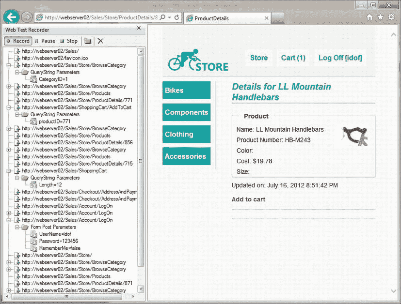
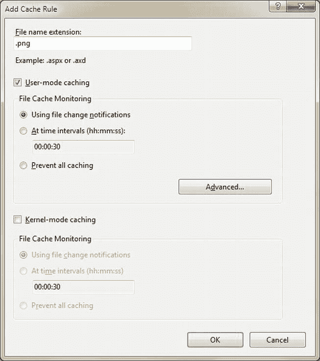
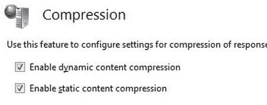

# 十一、Web 应用性能

Web 应用被设计为每秒处理数百甚至数千个请求。为了成功地构建这样的应用，识别潜在的性能瓶颈并尽一切努力防止其发生是非常重要的。但是处理和防止 ASP.NET 应用中的瓶颈不仅仅局限于您的代码。从一个 web 请求到达服务器 到到达你的应用代码，它通过一个 HTTP 管道，然后通过 IIS 管道，最后到达另一个管道，ASP。NET 的管道，只有这样它才能到达你的代码。当您处理完请求后，响应会沿着这些管道发送，直到最终被客户端的机器接收。这些管道中的每一个都是潜在的瓶颈，所以提高 ASP.NET 应用的性能实际上意味着提高你的代码和管道的性能。

当讨论如何提高 ASP.NET 应用 的性能时，人们必须看得更远，而不仅仅是应用本身，并检查构成 web 应用的各个部分如何影响其整体性能。web 应用的整体性能包括以下几个方面:

*   应用的代码
*   ASP.NET 环境
*   宿主环境(大多数情况下是 IIS)
*   网络
*   客户端(本书没有讨论)

在这一章中，我们将简要讨论 web 应用的性能测试工具，并从上述每个主题中探索各种方法，这些方法可以帮助我们提高 web 应用的整体性能。在本章的最后，我们将讨论扩展 web 应用的需要和含义，以及如何在扩展时避免已知的陷阱。

测试 Web 应用的性能

在开始对您的 web 应用进行更改之前，您需要知道您的应用是否运行良好——它是否满足 SLA(服务级别协议)中指定的要求？它在负载下的表现是否不同？有什么可以改进的一般性问题吗？为了了解所有这些以及更多，我们需要使用测试和监控工具来帮助我们识别 web 应用中的陷阱和瓶颈。

在第 2 章中，我们讨论了一些通用的分析工具来检测代码中的性能问题，例如 Visual Studio 和 ANTS profilers，但是还有其他工具可以帮助您测试、测量和调查应用的“web”部分。

这只是对 web 应用性能测试的一个简单介绍。关于如何计划、执行和分析 web 应用性能测试的更全面的描述和指导，你可以参考“Web 应用性能测试指南”MSDN 文章([http://msdn.microsoft.com/library/bb924375](http://msdn.microsoft.com/library/bb924375))。

Visual Studio Web 性能测试和负载测试

Visual Studio Ultimate 中可用的测试特性 之一是 web 性能测试，它使您能够评估 Web 应用的响应时间和吞吐量。通过 web 性能测试，可以记录浏览 Web 应用时产生的 HTTP 请求和响应，如图[图 11-1](#Fig00111) 所示。(这仅在 Internet Explorer 中直接支持。)



[图 11-1](#_Fig00111) 。使用 web 测试记录器记录 Web 应用

一旦进行了记录，您就可以使用该记录来测试 web 应用的性能，并通过将新的响应与先前记录的响应进行匹配来测试其正确性。

Web 性能测试允许您定制测试流程。您可以更改请求的顺序，添加您自己的新请求，在流程中插入循环和条件，更改请求的标题和内容，添加响应的验证规则，甚至通过将它转换为代码并编辑生成的代码来定制整个测试流程。

单独使用 web 性能测试有其好处，但是为了在压力下测试 Web 应用的性能，请将 Web 性能测试与 Visual Studio 的负载测试功能结合使用。Visual Studio 的这一功能使您能够模拟系统上的负载，其中多个用户同时调用它，对它执行不同的操作，并通过收集各种性能信息(如性能计数器和事件日志)来测试系统在此期间的行为。

 **警告**建议不要对公共网站进行负载测试，只对自己的网站和网络应用进行负载测试。对公共网站进行负载测试可能会被解释为拒绝服务(DOS) 攻击，导致您的机器甚至您的本地网络被禁止访问该网站。

结合负载测试和 web 性能测试的记录，我们可以模拟几十甚至几百个用户同时访问我们的 Web 应用，模拟在每个请求中使用不同的参数调用不同的页面。

为了正确地模拟数百个用户，建议您使用*测试代理*。测试代理是从控制器机器接收测试指令、执行所需测试并将结果发送回控制器的机器。测试代理的使用有助于减少测试机器(不是被测试的机器)上的压力，因为模拟数百个用户的单个机器可能遭受性能下降，导致测试产生错误的结果。

在负载测试期间，我们可以监控各种性能计数器，这些计数器可以指出我们的应用在压力下的行为，例如，通过检查请求是否在 ASP.NET 中排队，请求的持续时间是否随着时间的推移而增加，以及请求是否由于错误的配置而超时。

通过在各种场景下运行负载测试，例如不同数量的并发用户或不同类型的网络(慢速/快速)，我们可以了解很多关于我们的 web 应用如何在压力下工作的信息，并从记录的数据中得出关于我们可以改进其整体性能的方法的结论。

HTTP 监控工具

可以嗅探 HTTP 通信的网络监控工具，如 Wireshark、NetMon、HTTP Analyzer 和 Fiddler，可以帮助我们识别发送到 web 应用和从 web 应用接收的 HTTP 请求和响应的问题。在监控工具的帮助下，我们可以验证影响 web 应用性能的各种问题。例如:

*   **正确使用浏览器的缓存**。通过查看 HTTP 流量，我们可以确定哪些响应返回时没有缓存头，以及当请求的内容已经缓存时，请求是否使用正确的“匹配”头发送。
*   **消息的数量和大小**。监控工具显示每个请求和响应、接收每条消息所用的时间以及每条消息的大小，使您能够跟踪发送过于频繁的请求、大型请求和响应以及处理时间过长的请求。
*   **施加压力**。通过查看请求和响应，您可以验证请求是使用 *Accept-Encoding* 头发送的，以启用 GZip 压缩，并且您的 web 服务器相应地返回一个压缩的响应。
*   **同步通信**。一些 HTTP 监控工具可以显示请求的时间表，以及哪个进程生成了哪个请求，因此我们可以验证我们的客户端应用是否能够一次发送多个请求，或者由于缺少传出连接，请求是否被同步。例如，您可以使用此功能来检测浏览器可以向特定服务器打开多少个并发连接，或者检查您的。NET 客户端应用正在使用由 System.Net.ServicePointManager 强制实施的默认两个连接限制。

有些工具(如 Fiddler)还可以将记录的流量导出为 Visual Studio Web 性能测试，因此您可以使用 Web 测试和负载测试来测试从客户端应用和浏览器(而不是 Internet Explorer)调用的 Web 应用。例如，您可以从. NET 客户端应用监视基于 HTTP 的 WCF 调用，将它们导出为 Web 测试，并使用负载测试对您的 WCF 服务进行压力测试。

网络分析工具

另一组可用于识别 web 应用问题的工具是 web 分析工具，如 Yahoo！s YSlow 和谷歌的页面速度。Web 分析工具不仅仅分析流量本身，还会寻找丢失的缓存头和未压缩的响应。它们分析 HTML 页面本身，以检测可能影响加载和呈现页面的性能的问题，例如:

*   会影响渲染时间的大型 HTML 结构。
*   HTML、CSS 和 JavaScript 内容可以通过使用缩小技术缩小大小。
*   可以缩小尺寸以匹配 HTML 页面尺寸的大图像。
*   JavaScript 代码，可以在页面加载后执行，而不是在加载过程中执行，以加快页面加载速度。

提高服务器上的 Web 性能

有许多方法可以提高 ASP.NET 应用中代码的性能。可以使用对 ASP.NET 应用和桌面应用都有效的技术进行一些改进，例如使用线程或任务进行非依赖异步操作，但也有一些改进与您编写 ASP.NET 代码的方式有关，无论它是 WebForm 的代码隐藏，还是 ASP.NET MVC 控制器。这些变化，无论多小，都有助于更好地利用您的服务器，让应用运行得更快，并处理更多的并发请求。

缓存常用对象

在 web 应用中处理请求通常需要使用提取的数据，这些数据通常来自远程位置，如数据库或 web 服务。这些数据查找是昂贵的操作，通常会导致响应时间延迟。不需要为每个操作提取数据，数据可以被预先提取一次，并存储在内存中的某种缓存机制中。在获取数据后进入的新请求可以使用缓存的数据，而不是从其原始源再次获取数据。缓存范例通常被描述为:

1.  如果数据已经被缓存，就使用它。
2.  否则:

*   a.获取数据。
*   b.将其存储在缓存中。
*   c.用它。

 **注意**由于几个请求可以在任何给定的时间访问同一个缓存对象，导致同一个对象被多个线程引用，因此，无论是通过将缓存对象视为不可变的(对缓存对象的更改将需要克隆它，在新副本上进行更改，然后用克隆的对象更新缓存)，还是通过使用锁定机制来确保它不被其他线程更新，对缓存对象的更新都应该是负责任的。

很多开发者使用 ASP。NET 的应用状态集合作为一种缓存机制，因为它提供了内存中的缓存存储，所有用户和会话都可以访问。使用应用集合非常简单:

```cs
Application["listOfCountries"] = countries; // Store a value in the collection
countries = (IEnumerable < string>)Application["listOfCountries"]; // Get the value back
```

当使用应用集合时，存储在内存中并随着时间的推移而累积的资源最终会填满服务器内存，导致 ASP.NET 应用开始使用来自磁盘的分页内存，甚至由于内存不足而失败。因此，ASP.NET 提供了一种特殊的缓存机制，这种机制提供了对缓存项的某种管理，在内存不足时释放未使用的项。

可通过 Cache 类访问的 ASP.NET 缓存提供了广泛的缓存机制，除了存储资源之外，还允许您:

*   通过指定 TimeSpan 或固定日期时间来定义缓存对象的过期时间。一旦缓存对象的分配寿命到期，该对象将自动从缓存中移除。
*   定义缓存对象的优先级。当内存不足，需要释放对象时，优先级可以帮助缓存机制决定哪些对象不太“重要”
*   通过添加依赖项(如 SQL 依赖项)来定义缓存对象的有效性。例如，如果缓存的对象是 SQL 查询的结果，则可以设置 SQL 依赖项，因此数据库中影响从查询返回的结果的更改将使缓存的对象无效。
*   将回调附加到缓存的对象，这样当一个对象从缓存中移除时，回调就会被调用。当缓存中发生过期或失效时，使用回调可以帮助检索更新的资源信息。

将项目添加到缓存中就像将项目添加到字典中一样简单:

```cs
Cache["listOfCountries"] = listOfCountries;

```

当使用上面的代码将一个项添加到缓存中时，缓存的项将具有默认的 Normal 优先级，并且不使用任何过期或依赖检查。例如，要向缓存中添加一个具有可变过期时间的项，请使用 Insert 方法:

```cs
Cache.Insert("products", productsList,
  Cache.NoAbsoluteExpiration, TimeSpan.FromMinutes(60), dependencies: null);
```

 **注意**Cache 类也提供了 Add 方法。与 Insert 方法不同，如果缓存已经包含具有相同 key 参数的项，Add 方法将引发异常。

缓存访问范例，使用 ASP。NET 的缓存类通常实现如下:

```cs
object retrievedObject = null;

retrievedObject = Cache["theKey"];
if (retrievedObject == null) {
  //Lookup the data somewhere (database, web service, etc.)
  object originalData = null;
  . . .
  //Store the newly retrieved data in the cache
  Cache["theKey"] = originalData;
  retrievedObject = originalData;
}
//Use the retrieved object (either from the cache or the one that was just cached)
. . .
```

您会注意到第一行代码试图从缓存中检索对象，而没有首先检查它是否存在于缓存中。这是因为对象可以在任何时候被其他请求或缓存机制本身从缓存中移除，所以在检查和检索之间可以从缓存中移除一个项目。

使用异步页面、模块和控制器

当 IIS 将一个请求传递给 ASP.NET 时，该请求被排队到线程池中，并分配一个工作线程来处理该请求，无论它是对简单 HTTP 处理程序的请求，还是对 ASP.NET web form 应用中的页面或 ASP.NET MVC 应用中的控制器的请求。

由于线程池中工作线程的数量是有限的(由 web.config 中 process modelmaxWorkerThreads 部分的值集定义)，这意味着 ASP.NET 也受到它可以同时执行的线程或请求数量的限制。

线程限制通常很高，足以支持只需要处理几十个并发请求的中小型 web 应用。但是，如果您的 web 应用需要同时处理数百个请求，那么您应该继续阅读本节。

对并发执行请求数量的限制鼓励开发人员尝试最小化请求的执行时间，但是当一个请求的执行依赖于一些其他 I/O 操作时会发生什么呢，比如调用 web 服务，或者等待数据库操作完成？在这种情况下，请求的执行时间在很大程度上取决于从远程进程获取信息所需的时间，在此期间，附加到请求的工作线程被占用，无法为另一个请求释放。

最终，当当前执行的请求数量超过线程池的限制时，新的请求将被放置在一个特殊的等待队列中。当排队请求的数量超过队列的限制时，传入的请求将失败，返回 HTTP 503 响应(“服务不可用”)。

 **注意**线程池和请求队列的限制是在 web.config 文件的 processModel 部分为 ASP.NET 应用定义的，部分由 processModel  autoConfig 属性控制。

在现代 web 应用中，I/O 操作是我们系统设计中不可避免的一部分(调用 web 服务、查询数据库、从网络文件存储中读取数据等)。)，这种行为通常会导致许多正在运行的线程等待 I/O，而只有几个线程实际执行消耗 CPU 的任务。这通常会导致服务器 CPU 的利用率很低，其他请求无法使用 CPU，因为没有更多的空闲线程来处理传入的请求。

在 web 应用中，许多请求都是从 web 服务或数据库获取数据开始的，即使用户负载很高，CPU 利用率也很低，这是很常见的。您可以使用性能计数器来检查 web 应用的 CPU 利用率，方法是将处理器\% CPU 利用率计数器与 ASP.NET 应用\请求/秒和 ASP。NET\Requests 排队计数器。

如果您的一些请求正在执行冗长的 I/O 操作，那么就没有必要保持工作线程直到完成。使用 ASP.NET，您可以编写异步页面、控制器、处理程序和模块，这使您能够在代码等待 I/O 操作完成时将工作线程返回到线程池，并在完成后从线程池中抓取一个工作线程来完成请求的执行。从最终用户的角度来看，页面似乎仍然需要一些时间来加载，因为服务器会等待请求，直到处理完成，响应准备好发送回来。

通过将 I/O 绑定请求更改为使用异步处理而不是同步处理，您可以增加 CPU 密集型请求可用的工作线程数量，从而使您的服务器能够更好地利用其 CPU 并防止请求排队。

创建异步页面

如果您有一个 ASP.NET Web 窗体应用，并且希望创建一个异步页面，首先您需要将该页面标记为异步:

```cs
<%@ Page Async = "true" . . .

```

一旦标记为 async，就创建一个新的 PageAsyncTask 对象，并将 begin、end 和 timeout 方法的委托传递给它。创建 PageAsyncTask 对象后，调用页面。RegisterAsyncTask 方法来启动异步操作。

以下代码显示了如何使用 PageAsyncTask 启动一个冗长的 SQL 查询:

```cs
public partial class MyAsyncPage : System.Web.UI.Page {
  private SqlConnection _sqlConnection;
  private SqlCommand _sqlCommand;
  private SqlDataReader _sqlReader;

  IAsyncResult BeginAsyncOp(object sender, EventArgs e, AsyncCallback cb, object state) {
  //This part of the code will execute in the original worker thread,
  //so do not perform any lengthy operations in this method
  _sqlCommand = CreateSqlCommand(_sqlConnection);
  return _sqlCommand.BeginExecuteReader(cb, state);
  }
  void EndAsyncOp(IAsyncResult asyncResult) {
  _sqlReader = _sqlCommand.EndExecuteReader(asyncResult);
  //Read the data and build the page’s content
  . . .
  }
 void TimeoutAsyncOp(IAsyncResult asyncResult) {
  _sqlReader = _sqlCommand.EndExecuteReader(asyncResult);
  //Read the data and build the page’s content
  . . .
  }

  public override void Dispose() {
  if (_sqlConnection ! = null) {
  _sqlConnection.Close();
  }
  base.Dispose();
  }
  protected void btnClick_Click(object sender, EventArgs e) {
  PageAsyncTask task = new PageAsyncTask(
  new BeginEventHandler(BeginAsyncOp),
  new EndEventHandler(EndAsyncOp),
  new EndEventHandler(TimeoutAsyncOp),
  state:null);
  RegisterAsyncTask(task);
  }
}

```

创建异步页面的另一种方法是使用完成事件，例如使用 web 服务或 WCF 服务生成的代理时创建的事件:

```cs
public partial class MyAsyncPage2 : System.Web.UI.Page {
  protected void btnGetData_Click(object sender, EventArgs e) {
  Services.MyService serviceProxy = new Services.MyService();
  //Attach to the service’s xxCompleted event
  serviceProxy.GetDataCompleted + = new
  Services.GetDataCompletedEventHandler(GetData_Completed);
  //Use the Async service call which executes on an I/O thread
  serviceProxy.GetDataAsync();
  }
  void GetData_Completed (object sender, Services. GetDataCompletedEventArgs e) {
  //Extract the result from the event args and build the page’s content
  }
}

```

在上面的示例中，与第一个示例一样，页面也被标记为 Async，但是不需要创建 PageAsyncTask 对象，因为页面会在调用 xxAsync 方法时以及激发 xxCompleted 事件后自动接收通知。

 **注意**当页面设置为异步时，async 改变页面实现 IHttpAsyncHandler，而不是同步 IHttpHandler。如果您希望创建自己的异步通用 HTTP 处理程序，请创建一个实现 IHttpAsyncHandler 接口的通用 HTTP 处理程序类。

创建异步控制器

ASP.NET MVC 中的控制器类也可以被创建为异步控制器，如果它们执行冗长的 I/O 操作的话。要创建异步控制器，您需要执行以下步骤:

1.  创建一个从 AsyncController 类型继承的控制器类。
2.  根据以下约定为每个异步操作实现一组动作方法，其中 *xx* 是动作的名称:xxAsync 和 xxCompleted。
3.  在 xxAsync 方法中，调用 AsyncManager。用将要执行的异步操作的数量来递增方法。
4.  在异步操作返回期间执行的代码中，调用 AsyncManager。outstanding operations . Decrement 方法通知操作已完成。

例如，下面的代码显示了一个名为 *Index* 的控制器，它调用一个为视图返回数据的服务:

```cs
public class MyController : AsyncController {
  public void IndexAsync() {
  //Notify the AsyncManager there is going to be only one Async operation
  AsyncManager.OutstandingOperations.Increment();
  MyService serviceProxy = new MyService();
  //Register to the completed event
  serviceProxy.GetDataCompleted + = (sender, e) = > {
  AsyncManager.Parameters["result"] = e.Value;
  AsyncManager.OutstandingOperations.Decrement();
  };
  serviceProxy.GetHeadlinesAsync();
  }
  public ActionResult IndexCompleted(MyData result) {
  return View("Index", new MyViewModel { TheData = result });
  }
}

```

调整 ASP.NET 的环境

除了我们的代码，每个传入的请求和传出的响应都必须通过 ASP。NET 的组件。一些 ASP。NET 的机制是为了满足开发人员的需求而创建的，比如 ViewState 机制，但是它会影响应用的整体性能。当微调 ASP.NET 应用的性能时，建议更改其中一些机制的默认行为，尽管更改它们有时可能需要更改应用代码的构造方式。

关闭 ASP.NET 跟踪调试

ASP.NET 跟踪使开发人员能够查看所请求页面的诊断信息，如执行时间和路径、会话状态和 HTTP 头列表。

虽然跟踪是一个很好的特性，并在开发和调试 ASP.NET 应用时提供了附加值，但由于跟踪机制和对每个请求执行的数据收集，它对应用的整体性能有一些影响。因此，如果在开发过程中启用了跟踪，请在将 web 应用部署到生产环境之前，通过更改 web.config:

```cs
<configuration>
  <system.web>
  <trace enabled = "false"/>
  </system.web>
</configuration>

```

 **注意**如果在 web.config 中没有另外指定，trace 的默认值是禁用的(enabled = "false ")，因此从 web.config 文件中移除跟踪设置也会禁用它。

创建新的 ASP.NET web 应用时，自动添加到应用的 web.config 文件中的内容之一是 system.web 编译配置节，其 debug 属性设置为 true:

```cs
<configuration>
  <system.web>
  <compilation debug = "true" targetFramework = "4.5" />
  </system.web>
</configuration>

```

 **注意**这是在 Visual Studio 2012 或 2010 中创建 ASP.NET web 应用时的默认行为。在 Visual Studio 的早期版本中，默认行为是将调试设置设置为 false，当开发人员第一次尝试调试应用时，会出现一个对话框，询问是否允许将设置更改为 true。

这种设置的问题是，开发人员在将应用部署到生产环境中时，经常忽略将设置从 true 更改为 false，甚至故意这样做以获得更详细的异常信息。事实上，保持这种设置会导致几个性能问题:

*   浏览器不会缓存使用 WebResources.axd 处理程序下载的脚本，例如在页面中使用验证控件时。当将 debug 标志设置为 false 时，来自该处理程序的响应将返回缓存头，允许浏览器缓存响应以供将来访问。
*   当 debug 设置为 true 时，请求不会超时。虽然这在调试代码时非常方便，但在生产环境中不太需要这种行为，因为这种请求会导致服务器无法处理其他传入的请求，甚至会导致大量 CPU 使用、内存消耗增加和其他资源分配问题。
*   将调试标志设置为 false 将使 ASP.NET 能够根据 httpRuntimeexecution time out 配置设置(默认值为 110 秒)为请求定义超时。
*   当使用 debug = true 运行时，JIT 优化将不会应用于代码。JIT 优化是最重要的优势之一。NET，可以有效地提高您的 ASP.NET 应用的性能，而不需要您更改代码。将 debug 设置为 false 将允许 JIT 编译器执行它的行为，使您的应用执行得更快更有效。
*   当使用 debug = true 时，编译过程不使用批处理编译。如果没有批处理编译，将为每个页面和用户控件创建一个程序集，导致 web 应用在运行时加载几十个甚至几百个程序集；由于地址空间碎片化，加载这么多程序集可能会导致将来出现内存异常。当 debug 模式设置为 false 时，将使用批处理编译，为用户控件生成一个程序集，并为页面生成几个程序集(根据页面对用户控件的使用将页面分组为程序集)。

更改此设置非常简单:要么从配置中完全删除 debug 属性，要么将其设置为 false:

```cs
<configuration>
  <system.web>
  <compilation debug = "false" targetFramework = "4.5" />
  </system.web>
</configuration>

```

如果您担心在将应用部署到生产服务器时忘记更改此设置，您可以通过在服务器的 machine.config 文件中添加以下配置来强制服务器中的所有 ASP.NET 应用忽略调试设置:

```cs
<configuration>
  <system.web>
  <deployment retail = "true"/>
  </system.web>
</configuration>

```

禁用视图状态

视图状态 是 ASP.NET Web 窗体应用中使用的技术，用于将页面状态持久化到呈现的 HTML 输出中(ASP.NET MVC 应用不使用这种机制)。视图状态用于允许 ASP.NET 在用户执行回发之间保持页面的状态。视图状态数据通过以下方式存储在 HTML 输出中:对状态进行序列化、加密(默认情况下不设置)、编码为 Base64 字符串并存储在隐藏字段中。当用户回发页面时，内容被解码，然后反序列化回视图状态字典。许多服务器控件使用视图状态来保持它们自己的状态，例如将它们的属性值存储在视图状态中。

尽管这种机制非常有用和强大，但它会生成一个有效负载，当这个有效负载作为 Base64 字符串放在页面中时，会使响应的大小增加一个数量级。例如，包含带有分页的单个 GridView 的页面，绑定到 800 个客户的列表，将生成大小为 17 KB 的输出 HTML，其中 6 KB 是视图状态字段，这是因为 GridView 控件将它们的数据源存储在视图状态中。此外，使用视图状态需要对每个请求的视图状态进行序列化和反序列化，这增加了页面处理的额外开销。

 **提示**使用视图状态创建的有效负载通常不会被访问自己局域网中的 web 服务器的客户端注意到。这是因为局域网通常非常快，能够在几毫秒内传输非常大的页面(最佳 1Gb 局域网的吞吐量可以达到 40–100 MB/s，具体取决于硬件)。但是，当使用慢速广域网(如 Internet)时，视图状态的负载最为显著。

如果不需要使用视图状态，建议禁用它。通过在 web.config 文件中禁用视图状态，可以禁用整个应用的视图状态:

```cs
<system.web>
  <pages enableViewState = "false"/>
</system.web>

```

如果您不想禁用整个应用的视图状态，也可以禁用单个页面及其所有控件的视图状态:

```cs
<%@ PageEnableViewState = "false". . . %>

```

您还可以禁用每个控件的视图状态:

```cs
<asp:GridView ID = "gdvCustomers" runat = "server" DataSourceID = "mySqlDataSource"
  AllowPaging = "True"EnableViewState = "false"/>

```

在 ASP.NET 4 之前，禁用页面中的视图状态使得无法为页面中的特定控件重新启用视图状态。从 ASP.NET 4 开始，增加了一种新的方法，允许在页面上禁用视图状态，但对特定的控件重新启用它。这在 ASP.NET 4 中是通过使用 ViewStateMode 属性来实现的。例如，下面的代码禁用整个页面的视图状态，GridView 控件除外:

```cs
<%@ Page EnableViewState = "true"ViewStateMode = "Disabled". . . %>

<asp:GridView ID = "gdvCustomers" runat = "server" DataSourceID = "mySqlDataSource"
  AllowPaging = "True"ViewStateMode = "Enabled"/>

```

 **注意**通过将 EnableViewState 设置为 false 来禁用视图状态将覆盖对 ViewStateMode 所做的任何设置。因此，如果希望使用 ViewStateMode，请确保 EnableViewState 设置为 true 或省略(默认值为 true)。

服务器端输出缓存

尽管 ASP.NET 页面的内容被认为是动态的，但是您经常会遇到页面的动态内容不一定会随着时间的推移而改变的情况。例如，页面可以接收产品的 ID，并返回描述该产品的 HTML 内容。页面本身是动态的，因为它可以为不同的产品返回不同的 HTML 内容，但是特定产品的产品页面不会经常改变，至少在产品细节本身在数据库中改变之前不会。

继续我们的产品示例，为了防止我们的页面在每次请求产品时重新查询数据库，我们可能希望在本地缓存中缓存该产品信息，以便我们可以更快地访问它，但是我们仍然需要每次都呈现 HTML 页面。ASP.NET 没有缓存我们需要的数据，而是提供了一种不同的缓存机制——ASP.NET 输出缓存，它自己缓存输出的 HTML。

通过使用输出缓存，ASP.NET 可以缓存呈现的 HTML，因此后续请求将自动接收呈现的 HTML，而无需执行我们的页面代码。输出缓存在 ASP.NET Web 窗体中支持缓存页面，在 ASP.NET MVC 中支持缓存控制器动作。

例如，以下代码使用输出缓存将 ASP.NET MVC 控制器的操作返回的视图缓存 30 秒:

```cs
public class ProductController : Controller {
  [OutputCache(Duration = 30)]
  public ActionResult Index() {
  return View();
  }
}

```

如果上面示例中的 index 操作接收到一个 ID 参数，并返回一个显示特定产品信息的视图，我们将需要根据该操作接收到的不同 ID 缓存输出的几个版本。因此，输出缓存不仅支持输出的单个缓存，还支持根据传递给该动作的参数缓存同一动作的不同输出。下面的代码演示如何根据传递给方法的 ID 参数更改缓存输出的操作:

```cs
public class ProductController : Controller {
  [OutputCache(Duration = 30, VaryByParam = "id")]
  public ActionResult Index(int id) {
  //Retrieve the matching product and set the model accordingly . . .
  return View();
  }
}

```

 **注意**除了根据查询字符串参数改变之外，输出缓存还可以根据请求的 HTTP 头改变缓存的输出，例如 Accept-Encoding 和 Accept-Language 头。例如，如果您的操作根据 Accept-Language HTTP 头返回不同语言的内容，您可以将输出缓存设置为随该头而变化，为每种请求的语言创建不同的输出缓存版本。

如果不同的页面或操作具有相同的缓存设置，可以创建一个缓存配置文件，并使用该配置文件，而不是一遍又一遍地重复缓存设置。缓存配置文件是在 web.config 的 system.web 缓存部分下创建的。例如，以下配置声明了一个我们希望在几个页面中使用的缓存配置文件:

```cs
<system.web>
  <caching>
    <outputCacheSettings>
      <outputCacheProfiles>
         <add name = "CacheFor30Seconds" duration = "30" varyByParam = "id"/>
      </outputCacheProfiles>
    </outputCacheSettings>
  </caching>
</system.web>

```

现在，该配置文件可以用于我们的索引操作，而不是重复持续时间和参数:

```cs
public class ProductController : Controller {
  [OutputCache(CacheProfile = "CacheFor30Seconds")]
  public ActionResult Index(int id) {
  //Retrieve the matching product and set the model
  . . .
  return View();
  }
}

```

通过使用 OutputCache 指令，我们还可以在 ASP.NET web 表单中使用相同的缓存配置文件:

```cs
<%@ OutputCache CacheProfile = "CacheEntityFor30Seconds" %>

```

 **注意**默认情况下，ASP.NET 输出缓存机制将缓存的内容保存在服务器的内存中。从 ASP.NET 4 开始，您可以创建自己的输出缓存提供程序来代替默认的输出缓存提供程序。例如，您可以编写自己的自定义提供程序，将输出缓存存储到磁盘。

预编译 ASP.NET 应用

当编译一个 ASP.NET Web 应用项目时，会创建一个单独的程序集来保存所有应用的代码。但是，网页(。aspx)和用户控件(。ascx)不进行编译，并按原样部署到服务器。web 应用第一次启动时(在第一次请求时)，ASP.NET 动态编译网页和用户控件，并将编译后的文件放在 ASP.NET 临时文件夹中。这种动态编译增加了首次请求的响应时间，使用户体验到网站加载缓慢。

要解决这个问题，可以使用 Aspnet 编译工具(Aspnet_compiler.exe)预编译 web 应用，包括所有代码、页面和用户控件。在生产服务器上运行 ASP.NET 编译工具可以减少用户第一次请求时的延迟。要运行该工具，请按照下列步骤操作:

1.  在生产服务器中打开命令提示符。
2.  导航到% *windir%\Microsoft。NET* 文件夹
3.  根据 web 应用的应用池是否配置为支持 32 位应用，导航到*框架*或*框架 64* 文件夹(对于 32 位操作系统，*框架*文件夹是唯一选项)。
4.  根据定位到框架版本的文件夹。应用池使用的. NET framework 版本( *v2.0.50727* 或 *v4.0.30319* )。
5.  输入以下命令开始编译(用应用的虚拟路径替换 *WebApplicationName* ):
6.  aspnet _ compiler . exe-v/web application name

微调 ASP.NET 过程模型

当调用 ASP.NET 应用时，ASP.NET 使用一个工作线程来处理请求。有时，我们的应用中的代码可以自己创建一个新的线程，例如当调用一个服务时，这样就减少了线程池中自由线程的数量。

为了防止线程池耗尽，ASP.NET 会自动对线程池进行一些调整，并对在任何给定时间可以执行的请求数量进行一些限制。这些设置由三个主要配置部分控制——system . webprocess model 部分、system.web  httpRuntime 部分和 system.netconnection management 部分。

 **注意**httpRuntime 和 connectionManagement 部分可以在应用的 web.config 文件中设置。然而，processModel 部分只能在 *machine.config* 文件中更改。

processModel 部分控制线程池限制，例如最小和最大工作线程数，而 httpRuntime 部分定义与可用线程相关的限制，例如为了继续处理传入的请求而必须存在的最小可用线程数。connectionManagement 部分控制每个地址的最大传出 HTTP 连接数。

所有的设置都有默认值，但是，由于其中一些值设置得有点低，ASP.NET 包括另一个设置，自动配置设置，它调整一些设置以实现最佳性能。此设置是 processModel 配置部分的一部分，从 ASP.NET 2.0 开始就存在，并自动设置为 true。

自动配置设置控制以下设置(下面的默认值来自 http://support.microsoft.com/?id=821268 的微软知识库文章 KB821268):

*   process modelmaxWorkerThreads。将线程池中工作线程的最大数量从核心数的 20 倍更改为核心数的 100 倍。
*   最大线程数。将线程池中 I/O 线程的最大数量从核心数的 20 倍更改为核心数的 100 倍。
*   httpRuntime  minFreeThreads。将允许执行新请求所需的最小可用线程数从内核数的 8 倍更改为 88 倍。
*   httpRuntimeminLocalFreeThreads。将允许执行新的本地请求(来自本地主机)所需的最小可用线程数从内核数的 4 倍更改为 76 倍。
*   连接管理 maxConnections。将最大并发连接数从核心数的 10 倍更改为 12 倍。

尽管设置上述缺省值是为了获得优化的性能，但是在某些情况下，为了获得更好的性能，您可能需要更改这些缺省值，这取决于您在 web 应用中遇到的场景。例如，如果您的应用调用服务，您可能需要增加最大并发连接数，以允许更多的请求同时连接到后端服务。以下配置显示了如何增加最大连接数:

```cs
<configuration>
  <system.net>
  <connectionManagement>
  <add address = "*" maxconnection = "200" />
  </connectionManagement>
  </system.net>
</configuration>

```

在其他情况下，例如，当 web 应用在启动时往往会收到许多请求，或者有突然爆发的请求时，您可能需要更改线程池中的最小工作线程数(您指定的值在运行时乘以计算机上的核心数)。若要执行此更改，请在 machine.config 文件中应用以下配置:

```cs
<configuration>
  <system.web>
  <processModel autoConfig = "true" minWorkerThreads = "10"/>
  </system.web>
</configuration>

```

在您急于增加最小和最大线程的大小之前，请考虑这种变化可能对您的应用产生的副作用:如果您允许太多的请求并发运行，这可能会导致 CPU 的过度使用和高内存消耗，最终会使您的 web 应用崩溃。因此，在更改这些设置后，您必须执行负载测试，以验证计算机可以承受这么多请求。

配置 IIS

作为我们的 web 应用的托管环境，IIS 对它的整体性能有一些影响，例如，IIS 管道越小，每个请求上执行的代码就越少。IIS 中有一些机制可以用来提高我们的应用在延迟和吞吐量方面的性能，还有一些机制，如果调整得当，可以提高我们的应用的整体性能。

输出缓存

我们已经看到 ASP.NET 提供了自己的输出缓存机制，那么为什么 IIS 还需要另一种输出缓存机制呢？答案很简单:我们还想缓存其他类型的内容，不仅仅是 ASP.NET 页面。例如，我们可能希望缓存一组经常被请求的静态图像文件，或者自定义 HTTP 处理程序的输出。为此，我们可以使用 IIS 提供的输出缓存。

IIS 有两种输出缓存机制 :用户态缓存和内核态缓存。

用户模式缓存

就像 ASP.NET 一样，IIS 能够在内存中缓存响应，因此后续请求会自动从内存中得到响应，而无需从磁盘访问静态文件或调用服务器端代码。

要为您的 web 应用配置输出缓存，请打开 IIS 管理器应用，选择您的 web 应用，打开*输出缓存*功能。一旦打开，点击*添加。。。*从*动作*窗格链接添加一个新的缓存规则，或者选择一个现有的规则进行编辑。

要创建一个新的用户态缓存规则，添加一个新规则，输入你想要缓存的文件扩展名，在*添加缓存规则*对话框中勾选*用户态缓存*复选框，如图[图 11-2](#Fig00112) 所示。



[图 11-2](#_Fig00112) 。“添加缓存规则”对话框

选中该复选框后，您可以选择何时从内存中移除缓存的项目，例如在文件更新后或在内容首次缓存后经过一段时间后。文件更改更适合静态文件，而时间间隔更适合动态内容。通过按下*高级*按钮，您还可以控制缓存将如何存储不同版本的输出(选项根据查询字符串或 HTTP 头)。

添加缓存规则后，其配置将存储在应用的 web.config 文件中，位于 system.webServer 缓存部分下。例如，将规则设置为缓存。aspx 页，使它们在 30 分钟后过期，并通过接受语言 HTTP 头改变输出，将生成以下配置:

```cs
<system.webServer>
  <caching>
  <profiles>
  <add extension = ".aspx" policy = "CacheForTimePeriod" kernelCachePolicy = "DontCache"
  duration = "00:00:30" varyByHeaders = "Accept-Language" />
  </profiles>
  </caching>
</system.webServer>

```

内核模式缓存

与将缓存内容存储在 IIS 工作进程内存中的用户模式缓存不同，内核模式缓存将缓存内容存储在 HTTP.sys 内核模式驱动程序中。使用内核模式缓存可以提供更快的响应时间，但是并不总是受支持。例如，当请求包含查询字符串或者请求不是匿名请求时，不能使用内核模式缓存。

为内核模式设置缓存规则的方式与用户模式缓存类似。在规则对话框中，选中*内核模式缓存*复选框，然后选择您希望使用的缓存监控设置。

您可以在同一个规则中同时使用内核模式和用户模式缓存。当两种模式都使用时，首先尝试内核模式缓存。如果不成功，例如，当请求包含查询字符串时，将应用用户模式缓存。

 **提示**当使用内核模式和用户模式设置的时间间隔进行监控时，请确保这两种设置中的时间间隔相同，否则内核模式的时间间隔将用于这两种设置。

应用池配置

应用池控制 IIS 如何创建和维护最终承载我们代码的工作进程。当您安装 IIS 和 ASP.NET 时，根据。NET framework 版本，当您在服务器上安装更多 web 应用时，可以向其中添加新池。创建应用池时，它有一些控制其行为的默认设置。例如，每个应用池在创建时都有一个默认的空闲超时设置，在该设置之后，应用池将关闭。

理解其中一些设置的含义可以帮助您配置应用池的工作方式，这样它将更精确地满足您的应用的需求。

回收利用

通过更改回收设置，您可以控制应用池何时重启工作进程。例如，您可以设置工作进程每隔几个小时回收一次，或者当它超过一定的内存量时回收。如果您的 web 应用随着时间的推移消耗了大量内存(例如由于存储的对象)，那么增加回收的次数有助于保持其整体性能。另一方面，如果您的 web 应用运行正常，减少回收次数将防止状态信息的丢失。

 **提示**你可以使用 ASP。NET\Worker Process 重新启动性能计数器，以检查应用池自身回收的次数和回收频率。如果您看到许多没有明显原因的回收，请尝试将结果与应用的内存消耗和 CPU 使用相关联，以验证它没有超过应用池配置中定义的任何阈值。

空闲超时

应用池的默认设置是在 20 分钟不活动后关闭该池。如果您预计会有这样的空闲时间，例如当所有用户都出去吃午饭时，您可能希望增加超时时间，甚至取消它。

处理器关联

默认情况下，应用池配置为使用服务器中所有可用的核心。如果您有任何特殊的后台进程在服务器上运行，需要尽可能多的 CPU 时间，您可以调整池的关联性，只使用特定的核心，为后台进程释放其他核心。当然，这也需要您设置后台进程的亲缘关系，这样它就不会在相同的内核上与工作进程竞争。

网络花园

应用池的默认行为是启动一个工作进程来处理应用的所有请求。如果您的工作进程同时处理几个请求，并且这些请求通过锁定资源来竞争同一资源，您可能会以争用结束，从而导致返回响应的延迟。例如，如果您的应用使用专有的缓存机制，该机制具有防止并发请求将项目插入缓存的锁，则请求将开始一个接一个地同步，从而导致难以检测和修复的延迟。尽管我们有时可以修改代码以减少锁定，但这并不总是可行的。解决这种争用问题的另一种方法是启动多个工作进程，所有工作进程都运行同一个应用，每个工作进程都处理自己的一组请求，从而降低应用中的争用率。

运行同一个 web 应用的多个进程很有用的另一种情况是，当您有一个 64 位 IIS 服务器运行一个 32 位 web 应用时。64 位服务器通常拥有大量内存，但是 32 位应用最多只能使用 2 GB 内存，这通常会导致频繁的 GC 循环，并且可能会导致频繁的应用池回收。通过为一个 32 位 web 应用运行两个或三个工作进程，应用可以更好地利用服务器的可用内存，并减少它所需的 GC 周期和应用池回收的数量。

在 IIS 应用池配置中，您可以设置允许为请求提供服务的工作进程的最大数量。将该值增加到大于 1(这是默认值)将随着请求的到来旋转更多的工作进程，直到达到定义的最大值。拥有多个工作进程的应用池被称为“网络花园”每次从客户端建立连接时，它都被分配给一个工作进程，从现在开始该工作进程为来自该客户端的请求提供服务，从而允许来自多个用户的请求在进程之间得到平衡，有望降低争用率。

请注意，使用网络花园有其缺点。多个工作进程会占用更多内存，它们会阻止使用默认的进程内会话状态，并且当多个工作进程在同一台计算机上运行时，您可能会发现自己要处理本地资源争用问题，例如，如果两个工作进程都试图使用同一个日志文件。

优化网络

即使您编写的代码运行速度很快，并且您有一个高吞吐量的托管环境，web 应用的一个更成问题的瓶颈仍然是客户端的带宽以及客户端通过网络传递的数据量和请求数。有几种技术可以帮助减少请求的数量和响应的大小，其中一些很容易配置 IIS，而另一些则需要在应用代码中多加注意。

应用 HTTP 缓存头

节省带宽的方法之一是确保在一段时间内不会改变的所有内容都缓存在浏览器中。静态内容(如图像、脚本和 CSS 文件)是浏览器缓存的理想选择，动态内容(如。aspx 和。如果内容不经常更新，ashx 文件通常可以被缓存。

为静态内容设置缓存头

静态文件通常用两个缓存头发送回客户端:

*   **ETag** 。IIS 将此 HTTP 头设置为包含根据所请求内容的上次修改日期计算的哈希。对于静态内容，如图像文件和 CSS 文件，IIS 根据文件的最后修改日期设置 ETag。当使用以前缓存的 ETag 值发送后续请求时，IIS 会为请求的文件计算 ETag，如果它与客户端的 ETag 不匹配，则请求的文件会被发回。如果 ETags 匹配，则发送回 HTTP 304(未修改)响应。对于后续请求，缓存的 *ETag* 的值放在 *If-None-Match* HTTP 头中。
*   **最后修改时间**。IIS 将此 HTTP 头设置为所请求文件的最后修改日期。这是一个额外的缓存头，在 IIS 的 ETag 支持被禁用的情况下提供备份。当包含上次修改日期的后续请求被发送到服务器时，IIS 将验证文件的上次修改时间，并决定是否用文件的内容(如果修改时间已更改)或 HTTP 304 响应进行响应。对于后续请求，缓存的 *Last-Modified* 的值放在 *If-Modified-Since* HTTP 头中。

如果客户端已经有了最新的版本，这些缓存头将确保内容不会被发送回客户端，但是仍然需要从客户端向服务器发送一个请求，以验证内容没有发生更改。如果您的应用中有静态文件，并且您知道这些文件在接下来的几周甚至几个月内可能不会更改，例如您公司的徽标或脚本文件，这些文件在应用的下一个版本发布之前不会更改，那么您可能希望设置缓存头，以允许客户端缓存该内容并重用它，而无需在每次请求该内容时向服务器验证该内容是否已更改。这种行为可以通过使用带有 max-age 的 Cache-Control HTTP 头或 Expires HTTP 头来实现。max-age 和 Expires 之间的区别在于，max-age 设置一个滑动的过期值，而 Expires 允许您设置内容将过期的固定时间点(日期+时间)。例如，将 max-age 设置为 3600 将允许浏览器自动使用缓存内容一小时(3600 秒= 60 分钟= 1 小时)，而无需向服务器发送验证请求。一旦内容到期，无论是由于滑动窗口到期还是由于固定到期时间的到来，它都会被标记为陈旧。当对陈旧的内容提出新的请求时，浏览器将向服务器发送请求，要求更新的内容。

 **提示**您可以通过使用 HTTP 监控工具(如 Fiddler)并检查哪些请求被发送到服务器，来验证没有请求被发送到缓存内容。如果您注意到发送了一个请求，尽管它应该被缓存，请检查该请求的响应，以验证 max-age / Expires 头是否存在。

将 max-age / Expires 与 ETag / Last-Modified 一起使用，可以确保在内容过期后发送的请求可以返回 HTTP 304 响应，如果服务器上的内容实际上没有更改的话。在这种情况下，响应将包含一个新的 max-age / Expires HTTP 头。

在大多数浏览器中，单击刷新按钮(或按 F5)将通过忽略 max-age / Expires 头来强制浏览器刷新缓存，并发送对缓存内容的请求，即使内容尚未过期。如果适用的话，请求仍然具有 If-Modified-Since/If-None-Match 头，这样，如果内容仍然是最新的，服务器就可以返回 304 响应。

若要设置 max-age，请将以下配置添加到 web.config 文件中:

```cs
<system.webServer>
  <staticContent>
  <clientCache cacheControlMode = "UseMaxAge" cacheControlMaxAge = "0:10:00" />
  </staticContent>
</system.webServer>

```

上述配置将导致为静态内容发送的所有响应的 Cache-Control HTTP 头的 max-age 属性设置为 600 秒。

若要使用 Expires 标头，请更改 clientCache 元素配置，如下例所示:

```cs
<system.webServer>
  <staticContent>
    <clientCache cacheControlMode = "UseExpires" httpExpires = "Wed, 11 Jul 2013 6:00:00 GMT"/>
  </staticContent>
</system.webServer>
```

上述配置将使所有静态内容在 2013 年 7 月 11 日早上 6 点过期。

如果您希望为不同的内容设置不同的最大期限或到期时间，例如为 JavaScript 文件设置固定的到期时间，为图像设置 100 天的滑动窗口，您可以使用位置部分将不同的配置应用于应用的不同部分，如以下示例所示:

```cs
<location path = "Scripts">
  <system.webServer>
   <staticContent>
    <clientCache cacheControlMode = "UseExpires" httpExpires = "Wed, 11 Jul 2013 6:00:00 GMT" />
```

```cs
  </staticContent>
  </system.webServer>
</location>
    <location path = "Images">  <system.webServer>
  <staticContent>
<clientCache cacheControlMode = "UseMaxAge" cacheControlMaxAge = "100.0:00:0" />
  </staticContent>
  </system.webServer>
</location>
```

 **注意**您必须使用完全格式化的日期和时间来设置 Expires 标头。此外，根据 HTTP 规范，Expires 头的日期不能超过当前日期的一年。

为动态内容设置缓存头

静态文件有修改日期，可以用来验证缓存的内容是否已经更改。但是，动态内容没有修改日期，因为每次请求动态内容时，都会重新创建它，并且它的修改日期实际上是当前日期，因此 ETag 和 Last-Modified 之类的头与处理动态内容无关。

话虽如此，如果您查看一个动态页面的内容，您可能会找到一种方法来表示该内容的修改日期，或者可能会为它计算一个 ETag。例如，如果发送一个从数据库中检索产品信息的请求，product 表可能会包含一个可用于设置 Last-Modified 标题的 last update date 列。如果数据库表没有 last update 列，您可以尝试从实体的字段中计算 MD5 散列，并将 ETag 设置为结果。当随后的请求被发送到服务器时，服务器可以重新计算实体的 MD5 散列，并且如果没有字段被改变，则 ETags 将是相同的，并且服务器可以返回 HTTP 304 响应。

例如，以下代码将动态页中的上次修改的缓存头设置为产品的上次更新日期:

```cs
Response.Cache.SetLastModified(product.LastUpdateDate);

```

如果没有最后更新日期，可以将 ETag 设置为由实体属性计算的 MD5 哈希，如以下代码所示:

```cs
Response.Cache.SetCacheability(HttpCacheability.ServerAndPrivate);
//Calculate MD5 hash
System.Security.Cryptography.MD5 md5 = System.Security.Cryptography.MD5.Create();
string contentForEtag = entity.PropertyA + entity.NumericProperty.ToString();
byte[] checksum = md5.ComputeHash(System.Text.Encoding.UTF8.GetBytes(contentForEtag));

//Create an ETag string from the hash.
//ETag strings must be surrounded with double quotes, according to the standard
string etag = "\"" + Convert.ToBase64String(checksum, 0, checksum.Length) + "\"";
Response.Cache.SetETag(etag);
```

 **注意**在 ASP.NET，请求的默认可缓存模式阻止使用 ETags。为了支持 ETags，我们需要将 cacheability 模式更改为 ServerAndPrivate，允许在服务器端和客户端缓存内容，但不能在共享机器(如代理)上缓存。

当接收到包含 ETag 的请求时，您可以将计算出的 ETag 与浏览器提供的 ETag 进行比较，如果它们匹配，则使用 304 响应进行响应，如以下代码所示:

```cs
if (Request.Headers["If-None-Match"] == calculatedETag) {
  Response.Clear();
  Response.StatusCode = (int)System.Net.HttpStatusCode.NotModified; Response.End();
}

```

如果您对动态内容的生命周期有任何假设，也可以将值应用到 max-age 或 Expires 头。例如，如果您假设不再生产的产品将不会被更改，您可以将为该产品返回的页面设置为一年后过期，如下所示:

```cs
if (productIsDiscontinued)
  Response.Cache.SetExpires(DateTime.Now.AddYears(1));

```

您也可以使用 Cache-Control max-age 头进行同样的操作:

```cs
if (productIsDiscontinued)
  Response.Cache.SetMaxAge(TimeSpan.FromDays(365));

```

您可以在。aspx 文件作为输出缓存指令。例如，如果产品页面中显示的产品信息可以在客户端缓存 10 分钟(600 秒)，则可以将产品页面的输出缓存指令设置为:

```cs
<%@ Page . . . %>
<%@ OutputCache Duration = "600" Location = "Client"%>

```

使用 OutputCache 指令时，指定的持续时间以 max-age 和 expires 的形式输出到响应的 HTTP 头中(expires 从当前日期开始计算)。

打开 IIS 压缩

除了多媒体文件(声音、图像和视频)和二进制文件，如 Silverlight 和 Flash 组件，从我们的 web 服务器返回的大多数内容都是基于文本的，如 HTML、CSS、JavaScript、XML 和 JSON。通过使用 IIS 压缩，这些文本响应的大小可以缩小，从而允许使用较小的有效负载进行更快的响应。使用 IIS 压缩，响应的大小可以减少到原始大小的 50–60 %,有时甚至更多。IIS 支持两种类型的压缩，静态和动态。要使用 IIS 压缩，确保首先安装静态和动态压缩 IIS 组件 。

静态压缩

在 IIS 中使用静态压缩时，压缩的内容存储在磁盘上，因此对于后续的资源请求，将返回已经压缩的内容，而无需再次执行压缩。通过只压缩一次内容，您付出了磁盘空间的代价，但减少了 CPU 的使用和延迟，这通常是使用压缩的结果。

静态压缩对于通常不改变(因此是“静态的”)的文件很有用，例如 CSS 文件、JavaScript 文件，但是即使原始文件改变了，IIS 也会注意到这种改变，并且会重新压缩更新的文件。

请注意，压缩最适合文本文件(*。htm，*。txt，*。css)甚至二进制文件，如 Microsoft Office 文档(*。医生。xsl)，但是对于已经压缩的文件，比如图像文件(*。jpg，*。png)和压缩的 Microsoft Office 文档(。docx，。xslx)。

动态压缩

当使用动态压缩时，IIS 在每次请求资源时执行压缩，而不存储压缩后的内容。这意味着每次请求资源时，在发送到客户端之前都会对其进行压缩，这会导致 CPU 使用量和压缩过程中的一些延迟。因此，动态压缩更适合经常变化的内容，如 ASP.NET 页面。

由于动态压缩会增加 CPU 使用率，建议您在打开压缩后检查 CPU 利用率，以验证它不会给 CPU 带来太多压力。

配置压缩

使用压缩需要做的第一件事是启用静态压缩和/或动态压缩。要在 IIS 中启用压缩，打开 IIS 管理器应用，选择您的机器，点击*压缩*选项，选择您希望使用的压缩特性，如图[图 11-3](#Fig00113) 所示:



[图 11-3](#_Fig00113) 。在 IIS 管理器应用中启用动态和静态压缩

您还可以使用*压缩*对话框来设置静态压缩设置，例如存储缓存内容的文件夹，以及符合压缩条件的最小文件大小。

在选择了哪些压缩类型是活动的之后，您可以继续选择哪些 MIME 类型将被静态压缩，哪些将被动态压缩。不幸的是，IIS 不支持从 IIS 管理器应用中更改这些设置，所以您需要在 IIS 配置文件 applicationHost.config 中手动更改它，该文件位于*% windir % \ System32 \ inetsrv \ config*文件夹中。打开文件并搜索< httpCompression >部分，您应该已经看到为静态压缩定义的几种 MIME 类型和为动态压缩定义的几种其他类型。除了已经指定的 MIME 类型，您还可以添加在 web 应用中使用的其他类型。例如，如果您有返回 JSON 响应的 AJAX 调用，您可能希望为这些响应添加动态压缩支持。以下配置显示了如何对 JSON 进行动态压缩支持(为简洁起见，删除了现有内容):

```cs
<httpCompression>
   <dynamicTypes>
     <add mimeType = "application/json; charset = utf-8" enabled = "true" />
   </dynamicTypes>
</httpCompression>
```

 **注意**在向列表中添加新的 MIME 类型后，建议您通过使用 HTTP 嗅探工具(如 Fiddler)检查响应来验证压缩确实在工作。压缩响应应该有内容编码的 HTTP 头，并且应该设置为 gzip 或 deflate。

IIS 压缩和客户端应用

为了让 IIS 压缩传出的响应，它需要知道客户端应用可以处理压缩的响应。因此，当客户端应用向服务器发送请求时，它需要添加 Accept-Encoding HTTP 头，并将其设置为 gzip 或 deflate。

大多数已知的浏览器会自动添加这个头，所以当使用带有 web 应用或 Silverlight 应用的浏览器时，IIS 会以压缩的内容作为响应。然而，在。NET 应用中，当发送 HttpWebRequest 类型的 HTTP 请求时，Accept-Encoding 标头不会自动添加，您需要手动添加它。此外，HttpWebRequest 不会尝试解压缩响应，除非它被设置为期望压缩的响应。例如，如果您正在使用 HttpWebRequest 对象，您将需要添加以下代码，以便能够接收和解压缩压缩的响应:

```cs
var request = (HttpWebRequest)HttpWebRequest.Create(uri);
request.Headers.Add(HttpRequestHeader.AcceptEncoding, "gzip,deflate");
request.AutomaticDecompression = DecompressionMethods.GZip | DecompressionMethods.Deflate;
```

其他 HTTP 通信对象，如 ASMX web 服务代理或 WebClient 对象，也支持 IIS 压缩，但需要手动配置以发送标头并解压缩响应。至于基于 HTTP 的 WCF 服务，在 WCF 4 之前。使用服务引用或通道工厂的. NET 客户端不支持 IIS 压缩。从 WCF 4 开始，自动支持 IIS 压缩，包括发送报头和解压缩响应。

缩小和捆绑

使用 web 应用时，您经常会使用使用多个 JavaScript 和 CSS 文件的页面。当一个页面有几个到外部资源的链接时，在浏览器中加载该页面就变成了一个冗长的操作，因为用户通常需要等到该页面及其所有相关的样式和脚本都被下载并解析之后。使用外部资源时，我们面临两个问题:

1.  浏览器需要发送并等待响应的请求数。请求越多，浏览器发送所有请求所需的时间就越长，因为浏览器受到它们可以与单个服务器的并发连接数的限制(例如，在 IE 9 中，每台服务器的并发请求数是 6)。
2.  响应的大小，这会影响浏览器下载所有响应的总时间。响应越大，浏览器下载响应所需的时间就越长。如果达到最大并发请求数，这也可能会影响浏览器开始发送新请求的能力。

为了解决这个问题，我们需要一种技术，既能降低响应的大小，又能减少请求(以及响应)的数量。在 ASP.NET MVC 4 和 ASP.NET 4.5 中，这种技术现在被内置到框架中，被称为“捆绑和缩小”

Bundling 指的是将一组文件捆绑到一个 URL 中的能力，该 URL 在被请求时将所有文件连接起来作为一个响应返回，而 minification 指的是通过删除空格来减小样式或脚本文件的大小，对于脚本文件，重命名变量和函数，以便它们使用更少的字符，从而占用更少的空间。

与压缩一起使用缩小可以显著减小响应的大小。例如，缩小前的 jQuery 1.6.2 脚本文件的大小是 240 kb。压缩后，文件大小约为 68 kb。原始文件的缩小版本为 93 kb，比压缩版本稍大，但是在对缩小的文件应用压缩后，大小下降到只有 33 kb，大约是原始文件大小的 14%。

要创建一个缩小的包，首先要安装 Microsoft。AspNet.Web.Optimization NuGet 包，并添加对系统的引用。Web.Optimization 汇编。添加之后，您可以使用 BundleTable 静态类为脚本和样式创建新的包。应该在加载页面之前设置绑定，因此应该在 Application_Start 方法中的 *global.asax* 中放置绑定代码。例如，下面的代码创建了一个名为 *MyScripts* 的包(可从虚拟*包*文件夹中访问)，其中包含三个将被自动缩小的脚本文件:

```cs
protected void Application_Start() {
  Bundle myScriptsBundle = new ScriptBundle("∼/bundles/MyScripts").Include(
    "∼/Scripts/myCustomJsFunctions.js",
    "∼/Scripts/thirdPartyFunctions.js",
    "∼/Scripts/myNewJsTypes.js");

```

```cs
  BundleTable.Bundles.Add(myScriptsBundle);
  BundleTable.EnableOptimizations = true;
}

```

 **注**默认情况下，只有当 web 应用的编译模式设置为发布时，捆绑和缩小才起作用。为了在调试模式下启用绑定，我们将 EnableOptimizations 设置为 true。

要使用已创建的包，请在页面中添加以下脚本行:

```cs
<% = Scripts.Render("∼/bundles/MyScripts") %>

```

当页面被渲染时，上面的行将被一个指向包的< script >标签所替换，例如上面的行可能被翻译成下面的 HTML:

```cs
<script src = "/bundles/MyScript?v = XGaE5OlO_bpMLuETD5_XmgfU5dchi8G0SSBExK294I41"
  type = "text/javascript" > </script>

```

默认情况下，捆绑包和缩小框架将响应设置为一年后过期，因此捆绑包将保留在浏览器的缓存中，并从缓存中提供服务。为了防止包变得陈旧，每个包都有一个令牌，放置在 URL 的查询字符串中。如果从捆绑包中删除了任何文件，如果添加了新文件，或者如果捆绑包中的文件发生了更改，令牌将会更改，下一个对页面的请求将会生成一个具有不同令牌的不同 URL，从而使浏览器请求新的捆绑包。

以类似的方式，我们可以为 CSS 文件创建一个包:

```cs
Bundle myStylesBundle = new StyleBundle("∼/bundles/MyStyles")
  .Include("∼/Styles/defaultStyle.css",
        "∼/Styles/extensions.css",
        "∼/Styles/someMoreStyles.js");

```

```cs
BundleTable.Bundles.Add(myStylesBundle);

```

并在页面中使用包:

```cs
<% = Styles.Render("∼/bundles/MyStyles") %>

```

这将呈现一个< link >元素:

```cs
<link href = "/bundles/MyStyles?v = ji3nO1pdg6VLv3CVUWntxgZNf1zRciWDbm4YfW-y0RI1"
  rel = "stylesheet" type = "text/css" />

```

捆绑和缩小框架还支持定制转换，允许创建专门的转换类，例如为 JavaScript 文件创建您自己的定制缩小。

使用内容交付网络(cdn)

与 web 应用相关的性能问题之一是通过网络访问资源所涉及的延迟。使用与 web 服务器相同的本地网络的最终用户通常有很好的响应时间，但是一旦您的 web 应用走向全球，来自世界各地的用户通过 Internet 访问它，远处的用户，例如来自其他大洲的用户，可能会由于网络问题而遭受更长的延迟和更慢的带宽。

位置问题的一个解决方案是将 web 服务器的多个实例分散在不同的位置，地理上是分散的，因此最终用户在地理上总是靠近其中一个服务器。当然，这产生了一个整体的管理问题，因为您将需要一直复制和同步服务器，并且可能指示每个最终用户根据他们在世界上的位置使用不同的 URL。

这就是内容交付网络(cdn)的用武之地。CDN 是放置在全球不同位置的 web 服务器的集合，允许最终用户始终接近您的 web 应用的内容。使用 CDN 时，您实际上在世界各地使用相同的 CDN 地址，但您所在地区的本地 DNs 会将该地址转换为离您最近的实际 CDN 服务器。各种互联网公司，如微软、亚马逊和 Akamai 都有自己的 cdn，你可以付费使用。

以下场景描述了 CDN 的常见用途:

1.  你设置好你的 CDN，把它指向原始内容所在的地方。
2.  最终用户第一次通过 CDN 访问内容时，本地 CDN 服务器会连接到您的 web 服务器，从中提取内容，将其缓存在 CDN 服务器中，然后将内容返回给最终用户。
3.  对于后续请求，CDN 服务器会返回缓存的内容，而无需联系您的 web 服务器，从而实现更快的响应时间和可能更快的带宽。

 **注意**除了更快地为您的最终用户提供服务，CDN 的使用还减少了您的 web 服务器需要处理的静态内容的请求数量，使其能够将大部分资源用于处理动态内容。

要完成第一步，您需要选择您希望使用的 CDN 提供商，并按照提供商的指示配置您的 CDN。一旦有了 CDN 的地址，只需更改静态内容(图像、样式、脚本)的链接，使其指向 CDN 地址。例如，如果您将静态内容上传到 Windows Azure blob 存储，并向 Windows Azure CDN 注册您的内容，您可以更改页面中的 URL 以指向 CDN，如下所示:

```cs
<link href = "http://az18253.vo.msecnd.net/static/Content/Site.css
" rel = "stylesheet" type = "text/css" />

```

出于调试目的，您可以用一个变量替换静态 URL，该变量允许您控制是使用本地地址还是 CDN 的地址。例如，以下 Razor 代码通过在 Url 前添加 CDN 地址来构造 URL，该地址由来自 *web.config* 文件的 CdnUrl 应用设置提供:

```cs
@using System.Web.Configuration
<script src = "@WebConfigurationManager.AppSettings["CdnUrl"]/Scripts/jquery-1.6.2.js"
  type = "text/javascript" > </script>

```

调试 web 应用时，将 CdnUrl 更改为空字符串，以从本地 web 服务器获取内容。

扩展 ASP.NET 应用

因此，您已经通过整合您在这里学到的所有内容提高了 web 应用的性能，甚至可能应用了一些其他技术来提高性能，现在您的应用工作得非常好，并且尽可能地进行了优化。您将应用投入生产，最初几周一切都很好，但随后更多的用户开始使用该网站，每天都有更多的新用户加入，增加了您的服务器必须处理的请求数量，突然，您的服务器开始阻塞。开始时，请求花费的时间可能比平时长，您的工作进程开始使用更多的内存和 CPU，最终请求超时，HTTP 500(“内部服务器错误”)消息填满了您的日志文件。

出了什么问题？您应该再次尝试提高应用的性能吗？更多的用户会加入进来，你也会处于同样的情况。你应该增加机器的内存，还是增加更多的 CPU？单台机器上的纵向扩展是有限度的。是时候面对现实了，您需要扩展到更多服务器。

向外扩展 web 应用是一个自然的过程，在 web 应用生命周期的某个时刻必然会发生。一台服务器可以容纳几十甚至几千个并发用户，但它无法长时间处理这种压力。会话状态填满了服务器的内存，由于没有更多的线程可用，线程变得饥饿，过于频繁的上下文切换最终会增加延迟并降低单个服务器的吞吐量。

向外扩展

从架构的角度来看，扩展并不困难:只需再买一两台(或十台)机器，将服务器放在负载均衡器后面，从那以后，一切都应该没问题了。问题是通常没那么容易。

开发人员在扩展时面临的主要问题之一是如何处理*服务器关联* 。例如，当您使用单个 web 服务器时，用户的会话状态保存在内存中。如果添加另一个服务器，如何使这些会话对象对它可用？您将如何同步服务器之间的会话？一些 web 开发人员倾向于通过将状态保存在服务器中并在客户端和服务器之间建立关联来解决这个问题。一旦客户端通过负载均衡器连接到其中一个服务器，负载均衡器将从该点开始，继续将该客户端的所有请求发送到同一个 web 服务器，这也称为“粘性”会话。使用粘性会话是一种变通方法，而不是解决方案，因为它不能让您真正平衡服务器之间的工作。很容易出现这样的情况，其中一个服务器处理太多的用户，而其他服务器根本不处理请求，因为它们所有的客户端都已经断开连接。

因此，良好可伸缩性的真正解决方案是不依赖于机器的内存，无论是关于您为用户保存的状态，还是存储在内存中以提高性能的缓存。为什么在扩展时在机器上存储缓存会有问题？想象一下，当用户发送请求导致缓存更新时会发生什么:收到请求的服务器将更新其内存缓存，但其他服务器不知道这一变化，如果他们也有缓存对象的副本，它将变得陈旧并导致应用范围内的不一致。解决这个问题的方法之一是在服务器之间同步缓存的对象。尽管这是可能的，但是这种解决方案给你的 web 应用的架构增加了另一层复杂性，更不用说你的服务器之间会有大量的 chatter。

ASP.NET 标度机制

向外扩展到多台服务器需要进程外状态管理。ASP.NET 有两个内置的进程外机制 用于状态管理:

*   **国服**。状态服务是一种 Windows 服务，为多台计算机提供状态管理。安装时会自动安装此服务。NET framework，但默认情况下是关闭的。您可以简单地选择哪台机器将运行状态服务，并配置所有其他机器来使用它。尽管状态服务允许几台机器使用同一个会话存储，但它不提供持久性，因此如果托管服务的机器发生问题，您的 web 场的整个会话状态将会丢失。
*   **SQL Server** 。ASP.NET 支持在 SQL Server 中存储会话状态。在 SQL Server 中存储状态提供了与状态服务相同的共享能力，但它还支持状态的持久性，因此即使您的 web 服务器出现故障，如果 SQL Server 出现故障，也可以恢复状态信息。

对于缓存，大多数情况下的解决方案是使用分布式缓存机制，如微软的 AppFabric Cache、NCache 或 Memcached，这是一种开源的分布式缓存。使用分布式缓存，您可以将几个服务器的内存合并到一个分布式内存中，用作缓存数据的缓存存储。分布式缓存提供了位置抽象，因此您不需要知道每个数据的位置；通知服务，因此您可以知道何时发生了变化；高可用性，确保即使其中一个缓存服务器出现故障，数据也不会丢失。

一些分布式缓存，如 AppFabric Cache 和 Memcached，也有用于 ASP.NET 的自定义会话状态和缓存提供程序。

跳出陷阱

虽然与性能无关，但这是一个很好的地方，可以提一下在扩展 web 应用时应该注意的一些其他问题。web 应用中的某些部分需要使用特殊的安全密钥来生成唯一的标识符，以防止篡改和欺骗 web 应用。例如，在创建窗体身份验证 cookies 和加密视图状态数据时，会使用唯一密钥。默认情况下，每次启动应用池时，都会生成 web 应用的安全密钥。对于单个服务器来说，这可能不是问题，但是当您将您的服务器扩展到多个服务器时，这将会带来问题，因为每个服务器都有自己唯一的键。考虑下面的场景:一个客户机向服务器 A 发送一个请求，并得到一个用服务器 A 的惟一密钥签名的 cookie，然后这个客户机用它以前收到的 cookie 向服务器 B 发送一个新的请求。因为服务器 B 有一个不同的唯一密钥，所以对 cookie 内容的验证将失败，并返回一个错误。

您可以通过在 web.config 中配置 machineKey 部分来控制这些密钥在 ASP.NET 中的生成方式。当将 web 应用扩展到多个服务器时，您需要通过将计算机密钥硬编码到应用的配置中，将它配置为在所有服务器中使用相同的预生成密钥。

与向外扩展和使用唯一键相关的另一个问题是加密 web.config 文件中的节的能力。当应用部署到生产服务器时，web.config 文件中的敏感信息通常会被加密。例如，可以对 connectionString 部分进行加密，以防止数据库的用户名和密码被发现。您可以生成一个加密的 web.config 文件并将其部署到所有服务器上，而不是在部署后在每台服务器上单独加密 web.config 文件，这样会使部署过程变得繁琐。要做到这一点，您只需创建一个 RSA 密钥容器，并在所有 web 服务器中导入一次。

 **注**要了解更多关于生成机器密钥并将其应用到应用配置的信息，请查阅微软知识库文档 kb 312906([http://support.microsoft.com/?id=312906](http://support.microsoft.com/?id=312906))。有关生成 RSA 密钥容器的更多信息，请阅读“导入和导出受保护的配置 RSA 密钥容器”MSDN 文章([http://msdn.microsoft.com/library/yxw286t2](http://msdn.microsoft.com/library/yxw286t2))。

摘要

在这一章的开始，我们讨论了一个 web 应用的整体性能不仅由你的代码控制，也由管道的不同部分控制。本章一开始，我们研究了一些测试和分析工具，它们可以帮助您定位 web 应用中的瓶颈。通过适当的测试，并使用监控和分析工具，您可以轻松地跟踪问题，并显著提高您的 web 应用的性能。从那里，我们检查了管道，确定了可以修改的不同部分，使您的应用工作得更快、更智能，或者提供更小的有效负载，以便可以更快地发送它们。阅读完本章后，您现在已经意识到小的变化(如正确使用客户端缓存)如何有助于减少服务器必须处理的请求数量，解决许多应用面临的一些瓶颈问题。

在本章的后面，我们意识到单个服务器无法处理所有的客户端请求，因此提前计划扩展并应用可扩展的解决方案，如分布式缓存和进程外状态管理，将使您在一个服务器不够用时更容易扩展。最后，在这一章中，我们只探讨了改进 web 应用服务器端的不同技术，剩下的另一方面留给你去探索——客户端。

这是这本书的最后一章。在这 11 章中，您已经了解了如何测量和提高应用性能，如何进行并行化。NET 代码并在 GPU 上运行您的算法。NET 类型系统和垃圾收集器，如何明智地选择收集以及何时实现您自己的收集，甚至如何使用最新和最强大的处理器功能来为您的 CPU 受限的软件增加额外的性能。感谢您跟随我们踏上这一旅程，并祝您好运，提高您应用的性能！